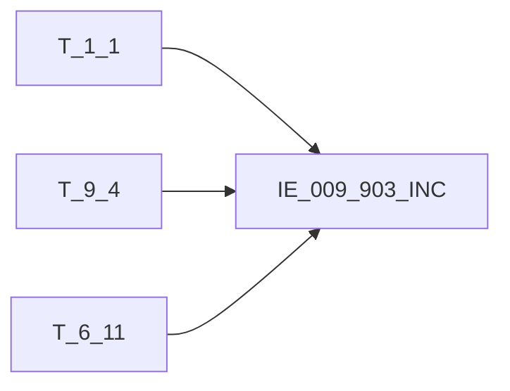

# 血缘-IE_009_903_INC-交易背景信息表-EAST5.0系统

## 页面边界

- 本页维护 `交易背景信息表` 从一表通来源表到 EAST5.0 目标表 `IE_009_903_INC` 的设计血缘。
- 证据为业务需求文档和工作区 GBase SQL 草案，尚未经过生产运行验证。
- 数据表字段定义见 [[数据表-IE_009_903_INC-交易背景信息表-EAST5.0系统]]；业务报送口径见 [[报表-IE_009_903_INC-交易背景信息表-EAST5.0系统]]。

## 系统边界

- 起始系统：一表通系统
- 目标系统：EAST5.0系统
- 是否跨系统血缘：是
- 目标对象：`IE_009_903_INC` `交易背景信息表`

## 业务链路摘要

- 按 `原始材料/业务需求/EAST5.0/055_交易背景信息表.md` 的字段映射，将一表通来源表加工为 EAST5.0 `交易背景信息表`。
- 表级规则：### 2.1 表级规则（Excel第 1349 行） 主表：【商业单据】T1 过滤条件：采集日期 = 报告日 内关联子查询：（ select 【协议与单据对应关系】所有字段 from 【协议与单据对应关系】 T1 left join 【贷款协议】 DK on T1.协议ID = DK.协议ID and T1.采集日期 = DK.采集日期 and DK.贷款协议起始日期 在本月 left join 【协议与单据对应关系】LST 上月末 协议ID、单据ID on T1.协议ID = LST.协议ID and T1.单据ID = LST.单据ID where T1.采集日期 = 报告日 且 （DK.协议ID非空 或 LST.协议ID为空） /*本月生效合同 或 上月未报送过*/ ）T11 关联条件：T1.单据ID = TT1.单据ID 且 T1.协议ID = TT1.协议ID 且 T1.采集日期 = TT1.采集日期 且 TT1.业务种类 in （'03','08','09','10','00'） /*限制为保理融资、承兑汇票、保函、信用证、其他业务*/
- SQL 草案采用按 `P_DATA_DATE` 清理后重插或增量边界过滤的方式；具体投产方式待验证。

## 直接上游对象

- [[数据表-T_1_1-机构信息-一表通系统]]：一表通来源表。
- [[数据表-T_9_4-商业单据-一表通系统]]：一表通来源表。
- [[数据表-T_6_11-信用证协议-一表通系统]]：一表通来源表。

## 直接下游对象

- 目标数据表：[[数据表-IE_009_903_INC-交易背景信息表-EAST5.0系统]]
- 报表业务口径页：[[报表-IE_009_903_INC-交易背景信息表-EAST5.0系统]]
- SQL 草案：`工作区/SQL开发/EAST5.0系统/PROC_EAST_IE_009_903_INC_JYBJXXB_草案.sql`

## Nodes

- [[数据表-T_1_1-机构信息-一表通系统]]：一表通来源表。
- [[数据表-T_9_4-商业单据-一表通系统]]：一表通来源表。
- [[数据表-T_6_11-信用证协议-一表通系统]]：一表通来源表。
- [[数据表-IE_009_903_INC-交易背景信息表-EAST5.0系统]]：EAST5.0 目标采集表。
- [[报表-IE_009_903_INC-交易背景信息表-EAST5.0系统]]：业务口径说明。

## 表级 Edge List

| From | To | Transform | Evidence |
| --- | --- | --- | --- |
| [[数据表-T_1_1-机构信息-一表通系统]] | [[数据表-IE_009_903_INC-交易背景信息表-EAST5.0系统]] | 字段映射、关联、过滤、码值/日期转换后装载 `IE_009_903_INC` | [[来源-EAST5.0系统-IE_009_903_INC-交易背景信息表]]；SQL 草案 |
| [[数据表-T_9_4-商业单据-一表通系统]] | [[数据表-IE_009_903_INC-交易背景信息表-EAST5.0系统]] | 字段映射、关联、过滤、码值/日期转换后装载 `IE_009_903_INC` | [[来源-EAST5.0系统-IE_009_903_INC-交易背景信息表]]；SQL 草案 |
| [[数据表-T_6_11-信用证协议-一表通系统]] | [[数据表-IE_009_903_INC-交易背景信息表-EAST5.0系统]] | 字段映射、关联、过滤、码值/日期转换后装载 `IE_009_903_INC` | [[来源-EAST5.0系统-IE_009_903_INC-交易背景信息表]]；SQL 草案 |

## 字段级 Edge List

| 源对象 | 源字段 | 目标对象 | 目标字段 | 处理逻辑 | 关系类型 | 证据 |
| --- | --- | --- | --- | --- | --- | --- |
| [[数据表-T_1_1-机构信息-一表通系统]] | `A010003` | [[数据表-IE_009_903_INC-交易背景信息表-EAST5.0系统]] | `JRXKZH` | 直接映射 | 直接映射 | [[来源-EAST5.0系统-IE_009_903_INC-交易背景信息表]]；SQL 草案 |
| [[数据表-T_9_4-商业单据-一表通系统]] | `J040002` | [[数据表-IE_009_903_INC-交易背景信息表-EAST5.0系统]] | `NBJGH` | 加工映射：SUBSTR(机构ID,12) | 加工映射 | [[来源-EAST5.0系统-IE_009_903_INC-交易背景信息表]]；SQL 草案 |
| [[数据表-T_1_1-机构信息-一表通系统]] | `A010005` | [[数据表-IE_009_903_INC-交易背景信息表-EAST5.0系统]] | `YHJGMC` | 直接映射 | 直接映射 | [[来源-EAST5.0系统-IE_009_903_INC-交易背景信息表]]；SQL 草案 |
| 待确认 | `待确认` | [[数据表-IE_009_903_INC-交易背景信息表-EAST5.0系统]] | `YWZL` | 加工映射：；CASE WHEN T11.业务种类 = '08' THEN '承兑汇票'； WHEN T11.业务种类 = '09' THEN '保函'； WHEN T11.业务种类 = '10' THEN '信用证'； WHEN T11.业务种类 = '01' THEN '其他-打包贷款'； WHEN T11.业务种类 = '02' THEN '其他-押汇'； WHEN T11.业务种类 = '03' THEN '其他-保理'； WHE... | 加工映射 | [[来源-EAST5.0系统-IE_009_903_INC-交易背景信息表]]；SQL 草案 |
| 待确认 | `待确认` | [[数据表-IE_009_903_INC-交易背景信息表-EAST5.0系统]] | `PJHHTH` | 直接映射 | 直接映射 | [[来源-EAST5.0系统-IE_009_903_INC-交易背景信息表]]；SQL 草案 |
| [[数据表-T_6_11-信用证协议-一表通系统]] | `F110008` | [[数据表-IE_009_903_INC-交易背景信息表-EAST5.0系统]] | `BZ` | 加工映射：通过协议ID关联【信用证协议/保函协议/票据协议/贸易融资协议】，获取其协议币种 | 加工映射 | [[来源-EAST5.0系统-IE_009_903_INC-交易背景信息表]]；SQL 草案 |
| [[数据表-T_6_11-信用证协议-一表通系统]] | `F110009` | [[数据表-IE_009_903_INC-交易背景信息表-EAST5.0系统]] | `HTJE` | 加工映射：通过协议ID关联【信用证协议/保函协议/票据协议/贸易融资协议】，获取其【开证金额/保函金额/票据金额/贸易融资金额】 | 加工映射 | [[来源-EAST5.0系统-IE_009_903_INC-交易背景信息表]]；SQL 草案 |
| [[数据表-T_9_4-商业单据-一表通系统]] | `J040001` | [[数据表-IE_009_903_INC-交易背景信息表-EAST5.0系统]] | `DJBH` | 直接映射 | 直接映射 | [[来源-EAST5.0系统-IE_009_903_INC-交易背景信息表]]；SQL 草案 |
| [[数据表-T_9_4-商业单据-一表通系统]] | `J040006` | [[数据表-IE_009_903_INC-交易背景信息表-EAST5.0系统]] | `DJZL` | 加工映射：CASE WHEN T1.商业单据种类 = '01' THEN '商业发票'； WHEN T1.商业单据种类 = '02' THEN '增值税发票'； WHEN T1.商业单据种类 = '03' THEN '证实发票'； WHEN T1.商业单据种类 = '04' THEN '收妥发票'； WHEN T1.商业单据种类 = '05' THEN '厂商发票'； WHEN T1.商业单据种类 = '06' THEN '形式发票'；... | 加工映射 | [[来源-EAST5.0系统-IE_009_903_INC-交易背景信息表]]；SQL 草案 |
| [[数据表-T_9_4-商业单据-一表通系统]] | `J040004` | [[数据表-IE_009_903_INC-交易背景信息表-EAST5.0系统]] | `DJBZ` | 直接映射 | 直接映射 | [[来源-EAST5.0系统-IE_009_903_INC-交易背景信息表]]；SQL 草案 |
| [[数据表-T_9_4-商业单据-一表通系统]] | `J040005` | [[数据表-IE_009_903_INC-交易背景信息表-EAST5.0系统]] | `DJJE` | 直接映射 | 直接映射 | [[来源-EAST5.0系统-IE_009_903_INC-交易背景信息表]]；SQL 草案 |
| 待确认 | `待确认` | [[数据表-IE_009_903_INC-交易背景信息表-EAST5.0系统]] | `BBZ` | 提取《9.4商业单据》、《3.8协议与单据对应关系》、《6.2贷款协议》、《6.13票据协议》、《6.11信用证协议》、《6.12保函及其他担保协议》、《6.10贸易融资协议》备注内容。 | 加工映射 | [[来源-EAST5.0系统-IE_009_903_INC-交易背景信息表]]；SQL 草案 |
| [[数据表-T_9_4-商业单据-一表通系统]] | `J040008` | [[数据表-IE_009_903_INC-交易背景信息表-EAST5.0系统]] | `CJRQ` | 加工映射：日期转YYYYMMDD格式 | 加工映射 | [[来源-EAST5.0系统-IE_009_903_INC-交易背景信息表]]；SQL 草案 |

## Graph-总览

## 回链检查

- 目标数据表页：已补 SQL 草案上游依赖摘要或待本次批处理补齐。
- 报表业务口径页：已创建或补充血缘回链。
- 一表通源表页：已补下游消费摘要或待本次批处理补齐。
- 当前字段级血缘基于业务需求和 SQL 草案，未运行验证，状态为待确认。

## 变更与冲突

- 本次为新增设计血缘或补齐草案血缘，不覆盖已验证生产血缘。
- 未发现需要将 `validated` 页面降级的情况；本页保持 `draft`。

## Open Questions

- GBase 草案中的复杂 JOIN、窗口去重、终态纳入和增量边界需要人工复核。
- 部分字段的码值 CASE 在草案中仍为待补，需要结合外部填报说明和跑数结果闭环。
- 外部监管实体页 wikilink 待补。

## 缺口字段（2026-05-04）

| 目标字段 | 字段名称 | 缺口说明 |
| --- | --- | --- |
| `SENSITIVEFLAG` | 涉密标志 | 本地 DDL 存在，但业务需求映射表和 SQL 草案未能确认来源，字段级血缘待补。 |
| `GSFZJG` | 归属分支机构 | 本地 DDL 存在，但业务需求映射表和 SQL 草案未能确认来源，字段级血缘待补。 |
