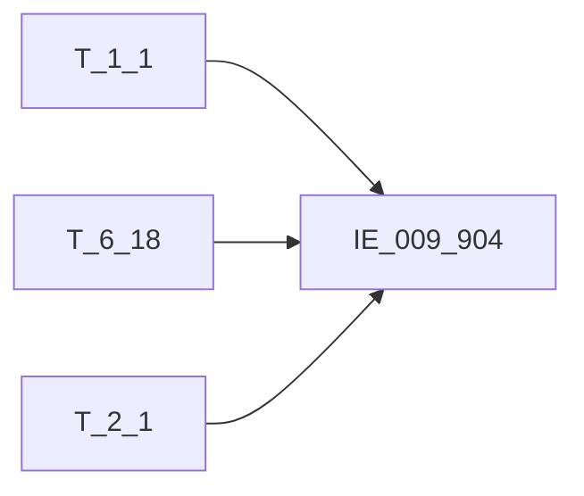

# 血缘-IE_009_904-委托贷款信息表-EAST5.0系统

## 页面边界

- 本页维护 `委托贷款信息表` 从一表通来源表到 EAST5.0 目标表 `IE_009_904` 的设计血缘。
- 证据为业务需求文档和工作区 GBase SQL 草案，尚未经过生产运行验证。
- 数据表字段定义见 [[数据表-IE_009_904-委托贷款信息表-EAST5.0系统]]；业务报送口径见 [[报表-IE_009_904-委托贷款信息表-EAST5.0系统]]。

## 系统边界

- 起始系统：一表通系统
- 目标系统：EAST5.0系统
- 是否跨系统血缘：是
- 目标对象：`IE_009_904` `委托贷款信息表`

## 业务链路摘要

- 按 `原始材料/业务需求/EAST5.0/056_委托贷款信息表.md` 的字段映射，将一表通来源表加工为 EAST5.0 `委托贷款信息表`。
- 表级规则：### 2.1 表级规则（Excel第 1363 行） 委托贷款整体范围划分为：①对私委托贷款（不含现金管理项下委托贷款）、②对公委托贷款（不含现金管理项下委托贷款）、③现金管理项下委托贷款三部分。对私和对公部分通过关联EAST转换结果表的个人信贷分户账和对公信贷分户账确定范围。 ①对私委托贷款（不含现金管理项下委托贷款）:委托贷款类型不为“01 现金管理项下委托贷款”，关联《6.27贷款协议补充信息》（6.18与6.27关联条件：借据ID、采集日期），再内关联转换生成的《对公信贷分户账》（6.27分户账号=对公信贷分户账.贷款分户账号）确定范围。 ②对公委托贷款（不含现金管理项下委托贷款）:委托贷款类型不为“01 现金管理项下委托贷款”，关联《6.27贷款协议补充信息》（6.18与6.27关联条件：借据ID、采集日期），再内关联转换生成的《个人信贷分户账》（6.27分户账号=个人信贷分户账.贷款分户账号）确定范围。 ③现金管理项下委托贷款：委托贷款类型为“01 现金管理项下委托贷款”，关联上月末委托贷款协议（筛选协议状态为非正常04,05,06，00-现金管理项下），剔除上月末已报失效数据，卡出当月数据范围。
- SQL 草案采用按 `P_DATA_DATE` 清理后重插或增量边界过滤的方式；具体投产方式待验证。

## 直接上游对象

- [[数据表-T_1_1-机构信息-一表通系统]]：一表通来源表。
- [[数据表-T_6_18-委托贷款协议-一表通系统]]：一表通来源表。
- [[数据表-T_2_1-单一法人基本情况-一表通系统]]：一表通来源表。

## 直接下游对象

- 目标数据表：[[数据表-IE_009_904-委托贷款信息表-EAST5.0系统]]
- 报表业务口径页：[[报表-IE_009_904-委托贷款信息表-EAST5.0系统]]
- SQL 草案：`工作区/SQL开发/EAST5.0系统/PROC_EAST_IE_009_904_WTDKXXB_草案.sql`

## Nodes

- [[数据表-T_1_1-机构信息-一表通系统]]：一表通来源表。
- [[数据表-T_6_18-委托贷款协议-一表通系统]]：一表通来源表。
- [[数据表-T_2_1-单一法人基本情况-一表通系统]]：一表通来源表。
- [[数据表-IE_009_904-委托贷款信息表-EAST5.0系统]]：EAST5.0 目标采集表。
- [[报表-IE_009_904-委托贷款信息表-EAST5.0系统]]：业务口径说明。

## 表级 Edge List

| From | To | Transform | Evidence |
| --- | --- | --- | --- |
| [[数据表-T_1_1-机构信息-一表通系统]] | [[数据表-IE_009_904-委托贷款信息表-EAST5.0系统]] | 字段映射、关联、过滤、码值/日期转换后装载 `IE_009_904` | [[来源-EAST5.0系统-IE_009_904-委托贷款信息表]]；SQL 草案 |
| [[数据表-T_6_18-委托贷款协议-一表通系统]] | [[数据表-IE_009_904-委托贷款信息表-EAST5.0系统]] | 字段映射、关联、过滤、码值/日期转换后装载 `IE_009_904` | [[来源-EAST5.0系统-IE_009_904-委托贷款信息表]]；SQL 草案 |
| [[数据表-T_2_1-单一法人基本情况-一表通系统]] | [[数据表-IE_009_904-委托贷款信息表-EAST5.0系统]] | 字段映射、关联、过滤、码值/日期转换后装载 `IE_009_904` | [[来源-EAST5.0系统-IE_009_904-委托贷款信息表]]；SQL 草案 |

## 字段级 Edge List

| 源对象 | 源字段 | 目标对象 | 目标字段 | 处理逻辑 | 关系类型 | 证据 |
| --- | --- | --- | --- | --- | --- | --- |
| [[数据表-T_1_1-机构信息-一表通系统]] | `A010003` | [[数据表-IE_009_904-委托贷款信息表-EAST5.0系统]] | `JRXKZH` | 直接映射 | 直接映射 | [[来源-EAST5.0系统-IE_009_904-委托贷款信息表]]；SQL 草案 |
| [[数据表-T_6_18-委托贷款协议-一表通系统]] | `F180002` | [[数据表-IE_009_904-委托贷款信息表-EAST5.0系统]] | `NBJGH` | 加工映射：SUBSTR(机构ID,12) | 加工映射 | [[来源-EAST5.0系统-IE_009_904-委托贷款信息表]]；SQL 草案 |
| [[数据表-T_1_1-机构信息-一表通系统]] | `A010005` | [[数据表-IE_009_904-委托贷款信息表-EAST5.0系统]] | `YHJGMC` | 直接映射 | 直接映射 | [[来源-EAST5.0系统-IE_009_904-委托贷款信息表]]；SQL 草案 |
| [[数据表-T_6_18-委托贷款协议-一表通系统]] | `F180016` | [[数据表-IE_009_904-委托贷款信息表-EAST5.0系统]] | `MXKMBH` | 直接映射 | 直接映射 | [[来源-EAST5.0系统-IE_009_904-委托贷款信息表]]；SQL 草案 |
| [[数据表-T_6_18-委托贷款协议-一表通系统]] | `F180017` | [[数据表-IE_009_904-委托贷款信息表-EAST5.0系统]] | `MXKMMC` | 直接映射 | 直接映射 | [[来源-EAST5.0系统-IE_009_904-委托贷款信息表]]；SQL 草案 |
| [[数据表-T_6_18-委托贷款协议-一表通系统]] | `F180001` | [[数据表-IE_009_904-委托贷款信息表-EAST5.0系统]] | `HTBH` | 直接映射 | 直接映射 | [[来源-EAST5.0系统-IE_009_904-委托贷款信息表]]；SQL 草案 |
| [[数据表-T_6_18-委托贷款协议-一表通系统]] | `F180012` | [[数据表-IE_009_904-委托贷款信息表-EAST5.0系统]] | `XDJJH` | 直接映射 | 直接映射 | [[来源-EAST5.0系统-IE_009_904-委托贷款信息表]]；SQL 草案 |
| [[数据表-T_6_18-委托贷款协议-一表通系统]] | `F180003` | [[数据表-IE_009_904-委托贷款信息表-EAST5.0系统]] | `WTDKLX` | 加工映射：CASE WHEN T1.委托贷款类型 = '01' THEN '现金管理项下委托贷款'； WHEN T1.委托贷款类型 = '02' THEN '非现金管理项下委托贷款'； WHEN T1.委托贷款类型 = '03' THEN '公积金贷款'； END | 加工映射 | [[来源-EAST5.0系统-IE_009_904-委托贷款信息表]]；SQL 草案 |
| [[数据表-T_6_18-委托贷款协议-一表通系统]] | `F180008` | [[数据表-IE_009_904-委托贷款信息表-EAST5.0系统]] | `BZ` | 直接映射 | 直接映射 | [[来源-EAST5.0系统-IE_009_904-委托贷款信息表]]；SQL 草案 |
| [[数据表-T_6_18-委托贷款协议-一表通系统]] | `F180007` | [[数据表-IE_009_904-委托贷款信息表-EAST5.0系统]] | `DKJE` | 直接映射 | 直接映射 | [[来源-EAST5.0系统-IE_009_904-委托贷款信息表]]；SQL 草案 |
| [[数据表-T_6_18-委托贷款协议-一表通系统]] | `F180010` | [[数据表-IE_009_904-委托贷款信息表-EAST5.0系统]] | `HTQSRQ` | 加工映射：日期转YYYYMMDD格式 | 加工映射 | [[来源-EAST5.0系统-IE_009_904-委托贷款信息表]]；SQL 草案 |
| [[数据表-T_6_18-委托贷款协议-一表通系统]] | `F180011` | [[数据表-IE_009_904-委托贷款信息表-EAST5.0系统]] | `HTDQRQ` | 加工映射：日期转YYYYMMDD格式 | 加工映射 | [[来源-EAST5.0系统-IE_009_904-委托贷款信息表]]；SQL 草案 |
| [[数据表-T_6_18-委托贷款协议-一表通系统]] | `F180004` | [[数据表-IE_009_904-委托贷款信息表-EAST5.0系统]] | `WTRBH` | 直接映射 | 直接映射 | [[来源-EAST5.0系统-IE_009_904-委托贷款信息表]]；SQL 草案 |
| [[数据表-T_2_1-单一法人基本情况-一表通系统]] | `待确认` | [[数据表-IE_009_904-委托贷款信息表-EAST5.0系统]] | `WTRMC` | 加工映射：通过委托人客户ID关联【单一法人基本情况/个人客户基本情况/同业客户基本情况/个体工商户及小微企业主基本情况】获取客户名称 | 加工映射 | [[来源-EAST5.0系统-IE_009_904-委托贷款信息表]]；SQL 草案 |
| [[数据表-T_6_18-委托贷款协议-一表通系统]] | `F180005` | [[数据表-IE_009_904-委托贷款信息表-EAST5.0系统]] | `WTRZH` | 直接映射 | 直接映射 | [[来源-EAST5.0系统-IE_009_904-委托贷款信息表]]；SQL 草案 |
| [[数据表-T_6_18-委托贷款协议-一表通系统]] | `F180006` | [[数据表-IE_009_904-委托贷款信息表-EAST5.0系统]] | `WTRKHHMC` | 直接映射 | 直接映射 | [[来源-EAST5.0系统-IE_009_904-委托贷款信息表]]；SQL 草案 |
| [[数据表-T_6_18-委托贷款协议-一表通系统]] | `F180014` | [[数据表-IE_009_904-委托贷款信息表-EAST5.0系统]] | `SYRMC` | 直接映射 | 直接映射 | [[来源-EAST5.0系统-IE_009_904-委托贷款信息表]]；SQL 草案 |
| [[数据表-T_6_18-委托贷款协议-一表通系统]] | `F180026` | [[数据表-IE_009_904-委托贷款信息表-EAST5.0系统]] | `SYRZH` | 直接映射 | 直接映射 | [[来源-EAST5.0系统-IE_009_904-委托贷款信息表]]；SQL 草案 |
| [[数据表-T_6_18-委托贷款协议-一表通系统]] | `F180027` | [[数据表-IE_009_904-委托贷款信息表-EAST5.0系统]] | `SYRKHHMC` | 直接映射 | 直接映射 | [[来源-EAST5.0系统-IE_009_904-委托贷款信息表]]；SQL 草案 |
| [[数据表-T_6_18-委托贷款协议-一表通系统]] | `F180009` | [[数据表-IE_009_904-委托贷款信息表-EAST5.0系统]] | `SFSX` | 加工映射：CASE WHEN T1.SXBS = '1' THEN '是' ELSE '否' END | 加工映射 | [[来源-EAST5.0系统-IE_009_904-委托贷款信息表]]；SQL 草案 |
| [[数据表-T_6_18-委托贷款协议-一表通系统]] | `F180023` | [[数据表-IE_009_904-委托贷款信息表-EAST5.0系统]] | `SXFBZ` | 直接映射 | 直接映射 | [[来源-EAST5.0系统-IE_009_904-委托贷款信息表]]；SQL 草案 |
| [[数据表-T_6_18-委托贷款协议-一表通系统]] | `F180024` | [[数据表-IE_009_904-委托贷款信息表-EAST5.0系统]] | `SXFJE` | 直接映射 | 直接映射 | [[来源-EAST5.0系统-IE_009_904-委托贷款信息表]]；SQL 草案 |
| [[数据表-T_6_18-委托贷款协议-一表通系统]] | `F180019` | [[数据表-IE_009_904-委托贷款信息表-EAST5.0系统]] | `KHJLGH` | 加工映射：CASE WHEN 经办员工ID = '自动' THEN ''； ELSE 经办员工ID； END | 加工映射 | [[来源-EAST5.0系统-IE_009_904-委托贷款信息表]]；SQL 草案 |
| 待确认 | `待确认` | [[数据表-IE_009_904-委托贷款信息表-EAST5.0系统]] | `DKZT` | 现金管理项下委托贷款：固定值：其他-现金管理项下委托贷款；对公：加工映射：通过借据ID关联【贷款协议补充信息】获取贷款分户账，再关联【EAST对公信贷分户账】获取贷款状态；对私：加工映射：通过借据ID关联【贷款协议补充信息】获取贷款分户账，再关联【EAST个人信贷分户账】获取贷款状态 | 加工映射 | [[来源-EAST5.0系统-IE_009_904-委托贷款信息表]]；SQL 草案 |
| [[数据表-T_6_18-委托贷款协议-一表通系统]] | `F180022` | [[数据表-IE_009_904-委托贷款信息表-EAST5.0系统]] | `BBZ` | 提取《6.18委托贷款协议》、《6.27贷款协议补充信息》、《4.3分户账信息》备注内容。 | 加工映射 | [[来源-EAST5.0系统-IE_009_904-委托贷款信息表]]；SQL 草案 |
| [[数据表-T_6_18-委托贷款协议-一表通系统]] | `F180025` | [[数据表-IE_009_904-委托贷款信息表-EAST5.0系统]] | `CJRQ` | 加工映射：日期转YYYYMMDD格式 | 加工映射 | [[来源-EAST5.0系统-IE_009_904-委托贷款信息表]]；SQL 草案 |

## Graph-总览

## 回链检查

- 目标数据表页：已补 SQL 草案上游依赖摘要或待本次批处理补齐。
- 报表业务口径页：已创建或补充血缘回链。
- 一表通源表页：已补下游消费摘要或待本次批处理补齐。
- 当前字段级血缘基于业务需求和 SQL 草案，未运行验证，状态为待确认。

## 变更与冲突

- 本次为新增设计血缘或补齐草案血缘，不覆盖已验证生产血缘。
- 未发现需要将 `validated` 页面降级的情况；本页保持 `draft`。

## Open Questions

- GBase 草案中的复杂 JOIN、窗口去重、终态纳入和增量边界需要人工复核。
- 部分字段的码值 CASE 在草案中仍为待补，需要结合外部填报说明和跑数结果闭环。
- 外部监管实体页 wikilink 待补。

## 缺口字段（2026-05-04）

| 目标字段 | 字段名称 | 缺口说明 |
| --- | --- | --- |
| `GSFZJG` | 归属分支机构 | 本地 DDL 存在，但业务需求映射表和 SQL 草案未能确认来源，字段级血缘待补。 |
| `SENSITIVEFLAG` | 涉密标志 | 本地 DDL 存在，但业务需求映射表和 SQL 草案未能确认来源，字段级血缘待补。 |
| `WTRKHLB` | 委托人客户类别 | 本地 DDL 存在，但业务需求映射表和 SQL 草案未能确认来源，字段级血缘待补。 |
| `SYRKHLB` | 受益人客户类别 | 本地 DDL 存在，但业务需求映射表和 SQL 草案未能确认来源，字段级血缘待补。 |
