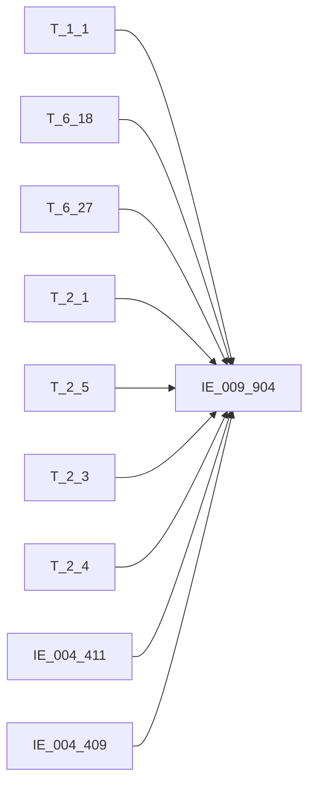

# 血缘-IE_009_904-委托贷款信息表-EAST5.0系统

## 页面边界

- 本页维护 `委托贷款信息表` 从一表通来源表到 EAST5.0 目标表 `IE_009_904` 的设计血缘。
- 证据为业务需求文档和工作区 GBase SQL 草案，尚未经过生产运行验证。
- 数据表字段定义见 [[数据表-IE_009_904-委托贷款信息表-EAST5.0系统]]；业务报送口径见 [[报表-IE_009_904-委托贷款信息表-EAST5.0系统]]。

## 系统边界

- 起始系统：一表通系统
- 目标系统：EAST5.0系统
- 是否跨系统血缘：是
- 目标对象：`IE_009_904` `委托贷款信息表`

## 业务链路摘要

- 按 `原始材料/业务需求/EAST5.0/056_委托贷款信息表.md` 的字段映射，将一表通来源表加工为 EAST5.0 `委托贷款信息表`。
- 表级规则：### 2.1 表级规则（Excel第 1363 行） 委托贷款整体范围划分为：①对私委托贷款（不含现金管理项下委托贷款）、②对公委托贷款（不含现金管理项下委托贷款）、③现金管理项下委托贷款三部分。对私和对公部分通过关联EAST转换结果表的个人信贷分户账和对公信贷分户账确定范围。 ①对私委托贷款（不含现金管理项下委托贷款）:委托贷款类型不为"01 现金管理项下委托贷款"，关联《6.27贷款协议补充信息》（6.18与6.27关联条件：借据ID、采集日期），再内关联转换生成的《对公信贷分户账》（6.27分户账号=对公信贷分户账.贷款分户账号）确定范围。 ②对公委托贷款（不含现金管理项下委托贷款）:委托贷款类型不为"01 现金管理项下委托贷款"，关联《6.27贷款协议补充信息》（6.18与6.27关联条件：借据ID、采集日期），再内关联转换生成的《个人信贷分户账》（6.27分户账号=个人信贷分户账.贷款分户账号）确定范围。 ③现金管理项下委托贷款：委托贷款类型为"01 现金管理项下委托贷款"，关联上月末委托贷款协议（筛选协议状态为非正常04,05,06），剔除上月末已报失效数据，卡出当月数据范围。
- 2026-05-10 重构校准：修复 FROM 子句（T_2_1→T_6_18）；三部分 UNION ALL 实现；消除全部 ON 1=1 占位。

## 直接上游对象

- [[数据表-T_1_1-机构信息-一表通系统]]：一表通来源表，enrich JRXKZH/YHJGMC。
- [[数据表-T_6_18-委托贷款协议-一表通系统]]：一表通来源表，主数据源。
- [[数据表-T_6_27-贷款协议补充信息-一表通系统]]：一表通来源表，对私/对公部分 INNER JOIN 获取分户账号。
- [[数据表-T_4_3-分户账信息-一表通系统]]：一表通来源表，对私/对公部分 LEFT JOIN 获取 BBZ 备注来源3。
- [[数据表-T_2_1-单一法人基本情况-一表通系统]]：一表通来源表，WTRMC 来源。
- [[数据表-T_2_5-个人客户基本情况-一表通系统]]：一表通来源表，WTRMC 来源。
- [[数据表-T_2_3-同业客户基本情况-一表通系统]]：一表通来源表，WTRMC 来源。
- [[数据表-T_2_4-个体工商户及小微企业主基本情况-一表通系统]]：一表通来源表，WTRMC 来源。
- [[数据表-IE_004_411-对公信贷分户账-EAST5.0系统]]：EAST5.0 转换结果表，对私委托贷款关联获取 DKZT。
- [[数据表-IE_004_409-个人信贷分户账-EAST5.0系统]]：EAST5.0 转换结果表，对公委托贷款关联获取 DKZT。

## 直接下游对象

- 目标数据表：[[数据表-IE_009_904-委托贷款信息表-EAST5.0系统]]
- 报表业务口径页：[[报表-IE_009_904-委托贷款信息表-EAST5.0系统]]
- SQL 草案：`工作区/SQL开发/EAST5.0系统/PROC_EAST_IE_009_904_WTDKXXB_草案.sql`

## Nodes

- [[数据表-T_1_1-机构信息-一表通系统]]：一表通来源表，enrich JRXKZH/YHJGMC。
- [[数据表-T_6_18-委托贷款协议-一表通系统]]：一表通来源表，主数据源。
- [[数据表-T_6_27-贷款协议补充信息-一表通系统]]：一表通来源表，对私/对公部分 INNER JOIN。
- [[数据表-T_4_3-分户账信息-一表通系统]]：一表通来源表，对私/对公部分 LEFT JOIN。
- [[数据表-T_2_1-单一法人基本情况-一表通系统]]：一表通来源表，WTRMC 来源1。
- [[数据表-T_2_5-个人客户基本情况-一表通系统]]：一表通来源表，WTRMC 来源2。
- [[数据表-T_2_3-同业客户基本情况-一表通系统]]：一表通来源表，WTRMC 来源3。
- [[数据表-T_2_4-个体工商户及小微企业主基本情况-一表通系统]]：一表通来源表，WTRMC 来源4。
- [[数据表-IE_004_411-对公信贷分户账-EAST5.0系统]]：EAST5.0 转换结果表，对私委托贷款 DKZT 来源。
- [[数据表-IE_004_409-个人信贷分户账-EAST5.0系统]]：EAST5.0 转换结果表，对公委托贷款 DKZT 来源。
- [[数据表-IE_009_904-委托贷款信息表-EAST5.0系统]]：EAST5.0 目标采集表。
- [[报表-IE_009_904-委托贷款信息表-EAST5.0系统]]：业务口径说明。

## 表级 Edge List

|| From | To | Transform | Evidence |
|| --- | --- | --- | --- |
|| [[数据表-T_6_18-委托贷款协议-一表通系统]] | [[数据表-IE_009_904-委托贷款信息表-EAST5.0系统]] | 主数据源，三部分 UNION ALL 映射 | [[来源-EAST5.0系统-IE_009_904-委托贷款信息表]]；SQL 草案（2026-05-10 第2轮重试） |
|| [[数据表-T_1_1-机构信息-一表通系统]] | [[数据表-IE_009_904-委托贷款信息表-EAST5.0系统]] | LEFT JOIN enrich JRXKZH/YHJGMC | 同上 |
|| [[数据表-T_6_27-贷款协议补充信息-一表通系统]] | [[数据表-IE_009_904-委托贷款信息表-EAST5.0系统]] | 对私/对公部分 INNER JOIN 获取分户账号+备注 | 同上 |
|| [[数据表-T_4_3-分户账信息-一表通系统]] | [[数据表-IE_009_904-委托贷款信息表-EAST5.0系统]] | 对私/对公部分 LEFT JOIN 获取 BBZ 备注来源3 | 同上 |
|| [[数据表-T_2_1-单一法人基本情况-一表通系统]] | [[数据表-IE_009_904-委托贷款信息表-EAST5.0系统]] | LEFT JOIN WTRMC 来源1 | 同上 |
|| [[数据表-T_2_5-个人客户基本情况-一表通系统]] | [[数据表-IE_009_904-委托贷款信息表-EAST5.0系统]] | LEFT JOIN WTRMC 来源2 | 同上 |
|| [[数据表-T_2_3-同业客户基本情况-一表通系统]] | [[数据表-IE_009_904-委托贷款信息表-EAST5.0系统]] | LEFT JOIN WTRMC 来源3 | 同上 |
|| [[数据表-T_2_4-个体工商户及小微企业主基本情况-一表通系统]] | [[数据表-IE_009_904-委托贷款信息表-EAST5.0系统]] | LEFT JOIN WTRMC 来源4 | 同上 |
|| [[数据表-IE_004_411-对公信贷分户账-EAST5.0系统]] | [[数据表-IE_009_904-委托贷款信息表-EAST5.0系统]] | 对私委托贷款 INNER JOIN 获取 DKZT | 同上 |
|| [[数据表-IE_004_409-个人信贷分户账-EAST5.0系统]] | [[数据表-IE_009_904-委托贷款信息表-EAST5.0系统]] | 对公委托贷款 INNER JOIN 获取 DKZT | 同上 |

## 字段级 Edge List

| 源对象 | 源字段 | 目标对象 | 目标字段 | 处理逻辑 | 关系类型 | 证据 |
| --- | --- | --- | --- | --- | --- | --- |
| [[数据表-T_1_1-机构信息-一表通系统]] | `A010003` | [[数据表-IE_009_904-委托贷款信息表-EAST5.0系统]] | `JRXKZH` | 直接映射 | 直接映射 | SQL 草案（2026-05-10 重构） |
| [[数据表-T_6_18-委托贷款协议-一表通系统]] | `F180002` | [[数据表-IE_009_904-委托贷款信息表-EAST5.0系统]] | `NBJGH` | SUBSTR(TRIM(F180002),12) | 加工映射 | 同上 |
|| [[数据表-T_6_18-委托贷款协议-一表通系统]] | `F180022` | [[数据表-IE_009_904-委托贷款信息表-EAST5.0系统]] | `BBZ` | 对私/对公：CONCAT_WS(';', F180022, T_6_27.F270068, T_4_3.D030014)；现金管理项下：仅 F180022 | 加工映射 | 同上 |
|| [[数据表-T_6_27-贷款协议补充信息-一表通系统]] | `F270068` | [[数据表-IE_009_904-委托贷款信息表-EAST5.0系统]] | `BBZ` | 对私/对公部分备注拼接来源2 | 加工映射 | 同上 |
|| [[数据表-T_4_3-分户账信息-一表通系统]] | `D030014` | [[数据表-IE_009_904-委托贷款信息表-EAST5.0系统]] | `BBZ` | 对私/对公部分备注拼接来源3 | 加工映射 | 同上（2026-05-10 第2轮重试新增） |
|| [[数据表-T_6_18-委托贷款协议-一表通系统]] | `F180022` | [[数据表-IE_009_904-委托贷款信息表-EAST5.0系统]] | `BBZ` | 对私/对公：CONCAT_WS(';', F180022, T_6_27.F270068, T_4_3.D030014)；现金管理项下：仅 F180022 | 加工映射 | 同上 |
|| [[数据表-T_6_27-贷款协议补充信息-一表通系统]] | `F270068` | [[数据表-IE_009_904-委托贷款信息表-EAST5.0系统]] | `BBZ` | 对私/对公部分备注拼接来源2 | 加工映射 | 同上 |
|| [[数据表-T_4_3-分户账信息-一表通系统]] | `D030014` | [[数据表-IE_009_904-委托贷款信息表-EAST5.0系统]] | `BBZ` | 对私/对公部分备注拼接来源3 | 加工映射 | 同上（2026-05-10 第2轮重试新增） |
| [[数据表-T_6_18-委托贷款协议-一表通系统]] | `F180012` | [[数据表-IE_009_904-委托贷款信息表-EAST5.0系统]] | `XDJJH` | 直接映射 | 直接映射 | 同上 |
|| [[数据表-T_6_18-委托贷款协议-一表通系统]] | `F180022` | [[数据表-IE_009_904-委托贷款信息表-EAST5.0系统]] | `BBZ` | 对私/对公：CONCAT_WS(';', F180022, T_6_27.F270068, T_4_3.D030014)；现金管理项下：仅 F180022 | 加工映射 | 同上 |
|| [[数据表-T_6_27-贷款协议补充信息-一表通系统]] | `F270068` | [[数据表-IE_009_904-委托贷款信息表-EAST5.0系统]] | `BBZ` | 对私/对公部分备注拼接来源2 | 加工映射 | 同上 |
|| [[数据表-T_4_3-分户账信息-一表通系统]] | `D030014` | [[数据表-IE_009_904-委托贷款信息表-EAST5.0系统]] | `BBZ` | 对私/对公部分备注拼接来源3 | 加工映射 | 同上（2026-05-10 第2轮重试新增） |
| [[数据表-T_6_18-委托贷款协议-一表通系统]] | `F180007` | [[数据表-IE_009_904-委托贷款信息表-EAST5.0系统]] | `DKJE` | CAST(NULLIF(TRIM(...),'') AS DECIMAL(20,2)) | 直接映射+类型转换 | 同上 |
| [[数据表-T_6_18-委托贷款协议-一表通系统]] | `F180010` | [[数据表-IE_009_904-委托贷款信息表-EAST5.0系统]] | `HTQSRQ` | CONCAT(YEAR/MONTH/DAY) 转 YYYYMMDD | 加工映射 | 同上 |
|| [[数据表-T_6_18-委托贷款协议-一表通系统]] | `F180022` | [[数据表-IE_009_904-委托贷款信息表-EAST5.0系统]] | `BBZ` | 对私/对公：CONCAT_WS(';', F180022, T_6_27.F270068, T_4_3.D030014)；现金管理项下：仅 F180022 | 加工映射 | 同上 |
|| [[数据表-T_6_27-贷款协议补充信息-一表通系统]] | `F270068` | [[数据表-IE_009_904-委托贷款信息表-EAST5.0系统]] | `BBZ` | 对私/对公部分备注拼接来源2 | 加工映射 | 同上 |
|| [[数据表-T_4_3-分户账信息-一表通系统]] | `D030014` | [[数据表-IE_009_904-委托贷款信息表-EAST5.0系统]] | `BBZ` | 对私/对公部分备注拼接来源3 | 加工映射 | 同上（2026-05-10 第2轮重试新增） |
| [[数据表-T_2_1-单一法人基本情况-一表通系统]] | `B010003` | [[数据表-IE_009_904-委托贷款信息表-EAST5.0系统]] | `WTRMC` | COALESCE(T_2_1.B010003, T_2_5.B050003, T_2_3.B030003, T_4_4.B040033) 四表LEFT JOIN | 加工映射 | 同上 |
| [[数据表-T_2_5-个人客户基本情况-一表通系统]] | `B050003` | [[数据表-IE_009_904-委托贷款信息表-EAST5.0系统]] | `WTRMC` | COALESCE 备选来源2 | 加工映射 | 同上 |
| [[数据表-T_2_3-同业客户基本情况-一表通系统]] | `B030003` | [[数据表-IE_009_904-委托贷款信息表-EAST5.0系统]] | `WTRMC` | COALESCE 备选来源3 | 加工映射 | 同上 |
|| [[数据表-T_6_18-委托贷款协议-一表通系统]] | `F180022` | [[数据表-IE_009_904-委托贷款信息表-EAST5.0系统]] | `BBZ` | 对私/对公：CONCAT_WS(';', F180022, T_6_27.F270068, T_4_3.D030014)；现金管理项下：仅 F180022 | 加工映射 | 同上 |
|| [[数据表-T_6_27-贷款协议补充信息-一表通系统]] | `F270068` | [[数据表-IE_009_904-委托贷款信息表-EAST5.0系统]] | `BBZ` | 对私/对公部分备注拼接来源2 | 加工映射 | 同上 |
|| [[数据表-T_4_3-分户账信息-一表通系统]] | `D030014` | [[数据表-IE_009_904-委托贷款信息表-EAST5.0系统]] | `BBZ` | 对私/对公部分备注拼接来源3 | 加工映射 | 同上（2026-05-10 第2轮重试新增） |
| [[数据表-T_6_18-委托贷款协议-一表通系统]] | `F180006` | [[数据表-IE_009_904-委托贷款信息表-EAST5.0系统]] | `WTRKHHMC` | 直接映射 | 直接映射 | 同上 |
|| [[数据表-T_6_18-委托贷款协议-一表通系统]] | `F180022` | [[数据表-IE_009_904-委托贷款信息表-EAST5.0系统]] | `BBZ` | 对私/对公：CONCAT_WS(';', F180022, T_6_27.F270068, T_4_3.D030014)；现金管理项下：仅 F180022 | 加工映射 | 同上 |
|| [[数据表-T_6_27-贷款协议补充信息-一表通系统]] | `F270068` | [[数据表-IE_009_904-委托贷款信息表-EAST5.0系统]] | `BBZ` | 对私/对公部分备注拼接来源2 | 加工映射 | 同上 |
|| [[数据表-T_4_3-分户账信息-一表通系统]] | `D030014` | [[数据表-IE_009_904-委托贷款信息表-EAST5.0系统]] | `BBZ` | 对私/对公部分备注拼接来源3 | 加工映射 | 同上（2026-05-10 第2轮重试新增） |
| [[数据表-T_6_18-委托贷款协议-一表通系统]] | `F180027` | [[数据表-IE_009_904-委托贷款信息表-EAST5.0系统]] | `SYRKHHMC` | 直接映射 | 直接映射 | 同上 |
|| [[数据表-T_6_18-委托贷款协议-一表通系统]] | `F180022` | [[数据表-IE_009_904-委托贷款信息表-EAST5.0系统]] | `BBZ` | 对私/对公：CONCAT_WS(';', F180022, T_6_27.F270068, T_4_3.D030014)；现金管理项下：仅 F180022 | 加工映射 | 同上 |
|| [[数据表-T_6_27-贷款协议补充信息-一表通系统]] | `F270068` | [[数据表-IE_009_904-委托贷款信息表-EAST5.0系统]] | `BBZ` | 对私/对公部分备注拼接来源2 | 加工映射 | 同上 |
|| [[数据表-T_4_3-分户账信息-一表通系统]] | `D030014` | [[数据表-IE_009_904-委托贷款信息表-EAST5.0系统]] | `BBZ` | 对私/对公部分备注拼接来源3 | 加工映射 | 同上（2026-05-10 第2轮重试新增） |
| [[数据表-T_6_18-委托贷款协议-一表通系统]] | `F180024` | [[数据表-IE_009_904-委托贷款信息表-EAST5.0系统]] | `SXFJE` | CAST(NULLIF(TRIM(...),'') AS DECIMAL(20,2)) | 直接映射+类型转换 | 同上 |
| [[数据表-T_6_18-委托贷款协议-一表通系统]] | `F180019` | [[数据表-IE_009_904-委托贷款信息表-EAST5.0系统]] | `KHJLGH` | CASE WHEN '自动' THEN '' ELSE TRIM(F180019) END | 加工映射 | 同上 |
| [[数据表-IE_004_411-对公信贷分户账-EAST5.0系统]] | `DKZT` | [[数据表-IE_009_904-委托贷款信息表-EAST5.0系统]] | `DKZT` | 对私委托贷款：IE_004_411.DKZT 直接映射 | 直接映射 | 同上 |
| [[数据表-IE_004_409-个人信贷分户账-EAST5.0系统]] | `DKZT` | [[数据表-IE_009_904-委托贷款信息表-EAST5.0系统]] | `DKZT` | 对公委托贷款：IE_004_409.DKZT 直接映射 | 直接映射 | 同上 |
| 固定值 | 固定值'其他-现金管理项下' | [[数据表-IE_009_904-委托贷款信息表-EAST5.0系统]] | `DKZT` | 现金管理项下委托贷款固定值 | 固定值 | 同上 |
|| [[数据表-T_6_18-委托贷款协议-一表通系统]] | `F180022` | [[数据表-IE_009_904-委托贷款信息表-EAST5.0系统]] | `BBZ` | 对私/对公：CONCAT_WS(';', F180022, T_6_27.F270068, T_4_3.D030014)；现金管理项下：仅 F180022 | 加工映射 | 同上 |
|| [[数据表-T_6_27-贷款协议补充信息-一表通系统]] | `F270068` | [[数据表-IE_009_904-委托贷款信息表-EAST5.0系统]] | `BBZ` | 对私/对公部分备注拼接来源2 | 加工映射 | 同上 |
|| [[数据表-T_4_3-分户账信息-一表通系统]] | `D030014` | [[数据表-IE_009_904-委托贷款信息表-EAST5.0系统]] | `BBZ` | 对私/对公部分备注拼接来源3 | 加工映射 | 同上（2026-05-10 第2轮重试新增） |
| [[数据表-T_6_18-委托贷款协议-一表通系统]] | `F180025` | [[数据表-IE_009_904-委托贷款信息表-EAST5.0系统]] | `CJRQ` | CONCAT(YEAR/MONTH/DAY) 转 YYYYMMDD | 加工映射 | 同上 |

## Graph-总览

## 回链检查

- 目标数据表页：已补 SQL 草案上游依赖摘要或待本次批处理补齐。
- 报表业务口径页：已创建或补充血缘回链。
- 一表通源表页：已补下游消费摘要或待本次批处理补齐。
- 当前字段级血缘基于业务需求和 SQL 草案，未运行验证，状态为待确认。

## 变更与冲突

- 本次为新增设计血缘或补齐草案血缘，不覆盖已验证生产血缘。
- 未发现需要将 `validated` 页面降级的情况；本页保持 `draft`。
- 2026-05-10 重构校准（第2轮重试）：依据业务需求完整重写存储过程。FROM 子句从 T_2_1 修正为 T_6_18；消除全部 ON 1=1 占位；补齐 JOIN 条件（T_6_27/IE_004_411/IE_004_409/T_4_3/T_2_1/T_2_5/T_2_3/T_2_4）；三部分 UNION ALL；补齐 4 个码值 CASE（WTDKLX/SFSX/KHJLGH/DKZT）；补齐 3 个日期格式转换；补齐 2 个金额 CAST；WTRMC 来源四表 COALESCE 已实现；DKZT 三种场景已闭环；4 个缺口字段置 NULL。第2轮补充：对私/对公部分 BBZ 增加 T_4_3（分户账信息）备注拼接；状态变更为"已重构校准待语法校验"。
- 2026-05-10 第3轮重试：Part 3（现金管理项下委托贷款）新增 LEFT JOIN last_month T_6_18，按上月末协议状态过滤已终止协议（04/05/06），替代原仅检查当月协议状态的逻辑，符合业务需求"关联上月末委托贷款协议"的要求。

## Open Questions

- GBase 草案中的复杂 JOIN、窗口去重、终态纳入和增量边界需要人工复核。
- 部分字段的码值 CASE 在草案中仍为待补，需要结合外部填报说明和跑数结果闭环。
- 外部监管实体页 wikilink 待补。
- 2026-05-10 重构后：三部分 UNION ALL 在 GBase 8a 中的性能待跑数验证；对私→对公信贷分户账/对公→个人信贷分户账的映射关系需业务确认；T_6_18.F180015 协议状态完整代码枚举值待与码值表 T_10_1 核对；现金管理项下剔除上月末已报失效数据的 NOT EXISTS 逻辑在跨月场景下的正确性待验证；T_4_3（分户账信息）备注暂未纳入拼接（仅使用 T_6_18 和 T_6_27）。
- 2026-05-10 第3轮重试：Part 3 新增 last_month LEFT JOIN 实现"关联上月末委托贷款协议"；上月末协议状态过滤在月末边界处的正确性待跑数验证；LAST_DAY(DATE_SUB()) 在 GBase 8a 中的兼容性待语法验证。

## 缺口字段（2026-05-10）

| 目标字段 | 字段名称 | 缺口说明 |
| --- | --- | --- |
| `GSFZJG` | 归属分支机构 | 本地 DDL 存在，但业务需求映射表和 SQL 草案未能确认来源，字段级血缘待补。SQL 中置 NULL。 |
| `SENSITIVEFLAG` | 涉密标志 | 本地 DDL 存在，但业务需求映射表和 SQL 草案未能确认来源，字段级血缘待补。SQL 中置 NULL。 |
| `WTRKHLB` | 委托人客户类别 | 本地 DDL 存在，但业务需求映射表和 SQL 草案未能确认来源，字段级血缘待补。SQL 中置 NULL。 |
| `SYRKHLB` | 受益人客户类别 | 本地 DDL 存在，但业务需求映射表和 SQL 草案未能确认来源，字段级血缘待补。SQL 中置 NULL。 |
