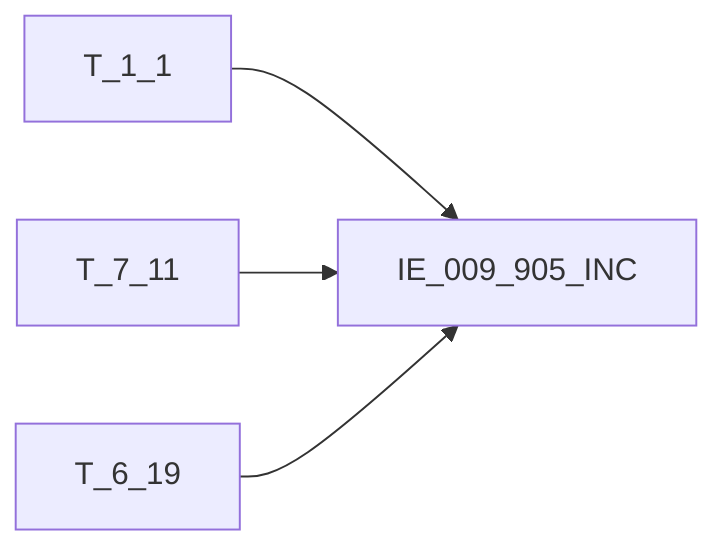

# 血缘-IE_009_905_INC-代理代销交易信息表-EAST5.0系统

## 页面边界

- 本页维护 `代理代销交易信息表` 从一表通来源表到 EAST5.0 目标表 `IE_009_905_INC` 的设计血缘。
- 证据为业务需求文档和工作区 GBase SQL 草案，尚未经过生产运行验证。
- 数据表字段定义见 [[数据表-IE_009_905_INC-代理代销交易信息表-EAST5.0系统]]；业务报送口径见 [[报表-IE_009_905_INC-代理代销交易信息表-EAST5.0系统]]。

## 系统边界

- 起始系统：一表通系统
- 目标系统：EAST5.0系统
- 是否跨系统血缘：是
- 目标对象：`IE_009_905_INC` `代理代销交易信息表`

## 业务链路摘要

- 按 `原始材料/业务需求/EAST5.0/057_代理代销交易信息表.md` 的字段映射，将一表通来源表加工为 EAST5.0 `代理代销交易信息表`。
- 表级规则：### 2.1 表级规则（Excel第 1390 行） 主表：理财及代销产品交易，关联代理协议 过滤条件：筛选采集日期为报告期当月
- SQL 草案采用按 `P_DATA_DATE` 清理后重插或增量边界过滤的方式；具体投产方式待验证。

## 直接上游对象

- [[数据表-T_1_1-机构信息-一表通系统]]：一表通来源表。
- [[数据表-T_7_11-理财及代销产品交易-一表通系统]]：一表通来源表。
- [[数据表-T_6_19-代理协议-一表通系统]]：一表通来源表。

## 直接下游对象

- 目标数据表：[[数据表-IE_009_905_INC-代理代销交易信息表-EAST5.0系统]]
- 报表业务口径页：[[报表-IE_009_905_INC-代理代销交易信息表-EAST5.0系统]]
- SQL 草案：`工作区/SQL开发/EAST5.0系统/PROC_EAST_IE_009_905_INC_DLDXJYXXB_草案.sql`

## Nodes

- [[数据表-T_1_1-机构信息-一表通系统]]：一表通来源表。
- [[数据表-T_7_11-理财及代销产品交易-一表通系统]]：一表通来源表。
- [[数据表-T_6_19-代理协议-一表通系统]]：一表通来源表。
- [[数据表-IE_009_905_INC-代理代销交易信息表-EAST5.0系统]]：EAST5.0 目标采集表。
- [[报表-IE_009_905_INC-代理代销交易信息表-EAST5.0系统]]：业务口径说明。

## 表级 Edge List

| From | To | Transform | Evidence |
| --- | --- | --- | --- |
| [[数据表-T_1_1-机构信息-一表通系统]] | [[数据表-IE_009_905_INC-代理代销交易信息表-EAST5.0系统]] | 字段映射、关联、过滤、码值/日期转换后装载 `IE_009_905_INC` | [[来源-EAST5.0系统-IE_009_905_INC-代理代销交易信息表]]；SQL 草案 |
| [[数据表-T_7_11-理财及代销产品交易-一表通系统]] | [[数据表-IE_009_905_INC-代理代销交易信息表-EAST5.0系统]] | 字段映射、关联、过滤、码值/日期转换后装载 `IE_009_905_INC` | [[来源-EAST5.0系统-IE_009_905_INC-代理代销交易信息表]]；SQL 草案 |
| [[数据表-T_6_19-代理协议-一表通系统]] | [[数据表-IE_009_905_INC-代理代销交易信息表-EAST5.0系统]] | 字段映射、关联、过滤、码值/日期转换后装载 `IE_009_905_INC` | [[来源-EAST5.0系统-IE_009_905_INC-代理代销交易信息表]]；SQL 草案 |

## 字段级 Edge List

| 源对象 | 源字段 | 目标对象 | 目标字段 | 处理逻辑 | 关系类型 | 证据 |
| --- | --- | --- | --- | --- | --- | --- |
| [[数据表-T_1_1-机构信息-一表通系统]] | `A010003` | [[数据表-IE_009_905_INC-代理代销交易信息表-EAST5.0系统]] | `JRXKZH` | 直接映射 | 直接映射 | [[来源-EAST5.0系统-IE_009_905_INC-代理代销交易信息表]]；SQL 草案 |
| [[数据表-T_7_11-理财及代销产品交易-一表通系统]] | `G110014` | [[数据表-IE_009_905_INC-代理代销交易信息表-EAST5.0系统]] | `NBJGH` | 从第12位开始截取【理财及代销产品交易】.机构ID | 加工映射 | [[来源-EAST5.0系统-IE_009_905_INC-代理代销交易信息表]]；SQL 草案 |
| [[数据表-T_1_1-机构信息-一表通系统]] | `A010005` | [[数据表-IE_009_905_INC-代理代销交易信息表-EAST5.0系统]] | `YHJGMC` | 直接映射 | 直接映射 | [[来源-EAST5.0系统-IE_009_905_INC-代理代销交易信息表]]；SQL 草案 |
| [[数据表-T_7_11-理财及代销产品交易-一表通系统]] | `G110002` | [[数据表-IE_009_905_INC-代理代销交易信息表-EAST5.0系统]] | `KHTYBH` | 直接映射 | 直接映射 | [[来源-EAST5.0系统-IE_009_905_INC-代理代销交易信息表]]；SQL 草案 |
| 待确认 | `待确认` | [[数据表-IE_009_905_INC-代理代销交易信息表-EAST5.0系统]] | `KHMC` | 当【对公客户信息表】.客户名称 <> '' 则 '【对公客户信息表】.客户名称；当【个人基础信息表】.客户姓名 <> '' 则 '【个人基础信息表】.客户姓名；否则'' | 加工映射 | [[来源-EAST5.0系统-IE_009_905_INC-代理代销交易信息表]]；SQL 草案 |
| [[数据表-T_7_11-理财及代销产品交易-一表通系统]] | `G110007` | [[数据表-IE_009_905_INC-代理代销交易信息表-EAST5.0系统]] | `KHZH` | 直接映射 | 直接映射 | [[来源-EAST5.0系统-IE_009_905_INC-代理代销交易信息表]]；SQL 草案 |
| [[数据表-T_7_11-理财及代销产品交易-一表通系统]] | `G110008` | [[数据表-IE_009_905_INC-代理代销交易信息表-EAST5.0系统]] | `KHHMC` | 直接映射 | 直接映射 | [[来源-EAST5.0系统-IE_009_905_INC-代理代销交易信息表]]；SQL 草案 |
| [[数据表-T_7_11-理财及代销产品交易-一表通系统]] | `G110003` | [[数据表-IE_009_905_INC-代理代销交易信息表-EAST5.0系统]] | `JYBH` | 直接映射 | 直接映射 | [[来源-EAST5.0系统-IE_009_905_INC-代理代销交易信息表]]；SQL 草案 |
| [[数据表-T_6_19-代理协议-一表通系统]] | `F190006` | [[数据表-IE_009_905_INC-代理代销交易信息表-EAST5.0系统]] | `DLDXJYLX` | 码值转化：；如果 【代理协议】.【代理产品类型】为 '0101' ，则 '债券承销' ；如果 【代理协议】.【代理产品类型】为 '0201' ，则 '代理代销信托计划' ；如果 【代理协议】.【代理产品类型】为 '0301' ，则 '代理代销资产管理计划' ；如果 【代理协议】.【代理产品类型】为 '0401' ，则 '代理代销保险产品' ；如果 【代理协议】.【代理产品类型】为 '0501' ，则 '代理代销基金' ；如果 【代理协议... | 码值转换/格式转换 | [[来源-EAST5.0系统-IE_009_905_INC-代理代销交易信息表]]；SQL 草案 |
| [[数据表-T_7_11-理财及代销产品交易-一表通系统]] | `待确认` | [[数据表-IE_009_905_INC-代理代销交易信息表-EAST5.0系统]] | `DXCPMC` | 直接映射 | 直接映射 | [[来源-EAST5.0系统-IE_009_905_INC-代理代销交易信息表]]；SQL 草案 |
| [[数据表-T_7_11-理财及代销产品交易-一表通系统]] | `G110011` | [[数据表-IE_009_905_INC-代理代销交易信息表-EAST5.0系统]] | `JYFX` | 码值转化：如果是'01' 则'买入'； 如果是'02' 则'卖出' | 码值转换/格式转换 | [[来源-EAST5.0系统-IE_009_905_INC-代理代销交易信息表]]；SQL 草案 |
| [[数据表-T_7_11-理财及代销产品交易-一表通系统]] | `G110005` | [[数据表-IE_009_905_INC-代理代销交易信息表-EAST5.0系统]] | `JYRQ` | 格式转化：YYYY-MM-DD转换为YYYYMMDD | 码值转换/格式转换 | [[来源-EAST5.0系统-IE_009_905_INC-代理代销交易信息表]]；SQL 草案 |
| [[数据表-T_7_11-理财及代销产品交易-一表通系统]] | `G110021` | [[数据表-IE_009_905_INC-代理代销交易信息表-EAST5.0系统]] | `BZ` | 直接映射 | 直接映射 | [[来源-EAST5.0系统-IE_009_905_INC-代理代销交易信息表]]；SQL 草案 |
| [[数据表-T_7_11-理财及代销产品交易-一表通系统]] | `G110022` | [[数据表-IE_009_905_INC-代理代销交易信息表-EAST5.0系统]] | `JYJE` | 直接映射 | 直接映射 | [[来源-EAST5.0系统-IE_009_905_INC-代理代销交易信息表]]；SQL 草案 |
| [[数据表-T_6_19-代理协议-一表通系统]] | `F190004` | [[数据表-IE_009_905_INC-代理代销交易信息表-EAST5.0系统]] | `FXJGMC` | 直接映射 | 直接映射 | [[来源-EAST5.0系统-IE_009_905_INC-代理代销交易信息表]]；SQL 草案 |
| [[数据表-T_6_19-代理协议-一表通系统]] | `F190008` | [[数据表-IE_009_905_INC-代理代销交易信息表-EAST5.0系统]] | `FXJGPJ` | 直接映射 | 直接映射 | [[来源-EAST5.0系统-IE_009_905_INC-代理代销交易信息表]]；SQL 草案 |
| [[数据表-T_6_19-代理协议-一表通系统]] | `F190009` | [[数据表-IE_009_905_INC-代理代销交易信息表-EAST5.0系统]] | `FXJGPJJG` | 直接映射 | 直接映射 | [[来源-EAST5.0系统-IE_009_905_INC-代理代销交易信息表]]；SQL 草案 |
| [[数据表-T_7_11-理财及代销产品交易-一表通系统]] | `G110019` | [[数据表-IE_009_905_INC-代理代销交易信息表-EAST5.0系统]] | `FXJGQSZH` | 直接映射 | 直接映射 | [[来源-EAST5.0系统-IE_009_905_INC-代理代销交易信息表]]；SQL 草案 |
| [[数据表-T_7_11-理财及代销产品交易-一表通系统]] | `待确认` | [[数据表-IE_009_905_INC-代理代销交易信息表-EAST5.0系统]] | `FXJGQSHM` | 直接映射 | 直接映射 | [[来源-EAST5.0系统-IE_009_905_INC-代理代销交易信息表]]；SQL 草案 |
| [[数据表-T_6_19-代理协议-一表通系统]] | `F190010` | [[数据表-IE_009_905_INC-代理代销交易信息表-EAST5.0系统]] | `RZRMC` | 直接映射 | 直接映射 | [[来源-EAST5.0系统-IE_009_905_INC-代理代销交易信息表]]；SQL 草案 |
| [[数据表-T_6_19-代理协议-一表通系统]] | `F190011` | [[数据表-IE_009_905_INC-代理代销交易信息表-EAST5.0系统]] | `RZRSSHY` | 直接映射 | 直接映射 | [[来源-EAST5.0系统-IE_009_905_INC-代理代销交易信息表]]；SQL 草案 |
| [[数据表-T_7_11-理财及代销产品交易-一表通系统]] | `G110010` | [[数据表-IE_009_905_INC-代理代销交易信息表-EAST5.0系统]] | `SXFBZ` | 直接映射 | 直接映射 | [[来源-EAST5.0系统-IE_009_905_INC-代理代销交易信息表]]；SQL 草案 |
| [[数据表-T_7_11-理财及代销产品交易-一表通系统]] | `G110009` | [[数据表-IE_009_905_INC-代理代销交易信息表-EAST5.0系统]] | `SXFJE` | 直接映射 | 直接映射 | [[来源-EAST5.0系统-IE_009_905_INC-代理代销交易信息表]]；SQL 草案 |
| [[数据表-T_7_11-理财及代销产品交易-一表通系统]] | `G110012` | [[数据表-IE_009_905_INC-代理代销交易信息表-EAST5.0系统]] | `XZBZ` | 码值转化：如果是01，则'现'； 如果是02, 则'转' | 码值转换/格式转换 | [[来源-EAST5.0系统-IE_009_905_INC-代理代销交易信息表]]；SQL 草案 |
| [[数据表-T_7_11-理财及代销产品交易-一表通系统]] | `G110017` | [[数据表-IE_009_905_INC-代理代销交易信息表-EAST5.0系统]] | `JYYGH` | 加工映射：CASE WHEN 经办员工ID = '自动' THEN ''； ELSE 经办员工ID； END | 加工映射 | [[来源-EAST5.0系统-IE_009_905_INC-代理代销交易信息表]]；SQL 草案 |
| 待确认 | `待确认` | [[数据表-IE_009_905_INC-代理代销交易信息表-EAST5.0系统]] | `BBZ` | 提取《7.11理财及代销产品交易》、《表6.19代理协议》备注内容。 | 加工映射 | [[来源-EAST5.0系统-IE_009_905_INC-代理代销交易信息表]]；SQL 草案 |
| 待确认 | `待确认` | [[数据表-IE_009_905_INC-代理代销交易信息表-EAST5.0系统]] | `CJRQ` | 赋值：当前批次日期：日期转YYYYMMDD格式 | 加工映射 | [[来源-EAST5.0系统-IE_009_905_INC-代理代销交易信息表]]；SQL 草案 |

## Graph-总览

## 回链检查

- 目标数据表页：已补 SQL 草案上游依赖摘要或待本次批处理补齐。
- 报表业务口径页：已创建或补充血缘回链。
- 一表通源表页：已补下游消费摘要或待本次批处理补齐。
- 当前字段级血缘基于业务需求和 SQL 草案，未运行验证，状态为待确认。

## 变更与冲突

- 本次为新增设计血缘或补齐草案血缘，不覆盖已验证生产血缘。
- 未发现需要将 `validated` 页面降级的情况；本页保持 `draft`。

## Open Questions

- GBase 草案中的复杂 JOIN、窗口去重、终态纳入和增量边界需要人工复核。
- 部分字段的码值 CASE 在草案中仍为待补，需要结合外部填报说明和跑数结果闭环。
- 外部监管实体页 wikilink 待补。

## 缺口字段（2026-05-04）

| 目标字段 | 字段名称 | 缺口说明 |
| --- | --- | --- |
| `SENSITIVEFLAG` | 涉密标志 | 本地 DDL 存在，但业务需求映射表和 SQL 草案未能确认来源，字段级血缘待补。 |
| `GSFZJG` | 归属分支机构 | 本地 DDL 存在，但业务需求映射表和 SQL 草案未能确认来源，字段级血缘待补。 |
| `KHLB` | 客户类别 | 本地 DDL 存在，但业务需求映射表和 SQL 草案未能确认来源，字段级血缘待补。 |
