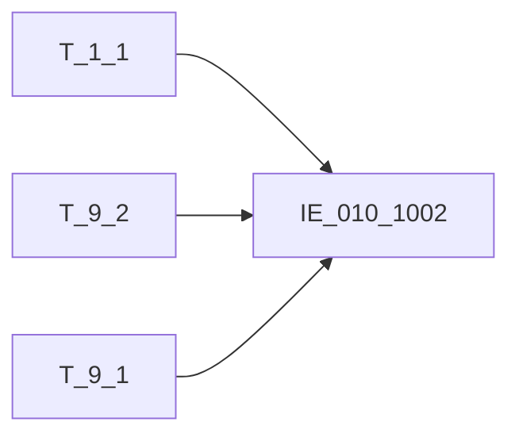

# 血缘-IE_010_1002-金融工具信息表-EAST5.0系统

## 页面边界

- 本页维护 `金融工具信息表` 从一表通来源表到 EAST5.0 目标表 `IE_010_1002` 的设计血缘。
- 证据为业务需求文档和工作区 GBase SQL 草案，尚未经过生产运行验证。
- 数据表字段定义见 [[数据表-IE_010_1002-金融工具信息表-EAST5.0系统]]；业务报送口径见 [[报表-IE_010_1002-金融工具信息表-EAST5.0系统]]。

## 系统边界

- 起始系统：一表通系统
- 目标系统：EAST5.0系统
- 是否跨系统血缘：是
- 目标对象：`IE_010_1002` `金融工具信息表`

## 业务链路摘要

- 按 `原始材料/业务需求/EAST5.0/059_金融工具信息表.md` 的字段映射，将一表通来源表加工为 EAST5.0 `金融工具信息表`。
- 表级规则：### 2.1 表级规则（Excel第 1429 行） 主表：【表9.2投融资标的】 左关联：【表1.1机构信息】 关联条件：【表9.2投融资标的】【机构ID】关联【机构信息】【机构ID】 左关联：【表9.1投资标的关系】 关联条件：【表9.2投融资标的】【投融资标的ID】关联【表9.1投资标的关系】【投资标的ID】 过滤条件：不包含【表8.7同业存量情况】【自营业务小类】为结算性存放同业、非结算性同业存放、结算性同业存放数据的【投融资标的ID】 并且（（只报送【表9.2投融资标的】【投融资标的代码】或【表9.2投融资标的】【投融资标的ID】在 自营资金交易信息表、自营资金业务余额表范围内） 或者 （【表9.2投融资标的】【失效日期】大于等于当月月初日期））
- SQL 草案采用按 `P_DATA_DATE` 清理后重插或增量边界过滤的方式；具体投产方式待验证。

## 直接上游对象

- [[数据表-T_1_1-机构信息-一表通系统]]：一表通来源表。
- [[数据表-T_9_2-投融资标的-一表通系统]]：一表通来源表。
- [[数据表-T_9_1-投资标的关系-一表通系统]]：一表通来源表。

## 直接下游对象

- 目标数据表：[[数据表-IE_010_1002-金融工具信息表-EAST5.0系统]]
- 报表业务口径页：[[报表-IE_010_1002-金融工具信息表-EAST5.0系统]]
- SQL 草案：`工作区/SQL开发/EAST5.0系统/PROC_EAST_IE_010_1002_JRGJXXB_草案.sql`

## Nodes

- [[数据表-T_1_1-机构信息-一表通系统]]：一表通来源表。
- [[数据表-T_9_2-投融资标的-一表通系统]]：一表通来源表。
- [[数据表-T_9_1-投资标的关系-一表通系统]]：一表通来源表。
- [[数据表-IE_010_1002-金融工具信息表-EAST5.0系统]]：EAST5.0 目标采集表。
- [[报表-IE_010_1002-金融工具信息表-EAST5.0系统]]：业务口径说明。

## 表级 Edge List

| From | To | Transform | Evidence |
| --- | --- | --- | --- |
| [[数据表-T_1_1-机构信息-一表通系统]] | [[数据表-IE_010_1002-金融工具信息表-EAST5.0系统]] | 字段映射、关联、过滤、码值/日期转换后装载 `IE_010_1002` | [[来源-EAST5.0系统-IE_010_1002-金融工具信息表]]；SQL 草案 |
| [[数据表-T_9_2-投融资标的-一表通系统]] | [[数据表-IE_010_1002-金融工具信息表-EAST5.0系统]] | 字段映射、关联、过滤、码值/日期转换后装载 `IE_010_1002` | [[来源-EAST5.0系统-IE_010_1002-金融工具信息表]]；SQL 草案 |
| [[数据表-T_9_1-投资标的关系-一表通系统]] | [[数据表-IE_010_1002-金融工具信息表-EAST5.0系统]] | 字段映射、关联、过滤、码值/日期转换后装载 `IE_010_1002` | [[来源-EAST5.0系统-IE_010_1002-金融工具信息表]]；SQL 草案 |

## 字段级 Edge List

| 源对象 | 源字段 | 目标对象 | 目标字段 | 处理逻辑 | 关系类型 | 证据 |
| --- | --- | --- | --- | --- | --- | --- |
| [[数据表-T_1_1-机构信息-一表通系统]] | `A010003` | [[数据表-IE_010_1002-金融工具信息表-EAST5.0系统]] | `JRXKZH` | 直接映射 | 直接映射 | [[来源-EAST5.0系统-IE_010_1002-金融工具信息表]]；SQL 草案 |
| [[数据表-T_9_2-投融资标的-一表通系统]] | `J020003` | [[数据表-IE_010_1002-金融工具信息表-EAST5.0系统]] | `NBJGH` | 截取12位以后 | 加工映射 | [[来源-EAST5.0系统-IE_010_1002-金融工具信息表]]；SQL 草案 |
| [[数据表-T_1_1-机构信息-一表通系统]] | `A010005` | [[数据表-IE_010_1002-金融工具信息表-EAST5.0系统]] | `YHJGMC` | 直接映射 | 直接映射 | [[来源-EAST5.0系统-IE_010_1002-金融工具信息表]]；SQL 草案 |
| [[数据表-T_9_2-投融资标的-一表通系统]] | `J020011` | [[数据表-IE_010_1002-金融工具信息表-EAST5.0系统]] | `JRGJBH` | 加工映射：优先取投融资标的代码，取不到再取投融资标的ID | 加工映射 | [[来源-EAST5.0系统-IE_010_1002-金融工具信息表]]；SQL 草案 |
| [[数据表-T_9_2-投融资标的-一表通系统]] | `待确认` | [[数据表-IE_010_1002-金融工具信息表-EAST5.0系统]] | `JRGJMC` | 直接映射 | 直接映射 | [[来源-EAST5.0系统-IE_010_1002-金融工具信息表]]；SQL 草案 |
| [[数据表-T_9_2-投融资标的-一表通系统]] | `J020021` | [[数据表-IE_010_1002-金融工具信息表-EAST5.0系统]] | `ZCLX` | 代码映射：【投融资标的的】.【投资标的类别】关联【代码映射表 TA99_CODE_REF_H】.【源代码 SrcCd】,使用【规则编号 RnvRuleNo】为'YBT-EAST-ZCLX',取【代码映射表 TA99_CODE_REF_H】.【目标代码描述 TargetCdDsc】；'0000-自定义'-'其他-自定义' | 加工映射 | [[来源-EAST5.0系统-IE_010_1002-金融工具信息表]]；SQL 草案 |
| [[数据表-T_9_2-投融资标的-一表通系统]] | `待确认` | [[数据表-IE_010_1002-金融工具信息表-EAST5.0系统]] | `BZ` | 直接映射 | 直接映射 | [[来源-EAST5.0系统-IE_010_1002-金融工具信息表]]；SQL 草案 |
| [[数据表-T_9_2-投融资标的-一表通系统]] | `J020004` | [[数据表-IE_010_1002-金融工具信息表-EAST5.0系统]] | `FXJG` | 直接映射 | 直接映射 | [[来源-EAST5.0系统-IE_010_1002-金融工具信息表]]；SQL 草案 |
| [[数据表-T_9_2-投融资标的-一表通系统]] | `J020005` | [[数据表-IE_010_1002-金融工具信息表-EAST5.0系统]] | `FXZGM` | 直接映射 | 直接映射 | [[来源-EAST5.0系统-IE_010_1002-金融工具信息表]]；SQL 草案 |
| [[数据表-T_9_2-投融资标的-一表通系统]] | `J020006` | [[数据表-IE_010_1002-金融工具信息表-EAST5.0系统]] | `FXJGMC` | 直接映射 | 直接映射 | [[来源-EAST5.0系统-IE_010_1002-金融工具信息表]]；SQL 草案 |
| [[数据表-T_9_2-投融资标的-一表通系统]] | `J020007` | [[数据表-IE_010_1002-金融工具信息表-EAST5.0系统]] | `FXJGDM` | 加工映射：发行机构代码长度为20位时，转成‘0’，其他取发行机构代码 | 加工映射 | [[来源-EAST5.0系统-IE_010_1002-金融工具信息表]]；SQL 草案 |
| [[数据表-T_9_2-投融资标的-一表通系统]] | `J020009` | [[数据表-IE_010_1002-金融工具信息表-EAST5.0系统]] | `FXGB` | 直接映射 | 直接映射 | [[来源-EAST5.0系统-IE_010_1002-金融工具信息表]]；SQL 草案 |
| [[数据表-T_9_2-投融资标的-一表通系统]] | `J020015` | [[数据表-IE_010_1002-金融工具信息表-EAST5.0系统]] | `FXRQ` | 直接映射:yyyy-mm-dd转为yyyymmdd | 直接映射 | [[来源-EAST5.0系统-IE_010_1002-金融工具信息表]]；SQL 草案 |
| [[数据表-T_9_2-投融资标的-一表通系统]] | `J020016` | [[数据表-IE_010_1002-金融工具信息表-EAST5.0系统]] | `DQRQ` | 加工映射:将【投融资标的】.【到期日期】格式由yyyy-mm-dd转为yyyymmdd,如果空则赋值:'99991231' | 加工映射 | [[来源-EAST5.0系统-IE_010_1002-金融工具信息表]]；SQL 草案 |
| [[数据表-T_9_2-投融资标的-一表通系统]] | `待确认` | [[数据表-IE_010_1002-金融工具信息表-EAST5.0系统]] | `LLLX` | 代码转换：01转LPR，02转非LPR | 码值转换/格式转换 | [[来源-EAST5.0系统-IE_010_1002-金融工具信息表]]；SQL 草案 |
| [[数据表-T_9_2-投融资标的-一表通系统]] | `待确认` | [[数据表-IE_010_1002-金融工具信息表-EAST5.0系统]] | `SJLL` | 直接映射 | 直接映射 | [[来源-EAST5.0系统-IE_010_1002-金融工具信息表]]；SQL 草案 |
| [[数据表-T_9_2-投融资标的-一表通系统]] | `J020087` | [[数据表-IE_010_1002-金融工具信息表-EAST5.0系统]] | `HQBS` | 加工映射：含权类型非空时，填写“是”，否则填写“否” | 加工映射 | [[来源-EAST5.0系统-IE_010_1002-金融工具信息表]]；SQL 草案 |
| [[数据表-T_9_2-投融资标的-一表通系统]] | `J020019` | [[数据表-IE_010_1002-金融工具信息表-EAST5.0系统]] | `ZJPGJG` | 直接映射 | 直接映射 | [[来源-EAST5.0系统-IE_010_1002-金融工具信息表]]；SQL 草案 |
| [[数据表-T_9_2-投融资标的-一表通系统]] | `J020020` | [[数据表-IE_010_1002-金融工具信息表-EAST5.0系统]] | `PGJGRQ` | 加工映射:yyyy-mm-dd转为yyyymmdd,如果空则赋值:'99991231' | 加工映射 | [[来源-EAST5.0系统-IE_010_1002-金融工具信息表]]；SQL 草案 |
| [[数据表-T_9_2-投融资标的-一表通系统]] | `待确认` | [[数据表-IE_010_1002-金融工具信息表-EAST5.0系统]] | `JCZCBH` | 加工映射:如果【基础资产客户名称】为空,则赋默认值‘’，否则取【投融资标的代码】 | 加工映射 | [[来源-EAST5.0系统-IE_010_1002-金融工具信息表]]；SQL 草案 |
| [[数据表-T_9_2-投融资标的-一表通系统]] | `待确认` | [[数据表-IE_010_1002-金融工具信息表-EAST5.0系统]] | `JCZCMC` | 加工映射:如果【基础资产客户名称】为空,则赋默认值‘’，否则取投【投资标的名称】 | 加工映射 | [[来源-EAST5.0系统-IE_010_1002-金融工具信息表]]；SQL 草案 |
| [[数据表-T_9_1-投资标的关系-一表通系统]] | `J010006` | [[数据表-IE_010_1002-金融工具信息表-EAST5.0系统]] | `JCZCGM` | 直接映射 | 直接映射 | [[来源-EAST5.0系统-IE_010_1002-金融工具信息表]]；SQL 草案 |
| [[数据表-T_9_1-投资标的关系-一表通系统]] | `J010005` | [[数据表-IE_010_1002-金融工具信息表-EAST5.0系统]] | `JCZCZB` | 直接映射 | 直接映射 | [[来源-EAST5.0系统-IE_010_1002-金融工具信息表]]；SQL 草案 |
| [[数据表-T_9_2-投融资标的-一表通系统]] | `J020031` | [[数据表-IE_010_1002-金融工具信息表-EAST5.0系统]] | `JCZCPJ` | 加工映射：先取【基础资产外部评级】，取不到则取【基础资产内部评级】 | 加工映射 | [[来源-EAST5.0系统-IE_010_1002-金融工具信息表]]；SQL 草案 |
| [[数据表-T_9_2-投融资标的-一表通系统]] | `J020032` | [[数据表-IE_010_1002-金融工具信息表-EAST5.0系统]] | `JCZCPJJG` | 优先使用外部评级机构，若无外部评级机构，填报内部评级机构名称（各银行内部评级机构，可为固定值）。若两者均无的，置为空。 | 直接映射 | [[来源-EAST5.0系统-IE_010_1002-金融工具信息表]]；SQL 草案 |
| [[数据表-T_9_2-投融资标的-一表通系统]] | `J020026` | [[数据表-IE_010_1002-金融工具信息表-EAST5.0系统]] | `JCZCKHMC` | 直接映射 | 直接映射 | [[来源-EAST5.0系统-IE_010_1002-金融工具信息表]]；SQL 草案 |
| [[数据表-T_9_2-投融资标的-一表通系统]] | `J020027` | [[数据表-IE_010_1002-金融工具信息表-EAST5.0系统]] | `JCZCKHGJ` | 代码映射：关联BS_CS_GGDM使用【表名 BM】为'通用'并且【字段名ZDM】为‘国家地区’,取【中文含义ZWHY】 | 加工映射 | [[来源-EAST5.0系统-IE_010_1002-金融工具信息表]]；SQL 草案 |
| [[数据表-T_9_2-投融资标的-一表通系统]] | `J020028` | [[数据表-IE_010_1002-金融工具信息表-EAST5.0系统]] | `JCZCKHPJ` | 直接映射 | 直接映射 | [[来源-EAST5.0系统-IE_010_1002-金融工具信息表]]；SQL 草案 |
| [[数据表-T_9_2-投融资标的-一表通系统]] | `J020029` | [[数据表-IE_010_1002-金融工具信息表-EAST5.0系统]] | `JCZCKHPJJG` | 直接映射 | 直接映射 | [[来源-EAST5.0系统-IE_010_1002-金融工具信息表]]；SQL 草案 |
| [[数据表-T_9_2-投融资标的-一表通系统]] | `J020030` | [[数据表-IE_010_1002-金融工具信息表-EAST5.0系统]] | `JCZCHKHHY` | 加工映射：当【投融资标的】.【基础资产客户行业类型】为'99999'时赋值'境外'，否则取【投资标的】.【基础资产客户行业类型】 | 加工映射 | [[来源-EAST5.0系统-IE_010_1002-金融工具信息表]]；SQL 草案 |
| [[数据表-T_9_2-投融资标的-一表通系统]] | `J020033` | [[数据表-IE_010_1002-金融工具信息表-EAST5.0系统]] | `ZZTXLX` | 代码映射：代码转中文描述；01-货币市场工具及货币市场公募基金；02-债券及债券公募基金；03-存款；04-信贷类投资；05-权益类投资及股票公募基金；00-自定义 - 其他-自定义 | 加工映射 | [[来源-EAST5.0系统-IE_010_1002-金融工具信息表]]；SQL 草案 |
| [[数据表-T_9_2-投融资标的-一表通系统]] | `J020034` | [[数据表-IE_010_1002-金融工具信息表-EAST5.0系统]] | `ZZTXHY` | 加工映射：当【投融资标的】.【基础资产最终投向行业类型】为'99999'时赋值'境外'，否则取【投融资标的】.【基础资产最终投向行业类型】 | 加工映射 | [[来源-EAST5.0系统-IE_010_1002-金融工具信息表]]；SQL 草案 |
| [[数据表-T_9_2-投融资标的-一表通系统]] | `J020104` | [[数据表-IE_010_1002-金融工具信息表-EAST5.0系统]] | `BBZ` | 加工映射：提取一表通《9.2投融资标的》、《9.1投资标的关系》备注，以“；”拼接。 | 加工映射 | [[来源-EAST5.0系统-IE_010_1002-金融工具信息表]]；SQL 草案 |
| [[数据表-T_9_2-投融资标的-一表通系统]] | `J020105` | [[数据表-IE_010_1002-金融工具信息表-EAST5.0系统]] | `CJRQ` | 直接映射:yyyy-mm-dd转为yyyymmdd | 直接映射 | [[来源-EAST5.0系统-IE_010_1002-金融工具信息表]]；SQL 草案 |

## Graph-总览

## 回链检查

- 目标数据表页：已补 SQL 草案上游依赖摘要或待本次批处理补齐。
- 报表业务口径页：已创建或补充血缘回链。
- 一表通源表页：已补下游消费摘要或待本次批处理补齐。
- 当前字段级血缘基于业务需求和 SQL 草案，未运行验证，状态为待确认。

## 变更与冲突

- 本次为新增设计血缘或补齐草案血缘，不覆盖已验证生产血缘。
- 未发现需要将 `validated` 页面降级的情况；本页保持 `draft`。

## Open Questions

- GBase 草案中的复杂 JOIN、窗口去重、终态纳入和增量边界需要人工复核。
- 部分字段的码值 CASE 在草案中仍为待补，需要结合外部填报说明和跑数结果闭环。
- 外部监管实体页 wikilink 待补。

## 缺口字段（2026-05-04）

| 目标字段 | 字段名称 | 缺口说明 |
| --- | --- | --- |
| `GSFZJG` | 归属分支机构 | 本地 DDL 存在，但业务需求映射表和 SQL 草案未能确认来源，字段级血缘待补。 |
| `SENSITIVEFLAG` | 涉密标志 | 本地 DDL 存在，但业务需求映射表和 SQL 草案未能确认来源，字段级血缘待补。 |
