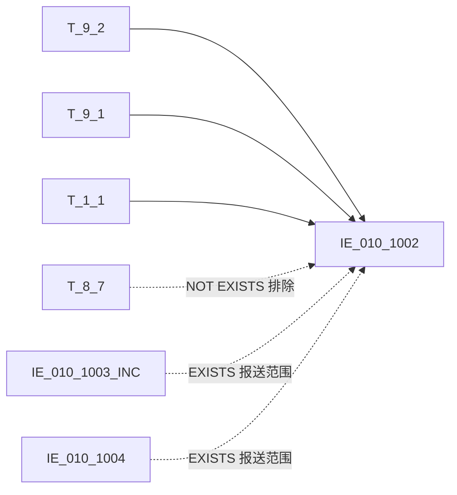

# 血缘-IE_010_1002-金融工具信息表-EAST5.0系统

## 页面边界

- 本页维护 `金融工具信息表` 从一表通来源表到 EAST5.0 目标表 `IE_010_1002` 的设计血缘。
- 证据为业务需求文档和工作区 GBase SQL 草案（2026-05-10 重构校准版）。
- 数据表字段定义见 [[数据表-IE_010_1002-金融工具信息表-EAST5.0系统]]；业务报送口径见 [[报表-IE_010_1002-金融工具信息表-EAST5.0系统]]。

## 系统边界

- 起始系统：一表通系统
- 目标系统：EAST5.0系统
- 是否跨系统血缘：是
- 目标对象：`IE_010_1002` `金融工具信息表`

## 业务链路摘要

- 按 `原始材料/业务需求/EAST5.0/059_金融工具信息表.md` 的字段映射，将一表通来源表加工为 EAST5.0 `金融工具信息表`。
- 表级规则：### 2.1 表级规则（Excel第 1429 行） 主表：【表9.2投融资标的】 左关联：【表1.1机构信息】 关联条件：【表9.2投融资标的】【机构ID】关联【机构信息】【机构ID】 左关联：【表9.1投资标的关系】 关联条件：【表9.2投融资标的】【投融资标的ID】关联【表9.1投资标的关系】【投资标的ID】 过滤条件：不包含【表8.7同业存量情况】【自营业务小类】为结算性存放同业、非结算性同业存放、结算性同业存放数据的【投融资标的ID】 并且（（只报送【表9.2投融资标的】【投融资标的代码】或【表9.2投融资标的】【投融资标的ID】在 自营资金交易信息表、自营资金业务余额表范围内） 或者 （【表9.2投融资标的】【失效日期】大于等于当月月初日期））
- SQL 草案采用按 `P_DATA_DATE` 清理后重插方式；所有 JOIN 条件和 WHERE 过滤已按业务需求补齐。

## 直接上游对象

- [[数据表-T_1_1-机构信息-一表通系统]]：一表通来源表。
- [[数据表-T_9_2-投融资标的-一表通系统]]：一表通来源表（主表）。
- [[数据表-T_9_1-投资标的关系-一表通系统]]：一表通来源表。
- [[数据表-T_8_7-同业存量情况-一表通系统]]：一表通来源表（NOT EXISTS 排除）。
- IE_010_1003_INC（自营资金交易信息表）：EAST5.0 目标表（EXISTS 报送范围）。
- IE_010_1004（自营资金业务余额表）：EAST5.0 目标表（EXISTS 报送范围）。

## 直接下游对象

- 目标数据表：[[数据表-IE_010_1002-金融工具信息表-EAST5.0系统]]
- 报表业务口径页：[[报表-IE_010_1002-金融工具信息表-EAST5.0系统]]
- SQL 草案：`工作区/SQL开发/EAST5.0系统/PROC_EAST_IE_010_1002_JRGJXXB_草案.sql`

## Nodes

- [[数据表-T_1_1-机构信息-一表通系统]]：一表通来源表。
- [[数据表-T_9_2-投融资标的-一表通系统]]：一表通来源表。
- [[数据表-T_9_1-投资标的关系-一表通系统]]：一表通来源表。
- [[数据表-T_8_7-同业存量情况-一表通系统]]：一表通来源表（排除条件）。
- IE_010_1003_INC：EAST5.0 目标表（报送范围条件）。
- IE_010_1004：EAST5.0 目标表（报送范围条件）。
- [[数据表-IE_010_1002-金融工具信息表-EAST5.0系统]]：EAST5.0 目标采集表。
- [[报表-IE_010_1002-金融工具信息表-EAST5.0系统]]：业务口径说明。

## 表级 Edge List

| From | To | Transform | Evidence |
| --- | --- | --- | --- |
| [[数据表-T_1_1-机构信息-一表通系统]] | [[数据表-IE_010_1002-金融工具信息表-EAST5.0系统]] | LEFT JOIN（J020003=A010001 + 采集日期），取 JRXKZH/YHJGMC | SQL 草案 2026-05-10 重构校准 |
| [[数据表-T_9_2-投融资标的-一表通系统]] | [[数据表-IE_010_1002-金融工具信息表-EAST5.0系统]] | 主表，字段映射、码值转换、日期转换 | SQL 草案 2026-05-10 重构校准 |
| [[数据表-T_9_1-投资标的关系-一表通系统]] | [[数据表-IE_010_1002-金融工具信息表-EAST5.0系统]] | LEFT JOIN（J020001=J010001 + 采集日期），取 JCZCZB/JCZCGM/BBZ | SQL 草案 2026-05-10 重构校准 |
| [[数据表-T_8_7-同业存量情况-一表通系统]] | [[数据表-IE_010_1002-金融工具信息表-EAST5.0系统]] | NOT EXISTS 排除结算性存放同业/非结算性同业存放/结算性同业存放 | SQL 草案 2026-05-10 重构校准 |
| IE_010_1003_INC | [[数据表-IE_010_1002-金融工具信息表-EAST5.0系统]] | EXISTS 报送范围（JRGJBH = T_9_2.J020011/J020001 + CJRQ） | SQL 草案 2026-05-10 重构校准 |
| IE_010_1004 | [[数据表-IE_010_1002-金融工具信息表-EAST5.0系统]] | EXISTS 报送范围（JRGJBH = T_9_2.J020011/J020001 + CJRQ） | SQL 草案 2026-05-10 重构校准 |

## 字段级 Edge List

| 源对象 | 源字段 | 目标对象 | 目标字段 | 处理逻辑 | 关系类型 | 证据 |
| --- | --- | --- | --- | --- | --- | --- |
| [[数据表-T_1_1-机构信息-一表通系统]] | `A010003` | [[数据表-IE_010_1002-金融工具信息表-EAST5.0系统]] | `JRXKZH` | 直接映射 | 直接映射 | SQL 草案 2026-05-10 |
| [[数据表-T_9_2-投融资标的-一表通系统]] | `J020003` | [[数据表-IE_010_1002-金融工具信息表-EAST5.0系统]] | `NBJGH` | SUBSTR(J020003,13) 截取12位以后 | 加工映射 | SQL 草案 2026-05-10 |
| [[数据表-T_1_1-机构信息-一表通系统]] | `A010005` | [[数据表-IE_010_1002-金融工具信息表-EAST5.0系统]] | `YHJGMC` | 直接映射 | 直接映射 | SQL 草案 2026-05-10 |
| [[数据表-T_9_2-投融资标的-一表通系统]] | `J020011/J020001` | [[数据表-IE_010_1002-金融工具信息表-EAST5.0系统]] | `JRGJBH` | 加工映射：优先取 J020011（投融资标的代码），取不到再取 J020001（投融资标的ID） | 加工映射 | SQL 草案 2026-05-10 |
| [[数据表-T_9_2-投融资标的-一表通系统]] | `J020002` | [[数据表-IE_010_1002-金融工具信息表-EAST5.0系统]] | `JRGJMC` | 直接映射（投资标的名称） | 直接映射 | SQL 草案 2026-05-10 |
| [[数据表-T_9_2-投融资标的-一表通系统]] | `J020021` | [[数据表-IE_010_1002-金融工具信息表-EAST5.0系统]] | `ZCLX` | 直接映射（待关联 TA99_CODE_REF_H 代码映射表） | 加工映射 | SQL 草案 2026-05-10 |
| [[数据表-T_9_2-投融资标的-一表通系统]] | `J020010` | [[数据表-IE_010_1002-金融工具信息表-EAST5.0系统]] | `BZ` | 直接映射（投融资标的币种） | 直接映射 | SQL 草案 2026-05-10 |
| [[数据表-T_9_2-投融资标的-一表通系统]] | `J020004` | [[数据表-IE_010_1002-金融工具信息表-EAST5.0系统]] | `FXJG` | 直接映射→DECIMAL(20,2) | 直接映射 | SQL 草案 2026-05-10 |
| [[数据表-T_9_2-投融资标的-一表通系统]] | `J020005` | [[数据表-IE_010_1002-金融工具信息表-EAST5.0系统]] | `FXZGM` | 直接映射→DECIMAL(20,2) | 直接映射 | SQL 草案 2026-05-10 |
| [[数据表-T_9_2-投融资标的-一表通系统]] | `J020006` | [[数据表-IE_010_1002-金融工具信息表-EAST5.0系统]] | `FXJGMC` | 直接映射 | 直接映射 | SQL 草案 2026-05-10 |
| [[数据表-T_9_2-投融资标的-一表通系统]] | `J020007` | [[数据表-IE_010_1002-金融工具信息表-EAST5.0系统]] | `FXJGDM` | 加工映射：LENGTH(TRIM)=20→'0'，其他取原值 | 加工映射 | SQL 草案 2026-05-10 |
| [[数据表-T_9_2-投融资标的-一表通系统]] | `J020009` | [[数据表-IE_010_1002-金融工具信息表-EAST5.0系统]] | `FXGB` | 直接映射 | 直接映射 | SQL 草案 2026-05-10 |
| [[数据表-T_9_2-投融资标的-一表通系统]] | `J020015` | [[数据表-IE_010_1002-金融工具信息表-EAST5.0系统]] | `FXRQ` | DATE_FORMAT(J020015,'%Y%m%d') | 直接映射 | SQL 草案 2026-05-10 |
| [[数据表-T_9_2-投融资标的-一表通系统]] | `J020016` | [[数据表-IE_010_1002-金融工具信息表-EAST5.0系统]] | `DQRQ` | CASE WHEN NULL THEN '99991231' ELSE DATE_FORMAT→VARCHAR(8) | 加工映射 | SQL 草案 2026-05-10 |
| [[数据表-T_9_2-投融资标的-一表通系统]] | `J020017` | [[数据表-IE_010_1002-金融工具信息表-EAST5.0系统]] | `LLLX` | CASE：'01'→LPR / '02'→非LPR / ELSE→NULL | 码值转换 | SQL 草案 2026-05-10 |
| [[数据表-T_9_2-投融资标的-一表通系统]] | `J020018` | [[数据表-IE_010_1002-金融工具信息表-EAST5.0系统]] | `SJLL` | 直接映射→DECIMAL(20,6) | 直接映射 | SQL 草案 2026-05-10 |
| [[数据表-T_9_2-投融资标的-一表通系统]] | `J020087` | [[数据表-IE_010_1002-金融工具信息表-EAST5.0系统]] | `HQBS` | CASE：非空→'是' / 空→'否' | 加工映射 | SQL 草案 2026-05-10 |
| [[数据表-T_9_2-投融资标的-一表通系统]] | `J020019` | [[数据表-IE_010_1002-金融工具信息表-EAST5.0系统]] | `ZJPGJG` | 直接映射→DECIMAL(20,2) | 直接映射 | SQL 草案 2026-05-10 |
| [[数据表-T_9_2-投融资标的-一表通系统]] | `J020020` | [[数据表-IE_010_1002-金融工具信息表-EAST5.0系统]] | `PGJGRQ` | CASE WHEN NULL THEN '99991231' ELSE DATE_FORMAT→VARCHAR(8) | 加工映射 | SQL 草案 2026-05-10 |
| [[数据表-T_9_2-投融资标的-一表通系统]] | `J020011` | [[数据表-IE_010_1002-金融工具信息表-EAST5.0系统]] | `JCZCBH` | CASE WHEN J020026 IS NULL THEN '' ELSE J020011 | 加工映射 | SQL 草案 2026-05-10 |
| [[数据表-T_9_2-投融资标的-一表通系统]] | `J020002` | [[数据表-IE_010_1002-金融工具信息表-EAST5.0系统]] | `JCZCMC` | CASE WHEN J020026 IS NULL THEN '' ELSE J020002 | 加工映射 | SQL 草案 2026-05-10 |
| [[数据表-T_9_1-投资标的关系-一表通系统]] | `J010006` | [[数据表-IE_010_1002-金融工具信息表-EAST5.0系统]] | `JCZCGM` | 直接映射→DECIMAL(20,2) | 直接映射 | SQL 草案 2026-05-10 |
| [[数据表-T_9_1-投资标的关系-一表通系统]] | `J010005` | [[数据表-IE_010_1002-金融工具信息表-EAST5.0系统]] | `JCZCZB` | 直接映射→DECIMAL(20,2) | 直接映射 | SQL 草案 2026-05-10 |
| [[数据表-T_9_2-投融资标的-一表通系统]] | `J020031/J020109` | [[数据表-IE_010_1002-金融工具信息表-EAST5.0系统]] | `JCZCPJ` | COALESCE(NULLIF(J020031), NULLIF(J020109)) 先取外部评级，取不到取内部评级 | 加工映射 | SQL 草案 2026-05-10 |
| [[数据表-T_9_2-投融资标的-一表通系统]] | `J020032` | [[数据表-IE_010_1002-金融工具信息表-EAST5.0系统]] | `JCZCPJJG` | 直接映射（基础资产评级机构） | 直接映射 | SQL 草案 2026-05-10 |
| [[数据表-T_9_2-投融资标的-一表通系统]] | `J020026` | [[数据表-IE_010_1002-金融工具信息表-EAST5.0系统]] | `JCZCKHMC` | 直接映射 | 直接映射 | SQL 草案 2026-05-10 |
| [[数据表-T_9_2-投融资标的-一表通系统]] | `J020027` | [[数据表-IE_010_1002-金融工具信息表-EAST5.0系统]] | `JCZCKHGJ` | 直接映射（待关联 BS_CS_GGDM 代码映射表） | 加工映射 | SQL 草案 2026-05-10 |
| [[数据表-T_9_2-投融资标的-一表通系统]] | `J020028` | [[数据表-IE_010_1002-金融工具信息表-EAST5.0系统]] | `JCZCKHPJ` | 直接映射 | 直接映射 | SQL 草案 2026-05-10 |
| [[数据表-T_9_2-投融资标的-一表通系统]] | `J020029` | [[数据表-IE_010_1002-金融工具信息表-EAST5.0系统]] | `JCZCKHPJJG` | 直接映射 | 直接映射 | SQL 草案 2026-05-10 |
| [[数据表-T_9_2-投融资标的-一表通系统]] | `J020030` | [[数据表-IE_010_1002-金融工具信息表-EAST5.0系统]] | `JCZCHKHHY` | CASE WHEN '99999' THEN '境外' ELSE J020030 | 加工映射 | SQL 草案 2026-05-10 |
| [[数据表-T_9_2-投融资标的-一表通系统]] | `J020033` | [[数据表-IE_010_1002-金融工具信息表-EAST5.0系统]] | `ZZTXLX` | CASE 代码转中文：01→货币市场工具及货币市场公募基金 / 02→债券及债券公募基金 / 03→存款 / 04→信贷类投资 / 05→权益类投资及股票公募基金 / 00→自定义 / 00-XX→其他-自定义 / ELSE→原值 | 加工映射 | SQL 草案 2026-05-10 |
| [[数据表-T_9_2-投融资标的-一表通系统]] | `J020034` | [[数据表-IE_010_1002-金融工具信息表-EAST5.0系统]] | `ZZTXHY` | CASE WHEN '99999' THEN '境外' ELSE J020034 | 加工映射 | SQL 草案 2026-05-10 |
| [[数据表-T_9_2-投融资标的-一表通系统]] | `J020104` | [[数据表-IE_010_1002-金融工具信息表-EAST5.0系统]] | `BBZ` | CONCAT_WS 拼接 T_9_2.J020104 + T_9_1.J010013 | 加工映射 | SQL 草案 2026-05-10 |
| [[数据表-T_9_2-投融资标的-一表通系统]] | `J020105` | [[数据表-IE_010_1002-金融工具信息表-EAST5.0系统]] | `CJRQ` | 直接赋参数 P_DATA_DATE | 直接映射 | SQL 草案 2026-05-10 |
| N/A | N/A | [[数据表-IE_010_1002-金融工具信息表-EAST5.0系统]] | `GSFZJG` | 无业务来源，置 NULL | 缺口字段 | SQL 草案 2026-05-10 |
| N/A | N/A | [[数据表-IE_010_1002-金融工具信息表-EAST5.0系统]] | `SENSITIVEFLAG` | 无业务来源，置 NULL | 缺口字段 | SQL 草案 2026-05-10 |

## Graph-总览

## 回链检查

- 目标数据表页：已更新 SQL 草案上游依赖摘要（2026-05-10 重构校准）。
- 报表业务口径页：已创建或补充血缘回链。
- 一表通源表页：已补下游消费摘要。
- 当前字段级血缘基于业务需求和重构后 SQL 草案，未运行验证，状态保持 draft。

## 变更与冲突

- 2026-05-10 重构校准：全面重写草案，消除所有 ON 1=1 和 WHERE 1=1 占位。
- 补齐全部 34 个字段的业务映射逻辑，2 个缺口字段（GSFZJG/SENSITIVEFLAG）无来源置 NULL。
- 新增 T_8_7 和 IE_010_1003_INC/IE_010_1004 作为上游对象。
- 所有页面保持 `draft`，SQL 草案尚未在 GBase 环境执行语法校验和跑数验证。

## Open Questions

- GBase 8a MPP 环境中 DATE_FORMAT 函数的兼容性待运行验证。
- T_8_7.H070021 实际存储值为代码还是中文描述待现场确认。
- ZCLX（TA99_CODE_REF_H）和 JCZCKHGJ（BS_CS_GGDM）的代码映射表可用性待确认。
- WHERE 中 IE_010_1003_INC/IE_010_1004 EXISTS 子查询的性能和依赖顺序待跑数验证。
- 外部监管实体页 wikilink 待补。

## 缺口字段（2026-05-10）

| 目标字段 | 字段名称 | 缺口说明 |
| --- | --- | --- |
| `GSFZJG` | 归属分支机构 | 本地 DDL 存在，但业务需求映射表和 SQL 草案未能确认来源，字段级血缘待补。 |
| `SENSITIVEFLAG` | 涉密标志 | 本地 DDL 存在，但业务需求映射表和 SQL 草案未能确认来源，字段级血缘待补。 |
