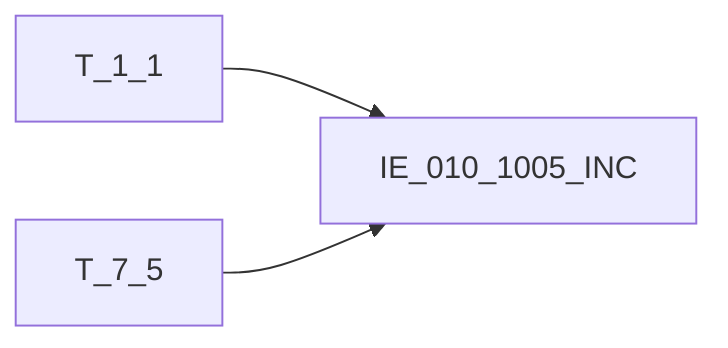

# 血缘-IE_010_1005_INC-即期及衍生品交易信息表-EAST5.0系统

## 页面边界

- 本页维护 `即期及衍生品交易信息表` 从一表通来源表到 EAST5.0 目标表 `IE_010_1005_INC` 的设计血缘。
- 证据为业务需求文档和工作区 GBase SQL 草案，尚未经过生产运行验证。
- 数据表字段定义见 [[数据表-IE_010_1005_INC-即期及衍生品交易信息表-EAST5.0系统]]；业务报送口径见 [[报表-IE_010_1005_INC-即期及衍生品交易信息表-EAST5.0系统]]。

## 系统边界

- 起始系统：一表通系统
- 目标系统：EAST5.0系统
- 是否跨系统血缘：是
- 目标对象：`IE_010_1005_INC` `即期及衍生品交易信息表`

## 业务链路摘要

- 按 `原始材料/业务需求/EAST5.0/062_即期及衍生品交易信息表.md` 的字段映射，将一表通来源表加工为 EAST5.0 `即期及衍生品交易信息表`。
- 表级规则：### 2.1 表级规则（Excel第 1524 行） 主表：【衍生品交易】 左关联：【机构信息】 关联条件：【衍生品交易】【交易机构ID】关联【机构信息】【机构ID】 过滤条件：【衍生品交易】【采集日期】当月数据
- SQL 草案采用按 `P_DATA_DATE` 清理后重插或增量边界过滤的方式；具体投产方式待验证。

## 直接上游对象

- [[数据表-T_1_1-机构信息-一表通系统]]：一表通来源表。
- [[数据表-T_7_5-衍生品交易-一表通系统]]：一表通来源表。

## 直接下游对象

- 目标数据表：[[数据表-IE_010_1005_INC-即期及衍生品交易信息表-EAST5.0系统]]
- 报表业务口径页：[[报表-IE_010_1005_INC-即期及衍生品交易信息表-EAST5.0系统]]
- SQL 草案：`工作区/SQL开发/EAST5.0系统/PROC_EAST_IE_010_1005_INC_JQJYSPJYXXB_草案.sql`

## Nodes

- [[数据表-T_1_1-机构信息-一表通系统]]：一表通来源表。
- [[数据表-T_7_5-衍生品交易-一表通系统]]：一表通来源表。
- [[数据表-IE_010_1005_INC-即期及衍生品交易信息表-EAST5.0系统]]：EAST5.0 目标采集表。
- [[报表-IE_010_1005_INC-即期及衍生品交易信息表-EAST5.0系统]]：业务口径说明。

## 表级 Edge List

| From | To | Transform | Evidence |
| --- | --- | --- | --- |
| [[数据表-T_1_1-机构信息-一表通系统]] | [[数据表-IE_010_1005_INC-即期及衍生品交易信息表-EAST5.0系统]] | 字段映射、关联、过滤、码值/日期转换后装载 `IE_010_1005_INC` | [[来源-EAST5.0系统-IE_010_1005_INC-即期及衍生品交易信息表]]；SQL 草案 |
| [[数据表-T_7_5-衍生品交易-一表通系统]] | [[数据表-IE_010_1005_INC-即期及衍生品交易信息表-EAST5.0系统]] | 字段映射、关联、过滤、码值/日期转换后装载 `IE_010_1005_INC` | [[来源-EAST5.0系统-IE_010_1005_INC-即期及衍生品交易信息表]]；SQL 草案 |

## 字段级 Edge List

| 源对象 | 源字段 | 目标对象 | 目标字段 | 处理逻辑 | 关系类型 | 证据 |
| --- | --- | --- | --- | --- | --- | --- |
| [[数据表-T_1_1-机构信息-一表通系统]] | `A010003` | [[数据表-IE_010_1005_INC-即期及衍生品交易信息表-EAST5.0系统]] | `JRXKZH` | 直接映射 | 直接映射 | [[来源-EAST5.0系统-IE_010_1005_INC-即期及衍生品交易信息表]]；SQL 草案 |
| [[数据表-T_7_5-衍生品交易-一表通系统]] | `G050002` | [[数据表-IE_010_1005_INC-即期及衍生品交易信息表-EAST5.0系统]] | `NBJGH` | 从第12位开始截取【衍生品交易】.交易机构ID | 加工映射 | [[来源-EAST5.0系统-IE_010_1005_INC-即期及衍生品交易信息表]]；SQL 草案 |
| [[数据表-T_1_1-机构信息-一表通系统]] | `A010005` | [[数据表-IE_010_1005_INC-即期及衍生品交易信息表-EAST5.0系统]] | `YHJGMC` | 直接映射 | 直接映射 | [[来源-EAST5.0系统-IE_010_1005_INC-即期及衍生品交易信息表]]；SQL 草案 |
| [[数据表-T_7_5-衍生品交易-一表通系统]] | `G050001` | [[数据表-IE_010_1005_INC-即期及衍生品交易信息表-EAST5.0系统]] | `JYBH` | 直接映射 | 直接映射 | [[来源-EAST5.0系统-IE_010_1005_INC-即期及衍生品交易信息表]]；SQL 草案 |
| [[数据表-T_7_5-衍生品交易-一表通系统]] | `G050040` | [[数据表-IE_010_1005_INC-即期及衍生品交易信息表-EAST5.0系统]] | `YWPZ` | 直接映射 | 直接映射 | [[来源-EAST5.0系统-IE_010_1005_INC-即期及衍生品交易信息表]]；SQL 草案 |
| [[数据表-T_7_5-衍生品交易-一表通系统]] | `G050041` | [[数据表-IE_010_1005_INC-即期及衍生品交易信息表-EAST5.0系统]] | `JCZCLX` | 直接映射 | 直接映射 | [[来源-EAST5.0系统-IE_010_1005_INC-即期及衍生品交易信息表]]；SQL 草案 |
| [[数据表-T_7_5-衍生品交易-一表通系统]] | `G050042` | [[数据表-IE_010_1005_INC-即期及衍生品交易信息表-EAST5.0系统]] | `JCZCMC` | 直接映射 | 直接映射 | [[来源-EAST5.0系统-IE_010_1005_INC-即期及衍生品交易信息表]]；SQL 草案 |
| [[数据表-T_7_5-衍生品交易-一表通系统]] | `G050006` | [[数据表-IE_010_1005_INC-即期及衍生品交易信息表-EAST5.0系统]] | `JYLX` | 码值转化：根据如下转换；源码值 目标值 ；01 套期保值 ；02 代客 卖出衍生品。；03 代客平盘 含权衍生品执行权利。；04 做市 衍生品到期按合同约定交割。；05 自营 远期或互换中按固定利率支付利息。；00 其他-自定义 | 码值转换/格式转换 | [[来源-EAST5.0系统-IE_010_1005_INC-即期及衍生品交易信息表]]；SQL 草案 |
| [[数据表-T_7_5-衍生品交易-一表通系统]] | `G050043` | [[数据表-IE_010_1005_INC-即期及衍生品交易信息表-EAST5.0系统]] | `HYZL` | 码值转化：根据如下转换；源码值 目标值 ；01 即期 即期；02 远期 远期；03 期货 期货；04 掉期 掉期；05 互换 互换；06 期权 期权；07 延期交收 延期交收；00-自定义 其他-银行自定义。 | 码值转换/格式转换 | [[来源-EAST5.0系统-IE_010_1005_INC-即期及衍生品交易信息表]]；SQL 草案 |
| [[数据表-T_7_5-衍生品交易-一表通系统]] | `G050024` | [[数据表-IE_010_1005_INC-即期及衍生品交易信息表-EAST5.0系统]] | `JYZT` | 码值转化：；一表通代码 映射east：；01 新增 新增；02 终止 终止；03 变更 变更；04 行权 行权；05 估值 估值；00 00-自定义 其他-自定义；其余返回 交易状态字段值 | 码值转换/格式转换 | [[来源-EAST5.0系统-IE_010_1005_INC-即期及衍生品交易信息表]]；SQL 草案 |
| [[数据表-T_7_5-衍生品交易-一表通系统]] | `G050037` | [[数据表-IE_010_1005_INC-即期及衍生品交易信息表-EAST5.0系统]] | `MFMC1` | 当【衍生品交易】.交易对手方向 ='01' /*买方*/则取 【衍生品交易】.交易对手名称；当【衍生品交易】.交易对手方向 ='02' /*卖方*/则取 【衍生品交易】.交易机构名称 | 加工映射 | [[来源-EAST5.0系统-IE_010_1005_INC-即期及衍生品交易信息表]]；SQL 草案 |
| [[数据表-T_7_5-衍生品交易-一表通系统]] | `G050037` | [[数据表-IE_010_1005_INC-即期及衍生品交易信息表-EAST5.0系统]] | `MFKHTYBH1` | 当【衍生品交易】.交易对手方向 ='01' /*买方*/则取 【衍生品交易】.交易对手客户编号；当【衍生品交易】.交易对手方向 ='02' /*卖方*/则用【衍生品交易】.交易机构ID 关联取金融许可证号。 | 加工映射 | [[来源-EAST5.0系统-IE_010_1005_INC-即期及衍生品交易信息表]]；SQL 草案 |
| [[数据表-T_7_5-衍生品交易-一表通系统]] | `G050037` | [[数据表-IE_010_1005_INC-即期及衍生品交易信息表-EAST5.0系统]] | `MFMC2` | 当【衍生品交易】.交易对手方向 ='01' /*买方*/则 '各取 【衍生品交易】.交易机构名称。；当【衍生品交易】.交易对手方向 ='02' /*买方*/则【衍生品交易】.交易对手名称 | 加工映射 | [[来源-EAST5.0系统-IE_010_1005_INC-即期及衍生品交易信息表]]；SQL 草案 |
| [[数据表-T_7_5-衍生品交易-一表通系统]] | `G050037` | [[数据表-IE_010_1005_INC-即期及衍生品交易信息表-EAST5.0系统]] | `MFKHTYBH2` | 当【衍生品交易】.交易对手方向 ='01' /*买方*/则用【衍生品交易】.交易机构ID 关联取金融许可证号；当【衍生品交易】.交易对手方向 ='02' /*买方*/则【衍生品交易】.交易对手客户编号 | 加工映射 | [[来源-EAST5.0系统-IE_010_1005_INC-即期及衍生品交易信息表]]；SQL 草案 |
| [[数据表-T_7_5-衍生品交易-一表通系统]] | `G050008` | [[数据表-IE_010_1005_INC-即期及衍生品交易信息表-EAST5.0系统]] | `JYRQ` | 格式转化：YYYY-MM-DD转换为YYYYMMDD | 码值转换/格式转换 | [[来源-EAST5.0系统-IE_010_1005_INC-即期及衍生品交易信息表]]；SQL 草案 |
| [[数据表-T_7_5-衍生品交易-一表通系统]] | `G050009` | [[数据表-IE_010_1005_INC-即期及衍生品交易信息表-EAST5.0系统]] | `JYSJ` | 格式转化：HH:MI:SS转换为HHMISS | 码值转换/格式转换 | [[来源-EAST5.0系统-IE_010_1005_INC-即期及衍生品交易信息表]]；SQL 草案 |
| [[数据表-T_7_5-衍生品交易-一表通系统]] | `G050044` | [[数据表-IE_010_1005_INC-即期及衍生品交易信息表-EAST5.0系统]] | `QXRQ` | 格式转化：YYYY-MM-DD转换为YYYYMMDD | 码值转换/格式转换 | [[来源-EAST5.0系统-IE_010_1005_INC-即期及衍生品交易信息表]]；SQL 草案 |
| [[数据表-T_7_5-衍生品交易-一表通系统]] | `G050045` | [[数据表-IE_010_1005_INC-即期及衍生品交易信息表-EAST5.0系统]] | `DQRQ` | 格式转化：YYYY-MM-DD转换为YYYYMMDD | 码值转换/格式转换 | [[来源-EAST5.0系统-IE_010_1005_INC-即期及衍生品交易信息表]]；SQL 草案 |
| [[数据表-T_7_5-衍生品交易-一表通系统]] | `G050046` | [[数据表-IE_010_1005_INC-即期及衍生品交易信息表-EAST5.0系统]] | `JZRQ` | 格式转化：YYYY-MM-DD转换为YYYYMMDD | 码值转换/格式转换 | [[来源-EAST5.0系统-IE_010_1005_INC-即期及衍生品交易信息表]]；SQL 草案 |
| [[数据表-T_7_5-衍生品交易-一表通系统]] | `G050012` | [[数据表-IE_010_1005_INC-即期及衍生品交易信息表-EAST5.0系统]] | `JGPL` | 直接映射 | 直接映射 | [[来源-EAST5.0系统-IE_010_1005_INC-即期及衍生品交易信息表]]；SQL 草案 |
| [[数据表-T_7_5-衍生品交易-一表通系统]] | `G050013` | [[数据表-IE_010_1005_INC-即期及衍生品交易信息表-EAST5.0系统]] | `BDSL` | 直接映射 | 直接映射 | [[来源-EAST5.0系统-IE_010_1005_INC-即期及衍生品交易信息表]]；SQL 草案 |
| [[数据表-T_7_5-衍生品交易-一表通系统]] | `G050014` | [[数据表-IE_010_1005_INC-即期及衍生品交易信息表-EAST5.0系统]] | `BDSLDW` | 直接映射 | 直接映射 | [[来源-EAST5.0系统-IE_010_1005_INC-即期及衍生品交易信息表]]；SQL 草案 |
| [[数据表-T_7_5-衍生品交易-一表通系统]] | `G050015` | [[数据表-IE_010_1005_INC-即期及衍生品交易信息表-EAST5.0系统]] | `CJJG` | 直接映射 | 直接映射 | [[来源-EAST5.0系统-IE_010_1005_INC-即期及衍生品交易信息表]]；SQL 草案 |
| [[数据表-T_7_5-衍生品交易-一表通系统]] | `G050016` | [[数据表-IE_010_1005_INC-即期及衍生品交易信息表-EAST5.0系统]] | `CJJGDW` | 直接映射 | 直接映射 | [[来源-EAST5.0系统-IE_010_1005_INC-即期及衍生品交易信息表]]；SQL 草案 |
| [[数据表-T_7_5-衍生品交易-一表通系统]] | `G050007` | [[数据表-IE_010_1005_INC-即期及衍生品交易信息表-EAST5.0系统]] | `JYCS` | 直接映射 | 直接映射 | [[来源-EAST5.0系统-IE_010_1005_INC-即期及衍生品交易信息表]]；SQL 草案 |
| [[数据表-T_7_5-衍生品交易-一表通系统]] | `G050017` | [[数据表-IE_010_1005_INC-即期及衍生品交易信息表-EAST5.0系统]] | `JGFS` | 码值转化：（代码值域：JGFS01）；一表通代码 映射east：；01 全额 全额；02 差额 差额；03 净额 其他-净额；04 实物 实物；05 现金 现金；00 其他 其他 | 码值转换/格式转换 | [[来源-EAST5.0系统-IE_010_1005_INC-即期及衍生品交易信息表]]；SQL 草案 |
| [[数据表-T_7_5-衍生品交易-一表通系统]] | `G050018` | [[数据表-IE_010_1005_INC-即期及衍生品交易信息表-EAST5.0系统]] | `QQLX` | 码值转化：（代码值域：QQLX01）；一表通代码 映射east：；01 看涨 看涨；02 看跌 看跌；03 上限 上限；04 下限 下限；00-自定义 其他-自定义 | 码值转换/格式转换 | [[来源-EAST5.0系统-IE_010_1005_INC-即期及衍生品交易信息表]]；SQL 草案 |
| [[数据表-T_7_5-衍生品交易-一表通系统]] | `G050047` | [[数据表-IE_010_1005_INC-即期及衍生品交易信息表-EAST5.0系统]] | `XQFS` | 码值转化：；一表通代码 映射east：；01 美式 美式；02 欧式 欧式；03 百慕大 百慕大 ；00-自定义 其他-自定义 | 码值转换/格式转换 | [[来源-EAST5.0系统-IE_010_1005_INC-即期及衍生品交易信息表]]；SQL 草案 |
| [[数据表-T_7_5-衍生品交易-一表通系统]] | `G050019` | [[数据表-IE_010_1005_INC-即期及衍生品交易信息表-EAST5.0系统]] | `XQJG` | 直接映射 | 直接映射 | [[来源-EAST5.0系统-IE_010_1005_INC-即期及衍生品交易信息表]]；SQL 草案 |
| [[数据表-T_7_5-衍生品交易-一表通系统]] | `G050020` | [[数据表-IE_010_1005_INC-即期及衍生品交易信息表-EAST5.0系统]] | `XQJGDW` | 直接映射 | 直接映射 | [[来源-EAST5.0系统-IE_010_1005_INC-即期及衍生品交易信息表]]；SQL 草案 |
| [[数据表-T_7_5-衍生品交易-一表通系统]] | `G050021` | [[数据表-IE_010_1005_INC-即期及衍生品交易信息表-EAST5.0系统]] | `BZJBZ` | 码值转化：0 转'否'，1转'是' | 码值转换/格式转换 | [[来源-EAST5.0系统-IE_010_1005_INC-即期及衍生品交易信息表]]；SQL 草案 |
| [[数据表-T_7_5-衍生品交易-一表通系统]] | `G050022` | [[数据表-IE_010_1005_INC-即期及衍生品交易信息表-EAST5.0系统]] | `ZXYMC` | 直接映射 | 直接映射 | [[来源-EAST5.0系统-IE_010_1005_INC-即期及衍生品交易信息表]]；SQL 草案 |
| [[数据表-T_7_5-衍生品交易-一表通系统]] | `G050023` | [[数据表-IE_010_1005_INC-即期及衍生品交易信息表-EAST5.0系统]] | `ZYJYDS` | 直接映射 | 直接映射 | [[来源-EAST5.0系统-IE_010_1005_INC-即期及衍生品交易信息表]]；SQL 草案 |
| [[数据表-T_7_5-衍生品交易-一表通系统]] | `G050048` | [[数据表-IE_010_1005_INC-即期及衍生品交易信息表-EAST5.0系统]] | `GZJE` | 直接映射 | 直接映射 | [[来源-EAST5.0系统-IE_010_1005_INC-即期及衍生品交易信息表]]；SQL 草案 |
| [[数据表-T_7_5-衍生品交易-一表通系统]] | `G050049` | [[数据表-IE_010_1005_INC-即期及衍生品交易信息表-EAST5.0系统]] | `GZBZ` | 直接映射 | 直接映射 | [[来源-EAST5.0系统-IE_010_1005_INC-即期及衍生品交易信息表]]；SQL 草案 |
| [[数据表-T_7_5-衍生品交易-一表通系统]] | `G050050` | [[数据表-IE_010_1005_INC-即期及衍生品交易信息表-EAST5.0系统]] | `GZRQ` | 直接映射 | 直接映射 | [[来源-EAST5.0系统-IE_010_1005_INC-即期及衍生品交易信息表]]；SQL 草案 |
| [[数据表-T_7_5-衍生品交易-一表通系统]] | `待确认` | [[数据表-IE_010_1005_INC-即期及衍生品交易信息表-EAST5.0系统]] | `JYYGH` | 直接映射 | 直接映射 | [[来源-EAST5.0系统-IE_010_1005_INC-即期及衍生品交易信息表]]；SQL 草案 |
| [[数据表-T_7_5-衍生品交易-一表通系统]] | `G050034` | [[数据表-IE_010_1005_INC-即期及衍生品交易信息表-EAST5.0系统]] | `SPRGH` | 直接映射 | 直接映射 | [[来源-EAST5.0系统-IE_010_1005_INC-即期及衍生品交易信息表]]；SQL 草案 |
| [[数据表-T_7_5-衍生品交易-一表通系统]] | `G050035` | [[数据表-IE_010_1005_INC-即期及衍生品交易信息表-EAST5.0系统]] | `BBZ` | 直接映射 | 直接映射 | [[来源-EAST5.0系统-IE_010_1005_INC-即期及衍生品交易信息表]]；SQL 草案 |
| [[数据表-T_7_5-衍生品交易-一表通系统]] | `G050036` | [[数据表-IE_010_1005_INC-即期及衍生品交易信息表-EAST5.0系统]] | `CJRQ` | 加工映射转换'YYYYMMDD'格式 | 码值转换/格式转换 | [[来源-EAST5.0系统-IE_010_1005_INC-即期及衍生品交易信息表]]；SQL 草案 |

## Graph-总览

## 回链检查

- 目标数据表页：已补 SQL 草案上游依赖摘要或待本次批处理补齐。
- 报表业务口径页：已创建或补充血缘回链。
- 一表通源表页：已补下游消费摘要或待本次批处理补齐。
- 当前字段级血缘基于业务需求和 SQL 草案，未运行验证，状态为待确认。

## 变更与冲突

- 本次为新增设计血缘或补齐草案血缘，不覆盖已验证生产血缘。
- 未发现需要将 `validated` 页面降级的情况；本页保持 `draft`。

## Open Questions

- GBase 草案中的复杂 JOIN、窗口去重、终态纳入和增量边界需要人工复核。
- 部分字段的码值 CASE 在草案中仍为待补，需要结合外部填报说明和跑数结果闭环。
- 外部监管实体页 wikilink 待补。

## 缺口字段（2026-05-04）

| 目标字段 | 字段名称 | 缺口说明 |
| --- | --- | --- |
| `GSFZJG` | 归属分支机构 | 本地 DDL 存在，但业务需求映射表和 SQL 草案未能确认来源，字段级血缘待补。 |
| `SENSITIVEFLAG` | 涉密标志 | 本地 DDL 存在，但业务需求映射表和 SQL 草案未能确认来源，字段级血缘待补。 |
