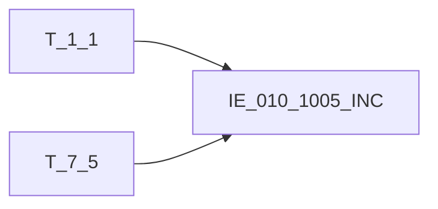

# 血缘-IE_010_1005_INC-即期及衍生品交易信息表-EAST5.0系统

## 页面边界

- 本页维护 `即期及衍生品交易信息表` 从一表通来源表到 EAST5.0 目标表 `IE_010_1005_INC` 的设计血缘。
- 证据为业务需求文档和工作区 GBase SQL 草案（已校准），尚未经过生产运行验证。
- 数据表字段定义见 [[数据表-IE_010_1005_INC-即期及衍生品交易信息表-EAST5.0系统]]；业务报送口径见 [[报表-IE_010_1005_INC-即期及衍生品交易信息表-EAST5.0系统]]。

## 系统边界

- 起始系统：一表通系统
- 目标系统：EAST5.0系统
- 是否跨系统血缘：是
- 目标对象：`IE_010_1005_INC` `即期及衍生品交易信息表`

## 业务链路摘要

- 按 `原始材料/业务需求/EAST5.0/062_即期及衍生品交易信息表.md` 的字段映射，将一表通来源表加工为 EAST5.0 `即期及衍生品交易信息表`。
- 表级规则：主表：【衍生品交易】（T_7_5）左关联：【机构信息】（T_1_1）关联条件：T_7_5.交易机构ID（G050002）= T_1_1.机构ID（A010001）过滤条件：T_7_5.采集日期（G050036）当月数据
- SQL 草案采用按 `P_DATA_DATE` 清理后重插的方式，CJRQ 使用 P_DATA_DATE 参数赋值。
- 2026-05-10 已完成全部字段校准，补齐所有 JOIN、WHERE、CASE 占位。

## 直接上游对象

- [[数据表-T_1_1-机构信息-一表通系统]]：一表通来源表，提供 JRXKZH/YHJGMC 及方向判断时的金融许可证号。
- [[数据表-T_7_5-衍生品交易-一表通系统]]：一表通来源表，主表，提供40个业务字段。

## 直接下游对象

- 目标数据表：[[数据表-IE_010_1005_INC-即期及衍生品交易信息表-EAST5.0系统]]
- 报表业务口径页：[[报表-IE_010_1005_INC-即期及衍生品交易信息表-EAST5.0系统]]
- SQL 草案：`工作区/SQL开发/EAST5.0系统/PROC_EAST_IE_010_1005_INC_JQJYSPJYXXB_草案.sql`

## Nodes

- [[数据表-T_1_1-机构信息-一表通系统]]：一表通来源表。
- [[数据表-T_7_5-衍生品交易-一表通系统]]：一表通来源表。
- [[数据表-IE_010_1005_INC-即期及衍生品交易信息表-EAST5.0系统]]：EAST5.0 目标采集表。
- [[报表-IE_010_1005_INC-即期及衍生品交易信息表-EAST5.0系统]]：业务口径说明。

## 表级 Edge List

| From | To | Transform | Evidence |
| --- | --- | --- | --- |
| [[数据表-T_1_1-机构信息-一表通系统]] | [[数据表-IE_010_1005_INC-即期及衍生品交易信息表-EAST5.0系统]] | 字段映射、LEFT JOIN、码值/日期转换后装载 `IE_010_1005_INC` | [[来源-EAST5.0系统-IE_010_1005_INC-即期及衍生品交易信息表]]；SQL 草案（已校准） |
| [[数据表-T_7_5-衍生品交易-一表通系统]] | [[数据表-IE_010_1005_INC-即期及衍生品交易信息表-EAST5.0系统]] | 字段映射、CASE码值转换、日期格式转换、CAST转换后装载 `IE_010_1005_INC` | [[来源-EAST5.0系统-IE_010_1005_INC-即期及衍生品交易信息表]]；SQL 草案（已校准） |

## 字段级 Edge List

| 源对象 | 源字段 | 目标对象 | 目标字段 | 处理逻辑 | 关系类型 | 证据 |
| --- | --- | --- | --- | --- | --- | --- |
| [[数据表-T_1_1-机构信息-一表通系统]] | `A010003` | [[数据表-IE_010_1005_INC-即期及衍生品交易信息表-EAST5.0系统]] | `JRXKZH` | 直接映射（LEFT JOIN ON G050002=A010001） | 直接映射 | SQL 草案；062_业务需求 |
| [[数据表-T_7_5-衍生品交易-一表通系统]] | `G050002` | [[数据表-IE_010_1005_INC-即期及衍生品交易信息表-EAST5.0系统]] | `NBJGH` | 从第12位开始截取交易机构ID：SUBSTR(TRIM(G050002), 12) | 加工映射 | SQL 草案；062_业务需求 |
| [[数据表-T_1_1-机构信息-一表通系统]] | `A010005` | [[数据表-IE_010_1005_INC-即期及衍生品交易信息表-EAST5.0系统]] | `YHJGMC` | 直接映射（LEFT JOIN ON G050002=A010001） | 直接映射 | SQL 草案；062_业务需求 |
| [[数据表-T_7_5-衍生品交易-一表通系统]] | `G050001` | [[数据表-IE_010_1005_INC-即期及衍生品交易信息表-EAST5.0系统]] | `JYBH` | 直接映射 | 直接映射 | SQL 草案；062_业务需求 |
| [[数据表-T_7_5-衍生品交易-一表通系统]] | `G050040` | [[数据表-IE_010_1005_INC-即期及衍生品交易信息表-EAST5.0系统]] | `YWPZ` | 直接映射 | 直接映射 | SQL 草案；062_业务需求 |
| [[数据表-T_7_5-衍生品交易-一表通系统]] | `G050041` | [[数据表-IE_010_1005_INC-即期及衍生品交易信息表-EAST5.0系统]] | `JCZCLX` | 直接映射 | 直接映射 | SQL 草案；062_业务需求 |
| [[数据表-T_7_5-衍生品交易-一表通系统]] | `G050042` | [[数据表-IE_010_1005_INC-即期及衍生品交易信息表-EAST5.0系统]] | `JCZCMC` | 直接映射 | 直接映射 | SQL 草案；062_业务需求 |
| [[数据表-T_7_5-衍生品交易-一表通系统]] | `G050006` | [[数据表-IE_010_1005_INC-即期及衍生品交易信息表-EAST5.0系统]] | `JYLX` | CASE码值转换：01->套期保值,02->代客,03->代客平盘,04->做市,05->自营,00->其他-自定义，其余返回原值 | 码值转换 | SQL 草案（已校准）；062_业务需求 |
| [[数据表-T_7_5-衍生品交易-一表通系统]] | `G050043` | [[数据表-IE_010_1005_INC-即期及衍生品交易信息表-EAST5.0系统]] | `HYZL` | CASE码值转换：01->即期,02->远期,03->期货,04->掉期,05->互换,06->期权,07->延期交收,00->其他-银行自定义，其余返回原值 | 码值转换 | SQL 草案（已校准）；062_业务需求 |
| [[数据表-T_7_5-衍生品交易-一表通系统]] | `G050024` | [[数据表-IE_010_1005_INC-即期及衍生品交易信息表-EAST5.0系统]] | `JYZT` | CASE码值转换：01->新增,02->终止,03->变更,04->行权,05->估值,00->其他-自定义，其余返回原值 | 码值转换 | SQL 草案（已校准）；062_业务需求 |
| [[数据表-T_7_5-衍生品交易-一表通系统]] | `G050037` / `G050026` / `G050003` | [[数据表-IE_010_1005_INC-即期及衍生品交易信息表-EAST5.0系统]] | `MFMC1` | CASE方向判断：01(买方)->G050026(交易对手名称),02(卖方)->G050003(交易机构名称) | 加工映射 | SQL 草案（已校准）；062_业务需求 |
| [[数据表-T_7_5-衍生品交易-一表通系统]] | `G050037` / `G050038` | [[数据表-IE_010_1005_INC-即期及衍生品交易信息表-EAST5.0系统]] | `MFKHTYBH1` | CASE方向判断：01(买方)->G050038(交易对手客户编号),02(卖方)->s1.A010003(金融许可证号) | 加工映射 | SQL 草案（已校准）；062_业务需求 |
| [[数据表-T_7_5-衍生品交易-一表通系统]] | `G050037` / `G050003` / `G050026` | [[数据表-IE_010_1005_INC-即期及衍生品交易信息表-EAST5.0系统]] | `MFMC2` | CASE方向判断：01(买方)->G050003(交易机构名称),02(卖方)->G050026(交易对手名称) | 加工映射 | SQL 草案（已校准）；062_业务需求 |
| [[数据表-T_7_5-衍生品交易-一表通系统]] | `G050037` / `G050038` | [[数据表-IE_010_1005_INC-即期及衍生品交易信息表-EAST5.0系统]] | `MFKHTYBH2` | CASE方向判断：01(买方)->s1.A010003(金融许可证号),02(卖方)->G050038(交易对手客户编号) | 加工映射 | SQL 草案（已校准）；062_业务需求 |
| [[数据表-T_7_5-衍生品交易-一表通系统]] | `G050008` | [[数据表-IE_010_1005_INC-即期及衍生品交易信息表-EAST5.0系统]] | `JYRQ` | DATE_FORMAT(G050008, '%Y%m%d') | 日期格式转换 | SQL 草案；062_业务需求 |
| [[数据表-T_7_5-衍生品交易-一表通系统]] | `G050009` | [[数据表-IE_010_1005_INC-即期及衍生品交易信息表-EAST5.0系统]] | `JYSJ` | REPLACE(G050009, ':', '')，HH:MI:SS -> HHMISS | 日期格式转换 | SQL 草案；062_业务需求 |
| [[数据表-T_7_5-衍生品交易-一表通系统]] | `G050044` | [[数据表-IE_010_1005_INC-即期及衍生品交易信息表-EAST5.0系统]] | `QXRQ` | DATE_FORMAT(G050044, '%Y%m%d') | 日期格式转换 | SQL 草案；062_业务需求 |
| [[数据表-T_7_5-衍生品交易-一表通系统]] | `G050045` | [[数据表-IE_010_1005_INC-即期及衍生品交易信息表-EAST5.0系统]] | `DQRQ` | DATE_FORMAT(G050045, '%Y%m%d') | 日期格式转换 | SQL 草案；062_业务需求 |
| [[数据表-T_7_5-衍生品交易-一表通系统]] | `G050046` | [[数据表-IE_010_1005_INC-即期及衍生品交易信息表-EAST5.0系统]] | `JZRQ` | DATE_FORMAT(G050046, '%Y%m%d') | 日期格式转换 | SQL 草案；062_业务需求 |
| [[数据表-T_7_5-衍生品交易-一表通系统]] | `G050012` | [[数据表-IE_010_1005_INC-即期及衍生品交易信息表-EAST5.0系统]] | `JGPL` | 直接映射 | 直接映射 | SQL 草案；062_业务需求 |
| [[数据表-T_7_5-衍生品交易-一表通系统]] | `G050013` | [[数据表-IE_010_1005_INC-即期及衍生品交易信息表-EAST5.0系统]] | `BDSL` | CAST(NULLIF(TRIM(G050013),'') AS DECIMAL(20,4)) | 数值转换 | SQL 草案；062_业务需求 |
| [[数据表-T_7_5-衍生品交易-一表通系统]] | `G050014` | [[数据表-IE_010_1005_INC-即期及衍生品交易信息表-EAST5.0系统]] | `BDSLDW` | 直接映射 | 直接映射 | SQL 草案；062_业务需求 |
| [[数据表-T_7_5-衍生品交易-一表通系统]] | `G050015` | [[数据表-IE_010_1005_INC-即期及衍生品交易信息表-EAST5.0系统]] | `CJJG` | CAST(NULLIF(TRIM(G050015),'') AS DECIMAL(20,4)) | 数值转换 | SQL 草案；062_业务需求 |
| [[数据表-T_7_5-衍生品交易-一表通系统]] | `G050016` | [[数据表-IE_010_1005_INC-即期及衍生品交易信息表-EAST5.0系统]] | `CJJGDW` | 直接映射 | 直接映射 | SQL 草案；062_业务需求 |
| [[数据表-T_7_5-衍生品交易-一表通系统]] | `G050007` | [[数据表-IE_010_1005_INC-即期及衍生品交易信息表-EAST5.0系统]] | `JYCS` | 直接映射 | 直接映射 | SQL 草案；062_业务需求 |
| [[数据表-T_7_5-衍生品交易-一表通系统]] | `G050017` | [[数据表-IE_010_1005_INC-即期及衍生品交易信息表-EAST5.0系统]] | `JGFS` | CASE码值转换：01->全额,02->差额,03->其他-净额,04->实物,05->现金,00->其他，其余返回原值 | 码值转换 | SQL 草案（已校准）；062_业务需求 |
| [[数据表-T_7_5-衍生品交易-一表通系统]] | `G050018` | [[数据表-IE_010_1005_INC-即期及衍生品交易信息表-EAST5.0系统]] | `QQLX` | CASE码值转换：01->看涨,02->看跌,03->上限,04->下限,00->其他-自定义，其余返回原值 | 码值转换 | SQL 草案（已校准）；062_业务需求 |
| [[数据表-T_7_5-衍生品交易-一表通系统]] | `G050047` | [[数据表-IE_010_1005_INC-即期及衍生品交易信息表-EAST5.0系统]] | `XQFS` | CASE码值转换：01->美式,02->欧式,03->百慕大,00->其他-自定义，其余返回原值 | 码值转换 | SQL 草案（已校准）；062_业务需求 |
| [[数据表-T_7_5-衍生品交易-一表通系统]] | `G050019` | [[数据表-IE_010_1005_INC-即期及衍生品交易信息表-EAST5.0系统]] | `XQJG` | CAST(NULLIF(TRIM(G050019),'') AS DECIMAL(20,4)) | 数值转换 | SQL 草案；062_业务需求 |
| [[数据表-T_7_5-衍生品交易-一表通系统]] | `G050020` | [[数据表-IE_010_1005_INC-即期及衍生品交易信息表-EAST5.0系统]] | `XQJGDW` | 直接映射 | 直接映射 | SQL 草案；062_业务需求 |
| [[数据表-T_7_5-衍生品交易-一表通系统]] | `G050021` | [[数据表-IE_010_1005_INC-即期及衍生品交易信息表-EAST5.0系统]] | `BZJBZ` | CASE码值转换：0->'否', 1->'是'，其余返回原值 | 码值转换 | SQL 草案（已校准）；062_业务需求 |
| [[数据表-T_7_5-衍生品交易-一表通系统]] | `G050022` | [[数据表-IE_010_1005_INC-即期及衍生品交易信息表-EAST5.0系统]] | `ZXYMC` | 直接映射 | 直接映射 | SQL 草案；062_业务需求 |
| [[数据表-T_7_5-衍生品交易-一表通系统]] | `G050023` | [[数据表-IE_010_1005_INC-即期及衍生品交易信息表-EAST5.0系统]] | `ZYJYDS` | 直接映射 | 直接映射 | SQL 草案；062_业务需求 |
| [[数据表-T_7_5-衍生品交易-一表通系统]] | `G050048` | [[数据表-IE_010_1005_INC-即期及衍生品交易信息表-EAST5.0系统]] | `GZJE` | CAST(NULLIF(TRIM(G050048),'') AS DECIMAL(20,4)) | 数值转换 | SQL 草案；062_业务需求 |
| [[数据表-T_7_5-衍生品交易-一表通系统]] | `G050049` | [[数据表-IE_010_1005_INC-即期及衍生品交易信息表-EAST5.0系统]] | `GZBZ` | 直接映射 | 直接映射 | SQL 草案；062_业务需求 |
| [[数据表-T_7_5-衍生品交易-一表通系统]] | `G050050` | [[数据表-IE_010_1005_INC-即期及衍生品交易信息表-EAST5.0系统]] | `GZRQ` | DATE_FORMAT(G050050, '%Y%m%d')（原草案缺失该转换，已修正） | 日期格式转换 | SQL 草案（已校准）；062_业务需求 |
| [[数据表-T_7_5-衍生品交易-一表通系统]] | `G050033` | [[数据表-IE_010_1005_INC-即期及衍生品交易信息表-EAST5.0系统]] | `JYYGH` | 直接映射（原草案为NULL，已修正为G050033） | 直接映射 | SQL 草案（已校准）；062_业务需求 |
| [[数据表-T_7_5-衍生品交易-一表通系统]] | `G050034` | [[数据表-IE_010_1005_INC-即期及衍生品交易信息表-EAST5.0系统]] | `SPRGH` | 直接映射 | 直接映射 | SQL 草案；062_业务需求 |
| [[数据表-T_7_5-衍生品交易-一表通系统]] | `G050035` | [[数据表-IE_010_1005_INC-即期及衍生品交易信息表-EAST5.0系统]] | `BBZ` | 直接映射 | 直接映射 | SQL 草案；062_业务需求 |
| `P_DATA_DATE` | 参数赋值 | [[数据表-IE_010_1005_INC-即期及衍生品交易信息表-EAST5.0系统]] | `CJRQ` | P_DATA_DATE参数赋值（原草案从G050036转换，已修正为标准模式） | 参数赋值 | SQL 草案（已校准） |

## Graph-总览

## 回链检查

- 目标数据表页：已补 SQL 草案上游依赖摘要。
- 报表业务口径页：已创建或补充血缘回链。
- 一表通源表页：已补下游消费摘要。
- 当前字段级血缘基于已校准的 SQL 草案，状态更新为"已校准待验证"。

## 变更与冲突

- 2026-05-10：完成 SQL 草案全部字段校准并同步更新字段级 Edge List。
- 修正字段：JYYGH（NULL->G050033）、GZRQ（无转换->DATE_FORMAT）、CJRQ（G050036->P_DATA_DATE）
- 补充7个码值转换CASE、4个加工映射CASE
- 修复JOIN条件和WHERE过滤条件
- 本页保持 `draft`：尚未在 GBase 执行验证。

## Open Questions

- GBase 草案已完成全面校准，需要实际环境语法校验和跑数验证。
- 缺口字段（GSFZJG、SENSITIVEFLAG）无业务来源，维持 NULL 占位。

## 缺口字段（2026-05-10）

| 目标字段 | 字段名称 | 缺口说明 |
| --- | --- | --- |
| `GSFZJG` | 归属分支机构 | 本地 DDL 存在，但业务需求映射表未能确认来源，暂置 NULL。 |
| `SENSITIVEFLAG` | 涉密标志 | 本地 DDL 存在，但业务需求映射表未能确认来源，暂置 NULL。 |
