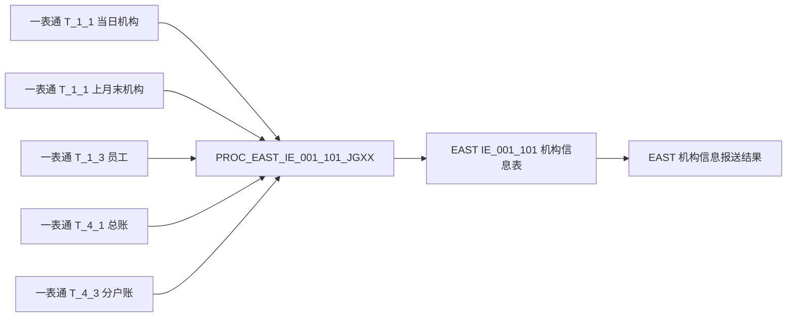
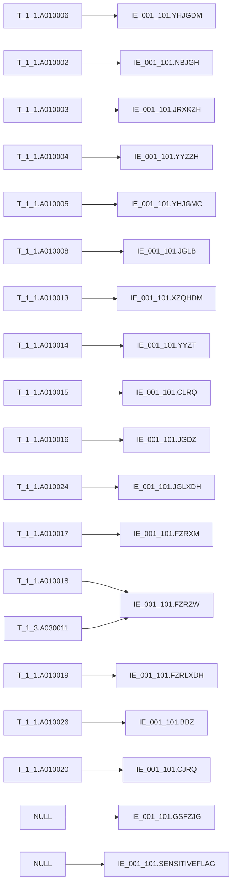

# 血缘-IE_001_101-机构信息表-EAST5.0系统

## 系统边界

- 起始系统：一表通系统
- 目标系统：EAST5.0系统
- 是否仅系统内血缘：否
- 文件路径归属哪个系统：EAST5.0系统

## 业务链路摘要

- 从一表通 `T_1_1` 读取当日机构信息快照。
- 通过上月末 `T_1_1` 识别连续停业机构，通过 `T_4_1` 与 `T_4_3` 判断是否存在余额或分户账回补证据。
- 通过一表通 `T_1_3` 员工表补取负责人职务。
- 将一表通字段映射为 EAST5.0 `IE_001_101` 字段，并把机构类别、营业状态和日期格式转换为 EAST 规范。
-  已同步调整为直接 `left join` 与显式字段查询；同内容SQL位于 [[sql/EAST5.0系统/PROC_EAST_IE_001_101_JGXXB_草案.sql|PROC_EAST_IE_001_101_JGXXB_草案.sql]]，不改变字段级血缘结论。

## 证据入口

| 证据对象 | 类型 | 作用 | 定位 | 确认状态 |
| --- | --- | --- | --- | --- |
| [[sql/EAST5.0系统/PROC_EAST_IE_001_101_JGXXB_草案.sql\|PROC_EAST_IE_001_101_JGXXB_草案.sql]] | 存储过程 | 加工 IE_001_101 机构信息表的完整 SQL | 行 44-200 | 已确认 |

## 直接上游对象

- [[数据表-T_1_1-机构信息-一表通系统]]
- [[数据表-T_1_3-员工-一表通系统]]
- [[数据表-T_4_1-总账会计全科目-一表通系统]]
- [[数据表-T_4_3-分户账信息-一表通系统]]
- 
- `PROC_EAST_IE_001_101_JGXXB`
- [[sql/EAST5.0系统/PROC_EAST_IE_001_101_JGXXB_草案.sql|PROC_EAST_IE_001_101_JGXXB_草案.sql]]

## 直接下游对象

- [[数据表-IE_001_101-机构信息表-EAST5.0系统]]
- [[报表-IE_001_101-机构信息表-EAST5.0系统]]

## Nodes

- [[数据表-T_1_1-机构信息-一表通系统]]
- [[数据表-T_1_3-员工-一表通系统]]
- [[数据表-T_4_1-总账会计全科目-一表通系统]]
- [[数据表-T_4_3-分户账信息-一表通系统]]
- [[sql/EAST5.0系统/PROC_EAST_IE_001_101_JGXXB_草案.sql|PROC_EAST_IE_001_101_JGXXB_草案.sql]]（SQL 加工脚本）
- [[数据表-IE_001_101-机构信息表-EAST5.0系统]]
- [[报表-IE_001_101-机构信息表-EAST5.0系统]]

## 表级 Edge List

| From | To | Transform | Evidence |
| --- | --- | --- | --- |
| [[数据表-T_1_1-机构信息-一表通系统]] | `PROC_EAST_IE_001_101_JGXXB` | 读取当日机构快照（派生表 c），并读取上月末快照（派生表 p）用于连续停业过滤 | [[sql/EAST5.0系统/PROC_EAST_IE_001_101_JGXXB_草案.sql\|PROC_EAST_IE_001_101_JGXXB_草案.sql]] |
| [[数据表-T_1_3-员工-一表通系统]] | `PROC_EAST_IE_001_101_JGXXB` | 按负责人工号（A010018）关联员工ID（A030001），取负责人职务（A030011） | [[sql/EAST5.0系统/PROC_EAST_IE_001_101_JGXXB_草案.sql\|PROC_EAST_IE_001_101_JGXXB_草案.sql]] 行 155-175 |
| [[数据表-T_4_1-总账会计全科目-一表通系统]] | `PROC_EAST_IE_001_101_JGXXB` | 去重取机构ID，识别总账余额合计不为 0 的机构（D010003+D010004+D010007+D010008） | [[sql/EAST5.0系统/PROC_EAST_IE_001_101_JGXXB_草案.sql\|PROC_EAST_IE_001_101_JGXXB_草案.sql]] 行 176-185 |
| [[数据表-T_4_3-分户账信息-一表通系统]] | `PROC_EAST_IE_001_101_JGXXB` | 去重取机构ID，识别仍有分户账记录的机构 | [[sql/EAST5.0系统/PROC_EAST_IE_001_101_JGXXB_草案.sql\|PROC_EAST_IE_001_101_JGXXB_草案.sql]] 行 186-190 |
| `PROC_EAST_IE_001_101_JGXXB` | [[数据表-IE_001_101-机构信息表-EAST5.0系统]] | 删除当日 EAST 目标数据后插入映射结果 | [[sql/EAST5.0系统/PROC_EAST_IE_001_101_JGXXB_草案.sql\|PROC_EAST_IE_001_101_JGXXB_草案.sql]] 行 56-196 |
| [[数据表-IE_001_101-机构信息表-EAST5.0系统]] | [[报表-IE_001_101-机构信息表-EAST5.0系统]] | 形成 EAST5.0 机构信息采集接口结果 | 本血缘页 |

## 字段级 Edge List

| 源对象 | 源字段 | 目标对象 | 目标字段 | 处理逻辑 | 关系类型 | 代码摘要 | 确认状态 |
| --- | --- | --- | --- | --- | --- | --- | --- |
| [[数据表-T_1_1-机构信息-一表通系统]] | A010006 | [[数据表-IE_001_101-机构信息表-EAST5.0系统]] | YHJGDM | 支付行号直接映射为银行机构代码 | 直接映射 |  | 已确认 |
| [[数据表-T_1_1-机构信息-一表通系统]] | A010002 | [[数据表-IE_001_101-机构信息表-EAST5.0系统]] | NBJGH | 内部机构号直接映射 | 直接映射 |  | 已确认 |
| [[数据表-T_1_1-机构信息-一表通系统]] | A010003 | [[数据表-IE_001_101-机构信息表-EAST5.0系统]] | JRXKZH | 金融许可证号直接映射 | 直接映射 |  | 已确认 |
| [[数据表-T_1_1-机构信息-一表通系统]] | A010004 | [[数据表-IE_001_101-机构信息表-EAST5.0系统]] | YYZZH | 统一社会信用代码映射为营业执照号 | 直接映射 |  | 已确认 |
| [[数据表-T_1_1-机构信息-一表通系统]] | A010005 | [[数据表-IE_001_101-机构信息表-EAST5.0系统]] | YHJGMC | 银行机构名称直接映射 | 直接映射 |  | 已确认 |
| [[数据表-T_1_1-机构信息-一表通系统]] | A010008 | [[数据表-IE_001_101-机构信息表-EAST5.0系统]] | JGLB | `0101/0102`→管理机构，`0201/0202/0203`→营业机构，`0301/0302`→虚拟机构，`0401/0402`→内设机构，其余→NULL | 码值转换 | CASE WHEN A010008 IN (...), ELSE NULL | 已确认 |
| [[数据表-T_1_1-机构信息-一表通系统]] | A010013 | [[数据表-IE_001_101-机构信息表-EAST5.0系统]] | XZQHDM | 行政区划直接映射 | 直接映射 |  | 已确认 |
| [[数据表-T_1_1-机构信息-一表通系统]] | A010014 | [[数据表-IE_001_101-机构信息表-EAST5.0系统]] | YYZT | `01`→营业，`00/02/03/其他`→停业 | 码值转换 | CASE WHEN A010014='01' THEN '营业', WHEN IN('00','02','03') THEN '停业', ELSE '停业' | 已确认 |
| [[数据表-T_1_1-机构信息-一表通系统]] | A010015 | [[数据表-IE_001_101-机构信息表-EAST5.0系统]] | CLRQ | 日期转为 `YYYYMMDD` | 日期转换 | TO_CHAR(A010015, 'YYYYMMDD') | 已确认 |
| [[数据表-T_1_1-机构信息-一表通系统]] | A010016 | [[数据表-IE_001_101-机构信息表-EAST5.0系统]] | JGDZ | 机构地址直接映射 | 直接映射 |  | 已确认 |
| [[数据表-T_1_1-机构信息-一表通系统]] | A010024 | [[数据表-IE_001_101-机构信息表-EAST5.0系统]] | JGLXDH | 机构联系电话直接映射 | 直接映射 |  | 已确认 |
| [[数据表-T_1_1-机构信息-一表通系统]] | A010017 | [[数据表-IE_001_101-机构信息表-EAST5.0系统]] | FZRXM | 负责人姓名直接映射 | 直接映射 |  | 已确认 |
| [[数据表-T_1_1-机构信息-一表通系统]] + [[数据表-T_1_3-员工-一表通系统]] | A010018 + A030011 | [[数据表-IE_001_101-机构信息表-EAST5.0系统]] | FZRZW | `A010018 = A030001` 关联员工表，取员工职务 | 条件映射 | LEFT JOIN e ON e.A030001 = c.A010018 | 已确认 |
| [[数据表-T_1_1-机构信息-一表通系统]] | A010019 | [[数据表-IE_001_101-机构信息表-EAST5.0系统]] | FZRLXDH | 负责人联系电话直接映射 | 直接映射 |  | 已确认 |
| [[数据表-T_1_1-机构信息-一表通系统]] | A010026 | [[数据表-IE_001_101-机构信息表-EAST5.0系统]] | BBZ | 备注直接映射 | 直接映射 |  | 已确认 |
| [[数据表-T_1_1-机构信息-一表通系统]] | A010020 | [[数据表-IE_001_101-机构信息表-EAST5.0系统]] | CJRQ | 采集日期转为 `YYYYMMDD` | 日期转换 | TO_CHAR(A010020, 'YYYYMMDD') | 已确认 |
| 常量 | NULL | [[数据表-IE_001_101-机构信息表-EAST5.0系统]] | GSFZJG | 当前无映射来源，暂置 NULL | 常量赋值 | NULL AS GSFZJG | 待确认 |
| 常量 | NULL | [[数据表-IE_001_101-机构信息表-EAST5.0系统]] | SENSITIVEFLAG | 当前无映射来源，暂置 NULL | 常量赋值 | NULL AS SENSITIVEFLAG | 待确认 |

## Graph-总览

## Graph-字段级

## 关键过滤与依赖条件

| 条件对象 | 条件字段 | 条件或关联规则 | 业务/血缘含义 | 证据 | 确认状态 |
| --- | --- | --- | --- | --- | --- |
| T_1_1（派生表 c） | A010020 | t.A010020 = TO_CHAR(P_DATA_DATE, 'YYYY-MM-DD') | 只取采集日期当日的机构快照 | SQL 行 131 | 已确认 |
| T_1_1（派生表 c） | A010002, A010001 | NOT EXISTS (同日期同机构号更小序号) | 同日期同机构号取最大序号记录去重 | SQL 行 132-138 | 已确认 |
| T_1_1（派生表 p） | A010020 | p0.A010020 = TO_CHAR(P_LAST_MON_DT, 'YYYY-MM-DD') | 取上月末机构快照用于连续停业判断 | SQL 行 144-146 | 已确认 |
| T_1_1（派生表 p） | A010002, A010001 | NOT EXISTS (同上月末同机构号更小序号) | 上月末快照去重取最大序号 | SQL 行 147-153 | 已确认 |
| T_1_3（派生表 e） | A030028 | emp.A030028 <= TO_CHAR(P_DATA_DATE, 'YYYY-MM-DD') | 只取采集日期前已入职员工 | SQL 行 160 | 已确认 |
| T_1_3（派生表 e） | A030001, A030028, A030002 | NOT EXISTS (同员工ID，更晚入职日期或更小编号) | 取采集日期前每位员工最新记录 | SQL 行 161-173 | 已确认 |
| T_4_1 + T_4_3（派生表 b） | 多字段 | UNION DISTINCT 取总账余额不为0或分户账有记录的机构 | 识别仍有业务活动的机构（回补证据） | SQL 行 176-190 | 已确认 |
| T_1_1（上月末+当日） | A010014 | COALESCE(p.A010014,'') IN ('00','02','03') AND COALESCE(c.A010014,'') IN ('00','02','03') AND b.org_id IS NULL | 连续停业（上月末+当日均停业）且无回补的机构排除 | SQL 行 192-195 | 已确认 |

## 血缘缺口

| 缺口对象 | 缺口类型 | 当前影响 | 补证方向 | 状态 |
| --- | --- | --- | --- | --- |
| GSFZJG | 缺源字段 | 该字段暂置 NULL，影响归属分支机构报送 | 从一表通或监管机构表确认映射字段 | open |
| SENSITIVEFLAG | 缺源字段 | 该字段暂置 NULL，影响涉密标志字段报送 | 从一表通或监管机构表确认映射字段 | open |
| T_4_1 余额判断 | 缺确认 | 当前沿用 D010003+D010004+D010007+D010008 合计不为 0 | 需业务确认正确的余额类字段范围和取值 | open |
| 03"被合并"状态 | 缺确认 | 当前视为停业，但"被合并"是否应单独处理待确认 | 补监管或源系统证据 | open |
| SQL 跑数验证 | 缺跑数验证 | SQL 草案尚未在 GBase 8a 环境运行验证 | 完成 GBase 8a 跑数验证并比对结果 | open |

## 变更与冲突

- 本次是否修改表级边：是 — 补充 Evidence 列 SQL wikilink 和行号定位
- 本次是否修改字段级边：是 — 源对象/目标对象改为数据表页 wikilink；补充代码摘要和确认状态列
- 本次是否修改关键过滤与依赖条件：是 — 新增过滤条件详细表
- 本次是否修改代码字段加工摘要：是 — JGLB、YYZT、FZRZW 补充 SQL 摘要
- 与既有 SQL、字段字典、外部来源或血缘结论是否存在冲突：否
- 是否需要从 `validated` 降级为 `draft`：否，当前状态仍为 `draft`

## 回链检查

- 目标数据表页已回链本血缘页：[[数据表-IE_001_101-机构信息表-EAST5.0系统]]
- 报表业务口径页已回链本血缘页：[[报表-IE_001_101-机构信息表-EAST5.0系统]]（本次新建）
- 上游一表通数据表页尚未全部回链本 EAST 血缘页，后续可在跨系统血缘批量维护时补齐。
- 本次新建的报表页已回链至本血缘页和 SQL 文件。

## Open Questions

- `GSFZJG` 与 `SENSITIVEFLAG` 当前没有映射来源。
- 被合并机构的状态码是否固定为 `03`，需补监管或源系统证据。
- `T_4_1` 总账余额不为 0 的判断范围需业务确认，当前脚本将余额类字段合计不为 0 作为回补依据。
