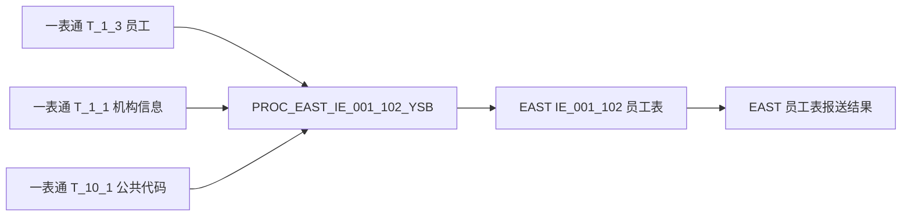
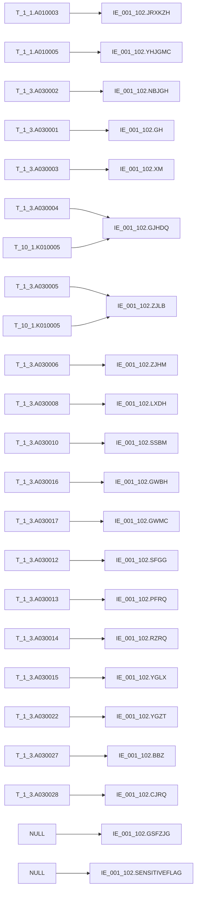

# 血缘-IE_001_102-员工表-EAST5.0系统

## 页面边界

- 本页回答"当前对象从哪些对象来、去到哪些对象、字段如何对应、关键过滤和加工条件是什么"。
- 本页记录表级边、字段级边、上下游对象、字段落地状态、SQL 产出状态、证据状态和回链检查。
- 本页不保存完整报表业务口径、完整字段字典、完整码表、监管原文或 SQL 全文。
- 没有 SQL、过程、视图、字段字典、外部 wikilink、用户确认材料或既有知识页支撑的边，只能写为待确认，不得写成已闭环。
- 仓库内部页面和已存在 SQL 文件使用 Obsidian wikilink；不存在页面不要写成占位 wikilink。

## 系统边界

- 起始系统：一表通系统
- 目标系统：EAST5.0系统
- 是否仅系统内血缘：否
- 文件路径归属哪个系统：EAST5.0系统
- 当前血缘对象：[[数据表-IE_001_102-员工表-EAST5.0系统]]

## 业务链路摘要

- 从一表通 `T_1_3` 员工表读取采集日员工快照（DISTINCT 去重）。
- 按员工状态（`A030022` in `01/03`）或当月离职（`A030029 >= 月初`）筛选本期需报送员工。
- LEFT JOIN 一表通 `T_1_1` 机构信息（`A010020 = 采集日`，取最大 `A010002` 记录），补金融许可证号（`A010003`）和银行机构名称（`A010005`）。
- LEFT JOIN 一表通 `T_10_1` 公共代码（`通用/国家地区`）按 `K010004`→`K010005` 转换国家地区中文含义。
- LEFT JOIN 一表通 `T_10_1` 公共代码（`通用/证件类型`）按 `K010004`→`K010005` 转换证件类型中文含义，`1999/2999` 前缀转为 `其他-自定义`。
- 按采集日 DELETE 目标表对应数据后 INSERT 映射结果。截面重跑方式。
- 过程名 `PROC_EAST_IE_001_102_YSB`，SQL 文件 <code>[[sql/EAST5.0系统/PROC_EAST_IE_001_102_YSB_草案.sql|PROC_EAST_IE_001_102_YSB_草案.sql]]</code>。

## 证据入口

| 证据对象 | 类型 | 作用 | 定位 | 确认状态 |
| --- | --- | --- | --- | --- |
| `sql/EAST5.0系统/PROC_EAST_IE_001_102_YSB_草案.sql` | SQL 文件（存储过程草案） | 加工当前对象 | 完整存储过程：CREATE PROCEDURE → DELETE → INSERT...SELECT | 已确认 |

## 直接上游对象

- [[数据表-T_1_3-员工-一表通系统]]
- [[数据表-T_1_1-机构信息-一表通系统]]
- [[数据表-T_10_1-公共代码-一表通系统]]

## 直接下游对象

- [[数据表-IE_001_102-员工表-EAST5.0系统]]
- [[报表-IE_001_102-员工表-EAST5.0系统]]

## Nodes

| 节点 | 类型 | 系统 | 角色 | 页面或证据 |
| --- | --- | --- | --- | --- |
| [[数据表-T_1_3-员工-一表通系统]] | 源表 | 一表通系统 | 主源 | 员工明细主源字段 |
| [[数据表-T_1_1-机构信息-一表通系统]] | 源表 | 一表通系统 | 维度关联 | 补金融许可证号、机构名称 |
| [[数据表-T_10_1-公共代码-一表通系统]] | 源表 | 一表通系统 | 维度关联 | 补国家地区、证件类型中文含义 |
| `PROC_EAST_IE_001_102_YSB` | 存储过程 | EAST5.0系统 | 加工过程 | `sql/EAST5.0系统/PROC_EAST_IE_001_102_YSB_草案.sql` |
| [[数据表-IE_001_102-员工表-EAST5.0系统]] | 目标表 | EAST5.0系统 | 目标落表 | EAST 员工表接口结果 |
| [[报表-IE_001_102-员工表-EAST5.0系统]] | 报表 | EAST5.0系统 | 报送结果 | 员工采集接口报送结果 |

## 表级 Edge List

| From | To | Transform | Evidence | 确认状态 |
| --- | --- | --- | --- | --- |
| [[数据表-T_1_3-员工-一表通系统]] | `PROC_EAST_IE_001_102_YSB` | 采集日员工快照，DISTINCT 去重，按状态和离职日期过滤 | `PROC_EAST_IE_001_102_YSB_草案.sql`，员工子查询（lines 151-177） | 已确认 |
| [[数据表-T_1_1-机构信息-一表通系统]] | `PROC_EAST_IE_001_102_YSB` | 按 `A010001 = e.A030002` 关联，取采集日最大版本记录，补金融许可证号和机构名称 | `PROC_EAST_IE_001_102_YSB_草案.sql`，机构子查询（lines 178-199） | 已确认 |
| [[数据表-T_10_1-公共代码-一表通系统]] | `PROC_EAST_IE_001_102_YSB` | 按 `通用/国家地区` 和 `通用/证件类型` 分组，取最小 `K010001` 版本，转换码值 | `PROC_EAST_IE_001_102_YSB_草案.sql`，代码子查询 cc/ct（lines 200-233） | 已确认 |
| `PROC_EAST_IE_001_102_YSB` | [[数据表-IE_001_102-员工表-EAST5.0系统]] | 删除当日目标数据后插入映射结果（截面重跑） | `PROC_EAST_IE_001_102_YSB_草案.sql`，DELETE（lines 72-74）+ INSERT（lines 77-233） | 已确认 |
| [[数据表-IE_001_102-员工表-EAST5.0系统]] | [[报表-IE_001_102-员工表-EAST5.0系统]] | 形成 EAST5.0 员工表采集接口结果 | `PROC_EAST_IE_001_102_YSB_草案.sql` | 已确认 |

## 字段级 Edge List

| 源对象 | 源字段 | 目标对象 | 目标字段 | 处理逻辑 | 关系类型 | 代码摘要 | 确认状态 |
| --- | --- | --- | --- | --- | --- | --- | --- |
| [[数据表-T_1_1-机构信息-一表通系统]] | `A010003` | [[数据表-IE_001_102-员工表-EAST5.0系统]] | `JRXKZH` | 员工机构ID关联机构信息后取金融许可证号，空值转 NULL | 条件映射 | `NULLIF(TRIM(o.A010003), '')` | 已确认 |
| [[数据表-T_1_3-员工-一表通系统]] | `A030002` | [[数据表-IE_001_102-员工表-EAST5.0系统]] | `NBJGH` | 截取机构ID第12位至最后一位 | 截取派生 | `SUBSTR(NULLIF(TRIM(e.A030002), ''), 12)` | 已确认 |
| [[数据表-T_1_1-机构信息-一表通系统]] | `A010005` | [[数据表-IE_001_102-员工表-EAST5.0系统]] | `YHJGMC` | 员工机构ID关联机构信息后取银行机构名称，空值转 NULL | 条件映射 | `NULLIF(TRIM(o.A010005), '')` | 已确认 |
| [[数据表-T_1_3-员工-一表通系统]] | `A030001` | [[数据表-IE_001_102-员工表-EAST5.0系统]] | `GH` | 直接映射工号，空值转 NULL | 直接映射 | `NULLIF(TRIM(e.A030001), '')` | 已确认 |
| [[数据表-T_1_3-员工-一表通系统]] | `A030003` | [[数据表-IE_001_102-员工表-EAST5.0系统]] | `XM` | 直接映射姓名，空值转 NULL | 直接映射 | `NULLIF(TRIM(e.A030003), '')` | 已确认 |
| [[数据表-T_1_3-员工-一表通系统]] | `A030004` | [[数据表-IE_001_102-员工表-EAST5.0系统]] | `GJHDQ` | 先尝试匹配公共代码 `通用/国家地区` 转中文含义，未匹配保留源值 | 码值转换 | `COALESCE(cc.code_name, NULLIF(TRIM(e.A030004), ''))`；cc 子查询取去重后 `K010004→K010005` | 已确认 |
| [[数据表-T_10_1-公共代码-一表通系统]] | `K010005`（别名 `cc.code_name`） | [[数据表-IE_001_102-员工表-EAST5.0系统]] | `GJHDQ` | 公共代码 `通用/国家地区` 中文含义补码 | 码值转换 | cc 子查询 WHERE `K010002='通用'` AND `K010003='国家地区'` | 已确认 |
| [[数据表-T_1_3-员工-一表通系统]] | `A030005` | [[数据表-IE_001_102-员工表-EAST5.0系统]] | `ZJLB` | CASE：`1999%/2999%` 前缀转为 `其他-自定义`；匹配公共代码 `通用/证件类型` 转中文含义；未匹配返回 NULL | 码值转换 | CASE 逻辑：`1999xxx` → `其他-xxx`；`2999xxx` → `其他-xxx`；ct.code_name 匹配；ELSE NULL | 已确认 |
| [[数据表-T_10_1-公共代码-一表通系统]] | `K010005`（别名 `ct.code_name`） | [[数据表-IE_001_102-员工表-EAST5.0系统]] | `ZJLB` | 公共代码 `通用/证件类型` 中文含义 | 码值转换 | ct 子查询 WHERE `K010002='通用'` AND `K010003='证件类型'` | 已确认 |
| [[数据表-T_1_3-员工-一表通系统]] | `A030006` | [[数据表-IE_001_102-员工表-EAST5.0系统]] | `ZJHM` | 直接映射证件号码，空值转 NULL | 直接映射 | `NULLIF(TRIM(e.A030006), '')` | 已确认 |
| [[数据表-T_1_3-员工-一表通系统]] | `A030008` | [[数据表-IE_001_102-员工表-EAST5.0系统]] | `LXDH` | 直接映射办公电话，空值转 NULL | 直接映射 | `NULLIF(TRIM(e.A030008), '')` | 已确认 |
| [[数据表-T_1_3-员工-一表通系统]] | `A030010` | [[数据表-IE_001_102-员工表-EAST5.0系统]] | `SSBM` | 直接映射所属部门，空值转 NULL | 直接映射 | `NULLIF(TRIM(e.A030010), '')` | 已确认 |
| [[数据表-T_1_3-员工-一表通系统]] | `A030016` | [[数据表-IE_001_102-员工表-EAST5.0系统]] | `GWBH` | 直接映射岗位编号，空值兜底为空字符串 | 直接映射 | `COALESCE(NULLIF(TRIM(e.A030016), ''), '')` | 已确认 |
| [[数据表-T_1_3-员工-一表通系统]] | `A030017` | [[数据表-IE_001_102-员工表-EAST5.0系统]] | `GWMC` | 直接映射岗位名称，空值兜底为空字符串 | 直接映射 | `COALESCE(NULLIF(TRIM(e.A030017), ''), '')` | 已确认 |
| [[数据表-T_1_3-员工-一表通系统]] | `A030012` | [[数据表-IE_001_102-员工表-EAST5.0系统]] | `SFGG` | `1 → 是`，`0 → 否`，其他返回 NULL | 码值转换 | CASE WHEN `A030012='1'` THEN `是` WHEN `'0'` THEN `否` ELSE NULL | 已确认 |
| [[数据表-T_1_3-员工-一表通系统]] | `A030013` | [[数据表-IE_001_102-员工表-EAST5.0系统]] | `PFRQ` | 日期转 `YYYYMMDD`，空值保持空 | 日期转换 | CASE WHEN NULL THEN NULL ELSE `TO_CHAR(e.A030013, 'YYYYMMDD')` | 已确认 |
| [[数据表-T_1_3-员工-一表通系统]] | `A030014` | [[数据表-IE_001_102-员工表-EAST5.0系统]] | `RZRQ` | 日期转 `YYYYMMDD`，空值保持空 | 日期转换 | CASE WHEN NULL THEN NULL ELSE `TO_CHAR(e.A030014, 'YYYYMMDD')` | 已确认 |
| [[数据表-T_1_3-员工-一表通系统]] | `A030015` | [[数据表-IE_001_102-员工表-EAST5.0系统]] | `YGLX` | `01/02/03` 转中文员工类型，`00%` 前缀转为 `其他-自定义` | 码值转换 | `01`→正式员工，`02`→非正式员工，`03`→非员工高管，`00xxx`→`其他-xxx`，ELSE NULL | 已确认 |
| [[数据表-T_1_3-员工-一表通系统]] | `A030022` | [[数据表-IE_001_102-员工表-EAST5.0系统]] | `YGZT` | `01~05` 转中文员工状态，`00%` 前缀转为 `其他-自定义` | 码值转换 | `01`→在岗，`02`→其他-退休，`03`→其他-待岗，`04`→离职，`05`→离岗，`00xxx`→`其他-xxx` | 已确认 |
| [[数据表-T_1_3-员工-一表通系统]] | `A030027` | [[数据表-IE_001_102-员工表-EAST5.0系统]] | `BBZ` | 备注直接映射，空值转 NULL | 直接映射 | `NULLIF(TRIM(e.A030027), '')` | 已确认 |
| [[数据表-T_1_3-员工-一表通系统]] | `A030028` | [[数据表-IE_001_102-员工表-EAST5.0系统]] | `CJRQ` | 采集日期转 `YYYYMMDD`，空值转 NULL | 日期转换 | `TO_CHAR(e.A030028, 'YYYYMMDD')` | 已确认 |
| 常量 | NULL | [[数据表-IE_001_102-员工表-EAST5.0系统]] | `GSFZJG` | 当前 SQL 置空，无映射来源 | 常量赋值 | `NULL AS GSFZJG` | 待确认 |
| 常量 | NULL | [[数据表-IE_001_102-员工表-EAST5.0系统]] | `SENSITIVEFLAG` | 当前 SQL 置空，无映射来源 | 常量赋值 | `NULL AS SENSITIVEFLAG` | 待确认 |

## 关键过滤与依赖条件

| 条件对象 | 条件字段 | 条件或关联规则 | 业务/血缘含义 | 证据 | 确认状态 |
| --- | --- | --- | --- | --- | --- |
| `T_1_3` 员工子查询 e | `A030028`（采集日） | `emp.A030028 = TO_CHAR(P_DATA_DATE, 'YYYY-MM-DD')` | 只取采集日当天的员工记录 | `PROC_EAST_IE_001_102_YSB_草案.sql` line 172 | 已确认 |
| `T_1_3` 员工子查询 e | `A030022`（员工状态）+ `A030029`（离职日期） | `emp.A030022 IN ('01', '03') OR emp.A030029 >= P_MONTH_BEGIN` | 在岗或待岗员工；当月离职员工仍纳入报送 | `PROC_EAST_IE_001_102_YSB_草案.sql` lines 173-176 | 已确认 |
| `T_1_3` 员工子查询 e | 全部输出字段 | `SELECT DISTINCT` | 同一员工同一采集日多条记录只保留一条 | `PROC_EAST_IE_001_102_YSB_草案.sql` line 152 | 已确认 |
| `T_1_1` 机构子查询 o | `A010020`（采集日） | `org.A010020 = TO_CHAR(P_DATA_DATE, 'YYYY-MM-DD')` | 只取采集日当天的机构版本 | `PROC_EAST_IE_001_102_YSB_草案.sql` line 184 | 已确认 |
| `T_1_1` 机构子查询 o | `A010001`（机构ID）+ `A010002`（排序） | `NOT EXISTS (取最大 A010002)` | 同一机构 ID 存在多版本时取最大排序版本 | `PROC_EAST_IE_001_102_YSB_草案.sql` lines 185-197 | 已确认 |
| `T_1_1` 机构子查询 o | `A010001` | `o.A010001 = e.A030002` | 员工机构 ID 关联机构信息 | `PROC_EAST_IE_001_102_YSB_草案.sql` line 199 | 已确认 |
| `T_10_1` 代码子查询 cc | `K010002` + `K010003` | `K010002='通用'` AND `K010003='国家地区'` | 公共代码分类锁定国家地区 | `PROC_EAST_IE_001_102_YSB_草案.sql` lines 205-206 | 已确认 |
| `T_10_1` 代码子查询 cc | `K010004` + `K010001` | `NOT EXISTS (取最小 K010001)` 且 `K010004` 匹配 | 代码重复版本取最小 `K010001` 记录 | `PROC_EAST_IE_001_102_YSB_草案.sql` lines 207-214 | 已确认 |
| cc ↔ e | `cc.code_value = e.A030004` | `cc.code_value = e.A030004` | 员工国家地区代码关联公共代码表 | `PROC_EAST_IE_001_102_YSB_草案.sql` line 216 | 已确认 |
| `T_10_1` 代码子查询 ct | `K010002` + `K010003` | `K010002='通用'` AND `K010003='证件类型'` | 公共代码分类锁定证件类型 | `PROC_EAST_IE_001_102_YSB_草案.sql` lines 222-223 | 已确认 |
| `T_10_1` 代码子查询 ct | `K010004` + `K010001` | `NOT EXISTS (取最小 K010001)` 且 `K010004` 匹配 | 代码重复版本取最小 `K010001` 记录 | `PROC_EAST_IE_001_102_YSB_草案.sql` lines 224-231 | 已确认 |
| ct ↔ e | `ct.code_value = e.A030005` | `ct.code_value = e.A030005` | 员工证件类型代码关联公共代码表 | `PROC_EAST_IE_001_102_YSB_草案.sql` line 233 | 已确认 |

## Graph-总览

## Graph-字段级

## 回链检查

- 下游数据表页已回链本血缘页：[[数据表-IE_001_102-员工表-EAST5.0系统]]（引用入口已含 [[血缘-IE_001_102-员工表-EAST5.0系统]]）
- 报表业务口径页已回链本血缘页：[[报表-IE_001_102-员工表-EAST5.0系统]]
- 直接上游数据表页是否需要回链本血缘页：上游为一表通系统数据表，跨系统血缘可在批量维护时统一补齐
- 系统页是否需要补入口或维护重点：EAST5.0 系统页 `概念/概念-系统-EAST5.0系统` 应检查本页是否已链接

## 血缘缺口

| 缺口对象 | 缺口类型 | 当前影响 | 补证方向 | 状态 |
| --- | --- | --- | --- | --- |
| `GSFZJG` | 缺目标字段来源 | 当前 SQL 置空，无映射来源 | 确认 EAST5.0 字段字典中该字段的监管口径，补外部来源 wikilink 或映射规则 | open |
| `SENSITIVEFLAG` | 缺目标字段来源 | 当前 SQL 置空，无映射来源 | 确认 EAST5.0 字段字典中该字段的监管口径，补外部来源 wikilink 或映射规则 | open |
| `T_10_1` 码值完整性 | 缺跑数验证 | 国家地区、证件类型的实际覆盖范围未知 | 在 `regulatory-knowledge-vault` 中检索公共代码表值，或跑数验证 | open |
| 员工去重稳定性 | 缺稳定排序字段 | DISTINCT 去重无稳定排序，依赖所有字段一致才去重 | 确认是否存在同一员工同采集日的差异记录场景；确认稳定排序字段（如最后修改时间） | open |
| SQL 未实现规则 | 缺过滤条件 | 子公司排除、理财子公司纳入规则无字段来源 | 在 `regulatory-knowledge-vault` 中检索 EAST5.0 员工表监管口径 | open |

## 变更与冲突

- 本次是否修改表级边：是，增加确认状态列、修正过程名和 SQL 文件引用、Evidence 列引用 SQL 行号
- 本次是否修改字段级边：是，增加代码摘要和确认状态两列，补充证据路径
- 本次是否修改关键过滤与依赖条件：是，新增 `## 关键过滤与依赖条件` 完整表格
- 本次是否修改代码字段加工摘要：是，新增代码摘要列，摘要各自 CASE 逻辑和格式转换规则
- 与既有 SQL、字段字典、外部来源或血缘结论是否存在冲突：否，SQL 文件已核对，字段级映射与 SQL 无冲突
- 是否需要从 `validated` 降级为 `draft`：否（原状态即为 `draft`）

## Open Questions

- `GSFZJG` 与 `SENSITIVEFLAG` 当前没有映射来源，SQL 置 NULL，需确认 EAST5.0 该字段的监管报送口径。
- 子公司员工排除规则和理财子公司纳入规则缺少字段来源，当前 SQL 未实现。
- 公共代码表中 `国家地区`、`证件类型` 的实际码值完整性需要跑数验证。
- DISTINCT 去重缺少稳定排序字段：同一采集日、同一员工、同一机构存在字段值不同的多条记录时，无排序依据决定保留哪条。
