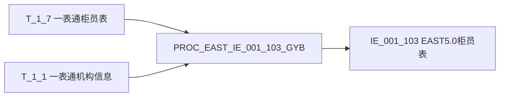
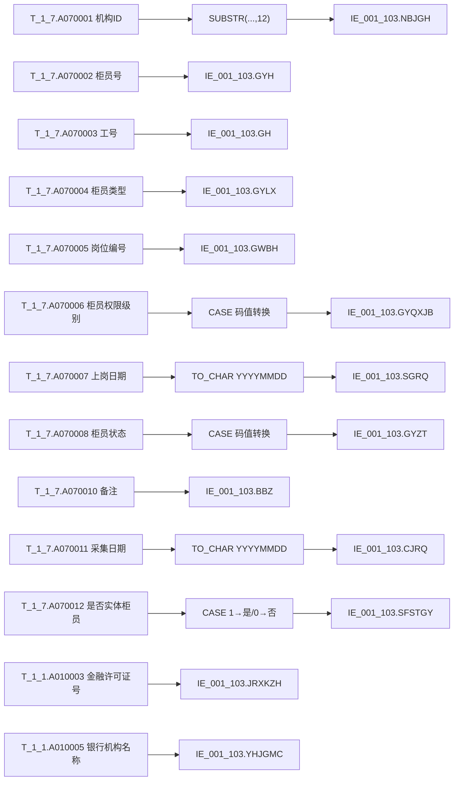

# 血缘-IE_001_103-柜员表-EAST5.0系统

## 页面边界

- 本页回答"当前对象从哪些对象来、去到哪些对象、字段如何对应、关键过滤和加工条件是什么"。
- 本页记录表级边、字段级边、上下游对象、字段落地状态、SQL 产出状态、证据状态和回链检查。
- 本页不保存完整报表业务口径、完整字段字典、完整码表、监管原文或 SQL 全文。
- 没有 SQL、过程、视图、字段字典、外部 wikilink、用户确认材料或既有知识页支撑的边，只能写为待确认，不得写成已闭环。
- 仓库内部页面和已存在 SQL 文件使用 Obsidian wikilink；不存在页面不要写成占位 wikilink。

## 链接约束

- 直接上游对象、直接下游对象、Nodes、表级 Edge List、字段级 Edge List、关键过滤与依赖条件、回链检查中出现的仓库内部对象，已存在页面时必须写成 Obsidian wikilink。
- 表级 Edge List 的 `From`、`To`、`Evidence` 列和字段级 Edge List 的 `源对象`、`目标对象`、`代码摘要` 中，只要指向数据表页、报表页、血缘页或 SQL 文件，必须使用 wikilink，不得只写表名、页面名、裸路径或反引号路径。
- 表格单元格内的 SQL 文件 wikilink 如需显示别名，必须转义竖线，例如双中括号内写成 `sql/<系统名>/<文件名>.sql\\|<文件名>.sql`；否则表格会被竖线拆列。
- 过程名、物理表名、字段名可以用反引号保留为技术标识；但只要存在对应知识页，首次出现和边表对象列必须同时给出 wikilink。
- 找不到对应页面或 SQL 文件时，不制造 wikilink；写普通文本"待补充（未找到：候选路径；检索词：...）"。

## 系统边界

- 起始系统：[[概念-系统-一表通系统]]
- 目标系统：[[概念-系统-EAST5.0系统]]
- 是否仅系统内血缘：否（跨系统：一表通 → EAST5.0）
- 文件路径归属哪个系统：EAST5.0系统
- 当前血缘对象：[[数据表-IE_001_103-柜员表-EAST5.0系统]]（EAST5.0 柜员表）

## 业务链路摘要

- 本血缘描述从一表通柜员表（`T_1_7`）和机构信息表（`T_1_1`）到 EAST5.0 柜员表（`IE_001_103`）的数据加工链路。
- 存储过程：`PROC_EAST_IE_001_103_GYB`（草案）
- 处理动作：柜员主源过滤（在岗或当月失效）→ 左关联机构信息派生表（去重取最新）补金融许可证号和银行机构名称 → 码值转换（柜员状态、柜员权限级别、是否实体柜员）→ 日期格式转换（上岗日期、采集日期）→ 字段清洗（NULLIF TRIM）→ 写入目标表。
- 常量赋值字段：`SENSITIVEFLAG`（涉密标志）和 `GSFZJG`（归属分支机构）当前 SQL 无来源，置 NULL。
- 本血缘基于 `[[sql/EAST5.0系统/PROC_EAST_IE_001_103_GYB_草案.sql|PROC_EAST_IE_001_103_GYB_草案.sql]]` 生成，为设计血缘，尚未运行验证。
- 2026-05-12 程序化解析验证（`extract_sql_lineage.py --engine auto`，GSP+JPype 就绪）：表级关系 `T_1_7 → IE_001_103`（fdd）、`T_1_1 → IE_001_103`（fdd）已由 GSP 确认；字段级 CASESFSTGY/GYQXJB/SGRQ/GYZT 因存储过程 CASE 表达式特性由正则补充，经 AI 审核与血缘页一致。
- 参数字段：`I_DATE`（采集日期，VARCHAR(8)）→ `P_DATA_DATE`（DATE）、`P_MONTH_BEGIN`（当月月初 DATE）。

## 证据入口

| 证据对象 | 类型 | 作用 | 定位 | 确认状态 |
| --- | --- | --- | --- | --- |
| [[sql/EAST5.0系统/PROC_EAST_IE_001_103_GYB_草案.sql\\|PROC_EAST_IE_001_103_GYB_草案.sql]] | 存储过程 / SQL 文件 | 加工当前对象：INSERT SELECT 映射 | 全文，主逻辑在 stmt 13（INSERT SELECT） | 已确认（草案） |
| [[数据表-T_1_7-柜员-一表通系统]] | 数据表页 | 柜员主源 | 字段主档：12 个字段 | 已确认 |
| [[数据表-T_1_1-机构信息-一表通系统]] | 数据表页 | 机构信息维表，补金融许可证号和银行机构名称 | 字段主档：`A010003`、`A010005` | 已确认 |
| [[数据表-IE_001_103-柜员表-EAST5.0系统]] | 数据表页 | 目标表结构 | 字段主档：15 个字段 | 已确认 |
| [[报表-IE_001_103-柜员表-EAST5.0系统]] | 报表业务口径页 | 业务需求和报送规则 | 补充业务口径和报送规则 | 已确认 |

## 直接上游对象

- [[数据表-T_1_7-柜员-一表通系统]]（`T_1_7`）：柜员明细主源
- [[数据表-T_1_1-机构信息-一表通系统]]（`T_1_1`）：机构信息维表，补金融许可证号和银行机构名称

## 直接下游对象

- 待补充（未找到：当前仓库无明确消费 `IE_001_103` 的 SQL 或下游报表；检索词：`IE_001_103`）

## Nodes

| 节点 | 类型 | 系统 | 角色 | 页面或证据 |
| --- | --- | --- | --- | --- |
| `T_1_7` | 源表 | 一表通系统 | 主源：柜员明细（12 个字段） | [[数据表-T_1_7-柜员-一表通系统]] |
| `T_1_1` | 源表 | 一表通系统 | 维度关联：补金融许可证号、银行机构名称 | [[数据表-T_1_1-机构信息-一表通系统]] |
| `PROC_EAST_IE_001_103_GYB` | 存储过程 | EAST5.0系统 | 加工过程：过滤、LEFT JOIN、CASE 映射、写入 | [[sql/EAST5.0系统/PROC_EAST_IE_001_103_GYB_草案.sql\\|PROC_EAST_IE_001_103_GYB_草案.sql]] |
| `IE_001_103` | 目标表 | EAST5.0系统 | 目标落表：EAST5.0 柜员表 | [[数据表-IE_001_103-柜员表-EAST5.0系统]] |

## 表级 Edge List

| From | To | Transform | Evidence | 确认状态 |
| --- | --- | --- | --- | --- |
| [[数据表-T_1_7-柜员-一表通系统]] | `PROC_EAST_IE_001_103_GYB` | 过滤：`A070011 = P_DATA_DATE` AND（`A070008 = '01'` OR `A070009 >= P_MONTH_BEGIN`），派生表 `t` | [[sql/EAST5.0系统/PROC_EAST_IE_001_103_GYB_草案.sql\\|PROC_EAST_IE_001_103_GYB_草案.sql]] 行 152-173 | 已确认 |
| [[数据表-T_1_1-机构信息-一表通系统]] | `PROC_EAST_IE_001_103_GYB` | LEFT JOIN，去重取最新机构记录（NOT EXISTS 子查询），关联条件 `o.A010001 = t.A070001`；取 `A010003`（金融许可证号）、`A010005`（银行机构名称） | [[sql/EAST5.0系统/PROC_EAST_IE_001_103_GYB_草案.sql\\|PROC_EAST_IE_001_103_GYB_草案.sql]] 行 174-196 | 已确认 |
| `PROC_EAST_IE_001_103_GYB` | [[数据表-IE_001_103-柜员表-EAST5.0系统]] | DELETE 删当日数据（行 81-83）→ INSERT SELECT 13 个字段映射（行 86-196） | [[sql/EAST5.0系统/PROC_EAST_IE_001_103_GYB_草案.sql\\|PROC_EAST_IE_001_103_GYB_草案.sql]] 行 81-196 | 已确认 |

## 字段级 Edge List

| 源对象 | 源字段 | 目标对象 | 目标字段 | 处理逻辑 | 关系类型 | 代码摘要 | 确认状态 |
| --- | --- | --- | --- | --- | --- | --- | --- |
| [[数据表-T_1_1-机构信息-一表通系统]] | `A010003` | [[数据表-IE_001_103-柜员表-EAST5.0系统]] | `JRXKZH` | `NULLIF(TRIM(o.A010003), '')` 直接映射 | 直接映射 | 无 | 已确认 |
| [[数据表-T_1_7-柜员-一表通系统]] | `A070001` | [[数据表-IE_001_103-柜员表-EAST5.0系统]] | `NBJGH` | `SUBSTR(NULLIF(TRIM(t.A070001), ''), 12)` 截取第12位至末尾 | 截取派生 | 机构ID编码规范是否统一支持第12位截取未确认 | 已确认 |
| [[数据表-T_1_1-机构信息-一表通系统]] | `A010005` | [[数据表-IE_001_103-柜员表-EAST5.0系统]] | `YHJGMC` | `NULLIF(TRIM(o.A010005), '')` 直接映射 | 直接映射 | 无 | 已确认 |
| 无映射来源 | — | [[数据表-IE_001_103-柜员表-EAST5.0系统]] | `SENSITIVEFLAG` | `NULL AS SENSITIVEFLAG` | 常量赋值 | 涉密标志无来源，当前置空 | 已确认 |
| 无映射来源 | — | [[数据表-IE_001_103-柜员表-EAST5.0系统]] | `GSFZJG` | `NULL AS GSFZJG` | 常量赋值 | 归属分支机构无来源，当前置空 | 已确认 |
| [[数据表-T_1_7-柜员-一表通系统]] | `A070002` | [[数据表-IE_001_103-柜员表-EAST5.0系统]] | `GYH` | `NULLIF(TRIM(t.A070002), '')` 直接映射 | 直接映射 | 无 | 已确认 |
| [[数据表-T_1_7-柜员-一表通系统]] | `A070003` | [[数据表-IE_001_103-柜员表-EAST5.0系统]] | `GH` | `NULLIF(TRIM(t.A070003), '')` 直接映射 | 直接映射 | 无 | 已确认 |
| [[数据表-T_1_7-柜员-一表通系统]] | `A070004` | [[数据表-IE_001_103-柜员表-EAST5.0系统]] | `GYLX` | `NULLIF(TRIM(t.A070004), '')` 直接映射 | 直接映射 | 无 | 已确认 |
| [[数据表-T_1_7-柜员-一表通系统]] | `A070012` | [[数据表-IE_001_103-柜员表-EAST5.0系统]] | `SFSTGY` | `CASE WHEN t.A070012='1' THEN '是' WHEN '0' THEN '否' ELSE NULL END` | 码值转换 | `1`→`是`, `0`→`否`, 其他→NULL | 已确认 |
| [[数据表-T_1_7-柜员-一表通系统]] | `A070005` | [[数据表-IE_001_103-柜员表-EAST5.0系统]] | `GWBH` | `NULLIF(TRIM(t.A070005), '')` 直接映射 | 直接映射 | 无 | 已确认 |
| [[数据表-T_1_7-柜员-一表通系统]] | `A070006` | [[数据表-IE_001_103-柜员表-EAST5.0系统]] | `GYQXJB` | `CASE WHEN A070006='01' THEN '高柜' WHEN '02' THEN '低柜' WHEN LIKE '00-%' THEN CONCAT('其他-', SUBSTR(...,4)) ELSE NULLIF(TRIM(...),'') END` | 码值转换 | `01`→`高柜`, `02`→`低柜`, `00-***`→`其他-***`, 其他→原值 | 已确认 |
| [[数据表-T_1_7-柜员-一表通系统]] | `A070007` | [[数据表-IE_001_103-柜员表-EAST5.0系统]] | `SGRQ` | `CASE WHEN t.A070007 IS NULL THEN NULL ELSE TO_CHAR(t.A070007, 'YYYYMMDD') END` | 日期转换 | date→VARCHAR(8) YYYYMMDD；NULL 时不兜底 | 已确认 |
| [[数据表-T_1_7-柜员-一表通系统]] | `A070008` | [[数据表-IE_001_103-柜员表-EAST5.0系统]] | `GYZT` | `CASE WHEN A070008='01' THEN '在岗' WHEN '02' THEN '离岗' WHEN LIKE '00-%' THEN CONCAT('其他-', SUBSTR(...,4)) ELSE NULLIF(TRIM(...),'') END` | 码值转换 | `01`→`在岗`, `02`→`离岗`, `00-***`→`其他-***`, 其他→原值 | 已确认 |
| [[数据表-T_1_7-柜员-一表通系统]] | `A070010` | [[数据表-IE_001_103-柜员表-EAST5.0系统]] | `BBZ` | `NULLIF(TRIM(t.A070010), '')` 直接映射 | 直接映射 | 无 | 已确认 |
| [[数据表-T_1_7-柜员-一表通系统]] | `A070011` | [[数据表-IE_001_103-柜员表-EAST5.0系统]] | `CJRQ` | `TO_CHAR(t.A070011, 'YYYYMMDD')` | 日期转换 | date→VARCHAR(8) YYYYMMDD | 已确认 |

## 关键过滤与依赖条件

| 条件对象 | 条件字段 | 条件或关联规则 | 业务/血缘含义 | 证据 | 确认状态 |
| --- | --- | --- | --- | --- | --- |
| `T_1_7`（派生表 `t`） | `A070011` | `t.A070011 = TO_CHAR(P_DATA_DATE, 'YYYY-MM-DD')` | 采集日期精确匹配：只取当前采集日的柜员数据 | 行 168 | 已确认 |
| `T_1_7`（派生表 `t`） | `A070008`、`A070009` | `t.A070008 = '01' OR t.A070009 >= P_MONTH_BEGIN` | 过滤条件：在岗（01）或失效日期 >= 当月月初的柜员才报送；离岗且失效日期早于当月月初的不报送 | 行 169-172 | 已确认 |
| `T_1_1`（派生表 `o`） | `A010020` | `org.A010020 = TO_CHAR(P_DATA_DATE, 'YYYY-MM-DD')` | 机构信息只取当前采集日期的记录 | 行 181 | 已确认 |
| `T_1_1`（派生表 `o`） | `A010001`（联合主键） | `NOT EXISTS` 子查询去重：同一 `A010001 + A010020` 下取 `A010002` 最大（最新）记录 | 机构派生表去重逻辑：同一机构ID和采集日期下取最新（A010002 最大）的一条 | 行 182-194 | 已确认 |
| `T_1_7` ↔ `T_1_1` | `A070001` ↔ `A010001` | `o.A010001 = t.A070001` | LEFT JOIN 关联条件：柜员表的机构ID关联机构信息表 | 行 196 | 已确认 |
| `IE_001_103` | `CJRQ` | `DELETE FROM IE_001_103 WHERE CJRQ = I_DATE` | 删除再插入：先清目标表当日数据，再写入映射结果（截面重跑） | 行 81-83 | 已确认 |
| `I_DATE`（入参） | — | `P_DATA_DATE = TO_DATE(I_DATE, 'YYYYMMDD')`；`P_MONTH_BEGIN = TO_DATE(CONCAT(SUBSTR(I_DATE,1,6),'01'), 'YYYYMMDD')` | 参数转换：VARCHAR 入参转为 DATE 类型用于过滤条件 | 行 77-78 | 已确认 |

## Graph-总览

## Graph-字段级

## 回链检查

- 目标数据表页是否已回链本血缘页：是（[[数据表-IE_001_103-柜员表-EAST5.0系统]] → `[[血缘-IE_001_103-柜员表-EAST5.0系统]]`）
- 报表业务口径页是否已回链本血缘页：待确认（[[报表-IE_001_103-柜员表-EAST5.0系统]] 需检查）
- 直接上游数据表页是否需要回链本血缘页：
  - [[数据表-T_1_7-柜员-一表通系统]]：已回链（引用入口已含 `[[血缘-IE_001_103-柜员表-EAST5.0系统]]`）
  - [[数据表-T_1_1-机构信息-一表通系统]]：未回链（当前引用入口的血缘页指向 `[[血缘-1.1-机构信息-一表通系统]]`，与本血缘页不同；是否应追加本血缘页回链需确认，因为 T_1_1 在本血缘中仅作为维度补充，非主源）
- 直接下游对象页是否需要回链本血缘页：无已确认的下游对象
- 系统页是否需要补入口或维护重点：
  - [[概念-系统-EAST5.0系统]]：需检查是否已包含 `IE_001_103` 入口
  - [[概念-系统-一表通系统]]：需检查是否需补充 `T_1_7` → EAST5.0 跨系统血缘线索

## 血缘缺口

| 缺口对象 | 缺口类型 | 当前影响 | 补证方向 | 状态 |
| --- | --- | --- | --- | --- |
| `IE_001_103` 下游消费 | 缺下游对象 | 不清楚 `IE_001_103` 被哪些报表或下游系统消费 | 检索 `rg "IE_001_103"` 在仓库中找引用 | open |
| `SENSITIVEFLAG` | 缺源字段 | 当前置 NULL，涉密标志的取数来源未确认 | 确认业务规则后补来源字段 | open |
| `GSFZJG` | 缺源字段 | 当前置 NULL，归属分支机构的取数来源未确认 | 确认业务规则后补来源字段 | open |
| `A070009`（失效日期）过滤语义 | 缺过滤条件确认 | "柜员状态转为注销、无效等"是否等于"离岗(02)"未确认 | 确认码值含义后固化过滤规则 | open |
| 上游 T_1_7 加工 SQL | 缺上游加工过程 | 一表通侧 T_1_7 的加工 SQL 或数据源未在仓库中记录 | 确认 T_1_7 表的数据来源并补表级边 | open |

## 变更与冲突

- 本次是否修改表级边：是（按模板重构，补充确认状态列、wikilink 化 From/To/Evidence）
- 本次是否修改字段级边：是（补充代码摘要和确认状态列，新增 SENSITIVEFLAG/GSFZJG 常量赋值行，修正 GYH/GYLX 等字段来源匹配）
- 本次是否修改关键过滤与依赖条件：是（新增独立条件表，细化每条过滤规则）
- 本次是否修改代码字段加工摘要：是（新增代码摘要列，摘要码值转换规则）
- 与既有 SQL、字段字典、外部来源或血缘结论是否存在冲突：
  - 旧血缘页过程名写为 `PROC_EAST_IE_001_103`，实际 SQL 定义为 `PROC_EAST_IE_001_103_GYB`，已修正
  - SQL 文件已于 2026-05-12 提交变更为含 GYB 后缀的草案
- 是否需要从 `validated` 降级为 `draft`：否（当前仍为 draft）

## Open Questions

- 待确认下游对象：`IE_001_103` 在 EAST5.0 系统中被哪些视图、存储过程或报表消费，需检索确认后补血缘页直接下游对象。
- 待确认字段级边：`SENSITIVEFLAG` 和 `GSFZJG` 的取数来源待业务确认，确认后补字段级边。
- 待确认过滤条件：柜员状态 "注销/无效" 是否映射为 `02`（离岗），需与业务确认码值含义。
- 待确认回链：T_1_1 数据表页是否需要追加本血缘页（血缘-IE_001_103-柜员表-EAST5.0系统）作为维度关联回链。
- 待确认系统页入口：检查 [[概念-系统-EAST5.0系统]] 是否已包含 `IE_001_103` 的系统入口。
