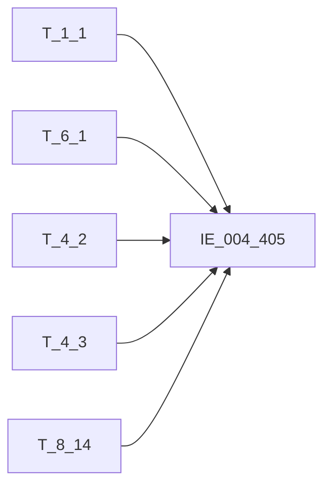

# 血缘-IE_004_405-对公存款分户账-EAST5.0系统

## 页面边界

- 本页维护 `对公存款分户账` 从一表通来源表到 EAST5.0 目标表 `IE_004_405` 的设计血缘。
- 证据为业务需求文档和工作区 GBase SQL 草案，尚未经过生产运行验证。
- 数据表字段定义见 [[数据表-IE_004_405-对公存款分户账-EAST5.0系统]]；业务报送口径见 [[报表-IE_004_405-对公存款分户账-EAST5.0系统]]。

## 系统边界

- 起始系统：一表通系统
- 目标系统：EAST5.0系统
- 是否跨系统血缘：是
- 目标对象：`IE_004_405` `对公存款分户账`

## 业务链路摘要

- 按 历史业务需求材料 的字段映射，将一表通来源表加工为 EAST5.0 `对公存款分户账`。
- 表级规则：### 2.1 表级规则（Excel第 393 行） 主表：【存款协议】 内关联1：【分户账信息表】 关联条件1：【存款协议】【分户账号】=【分户账信息表】【分户账号】 AND 【存款协议】【币种】=【分户账信息表】【币种】 AND 【存款协议】【钞汇类别】=【分户账信息表】【钞汇类别】 AND 【分户账信息表】【分户账类型】 = '01' 左关联：【机构信息表】 关联条件：【存款协议】【内部机构号】关联【机构信息表】【内部机构号】 左关联：【科目信息】 关联条件：【存款协议】【科目ID】，关联【一表通】【科目信息】的【科目ID】 左关联：【存款状态】 关联条件：【存款协议】【协议ID】=【存款状态】【协议ID】 AND 【存款协议】【分户账号】=【存款状态】【分户账号】 AND 【存款协议】【协议币种】=【存款状态】【币种】 AND 【存款协议】【钞汇类别】=【存款状态】【钞汇类别】 筛选条件：（【分户账信息表】【账户状态】不为销户或者【分户账信息表】【账户状态】为销户且销户日期在当月）
- SQL 草案采用按 `P_DATA_DATE` 清理后重插或增量边界过滤的方式；具体投产方式待验证。

## 直接上游对象

- [[数据表-T_1_1-机构信息-一表通系统]]：一表通来源表。
- [[数据表-T_6_1-存款协议-一表通系统]]：一表通来源表。
- [[数据表-T_4_2-科目信息-一表通系统]]：一表通来源表。
- [[数据表-T_4_3-分户账信息-一表通系统]]：一表通来源表。
- [[数据表-T_8_14-存款状态-一表通系统]]：一表通来源表。

## 直接下游对象

- 目标数据表：[[数据表-IE_004_405-对公存款分户账-EAST5.0系统]]
- 报表业务口径页：[[报表-IE_004_405-对公存款分户账-EAST5.0系统]]
- SQL 草案：`sql/EAST5.0系统/PROC_EAST_IE_004_405_DGCKFHZ_草案.sql`

## Nodes

- [[数据表-T_1_1-机构信息-一表通系统]]：一表通来源表。
- [[数据表-T_6_1-存款协议-一表通系统]]：一表通来源表。
- [[数据表-T_4_2-科目信息-一表通系统]]：一表通来源表。
- [[数据表-T_4_3-分户账信息-一表通系统]]：一表通来源表。
- [[数据表-T_8_14-存款状态-一表通系统]]：一表通来源表。
- [[数据表-IE_004_405-对公存款分户账-EAST5.0系统]]：EAST5.0 目标采集表。
- [[报表-IE_004_405-对公存款分户账-EAST5.0系统]]：业务口径说明。

## 表级 Edge List

| From | To | Transform | Evidence |
| --- | --- | --- | --- |
| [[数据表-T_1_1-机构信息-一表通系统]] | [[数据表-IE_004_405-对公存款分户账-EAST5.0系统]] | 字段映射、关联、过滤、码值/日期转换后装载 `IE_004_405` | ；SQL 草案 |
| [[数据表-T_6_1-存款协议-一表通系统]] | [[数据表-IE_004_405-对公存款分户账-EAST5.0系统]] | 字段映射、关联、过滤、码值/日期转换后装载 `IE_004_405` | ；SQL 草案 |
| [[数据表-T_4_2-科目信息-一表通系统]] | [[数据表-IE_004_405-对公存款分户账-EAST5.0系统]] | 字段映射、关联、过滤、码值/日期转换后装载 `IE_004_405` | ；SQL 草案 |
| [[数据表-T_4_3-分户账信息-一表通系统]] | [[数据表-IE_004_405-对公存款分户账-EAST5.0系统]] | 字段映射、关联、过滤、码值/日期转换后装载 `IE_004_405` | ；SQL 草案 |
| [[数据表-T_8_14-存款状态-一表通系统]] | [[数据表-IE_004_405-对公存款分户账-EAST5.0系统]] | 字段映射、关联、过滤、码值/日期转换后装载 `IE_004_405` | ；SQL 草案 |

## 字段级 Edge List

| 源对象 | 源字段 | 目标对象 | 目标字段 | 处理逻辑 | 关系类型 | 证据 |
| --- | --- | --- | --- | --- | --- | --- |
| [[数据表-T_1_1-机构信息-一表通系统]] | `A010003` | [[数据表-IE_004_405-对公存款分户账-EAST5.0系统]] | `JRXKZH` | 加工映射：将【一表通】【存款协议】【机构id】，关联【一表通】【机构信息表】的【机构id】取【金融许可证号】 | 加工映射 | ；SQL 草案 |
| [[数据表-T_6_1-存款协议-一表通系统]] | `F010002` | [[数据表-IE_004_405-对公存款分户账-EAST5.0系统]] | `NBJGH` | 加工映射：将【一表通】【存款协议】【机构id】从第12位开始截取 | 加工映射 | ；SQL 草案 |
| [[数据表-T_1_1-机构信息-一表通系统]] | `A010005` | [[数据表-IE_004_405-对公存款分户账-EAST5.0系统]] | `YHJGMC` | 加工映射：将【一表通】【存款协议】【机构id】，关联【一表通】【机构信息表】的【机构id】取【银行机构名称】 | 加工映射 | ；SQL 草案 |
| [[数据表-T_6_1-存款协议-一表通系统]] | `F010005` | [[数据表-IE_004_405-对公存款分户账-EAST5.0系统]] | `MXKMBH` | 加工映射：将【一表通】【存款协议】【科目ID】 | 加工映射 | ；SQL 草案 |
| [[数据表-T_4_2-科目信息-一表通系统]] | `D020003` | [[数据表-IE_004_405-对公存款分户账-EAST5.0系统]] | `MXKMMC` | 加工映射：将【一表通】【存款协议】【科目ID】，关联【一表通】【科目信息】的【科目ID】取【会计科目名称】 | 加工映射 | ；SQL 草案 |
| [[数据表-T_6_1-存款协议-一表通系统]] | `F010003` | [[数据表-IE_004_405-对公存款分户账-EAST5.0系统]] | `KHTYBH` | 加工映射：将【一表通】【存款协议】【客户ID】 | 加工映射 | ；SQL 草案 |
| [[数据表-T_4_3-分户账信息-一表通系统]] | `D030004` | [[数据表-IE_004_405-对公存款分户账-EAST5.0系统]] | `ZHMC` | 直接映射:【分户账信息】.【分户账名称】 | 直接映射 | ；SQL 草案 |
| [[数据表-T_6_1-存款协议-一表通系统]] | `F010007` | [[数据表-IE_004_405-对公存款分户账-EAST5.0系统]] | `DGCKZH` | 直接映射:【存款协议】.【分户账号】 | 直接映射 | ；SQL 草案 |
| [[数据表-T_6_1-存款协议-一表通系统]] | `F010048` | [[数据表-IE_004_405-对公存款分户账-EAST5.0系统]] | `DGCKZHLX` | 加工映射：； CASE WHEN 【存款协议】.【社会保障基金存款标识】 = '1' THEN '社会保障基金'； WHEN 【存款协议】.【存款产品类别】 = '01' THEN '单位活期存款'； WHEN 【存款协议】.【存款产品类别】 = '02' THEN '单位定期存款'； WHEN 【存款协议】.【存款产品类别】 = '03' THEN '单位通知存款'； WHEN 【存款协议】.【存款产品类别】 = '04' THEN ... | 加工映射 | ；SQL 草案 |
| [[数据表-T_6_1-存款协议-一表通系统]] | `F010016` | [[数据表-IE_004_405-对公存款分户账-EAST5.0系统]] | `BZJZHBZ` | 加工映射：CASE WHEN 【存款协议】.【保证金账户标志】 = '1' THEN '是' ELSE '否' END | 加工映射 | ；SQL 草案 |
| [[数据表-T_6_1-存款协议-一表通系统]] | `F010017` | [[数据表-IE_004_405-对公存款分户账-EAST5.0系统]] | `LL` | 直接映射:【存款协议】.【利率】 | 直接映射 | ；SQL 草案 |
| [[数据表-T_6_1-存款协议-一表通系统]] | `F010022` | [[数据表-IE_004_405-对公存款分户账-EAST5.0系统]] | `BZ` | 直接映射:【存款协议】.【协议币种】 | 直接映射 | ；SQL 草案 |
| [[数据表-T_8_14-存款状态-一表通系统]] | `H140013` | [[数据表-IE_004_405-对公存款分户账-EAST5.0系统]] | `CKYE` | 直接映射:【存款状态】.【存款余额】 | 直接映射 | ；SQL 草案 |
| [[数据表-T_6_1-存款协议-一表通系统]] | `F010019` | [[数据表-IE_004_405-对公存款分户账-EAST5.0系统]] | `KHRQ` | 加工映射：格式由YYYY-MM-DD转化成YYYYMMDD，空值需要转换成’99991231‘ | 码值转换/格式转换 | ；SQL 草案 |
| [[数据表-T_6_1-存款协议-一表通系统]] | `F010028` | [[数据表-IE_004_405-对公存款分户账-EAST5.0系统]] | `KHGYH` | 加工映射:【存款协议】.【经办员工ID】，如为“自动”则转为空，否则取原值 | 加工映射 | ；SQL 草案 |
| [[数据表-T_6_1-存款协议-一表通系统]] | `F010024` | [[数据表-IE_004_405-对公存款分户账-EAST5.0系统]] | `XHRQ` | 加工映射：格式由YYYY-MM-DD转化成YYYYMMDD，空值需要转换成’99991231‘ | 码值转换/格式转换 | ；SQL 草案 |
| [[数据表-T_8_14-存款状态-一表通系统]] | `H140016` | [[数据表-IE_004_405-对公存款分户账-EAST5.0系统]] | `SCDHRQ` | 加工映射：格式由YYYY-MM-DD转化成YYYYMMDD，空值需要转换成’99991231‘ | 码值转换/格式转换 | ；SQL 草案 |
| [[数据表-T_6_1-存款协议-一表通系统]] | `F010023` | [[数据表-IE_004_405-对公存款分户账-EAST5.0系统]] | `CHLB` | 码值转化：当币种为’CNY‘时，赋值：’人民币‘；当钞汇类别为’01‘时，赋值 ：‘钞'；当钞汇类别为’02‘时，赋值 ：‘汇'；当钞汇类别为’03‘时，赋值 ：‘可钞可汇'；当钞汇类别为’00-XX‘时，赋值 ：'其他-XX’ | 码值转换/格式转换 | ；SQL 草案 |
| [[数据表-T_4_3-分户账信息-一表通系统]] | `D030013` | [[数据表-IE_004_405-对公存款分户账-EAST5.0系统]] | `ZHZT` | 加工映射：当账户状态为'01'时,赋值'正常',；为'02'时，赋值'预销户',；为'03'时，赋值'销户',；为'04'时，赋值'冻结',；为'05'时，赋值'止付',；为'00-XX'时，赋值'其他-XX' | 加工映射 | ；SQL 草案 |
| [[数据表-T_6_1-存款协议-一表通系统]] | `F010032` | [[数据表-IE_004_405-对公存款分户账-EAST5.0系统]] | `BBZ` | 提取一表通《表6.1存款协议》、《表8.14存款状态》、《表4.3分户账信息》、《表1.1机构信息》、《表4.2科目信息》备注，如有多项，以英文分隔符';'拼接 | 加工映射 | ；SQL 草案 |
| 参数 | `P_DATA_DATE` | [[数据表-IE_004_405-对公存款分户账-EAST5.0系统]] | `CJRQ` | 参数直接赋值，格式 YYYYMMDD | 规则映射 | ；SQL 草案 |

## Graph-总览

## 回链检查

- 目标数据表页：已补 SQL 草案上游依赖摘要或待本次批处理补齐。
- 报表业务口径页：已创建或补充血缘回链。
- 一表通源表页：已补下游消费摘要或待本次批处理补齐。
- 当前字段级血缘基于业务需求和 SQL 草案，未运行验证，状态为待确认。

## 变更与冲突

- 本次为新增设计血缘或补齐草案血缘，不覆盖已验证生产血缘。
- 未发现需要将 `validated` 页面降级的情况；本页保持 `draft`。

## Open Questions

- GBase 草案中的复杂 JOIN、窗口去重、终态纳入和增量边界需要人工复核。
- 部分字段的码值 CASE 在草案中仍为待补，需要结合外部填报说明和跑数结果闭环。
- 外部监管实体页 wikilink 待补。
- **账户状态来源冲突**：业务需求文档（020_对公存款分户账.md）第19条标注 `ZHZT` 来源为"存款协议.账户状态"，但 T_6_1（存款协议）DDL 中无此字段；实际账户状态在 T_4_3（分户账信息）的 `D030013`。本草案以 T_4_3.D030013 为准，需与业务方确认是否需求文档有误。
- T_8_14（存款状态）关联键已根据 DDL 确认：H140018=协议ID, H140001=分户账号, H140004=币种, H140017=钞汇类别。SQL 草案 JOIN 条件已修正。
- T_8_14、T_1_1、T_4_2 备注字段已根据 DDL 确认：H140021=备注, A010026=备注, D020010=备注。SQL 草案已修正。

## 缺口字段（2026-05-04）

| 目标字段 | 字段名称 | 缺口说明 |
| --- | --- | --- |
| `GSFZJG` | 归属分支机构 | 本地 DDL 存在，但业务需求映射表和 SQL 草案未能确认来源，字段级血缘待补。 |
| `SENSITIVEFLAG` | 涉密标志 | 本地 DDL 存在，但业务需求映射表和 SQL 草案未能确认来源，字段级血缘待补。 |
