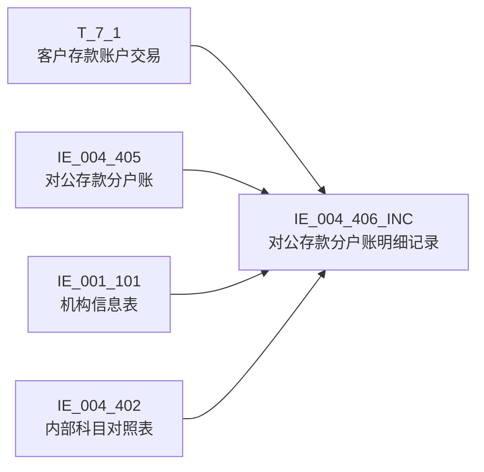

# 血缘-IE_004_406_INC-对公存款分户账明细记录-EAST5.0系统

## 页面边界

- 本页维护 `对公存款分户账明细记录` 从一表通来源表到 EAST5.0 目标表 `IE_004_406_INC` 的设计血缘。
- 证据为业务需求文档和工作区 GBase SQL 草案，尚未经过生产运行验证。
- 数据表字段定义见 [[数据表-IE_004_406_INC-对公存款分户账明细记录-EAST5.0系统]]；业务报送口径见 [[报表-IE_004_406_INC-对公存款分户账明细记录-EAST5.0系统]]。

## 系统边界

- 起始系统：一表通系统
- 目标系统：EAST5.0系统
- 是否跨系统血缘：是
- 目标对象：`IE_004_406_INC` `对公存款分户账明细记录`

## 业务链路摘要

- 按 历史业务需求材料 的字段映射，将一表通来源表加工为 EAST5.0 `对公存款分户账明细记录`。
- 表级规则：### 2.1 表级规则（Excel第 415 行） 主表：【客户存款账户交易表】 内关联1：【EAST.对公存款分户账】 关联条件1：【客户存款账户交易表】【分户账号】=【EAST.对公存款分户账】【分户账号】 AND 【客户存款账户交易表】【币种】=【分户账号】【币种】 AND CASE WHEN 【客户存款账户交易表】【币种】 = 'CNY' THEN '人民币' WHEN 【客户存款账户交易表】【钞汇类别】 = '01' THEN '钞' WHEN 【客户存款账户交易表】【钞汇类别】 = '02' THEN '汇' WHEN 【客户存款账户交易表】【钞汇类别】 = '03' THEN '可钞可汇' =【个人存款分户账】【钞汇类别】 左关联：【EAST.机构信息表】 关联条件：【客户存款账户交易表】【内部机构号】关联【EAST.机构信息表】【内部机构号】 左关联：【EAST.内部科目对照表】 关联条件：【客户存款账户交易表】【科目ID】，关联【EAST.内部科目对照表】的【会计科目编号】 左关联：【EAST.对公存款分户账】 关联条件：【客户存款账户交易表】【客户ID】，关联【EAST.对公存款分户账】的【统一客户编号】
- SQL 草案采用按 `P_DATA_DATE` 清理后重插或增量边界过滤的方式；具体投产方式待验证。

## 直接上游对象

- [[数据表-T_7_1-客户存款账户交易-一表通系统]]：一表通来源表，33 个业务需求字段主源。
- [[数据表-IE_004_405-对公存款分户账-EAST5.0系统]]：内关联补充 ZHMC、SENSITIVEFLAG、GSFZJG、MXKMBH。
- [[数据表-IE_001_101-机构信息表-EAST5.0系统]]：左关联补充 JRXKZH、YHJGMC。
- [[数据表-IE_004_402-内部科目对照表-EAST5.0系统]]：左关联补充 MXKMMC。

## 直接下游对象

- 目标数据表：[[数据表-IE_004_406_INC-对公存款分户账明细记录-EAST5.0系统]]
- 报表业务口径页：[[报表-IE_004_406_INC-对公存款分户账明细记录-EAST5.0系统]]
- SQL 草案：`sql/EAST5.0系统/PROC_EAST_IE_004_406_INC_DGCKFHZMX_草案.sql`

## Nodes

- [[数据表-T_7_1-客户存款账户交易-一表通系统]]：一表通来源表。
- [[数据表-IE_004_405-对公存款分户账-EAST5.0系统]]：EAST 对公存款分户账，内关联限定对公账户。
- [[数据表-IE_001_101-机构信息表-EAST5.0系统]]：EAST 机构信息表，左关联补机构信息。
- [[数据表-IE_004_402-内部科目对照表-EAST5.0系统]]：EAST 内部科目对照表，左关联补科目名称。
- [[数据表-IE_004_406_INC-对公存款分户账明细记录-EAST5.0系统]]：EAST5.0 目标采集表。
- [[报表-IE_004_406_INC-对公存款分户账明细记录-EAST5.0系统]]：业务口径说明。

## 表级 Edge List

| From | To | Transform | Evidence |
| --- | --- | --- | --- |
| [[数据表-T_7_1-客户存款账户交易-一表通系统]] | [[数据表-IE_004_406_INC-对公存款分户账明细记录-EAST5.0系统]] | 字段映射、关联、过滤、码值/日期转换后装载 `IE_004_406_INC` | ；SQL 草案 |
| [[数据表-IE_004_405-对公存款分户账-EAST5.0系统]] | [[数据表-IE_004_406_INC-对公存款分户账明细记录-EAST5.0系统]] | 内关联限定对公账户，补充 ZHMC、SENSITIVEFLAG、GSFZJG、MXKMBH | ；SQL 草案 |
| [[数据表-IE_001_101-机构信息表-EAST5.0系统]] | [[数据表-IE_004_406_INC-对公存款分户账明细记录-EAST5.0系统]] | 左关联补充 JRXKZH、YHJGMC | ；SQL 草案 |
| [[数据表-IE_004_402-内部科目对照表-EAST5.0系统]] | [[数据表-IE_004_406_INC-对公存款分户账明细记录-EAST5.0系统]] | 左关联补充 MXKMMC | ；SQL 草案 |

## 字段级 Edge List

> 2026-05-05 重新校准：依据《021_对公存款分户账明细记录.md》业务需求文档逐项核对 GBase 存储过程草案。33 个业务需求字段全部映射正确，4 个"待确认"源字段已通过 JOIN 表确认可追溯。

| 源对象 | 源字段 | 目标对象 | 目标字段 | 处理逻辑 | 关系类型 | 证据 |
| --- | --- | --- | --- | --- | --- | --- |
| [[数据表-T_7_1-客户存款账户交易-一表通系统]] | `G010001` | [[数据表-IE_004_406_INC-对公存款分户账明细记录-EAST5.0系统]] | `JYXLH` | 直接映射：【客户存款账户交易表 BS_JY_KHZZJY】.【交易ID JYID】 | 直接映射 | 业务需求第1条；SQL 草案 L116 |
| [[数据表-IE_001_101-机构信息表-EAST5.0系统]] | `JRXKZH` | [[数据表-IE_004_406_INC-对公存款分户账明细记录-EAST5.0系统]] | `JRXKZH` | 直接映射：T8.【金融许可证号 JRXKZH】，通过 LEFT JOIN IE_001_101 获取 | 直接映射 | 业务需求第2条；SQL 草案 L118 |
| [[数据表-T_7_1-客户存款账户交易-一表通系统]] | `G010035` | [[数据表-IE_004_406_INC-对公存款分户账明细记录-EAST5.0系统]] | `NBJGH` | 加工映射：SUBSTR(TRIM(【客户存款账户交易 BS_JY_KHZZJY】.【入账机构ID JYJGID】,12) | 加工映射 | 业务需求第3条；SQL 草案 L120 |
| [[数据表-T_7_1-客户存款账户交易-一表通系统]] | `G010004` | [[数据表-IE_004_406_INC-对公存款分户账明细记录-EAST5.0系统]] | `YWBLJGH` | 加工映射：SUBSTR(TRIM(【客户存款账户交易表 BS_JY_KHZZJY】.【交易机构ID JYJGID】,12) | 加工映射 | 业务需求第4条；SQL 草案 L122 |
| [[数据表-IE_001_101-机构信息表-EAST5.0系统]] | `YHJGMC` | [[数据表-IE_004_406_INC-对公存款分户账明细记录-EAST5.0系统]] | `YHJGMC` | 直接映射：T8.【银行机构名称 YHJGMC】，通过 LEFT JOIN IE_001_101 获取 | 直接映射 | 业务需求第5条；SQL 草案 L124 |
| [[数据表-T_7_1-客户存款账户交易-一表通系统]] | `G010011` | [[数据表-IE_004_406_INC-对公存款分户账明细记录-EAST5.0系统]] | `MXKMBH` | 加工映射：COALESCE(【客户存款账户交易表 BS_JY_KHZZJY】.【科目ID KMID】,【对公存款分户账 T_EAST_YBT_DGCKFHZ】.【明细科目编号 MXKMBH】) | 加工映射 | 业务需求第6条；SQL 草案 L126 |
| [[数据表-IE_004_402-内部科目对照表-EAST5.0系统]] | `KJKMMC` | [[数据表-IE_004_406_INC-对公存款分户账明细记录-EAST5.0系统]] | `MXKMMC` | 直接映射：【内部科目对照表 T_EAST_YBT_NBKMDZB】.【会计科目名称 KJKMMC】，通过 LEFT JOIN IE_004_402 获取 | 直接映射 | 业务需求第7条；SQL 草案 L128 |
| [[数据表-T_7_1-客户存款账户交易-一表通系统]] | `G010003` | [[数据表-IE_004_406_INC-对公存款分户账明细记录-EAST5.0系统]] | `KHTYBH` | 直接映射：【客户存款账户交易表 BS_JY_KHZZJY】.【客户ID KHID】 | 直接映射 | 业务需求第8条；SQL 草案 L130 |
| [[数据表-IE_004_405-对公存款分户账-EAST5.0系统]] | `ZHMC` | [[数据表-IE_004_406_INC-对公存款分户账明细记录-EAST5.0系统]] | `ZHMC` | 直接映射：T2.【账户名称 ZHMC】，通过 INNER JOIN IE_004_405 获取 | 直接映射 | 业务需求第9条；SQL 草案 L132 |
| [[数据表-T_7_1-客户存款账户交易-一表通系统]] | `G010002` | [[数据表-IE_004_406_INC-对公存款分户账明细记录-EAST5.0系统]] | `DGCKZH` | 直接映射：【客户存款账户交易表 BS_JY_KHZZJY】.【分户账号 FHZH】 | 直接映射 | 业务需求第10条；SQL 草案 L134 |
| [[数据表-T_7_1-客户存款账户交易-一表通系统]] | `G010025` | [[数据表-IE_004_406_INC-对公存款分户账明细记录-EAST5.0系统]] | `WBZH` | 直接映射：【客户存款账户交易表 BS_JY_KHZZJY】.【外部账号 WBZH】 | 直接映射 | 业务需求第11条；SQL 草案 L136 |
| [[数据表-T_7_1-客户存款账户交易-一表通系统]] | `G010010` | [[数据表-IE_004_406_INC-对公存款分户账明细记录-EAST5.0系统]] | `JYLX` | 码值转化：CASE WHEN G010010='01' THEN '转账' ... END（14 个码值 + '00%' 兜底） | 码值转换 | 业务需求第12条；SQL 草案 L138-155 |
| [[数据表-T_7_1-客户存款账户交易-一表通系统]] | `G010014` | [[数据表-IE_004_406_INC-对公存款分户账明细记录-EAST5.0系统]] | `JYJDBZ` | 码值转换：01→借，02→贷 | 码值转换 | 业务需求第13条；SQL 草案 L157-161 |
| [[数据表-T_7_1-客户存款账户交易-一表通系统]] | `G010005` | [[数据表-IE_004_406_INC-对公存款分户账明细记录-EAST5.0系统]] | `HXJYRQ` | 加工映射：YYYY-MM-DD → YYYYMMDD | 格式转换 | 业务需求第14条；SQL 草案 L163-167 |
| [[数据表-T_7_1-客户存款账户交易-一表通系统]] | `G010006` | [[数据表-IE_004_406_INC-对公存款分户账明细记录-EAST5.0系统]] | `HXJYSJ` | 加工映射：REPLACE(HH:MM:SS, ':', '') | 格式转换 | 业务需求第15条；SQL 草案 L169-171 |
| [[数据表-T_7_1-客户存款账户交易-一表通系统]] | `G010009` | [[数据表-IE_004_406_INC-对公存款分户账明细记录-EAST5.0系统]] | `BZ` | 直接映射：【客户存款账户交易表 BS_JY_KHZZJY】.【币种 BZ】 | 直接映射 | 业务需求第16条；SQL 草案 L173 |
| [[数据表-T_7_1-客户存款账户交易-一表通系统]] | `G010007` | [[数据表-IE_004_406_INC-对公存款分户账明细记录-EAST5.0系统]] | `JYJE` | 直接映射：CAST(NULLIF(TRIM(G010007), ''), DECIMAL(20,2)) | 类型转换 | 业务需求第17条；SQL 草案 L175 |
| [[数据表-T_7_1-客户存款账户交易-一表通系统]] | `G010008` | [[数据表-IE_004_406_INC-对公存款分户账明细记录-EAST5.0系统]] | `ZHYE` | 直接映射：CAST(NULLIF(TRIM(G010008), ''), DECIMAL(20,2)) | 类型转换 | 业务需求第18条；SQL 草案 L177 |
| [[数据表-T_7_1-客户存款账户交易-一表通系统]] | `G010015` | [[数据表-IE_004_406_INC-对公存款分户账明细记录-EAST5.0系统]] | `DFZH` | 直接映射：【客户存款账户交易表 BS_JY_KHZZJY】.【对方账号 DFZH】 | 直接映射 | 业务需求第19条；SQL 草案 L179 |
| [[数据表-T_7_1-客户存款账户交易-一表通系统]] | `G010016` | [[数据表-IE_004_406_INC-对公存款分户账明细记录-EAST5.0系统]] | `DFHM` | 直接映射：【客户存款账户交易表 BS_JY_KHZZJY】.【对方户名 HFHUM】 | 直接映射 | 业务需求第20条；SQL 草案 L181 |
| [[数据表-T_7_1-客户存款账户交易-一表通系统]] | `G010017` | [[数据表-IE_004_406_INC-对公存款分户账明细记录-EAST5.0系统]] | `DFXH` | 直接映射：【客户存款账户交易表 BS_JY_KHZZJY】.【对方账号行号 DFZHHH】 | 直接映射 | 业务需求第21条；SQL 草案 L183 |
| [[数据表-T_7_1-客户存款账户交易-一表通系统]] | `G010018` | [[数据表-IE_004_406_INC-对公存款分户账明细记录-EAST5.0系统]] | `DFXM` | 直接映射：【客户存款账户交易表 BS_JY_KHZZJY】.【对方行名 DFHM】 | 直接映射 | 业务需求第22条；SQL 草案 L185 |
| [[数据表-T_7_1-客户存款账户交易-一表通系统]] | `G010019` | [[数据表-IE_004_406_INC-对公存款分户账明细记录-EAST5.0系统]] | `ZY` | 直接映射：【客户存款账户交易表 BS_JY_KHZZJY】.【交易摘要 JYZY】 | 直接映射 | 业务需求第23条；SQL 草案 L187 |
| [[数据表-T_7_1-客户存款账户交易-一表通系统]] | `G010031` | [[数据表-IE_004_406_INC-对公存款分户账明细记录-EAST5.0系统]] | `FY` | 直接映射：【客户存款账户交易表 BS_JY_KHZZJY】.【附言】 | 直接映射 | 业务需求第24条；SQL 草案 L189 |
| [[数据表-T_7_1-客户存款账户交易-一表通系统]] | `G010020` | [[数据表-IE_004_406_INC-对公存款分户账明细记录-EAST5.0系统]] | `CBMBZ` | 码值转化：01→正常，02→冲补抹，ELSE→空 | 码值转换 | 业务需求第25条；SQL 草案 L191-195 |
| [[数据表-T_7_1-客户存款账户交易-一表通系统]] | `G010013` | [[数据表-IE_004_406_INC-对公存款分户账明细记录-EAST5.0系统]] | `XZBZ` | 码值转化：01→现，02→转，ELSE→空 | 码值转换 | 业务需求第26条；SQL 草案 L197-201 |
| [[数据表-T_7_1-客户存款账户交易-一表通系统]] | `G010021` | [[数据表-IE_004_406_INC-对公存款分户账明细记录-EAST5.0系统]] | `JYQD` | 码值转化：CASE WHEN G010021='01' THEN '柜面' ... END（9 个码值 + '07%'/'00%' 兜底） | 码值转换 | 业务需求第27条；SQL 草案 L203-214 |
| [[数据表-T_7_1-客户存款账户交易-一表通系统]] | `G010023` | [[数据表-IE_004_406_INC-对公存款分户账明细记录-EAST5.0系统]] | `IPDZ` | 直接映射：【客户存款账户交易表 BS_JY_KHZZJY】.【IP地址 IPDZ】 | 直接映射 | 业务需求第28条；SQL 草案 L216 |
| [[数据表-T_7_1-客户存款账户交易-一表通系统]] | `G010024` | [[数据表-IE_004_406_INC-对公存款分户账明细记录-EAST5.0系统]] | `MACDZ` | 直接映射：【客户存款账户交易表 BS_JY_KHZZJY】.【MAC地址 MACDZ】 | 直接映射 | 业务需求第29条；SQL 草案 L218 |
| [[数据表-T_7_1-客户存款账户交易-一表通系统]] | `G010029` | [[数据表-IE_004_406_INC-对公存款分户账明细记录-EAST5.0系统]] | `JYGYH` | 加工映射：IF G010029='自动' THEN NULL ELSE G010029 | 加工映射 | 业务需求第30条；SQL 草案 L220 |
| [[数据表-T_7_1-客户存款账户交易-一表通系统]] | `G010030` | [[数据表-IE_004_406_INC-对公存款分户账明细记录-EAST5.0系统]] | `SQGYH` | 加工映射：IF G010030='自动' THEN NULL ELSE G010030 | 加工映射 | 业务需求第31条；SQL 草案 L222 |
| [[数据表-T_7_1-客户存款账户交易-一表通系统]] | `G010034` | [[数据表-IE_004_406_INC-对公存款分户账明细记录-EAST5.0系统]] | `BBZ` | 直接映射：【客户存款账户交易表 BS_JY_KHZZJY】.【备注】 | 直接映射 | 业务需求第32条；SQL 草案 L224 |
| 参数 | `P_DATA_DATE` | [[数据表-IE_004_406_INC-对公存款分户账明细记录-EAST5.0系统]] | `CJRQ` | 加工映射：P_DATA_DATE 参数直接赋值（YYYYMMDD 格式） | 加工映射 | 业务需求第33条；SQL 草案 L226 |
| [[数据表-IE_004_405-对公存款分户账-EAST5.0系统]] | `SENSITIVEFLAG` | [[数据表-IE_004_406_INC-对公存款分户账明细记录-EAST5.0系统]] | `SENSITIVEFLAG` | 直接映射：通过 INNER JOIN IE_004_405 获取 | 直接映射 | 本地 DDL 存在，业务需求映射表未给来源；SQL 草案 L228 |
| [[数据表-IE_004_405-对公存款分户账-EAST5.0系统]] | `GSFZJG` | [[数据表-IE_004_406_INC-对公存款分户账明细记录-EAST5.0系统]] | `GSFZJG` | 直接映射：通过 INNER JOIN IE_004_405 获取 | 直接映射 | 本地 DDL 存在，业务需求映射表未给来源；SQL 草案 L230 |
| NULL | NULL | [[数据表-IE_004_406_INC-对公存款分户账明细记录-EAST5.0系统]] | `DFKHLB` | 固定 NULL：业务需求未给出来源 | 固定值 | 本地 DDL 存在，业务需求映射表未给来源；SQL 草案 L232 |

## Graph-总览

## 回链检查

- 目标数据表页：已补 SQL 草案上游依赖摘要。
- 报表业务口径页：已创建并补充血缘回链。
- 一表通源表页（T_7_1）：已补下游消费摘要。
- IE_004_405 数据表页：已补下游消费摘要。
- IE_001_101 数据表页：已补下游消费摘要（如有）。
- IE_004_402 数据表页：已补下游消费摘要（如有）。
- 当前字段级血缘基于业务需求和 SQL 草案，未运行验证，状态为 draft。

## 变更与冲突

- 本次为新增设计血缘或补齐草案血缘，不覆盖已验证生产血缘。
- 未发现需要将 `validated` 页面降级的情况；本页保持 `draft`。

## Open Questions

- GBase 草案中的复杂 JOIN、窗口去重、终态纳入和增量边界需要人工复核。
- 部分字段的码值 CASE 在草案中仍为待补，需要结合外部填报说明和跑数结果闭环。
- 外部监管实体页 wikilink 待补。

## 缺口字段（2026-05-05 重新校准）

> 2026-05-05 重新校准结论：33 个业务需求字段全部映射正确，4 个"待确认"源字段已通过 JOIN 表确认可追溯。以下 3 个字段为 DDL 存在但业务需求映射表未给来源，SQL 草案中保留 NULL 赋值，符合审计处置原则（DDL 允许 NULL 且业务需求未给来源），不视为阻塞缺口。

| 目标字段 | 字段名称 | 缺口说明 |
| --- | --- | --- |
| `SENSITIVEFLAG` | 涉密标志 | 本地 DDL 存在，业务需求映射表未给来源，SQL 草案通过 INNER JOIN IE_004_405 获取。待确认是否监管必报、是否允许置空。 |
| `GSFZJG` | 归属分支机构 | 本地 DDL 存在，业务需求映射表未给来源，SQL 草案通过 INNER JOIN IE_004_405 获取。待确认是否监管必报、是否允许置空。 |
| `DFKHLB` | 对方客户类别 | 本地 DDL 存在，业务需求映射表未给来源，SQL 草案固定 NULL。待确认是否监管必报、是否允许置空或由其他规则补值。 |
