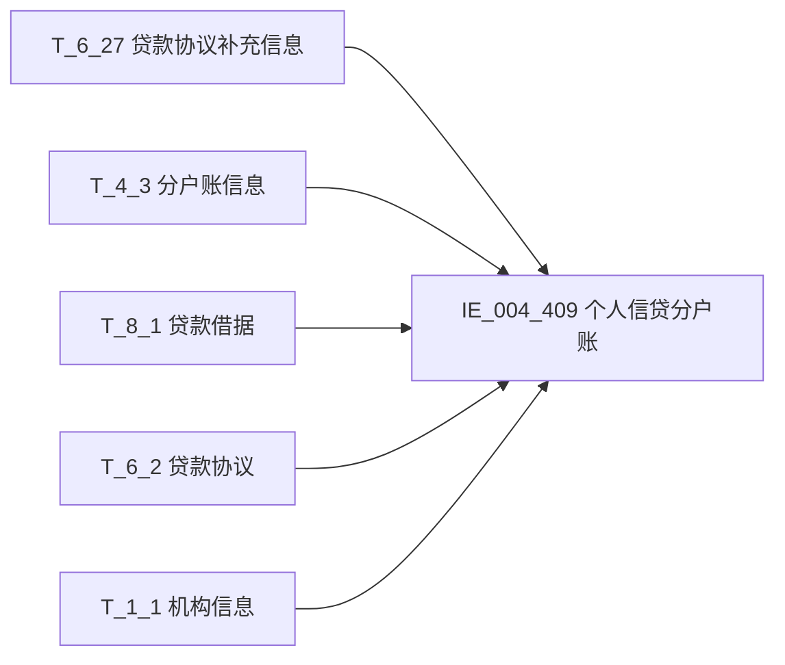

# 血缘-IE_004_409-个人信贷分户账-EAST5.0系统

## 页面边界

- 本页维护 `个人信贷分户账` 从一表通来源表到 EAST5.0 目标表 `IE_004_409` 的设计血缘。
- 证据为业务需求文档和工作区 GBase SQL 草案，尚未经过生产运行验证。
- 数据表字段定义见 [[数据表-IE_004_409-个人信贷分户账-EAST5.0系统]]；业务报送口径见 [[报表-IE_004_409-个人信贷分户账-EAST5.0系统]]。

## 系统边界

- 起始系统：一表通系统
- 目标系统：EAST5.0系统
- 是否跨系统血缘：是
- 目标对象：`IE_004_409` `个人信贷分户账`

## 业务链路摘要

- 按 历史业务需求材料 的字段映射，将一表通来源表加工为 EAST5.0 `个人信贷分户账`。
- 表级规则：### 2.1 表级规则（Excel第 502 行） 通过【贷款协议补充信息】.【借据ID】关联【贷款借据】.【借据ID】，加总如下4个场景数据： 1、取上月末未终结：上月末【贷款借据】.【贷款状态】等于01、05 2、当月末未终结：当月末的【贷款借据】.【贷款状态】等于01、05 3、当月新发放贷款：【贷款协议补充信息】.【贷款实际发放日期】在当月 4、第三方平台跨月新发放：当月末【贷款借据】.【借据ID】在上月末的【贷款借据】.【借据ID】中不存在
- SQL 草案 `PROC_EAST_IE_004_409_GRXDFHZ_草案.sql`（2026-05-05 重构）：
  - T_6_27 agg LEFT JOIN T_4_3 src ON src.D030002 = agg.F270005 AND src.D030015 = V_DATA_DATE（分户账号关联）
  - T_6_27 agg LEFT JOIN T_8_1 s2 ON s2.H010001 = agg.XDJJH AND s2.H010029 = V_DATA_DATE（借据ID关联）
  - T_6_27 agg LEFT JOIN T_6_2 s3 ON s3.F020001 = agg.F270003 AND s3.F020063 = V_DATA_DATE（协议ID关联）
  - T_6_27 agg LEFT JOIN T_1_1 s4 ON s4.A010001 = agg.F270004 AND s4.A010020 = V_DATA_DATE（机构ID关联）
  - WHERE 过滤：4 场景纳入条件（上月末未终结/当月末未终结/当月新发放/跨月新发放）OR 条件 + 采集日期过滤 + 分户账非空过滤
  - 码值转换：账户状态 6 分支（01→正常/02→预销户/03→销户/04→冻结/05→止付/00→其他-XX），贷款状态 6 分支（01→正常/02→核销/03→转让/04→结清/05→逾期/00→其他-XX）
  - 日期转换：FFRQ/XHRQ/KHRQ/DQRQ/CJRQ 使用 CONCAT+YEAR+MONTH+DAY 由 DATE 转 YYYYMMDD，空值默认 '99991231'
  - 备注 BBZ 使用 CONCAT_WS 拼接四表备注
  - 内部机构号 NBJGH 使用 SUBSTR(TRIM(F270004), 12)

## 直接上游对象

- [[数据表-T_6_27-贷款协议补充信息-一表通系统]]：一表通来源表，主源表。
- [[数据表-T_4_3-分户账信息-一表通系统]]：一表通来源表。
- [[数据表-T_8_1-贷款借据-一表通系统]]：一表通来源表。
- [[数据表-T_6_2-贷款协议-一表通系统]]：一表通来源表。
- [[数据表-T_1_1-机构信息-一表通系统]]：一表通来源表。

## 直接下游对象

- 目标数据表：[[数据表-IE_004_409-个人信贷分户账-EAST5.0系统]]
- 报表业务口径页：[[报表-IE_004_409-个人信贷分户账-EAST5.0系统]]
- SQL 草案：`sql/EAST5.0系统/PROC_EAST_IE_004_409_GRXDFHZ_草案.sql`

## Nodes

- [[数据表-T_6_27-贷款协议补充信息-一表通系统]]：一表通来源表，主源表。
- [[数据表-T_4_3-分户账信息-一表通系统]]：一表通来源表。
- [[数据表-T_8_1-贷款借据-一表通系统]]：一表通来源表。
- [[数据表-T_6_2-贷款协议-一表通系统]]：一表通来源表。
- [[数据表-T_1_1-机构信息-一表通系统]]：一表通来源表。
- [[数据表-IE_004_409-个人信贷分户账-EAST5.0系统]]：EAST5.0 目标采集表。
- [[报表-IE_004_409-个人信贷分户账-EAST5.0系统]]：业务口径说明。

## 表级 Edge List

| From | To | Transform | Evidence |
| --- | --- | --- | --- |
| [[数据表-T_6_27-贷款协议补充信息-一表通系统]] | [[数据表-IE_004_409-个人信贷分户账-EAST5.0系统]] | 字段映射、聚合、关联、过滤、码值/日期转换后装载 `IE_004_409` | ；SQL 草案 |
| [[数据表-T_4_3-分户账信息-一表通系统]] | [[数据表-IE_004_409-个人信贷分户账-EAST5.0系统]] | 字段映射、LEFT JOIN 分户账号、码值/日期转换后装载 `IE_004_409` | ；SQL 草案 |
| [[数据表-T_8_1-贷款借据-一表通系统]] | [[数据表-IE_004_409-个人信贷分户账-EAST5.0系统]] | 字段映射、LEFT JOIN 借据ID、码值转换后装载 `IE_004_409` | ；SQL 草案 |
| [[数据表-T_6_2-贷款协议-一表通系统]] | [[数据表-IE_004_409-个人信贷分户账-EAST5.0系统]] | 备注字段 LEFT JOIN 协议ID 后装载 `IE_004_409` | ；SQL 草案 |
| [[数据表-T_1_1-机构信息-一表通系统]] | [[数据表-IE_004_409-个人信贷分户账-EAST5.0系统]] | 字段映射、LEFT JOIN 机构ID 后装载 `IE_004_409` | ；SQL 草案 |

## 字段级 Edge List

| 源对象 | 源字段 | 目标对象 | 目标字段 | 处理逻辑 | 关系类型 | 证据 |
| --- | --- | --- | --- | --- | --- | --- |
| [[数据表-T_1_1-机构信息-一表通系统]] | `A010003` | [[数据表-IE_004_409-个人信贷分户账-EAST5.0系统]] | `JRXKZH` | LEFT JOIN ON s4.A010001=agg.F270004 AND s4.A010020=V_DATA_DATE；取 A010003 | 加工映射 | ；`PROC_EAST_IE_004_409_GRXDFHZ_草案.sql` |
| [[数据表-T_4_3-分户账信息-一表通系统]] | `D030014`；[[数据表-T_6_27-贷款协议补充信息-一表通系统]] `F270068`；[[数据表-T_8_1-贷款借据-一表通系统]] `H010030`；[[数据表-T_6_2-贷款协议-一表通系统]] `F020062` | [[数据表-IE_004_409-个人信贷分户账-EAST5.0系统]] | `BBZ` | CONCAT_WS(';', D030014, F270068, H010030, F020062)；四表备注以英文分号拼接 | 加工映射 | ；`PROC_EAST_IE_004_409_GRXDFHZ_草案.sql` |
| [[数据表-T_6_27-贷款协议补充信息-一表通系统]] | `F270007` | [[数据表-IE_004_409-个人信贷分户账-EAST5.0系统]] | `MXKMBH` | 直接映射 F270007 | 直接映射 | ；`PROC_EAST_IE_004_409_GRXDFHZ_草案.sql` |
| [[数据表-T_6_27-贷款协议补充信息-一表通系统]] | `F270002` | [[数据表-IE_004_409-个人信贷分户账-EAST5.0系统]] | `KHTYBH` | 直接映射 F270002 | 直接映射 | ；`PROC_EAST_IE_004_409_GRXDFHZ_草案.sql` |
| [[数据表-T_4_3-分户账信息-一表通系统]] | `D030004` | [[数据表-IE_004_409-个人信贷分户账-EAST5.0系统]] | `ZHMC` | LEFT JOIN ON src.D030002=agg.F270005 AND src.D030015=V_DATA_DATE；直接映射 D030004 | 加工映射 | ；`PROC_EAST_IE_004_409_GRXDFHZ_草案.sql` |
| [[数据表-T_6_27-贷款协议补充信息-一表通系统]] | `F270003` | [[数据表-IE_004_409-个人信贷分户账-EAST5.0系统]] | `XDHTH` | 直接映射 F270003 | 直接映射 | ；`PROC_EAST_IE_004_409_GRXDFHZ_草案.sql` |
| [[数据表-T_8_1-贷款借据-一表通系统]] | `H010021` | [[数据表-IE_004_409-个人信贷分户账-EAST5.0系统]] | `DKLL` | LEFT JOIN ON s2.H010001=agg.XDJJH AND s2.H010029=V_DATA_DATE；CAST(NULLIF(TRIM(H010021),'') AS DECIMAL(20,6)) | 加工映射 | ；`PROC_EAST_IE_004_409_GRXDFHZ_草案.sql` |
| [[数据表-T_6_27-贷款协议补充信息-一表通系统]] | `F270009` | [[数据表-IE_004_409-个人信贷分户账-EAST5.0系统]] | `DKJE` | SUM(CAST(NULLIF(TRIM(F270009),'') AS DECIMAL(20,2))) OVER (PARTITION BY F270005)；同分户账号汇总 | 聚合 | ；`PROC_EAST_IE_004_409_GRXDFHZ_草案.sql` |
| [[数据表-T_6_27-贷款协议补充信息-一表通系统]] | `F270016` | [[数据表-IE_004_409-个人信贷分户账-EAST5.0系统]] | `FFRQ` | MIN(F270016) OVER (PARTITION BY F270005)；CONCAT(YEAR,LPAD(MONTH),LPAD(DAY)) 转 YYYYMMDD | 聚合+格式转换 | ；`PROC_EAST_IE_004_409_GRXDFHZ_草案.sql` |
| [[数据表-T_4_3-分户账信息-一表通系统]] | `D030012` | [[数据表-IE_004_409-个人信贷分户账-EAST5.0系统]] | `XHRQ` | CASE WHEN D030012 IS NULL THEN '99991231' ELSE CONCAT(YEAR,LPAD(MONTH),LPAD(DAY)) | 格式转换 | ；`PROC_EAST_IE_004_409_GRXDFHZ_草案.sql` |
| [[数据表-T_4_3-分户账信息-一表通系统]] | `D030013` | [[数据表-IE_004_409-个人信贷分户账-EAST5.0系统]] | `ZHZT` | CASE TRIM(D030013)：01→正常，02→预销户，03→销户，04→冻结，05→止付，00→其他-XX，ELSE 原值 | 码值转换 | ；`PROC_EAST_IE_004_409_GRXDFHZ_草案.sql` |
| 无 | 无 | [[数据表-IE_004_409-个人信贷分户账-EAST5.0系统]] | `SENSITIVEFLAG` | NULL 赋值，无来源 | 无来源 | 缺口 |
| 无 | 无 | [[数据表-IE_004_409-个人信贷分户账-EAST5.0系统]] | `GSFZJG` | NULL 赋值，无来源 | 无来源 | 缺口 |
| [[数据表-T_6_27-贷款协议补充信息-一表通系统]] | `F270008` | [[数据表-IE_004_409-个人信贷分户账-EAST5.0系统]] | `MXKMMC` | 直接映射 F270008 | 直接映射 | ；`PROC_EAST_IE_004_409_GRXDFHZ_草案.sql` |
| [[数据表-T_6_27-贷款协议补充信息-一表通系统]] | `F270069` | [[数据表-IE_004_409-个人信贷分户账-EAST5.0系统]] | `CJRQ` | CONCAT(YEAR(F270069),LPAD(MONTH),LPAD(DAY)) 转 YYYYMMDD | 格式转换 | ；`PROC_EAST_IE_004_409_GRXDFHZ_草案.sql` |
| [[数据表-T_1_1-机构信息-一表通系统]] | `A010005` | [[数据表-IE_004_409-个人信贷分户账-EAST5.0系统]] | `YHJGMC` | LEFT JOIN ON s4.A010001=agg.F270004 AND s4.A010020=V_DATA_DATE；取 A010005 | 加工映射 | ；`PROC_EAST_IE_004_409_GRXDFHZ_草案.sql` |
| [[数据表-T_6_27-贷款协议补充信息-一表通系统]] | `F270005` | [[数据表-IE_004_409-个人信贷分户账-EAST5.0系统]] | `DKFHZH` | 直接映射 F270005 | 直接映射 | ；`PROC_EAST_IE_004_409_GRXDFHZ_草案.sql` |
| [[数据表-T_6_27-贷款协议补充信息-一表通系统]] | `F270001` | [[数据表-IE_004_409-个人信贷分户账-EAST5.0系统]] | `XDJJH` | 直接映射 F270001 | 直接映射 | ；`PROC_EAST_IE_004_409_GRXDFHZ_草案.sql` |
| [[数据表-T_6_27-贷款协议补充信息-一表通系统]] | `F270006` | [[数据表-IE_004_409-个人信贷分户账-EAST5.0系统]] | `BZ` | 直接映射 F270006 | 直接映射 | ；`PROC_EAST_IE_004_409_GRXDFHZ_草案.sql` |
| [[数据表-T_8_1-贷款借据-一表通系统]] | `H010010` | [[数据表-IE_004_409-个人信贷分户账-EAST5.0系统]] | `DKYE` | SUM(CAST(NULLIF(TRIM(H010010),'') AS DECIMAL(20,2))) OVER (PARTITION BY XDJJH)；按分户账号汇总 | 聚合 | ；`PROC_EAST_IE_004_409_GRXDFHZ_草案.sql` |
| [[数据表-T_4_3-分户账信息-一表通系统]] | `D030011` | [[数据表-IE_004_409-个人信贷分户账-EAST5.0系统]] | `KHRQ` | CASE WHEN D030011 IS NULL THEN '99991231' ELSE CONCAT(YEAR,LPAD(MONTH),LPAD(DAY)) | 格式转换 | ；`PROC_EAST_IE_004_409_GRXDFHZ_草案.sql` |
| [[数据表-T_8_1-贷款借据-一表通系统]] | `H010019` | [[数据表-IE_004_409-个人信贷分户账-EAST5.0系统]] | `DKZT` | CASE TRIM(H010019)：01→正常，02→核销，03→转让，04→结清，05→逾期，00→其他-XX，ELSE 原值 | 码值转换 | ；`PROC_EAST_IE_004_409_GRXDFHZ_草案.sql` |
| [[数据表-T_6_27-贷款协议补充信息-一表通系统]] | `F270018` | [[数据表-IE_004_409-个人信贷分户账-EAST5.0系统]] | `DQRQ` | CASE WHEN F270018 IS NULL THEN NULL ELSE CONCAT(YEAR,LPAD(MONTH),LPAD(DAY)) | 格式转换 | ；`PROC_EAST_IE_004_409_GRXDFHZ_草案.sql` |
| [[数据表-T_6_27-贷款协议补充信息-一表通系统]] | `F270004` | [[数据表-IE_004_409-个人信贷分户账-EAST5.0系统]] | `NBJGH` | SUBSTR(TRIM(F270004), 12)；从第12位开始截取 | 加工映射 | ；`PROC_EAST_IE_004_409_GRXDFHZ_草案.sql` |

## Graph-总览

## 回链检查

- 目标数据表页：已补 SQL 草案上游依赖摘要和直接上游对象表。
- 报表业务口径页：已创建并回链血缘页。
- 一表通源表页：已补下游消费摘要（见下方各源表页更新记录）。
- 当前字段级血缘基于业务需求和 SQL 草案，未运行验证，状态为待确认。

## 变更与冲突

- 本次为新增设计血缘或补齐草案血缘，不覆盖已验证生产血缘。
- 未发现需要将 `validated` 页面降级的情况；本页保持 `draft`。

## Open Questions

- 外部监管实体页 wikilink 待补。
- 场景 4（第三方平台跨月新发放）的子查询实现性能需验证。
- 账户状态码值 '00-XX' 通配处理策略（`00` 前缀 → `其他-XX`）需与外部填报说明核对。
- 贷款状态码值 '00-XX' 通配处理策略同样需核对。
- 上月末按 `DATE_SUB(V_DATA_DATE, INTERVAL 1 DAY)` 代理，跨月边界是否应按月份对齐待确认。

## 缺口字段（2026-05-05）

| 目标字段 | 字段名称 | 缺口说明 |
| --- | --- | --- |
| `GSFZJG` | 归属分支机构 | 本地 DDL 存在，但业务需求映射表和 SQL 草案未能确认来源，SQL 中置 NULL，符合审计处置原则。 |
| `SENSITIVEFLAG` | 涉密标志 | 本地 DDL 存在，但业务需求映射表和 SQL 草案未能确认来源，SQL 中置 NULL，符合审计处置原则。 |
