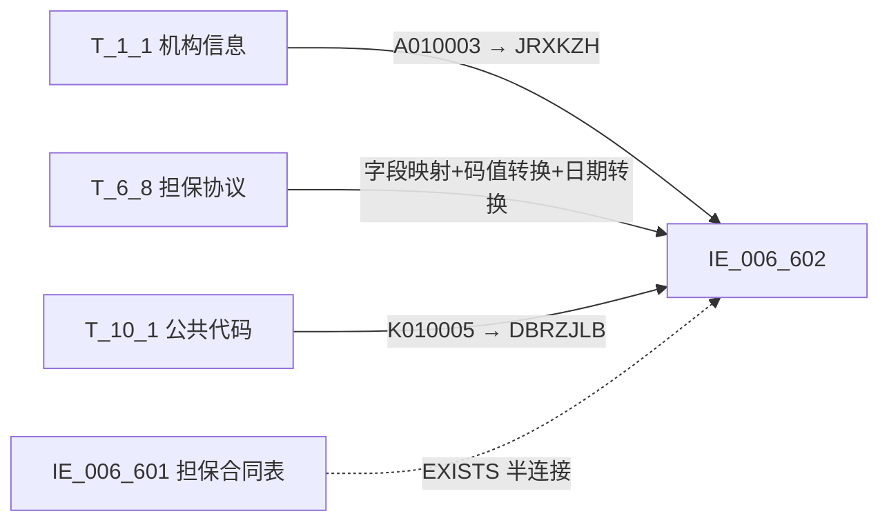

# 血缘-IE_006_602-表内外业务担保人-EAST5.0系统

## 页面边界

- 本页维护 `表内外业务担保人` 从一表通来源表到 EAST5.0 目标表 `IE_006_602` 的设计血缘。
- 证据为业务需求文档和 2026-05-09 重构后的 GBase SQL 草案，尚未经过生产运行验证。
- 数据表字段定义见 [[数据表-IE_006_602-表内外业务担保人-EAST5.0系统]]；业务报送口径见 [[报表-IE_006_602-表内外业务担保人-EAST5.0系统]]。

## 系统边界

- 起始系统：一表通系统
- 目标系统：EAST5.0系统
- 是否跨系统血缘：是
- 目标对象：`IE_006_602` `表内外业务担保人`

## 业务链路摘要

- 按 历史业务需求材料 的字段映射，将一表通来源表加工为 EAST5.0 `表内外业务担保人`。
- 表级规则：### 2.1 表级规则（Excel第 1002 行） 取报送日期为当月，通过取不为抵质押类型且在生成EAST《表内外业务担保合同表》中报送的担保合同号作为报送范围
- SQL 草案采用按 `P_DATA_DATE` 清理后重插，WHERE 条件过滤当月数据、排除抵质押类型、半连接 IE_006_601 确保仅报送已在担保合同表中存在的担保合同号。

## 直接上游对象

- [[数据表-T_1_1-机构信息-一表通系统]]：一表通来源表，提供金融许可证号 JRXKZH。
- [[数据表-T_6_8-担保协议-一表通系统]]：一表通来源表，提供担保协议全量字段。
- [[数据表-T_10_1-公共代码-一表通系统]]：一表通码值表，提供担保人证件类型中文含义。
- [[数据表-IE_006_601-表内外业务担保合同表-EAST5.0系统]]：EAST5.0 担保合同表，半连接确保担保合同号已在当批次报送。

## 直接下游对象

- 目标数据表：[[数据表-IE_006_602-表内外业务担保人-EAST5.0系统]]
- 报表业务口径页：[[报表-IE_006_602-表内外业务担保人-EAST5.0系统]]
- SQL 草案：`sql/EAST5.0系统/PROC_EAST_IE_006_602_BNWYWDBR_草案.sql`

## Nodes

- [[数据表-T_1_1-机构信息-一表通系统]]：一表通来源表。
- [[数据表-T_6_8-担保协议-一表通系统]]：一表通来源表。
- [[数据表-T_10_1-公共代码-一表通系统]]：一表通码值表。
- [[数据表-IE_006_601-表内外业务担保合同表-EAST5.0系统]]：EAST5.0 担保合同表（半连接依赖）。
- [[数据表-IE_006_602-表内外业务担保人-EAST5.0系统]]：EAST5.0 目标采集表。
- [[报表-IE_006_602-表内外业务担保人-EAST5.0系统]]：业务口径说明。

## 表级 Edge List

| From | To | Transform | Evidence |
| --- | --- | --- | --- |
| [[数据表-T_1_1-机构信息-一表通系统]] | [[数据表-IE_006_602-表内外业务担保人-EAST5.0系统]] | 按 `T_6_8.F080002 = T_1_1.A010001` 关联，提取 `A010003`（金融许可证号）装载 `JRXKZH` | ；SQL 草案 |
| [[数据表-T_6_8-担保协议-一表通系统]] | [[数据表-IE_006_602-表内外业务担保人-EAST5.0系统]] | 字段映射、码值 CASE 转换、日期格式转换、金额类型转换、WHERE 过滤后装载 `IE_006_602` | ；SQL 草案 |
| [[数据表-T_10_1-公共代码-一表通系统]] | [[数据表-IE_006_602-表内外业务担保人-EAST5.0系统]] | 按 `TRIM(F080010)=TRIM(K010004)` AND `TRIM(F080002)=TRIM(K010006)` AND 表名='担保协议' AND 字段名='担保人证件类型' 关联，取 K010005（中文含义）装载 DBRZJLB | ；SQL 草案 |
| [[数据表-IE_006_601-表内外业务担保合同表-EAST5.0系统]] | [[数据表-IE_006_602-表内外业务担保人-EAST5.0系统]] | EXISTS 半连接：仅取 601 中当批次已报送的担保合同号对应的担保人 | SQL 草案 |

## 字段级 Edge List

| 源对象 | 源字段 | 目标对象 | 目标字段 | 处理逻辑 | 关系类型 | 证据 |
| --- | --- | --- | --- | --- | --- | --- |
| [[数据表-T_1_1-机构信息-一表通系统]] | `A010003` | [[数据表-IE_006_602-表内外业务担保人-EAST5.0系统]] | `JRXKZH` | 直接映射，通过 `T_6_8.F080002 = T_1_1.A010001` 关联 | 直接映射 | SQL 草案 |
| [[数据表-T_6_8-担保协议-一表通系统]] | `F080001` | [[数据表-IE_006_602-表内外业务担保人-EAST5.0系统]] | `DBHTH` | 直接映射 | 直接映射 | SQL 草案 |
| [[数据表-T_6_8-担保协议-一表通系统]] | `F080002` | [[数据表-IE_006_602-表内外业务担保人-EAST5.0系统]] | `NBJGH` | 加工映射：`SUBSTR(F080002, 12)`，截取第12位起 | 加工映射 | SQL 草案 |
| [[数据表-T_6_8-担保协议-一表通系统]] | `F080008` | [[数据表-IE_006_602-表内外业务担保人-EAST5.0系统]] | `BZRLB` | 代码转换：'01'→'对公'/'02'→'个人'/ELSE→'' | 码值转换 | SQL 草案 |
| [[数据表-T_6_8-担保协议-一表通系统]] | `F080009` | [[数据表-IE_006_602-表内外业务担保人-EAST5.0系统]] | `BZRMC` | 直接映射 | 直接映射 | SQL 草案 |
| [[数据表-T_6_8-担保协议-一表通系统]] | `F080010` + [[数据表-T_10_1-公共代码-一表通系统]] `K010005` | [[数据表-IE_006_602-表内外业务担保人-EAST5.0系统]] | `DBRZJLB` | 码值转换：'00-XX'通配→'其他-XX'/公共代码有匹配取中文含义/ELSE→原值。关联条件：`TRIM(F080010)=TRIM(K010004)` AND `TRIM(F080002)=TRIM(K010006)` AND `K010002='担保协议'` AND `K010003='担保人证件类型'` | 码值转换 | SQL 草案 |
| [[数据表-T_6_8-担保协议-一表通系统]] | `F080011` | [[数据表-IE_006_602-表内外业务担保人-EAST5.0系统]] | `DBRZJHM` | 直接映射 | 直接映射 | SQL 草案 |
| [[数据表-T_6_8-担保协议-一表通系统]] | `F080017` | [[数据表-IE_006_602-表内外业务担保人-EAST5.0系统]] | `DBRJZCBZ` | 直接映射 | 直接映射 | SQL 草案 |
| [[数据表-T_6_8-担保协议-一表通系统]] | `F080018` | [[数据表-IE_006_602-表内外业务担保人-EAST5.0系统]] | `DBRJZC` | 类型转换：`CAST(NULLIF(TRIM(F080018), '') AS DECIMAL(20,2))` | 类型转换 | SQL 草案 |
| [[数据表-T_6_8-担保协议-一表通系统]] | `F080019` | [[数据表-IE_006_602-表内外业务担保人-EAST5.0系统]] | `DBHTZT` | 码值转换：'01'→'有效'/ELSE→'失效' | 码值转换 | SQL 草案 |
| [[数据表-T_6_8-担保协议-一表通系统]] | `F080024` | [[数据表-IE_006_602-表内外业务担保人-EAST5.0系统]] | `BBZ` | 直接映射 | 直接映射 | SQL 草案 |
| [[数据表-T_6_8-担保协议-一表通系统]] | `F080025` | [[数据表-IE_006_602-表内外业务担保人-EAST5.0系统]] | `CJRQ` | 格式转换：DATE→YYYYMMDD | 格式转换 | SQL 草案 |

## Graph-总览

## 回链检查

- 目标数据表页：已补 SQL 加工逻辑章节（码值映射、关联条件、WHERE 过滤）。
- 报表业务口径页：已创建并补充血缘回链。
- 一表通源表页（T_6_8/T_1_1/T_10_1）：需追加下游消费摘要（本次未做，留给模板批量更新）。
- 当前字段级血缘基于业务需求和 2026-05-09 重构后的 SQL 草案，未运行验证，状态为 `draft`。

## 变更与冲突

- 2026-05-09 重构：
  - ALL 字段级血缘已闭环（除 SENSITIVEFLAG/GSFZJG 为缺口字段置 NULL）。
  - NBJGH 源字段从 `待确认` 更正为 `T_6_8.F080002`（截取第12位）。
  - DBRZJLB 源字段从 `待确认` 更正为 `T_6_8.F080010 + T_10_1.K010005`。
  - BZRLB 从占位 `src.F080008` 改为完整 CASE 码值转换（'01'→'对公'/'02'→'个人'）。
  - DBHTZT 从占位 `src.F080019` 改为码值转换（'01'→'有效'/ELSE→'失效'）。
  - 新增 T_10_1 公共代码 LEFT JOIN 和 IE_006_601 EXISTS 半连接。
  - WHERE 条件从占位 TODO 改为完整过滤链。
- 未发现需要将 `validated` 页面降级的情况；本页保持 `draft`。

## Open Questions

- GBase 草案尚未执行语法校验和跑数校验。
- "不为抵质押类型"的具体码值集合需与业务确认：当前硬编码为 `NOT IN ('01', '02')`，对应 601 码值定义中的'抵押'(01)和'质押'(02)。
- IE_006_601 必须先于 IE_006_602 执行，否则 EXISTS 半连接会无数据返回。
- 外部监管实体页和填报说明 wikilink 待补。

## 缺口字段（2026-05-09）

| 目标字段 | 字段名称 | 缺口说明 |
| --- | --- | --- |
| `SENSITIVEFLAG` | 涉密标志 | 本地 DDL 存在，但业务需求映射表和 SQL 草案均未能确认来源，SQL 中置 NULL。 |
| `GSFZJG` | 归属分支机构 | 本地 DDL 存在，但业务需求映射表和 SQL 草案均未能确认来源，SQL 中置 NULL。 |
