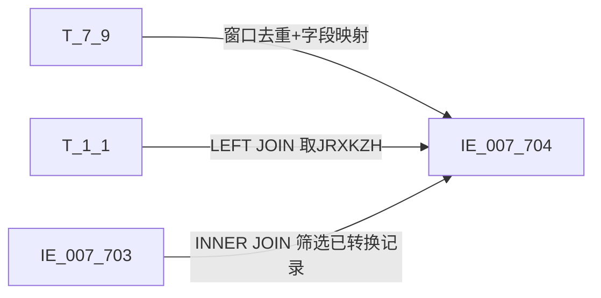

# 血缘-IE_007_704-资产转让关系表-EAST5.0系统

## 页面边界

- 本页维护 `资产转让关系表` 从一表通来源表到 EAST5.0 目标表 `IE_007_704` 的设计血缘。
- 证据为业务需求文档和工作区 GBase SQL 草案，尚未经过生产运行验证。
- 数据表字段定义见 [[数据表-IE_007_704-资产转让关系表-EAST5.0系统]]；业务报送口径见 [[报表-IE_007_704-资产转让关系表-EAST5.0系统]]。

## 系统边界

- 起始系统：一表通系统
- 目标系统：EAST5.0系统
- 是否跨系统血缘：是
- 目标对象：`IE_007_704` `资产转让关系表`

## 业务链路摘要

- 按 历史业务需求材料 的字段映射，将一表通来源表加工为 EAST5.0 `资产转让关系表`。
- 表级规则（2026-05-09 重构后已实现）：
  - 主表【一表通】【信贷资产转让】(T_7_9)，取按照【借据ID】、【资产转让方向】分组，采集日期降序排列后的第一条数据
  - 过滤条件：【信贷资产转让】.采集日期<=跑批日期
  - 左关联：【一表通】【机构信息】(T_1_1)：SUBSTR(TRIM(T_7_9.机构ID),12)=SUBSTR(TRIM(T_1_1.机构ID),12) AND T_1_1.采集日期=跑批日期
  - 内关联：【一表通转EAST】【信贷资产转让表】(IE_007_703)：IE_007_703.采集日期=跑批日期 AND IE_007_703.转让合同号=T_7_9.协议ID AND IE_007_703.资产转让方向=CASE T_7_9.资产转让方向 WHEN '01' THEN '转入' WHEN '02' THEN '转出' ELSE '' END

## 直接上游对象

- [[数据表-T_7_9-信贷资产转让-一表通系统]]：一表通来源表（主表）。
- [[数据表-T_1_1-机构信息-一表通系统]]：一表通机构信息表（左关联取金融许可证号）。
- [[数据表-IE_007_703-信贷资产转让表-EAST5.0系统]]：EAST5.0 信贷资产转让表（内关联，用于筛选已转换的记录）。

## 直接下游对象

- 目标数据表：[[数据表-IE_007_704-资产转让关系表-EAST5.0系统]]
- 报表业务口径页：[[报表-IE_007_704-资产转让关系表-EAST5.0系统]]
- SQL 草案：`sql/EAST5.0系统/PROC_EAST_IE_007_704_ZCZRGXB_草案.sql`

## Nodes

- [[数据表-T_7_9-信贷资产转让-一表通系统]]：一表通来源表（主表）。
- [[数据表-T_1_1-机构信息-一表通系统]]：一表通机构信息表（左关联）。
- [[数据表-IE_007_703-信贷资产转让表-EAST5.0系统]]：EAST5.0 信贷资产转让表（内关联）。
- [[数据表-IE_007_704-资产转让关系表-EAST5.0系统]]：EAST5.0 目标采集表。
- [[报表-IE_007_704-资产转让关系表-EAST5.0系统]]：业务口径说明。

## 表级 Edge List

| From | To | Transform | Evidence |
| --- | --- | --- | --- |
| [[数据表-T_7_9-信贷资产转让-一表通系统]] | [[数据表-IE_007_704-资产转让关系表-EAST5.0系统]] | 主表：窗口去重（按借据ID+资产转让方向分组，采集日期降序取第一条）；字段映射、码值/日期转换；过滤条件：采集日期<=跑批日期 | ；SQL 草案（2026-05-09 重构后） |
| [[数据表-T_1_1-机构信息-一表通系统]] | [[数据表-IE_007_704-资产转让关系表-EAST5.0系统]] | LEFT JOIN，按机构ID从第12位截取关联，取金融许可证号 JRXKZH；条件：T_1_1.采集日期=跑批日期 | ；SQL 草案（2026-05-09 重构后） |
| [[数据表-IE_007_703-信贷资产转让表-EAST5.0系统]] | [[数据表-IE_007_704-资产转让关系表-EAST5.0系统]] | INNER JOIN，按转让合同号+资产转让方向关联，筛选已转换记录；条件：IE_007_703.采集日期=跑批日期 | ；SQL 草案（2026-05-09 重构后） |

## 字段级 Edge List

| 源对象 | 源字段 | 目标对象 | 目标字段 | 处理逻辑 | 关系类型 | 证据 |
| --- | --- | --- | --- | --- | --- | --- |
| [[数据表-T_7_9-信贷资产转让-一表通系统]] | `G090001` | [[数据表-IE_007_704-资产转让关系表-EAST5.0系统]] | `ZRHTH` | 直接映射：协议ID -> 转让合同号 | 直接映射 | SQL 草案（2026-05-09 重构后） |
| [[数据表-T_7_9-信贷资产转让-一表通系统]] | `G090003` | [[数据表-IE_007_704-资产转让关系表-EAST5.0系统]] | `XDJJH` | 直接映射：细分资产ID（借据ID）-> 信贷借据号 | 直接映射 | SQL 草案（2026-05-09 重构后） |
| [[数据表-T_7_9-信贷资产转让-一表通系统]] | `G090002` | [[数据表-IE_007_704-资产转让关系表-EAST5.0系统]] | `NBJGH` | 加工映射：将机构ID从第12位开始截取 | 码值转换/格式转换 | SQL 草案（2026-05-09 重构后） |
| [[数据表-T_1_1-机构信息-一表通系统]] | `A010003` | [[数据表-IE_007_704-资产转让关系表-EAST5.0系统]] | `JRXKZH` | LEFT JOIN：按机构ID从第12位截取关联 T_1_1，取金融许可证号 | 转换映射 | SQL 草案（2026-05-09 重构后） |
| [[数据表-T_7_9-信贷资产转让-一表通系统]] | `G090008` | [[数据表-IE_007_704-资产转让关系表-EAST5.0系统]] | `ZRDKLX` | 直接映射，CAST 为 DECIMAL(20,2) | 直接映射 | SQL 草案（2026-05-09 重构后） |
| 缺口字段（无来源） | 无 | [[数据表-IE_007_704-资产转让关系表-EAST5.0系统]] | `SENSITIVEFLAG` | 无业务需求映射，SQL 置 NULL | 缺口字段 | SQL 草案（2026-05-09 重构后） |
| [[数据表-T_7_9-信贷资产转让-一表通系统]] | `G090019` | [[数据表-IE_007_704-资产转让关系表-EAST5.0系统]] | `BBZ` | 直接映射 | 直接映射 | SQL 草案（2026-05-09 重构后） |
| [[数据表-T_7_9-信贷资产转让-一表通系统]] | `G090007` | [[数据表-IE_007_704-资产转让关系表-EAST5.0系统]] | `ZRDKBJ` | 直接映射，CAST 为 DECIMAL(20,2) | 直接映射 | SQL 草案（2026-05-09 重构后） |
| [[数据表-T_7_9-信贷资产转让-一表通系统]] | `G090009` | [[数据表-IE_007_704-资产转让关系表-EAST5.0系统]] | `XDZCLX` | 码值转换：'01'→'个人贷款'，'02'→'对公贷款'，'03'→'信用卡贷款'，其他→'其他' | 码值转换/格式转换 | SQL 草案（2026-05-09 重构后） |
| 缺口字段（无来源） | 无 | [[数据表-IE_007_704-资产转让关系表-EAST5.0系统]] | `GSFZJG` | 无业务需求映射，SQL 置 NULL | 缺口字段 | SQL 草案（2026-05-09 重构后） |
| 入参 | `P_DATA_DATE` | [[数据表-IE_007_704-资产转让关系表-EAST5.0系统]] | `CJRQ` | 格式转换：跑批日期格式改为YYYYMMDD | 码值转换/格式转换 | SQL 草案（2026-05-09 重构后） |

## Graph-总览

## 回链检查

- 目标数据表页：已补 SQL 草案上游依赖摘要。
- 报表业务口径页：已创建或补充血缘回链。
- 一表通源表页：已补下游消费摘要。
- 当前字段级血缘基于业务需求和 SQL 草案（2026-05-09 重构后），未运行验证，状态为待确认。

## 变更与冲突

- 2026-05-09：依据《047_资产转让关系表.md》重构校准 SP，消除全部占位符。补齐 XDJJH（G090003）、JRXKZH（T_1_1）、CJRQ（P_DATA_DATE）、XDZCLX（码值CASE）、NBJGH（SUBSTR截取第12位）。补齐窗口去重（按借据ID+资产转让方向分组）、LEFT JOIN T_1_1、INNER JOIN IE_007_703。2个缺口字段（SENSITIVEFLAG/GSFZJG）保持 NULL。
- 未发现需要将 `validated` 页面降级的情况；本页保持 `draft`。

## Open Questions

- GBase 8a 中 ROW_NUMBER() 窗口函数嵌套子查询的兼容性待跑数验证。
- 内关联 IE_007_703 的 ZCZRFX 字段（资产转让方向）在目标 DDL 中存在，值映射为 '转入'/'转出'，需要确认与行内实际数据一致。
- 外部监管实体页 wikilink 待补。

## 缺口字段（2026-05-09）

| 目标字段 | 字段名称 | 缺口说明 |
| --- | --- | --- |
| `SENSITIVEFLAG` | 涉密标志 | 本地 DDL 存在，但业务需求映射表和 SQL 草案未能确认来源，字段级血缘待补。 |
| `GSFZJG` | 归属分支机构 | 本地 DDL 存在，但业务需求映射表和 SQL 草案未能确认来源，字段级血缘待补。 |
