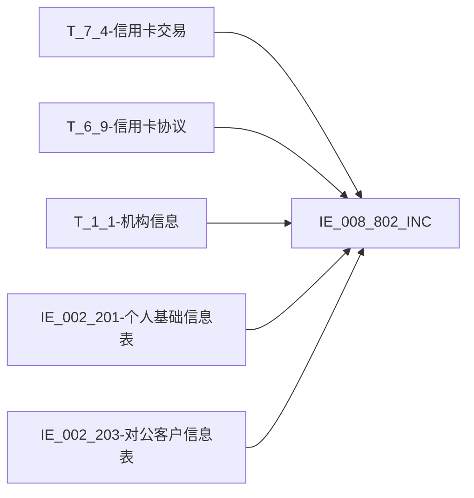

# 血缘-IE_008_802_INC-信用卡交易明细表-EAST5.0系统

## 页面边界

- 本页维护 `信用卡交易明细表` 从一表通来源表到 EAST5.0 目标表 `IE_008_802_INC` 的设计血缘。
- 证据为业务需求文档和工作区 GBase SQL 草案，尚未经过生产运行验证。
- 数据表字段定义见 [[数据表-IE_008_802_INC-信用卡交易明细表-EAST5.0系统]]；业务报送口径见 [[报表-IE_008_802_INC-信用卡交易明细表-EAST5.0系统]]。

## 系统边界

- 起始系统：一表通系统
- 目标系统：EAST5.0系统
- 是否跨系统血缘：是
- 目标对象：`IE_008_802_INC` `信用卡交易明细表`

## 业务链路摘要

- 按 历史业务需求材料 的字段映射，将一表通来源表加工为 EAST5.0 `信用卡交易明细表`。
- 表级规则：### 2.1 表级规则（Excel第 1182 行） 直接映射
- SQL 草案采用按 `P_DATA_DATE` 清理后重插或增量边界过滤的方式；具体投产方式待验证。
- **2026-05-09 重构校准**：消除全部 ON 1=1、WHERE 1=1 和 NULL 占位，补齐 JOIN 条件、WHERE 过滤、6 个码值 CASE 转换、日期格式转换、金额 CAST、客户名称/证件多源合并。

## 直接上游对象

- [[数据表-T_7_4-信用卡交易-一表通系统]]：一表通来源表，主交易表。
- [[数据表-T_6_9-信用卡协议-一表通系统]]：一表通来源表，用于卡号→机构ID映射。
- [[数据表-T_1_1-机构信息-一表通系统]]：一表通来源表，用于获取金融许可证号/银行机构名称。
- `IE_002_201` 个人基础信息表：EAST5.0 表，用于获取个人客户姓名/证件。
- `IE_002_203` 对公客户信息表：EAST5.0 表，用于获取对公客户名称/证件。

## 直接下游对象

- 目标数据表：[[数据表-IE_008_802_INC-信用卡交易明细表-EAST5.0系统]]
- 报表业务口径页：[[报表-IE_008_802_INC-信用卡交易明细表-EAST5.0系统]]
- SQL 草案：`sql/EAST5.0系统/PROC_EAST_IE_008_802_INC_XYKJYMXB_草案.sql`

## Nodes

- [[数据表-T_7_4-信用卡交易-一表通系统]]：一表通来源表。
- [[数据表-T_1_1-机构信息-一表通系统]]：一表通来源表。
- [[数据表-T_6_9-信用卡协议-一表通系统]]：一表通来源表。
- `IE_002_201` (个人基础信息表)：EAST5.0 客户信息表。
- `IE_002_203` (对公客户信息表)：EAST5.0 客户信息表。
- [[数据表-IE_008_802_INC-信用卡交易明细表-EAST5.0系统]]：EAST5.0 目标采集表。
- [[报表-IE_008_802_INC-信用卡交易明细表-EAST5.0系统]]：业务口径说明。

## 表级 Edge List

| From | To | Transform | Evidence |
| --- | --- | --- | --- |
| [[数据表-T_7_4-信用卡交易-一表通系统]] | [[数据表-IE_008_802_INC-信用卡交易明细表-EAST5.0系统]] | 字段映射、关联、过滤、码值/日期转换后装载 `IE_008_802_INC` | ；SQL 草案（2026-05-09 重构） |
| [[数据表-T_1_1-机构信息-一表通系统]] | [[数据表-IE_008_802_INC-信用卡交易明细表-EAST5.0系统]] | 通过 T_6_9 机构ID→内部机构号关联，取金融许可证号/银行机构名称 | ；SQL 草案（2026-05-09 重构） |
| [[数据表-T_6_9-信用卡协议-一表通系统]] | [[数据表-IE_008_802_INC-信用卡交易明细表-EAST5.0系统]] | 卡号关联获取机构ID(截取第12位为内部机构号)，关联机构信息 | ；SQL 草案（2026-05-09 重构） |
| `IE_002_201` (个人基础信息表) | [[数据表-IE_008_802_INC-信用卡交易明细表-EAST5.0系统]] | LEFT JOIN 获取个人客户姓名(KHXM)/证件类别(ZJLB)/证件号码(ZJHM)，COALESCE 回退 | ；SQL 草案（2026-05-09 重构） |
| `IE_002_203` (对公客户信息表) | [[数据表-IE_008_802_INC-信用卡交易明细表-EAST5.0系统]] | LEFT JOIN 获取对公客户名称(KHMC)/证件类别(ZJLB)/证件号码(ZJHM)，优先使用 | ；SQL 草案（2026-05-09 重构） |

## 字段级 Edge List

| 源对象 | 源字段 | 目标对象 | 目标字段 | 处理逻辑 | 关系类型 | 证据 |
| --- | --- | --- | --- | --- | --- | --- |
| [[数据表-T_7_4-信用卡交易-一表通系统]] | `G040019` | [[数据表-IE_008_802_INC-信用卡交易明细表-EAST5.0系统]] | `DFXH` | 直接映射 | 直接映射 | ；SQL 草案（2026-05-09 重构） |
| [[数据表-T_7_4-信用卡交易-一表通系统]] | `G040023` | [[数据表-IE_008_802_INC-信用卡交易明细表-EAST5.0系统]] | `SHMC` | 直接映射 | 直接映射 | 同上 |
| [[数据表-T_7_4-信用卡交易-一表通系统]] | `G040024` | [[数据表-IE_008_802_INC-信用卡交易明细表-EAST5.0系统]] | `XSXXJYBZ` | 加工映射：'01'→'线上'，'02'→'线下'，ELSE→原值 | 加工映射 | 同上 |
| [[数据表-T_7_4-信用卡交易-一表通系统]] | `G040014` | [[数据表-IE_008_802_INC-信用卡交易明细表-EAST5.0系统]] | `SXFJE` | 直接映射，CAST(NULLIF(TRIM(...),'') AS DECIMAL(20,2)) | 直接映射 | 同上 |
| [[数据表-T_7_4-信用卡交易-一表通系统]] | `G040036` | [[数据表-IE_008_802_INC-信用卡交易明细表-EAST5.0系统]] | `JYZDRQ` | 直接映射，DATE_FORMAT→YYYYMMDD | 直接映射 | 同上 |
| `IE_002_203` (对公客户信息表) | `ZJLB` | [[数据表-IE_008_802_INC-信用卡交易明细表-EAST5.0系统]] | `ZJLB` | 加工映射：优先对公客户信息表.证件类别，COALESCE(s4.ZJLB, s3.ZJLB) | 加工映射 | 同上 |
| `IE_002_201` (个人基础信息表) | `ZJLB` | [[数据表-IE_008_802_INC-信用卡交易明细表-EAST5.0系统]] | `ZJLB` | 加工映射：回退个人基础信息表.证件类别 | 加工映射 | 同上 |
| [[数据表-T_7_4-信用卡交易-一表通系统]] | `G040009` | [[数据表-IE_008_802_INC-信用卡交易明细表-EAST5.0系统]] | `KPJYLX` | 加工映射：'01'→'消费交易'，'02'→'现金交易'，'03'→'还款交易'，'04'→'转账交易'，'00-XX'→'其他-XX'，ELSE→原值 | 加工映射 | 同上 |
| 缺口字段(无来源) | - | [[数据表-IE_008_802_INC-信用卡交易明细表-EAST5.0系统]] | `SENSITIVEFLAG` | 缺口字段，业务需求映射表未给来源，置NULL | 缺口 | 同上 |
| [[数据表-T_7_4-信用卡交易-一表通系统]] | `G040007` | [[数据表-IE_008_802_INC-信用卡交易明细表-EAST5.0系统]] | `HXJYRQ` | 加工映射：DATE_FORMAT→YYYYMMDD | 加工映射 | 同上 |
| [[数据表-T_7_4-信用卡交易-一表通系统]] | `G040015` | [[数据表-IE_008_802_INC-信用卡交易明细表-EAST5.0系统]] | `BZ` | 直接映射 | 直接映射 | 同上 |
| [[数据表-T_1_1-机构信息-一表通系统]] | `A010003` | [[数据表-IE_008_802_INC-信用卡交易明细表-EAST5.0系统]] | `JRXKZH` | 加工映射：用卡号关联信用卡协议取机构ID(截取第12位)，关联机构信息取金融许可证号 | 加工映射 | 同上 |
| [[数据表-T_7_4-信用卡交易-一表通系统]] | `G040013` | [[数据表-IE_008_802_INC-信用卡交易明细表-EAST5.0系统]] | `MXKMMC` | 直接映射 | 直接映射 | 同上 |
| [[数据表-T_7_4-信用卡交易-一表通系统]] | `G040001` | [[数据表-IE_008_802_INC-信用卡交易明细表-EAST5.0系统]] | `JYXLH` | 直接映射 | 直接映射 | 同上 |
| [[数据表-T_1_1-机构信息-一表通系统]] | `A010005` | [[数据表-IE_008_802_INC-信用卡交易明细表-EAST5.0系统]] | `YHJGMC` | 加工映射：同JRXKZH关联路径取银行机构名称 | 加工映射 | 同上 |
| [[数据表-T_7_4-信用卡交易-一表通系统]] | `G040004` | [[数据表-IE_008_802_INC-信用卡交易明细表-EAST5.0系统]] | `KHTYBH` | 直接映射 | 直接映射 | 同上 |
| `IE_002_203` (对公客户信息表) | `KHMC` | [[数据表-IE_008_802_INC-信用卡交易明细表-EAST5.0系统]] | `KHMC` | 加工映射：COALESCE(s4.KHMC, s3.KHXM) | 加工映射 | 同上 |
| `IE_002_201` (个人基础信息表) | `KHXM` | [[数据表-IE_008_802_INC-信用卡交易明细表-EAST5.0系统]] | `KHMC` | 加工映射：回退个人客户姓名 | 加工映射 | 同上 |
| `IE_002_203` (对公客户信息表) | `ZJHM` | [[数据表-IE_008_802_INC-信用卡交易明细表-EAST5.0系统]] | `ZJHM` | 加工映射：COALESCE(s4.ZJHM, s3.ZJHM) | 加工映射 | 同上 |
| `IE_002_201` (个人基础信息表) | `ZJHM` | [[数据表-IE_008_802_INC-信用卡交易明细表-EAST5.0系统]] | `ZJHM` | 加工映射：回退个人证件号码 | 加工映射 | 同上 |
| [[数据表-T_7_4-信用卡交易-一表通系统]] | `G040003` | [[数据表-IE_008_802_INC-信用卡交易明细表-EAST5.0系统]] | `XYKZH` | 直接映射 | 直接映射 | 同上 |
| [[数据表-T_7_4-信用卡交易-一表通系统]] | `G040002` | [[数据表-IE_008_802_INC-信用卡交易明细表-EAST5.0系统]] | `KH` | 直接映射 | 直接映射 | 同上 |
| [[数据表-T_7_4-信用卡交易-一表通系统]] | `G040021` | [[数据表-IE_008_802_INC-信用卡交易明细表-EAST5.0系统]] | `JYJDBZ` | 加工映射：'01'→'借'，'02'→'贷'，ELSE→原值 | 加工映射 | 同上 |
| [[数据表-T_7_4-信用卡交易-一表通系统]] | `G040008` | [[数据表-IE_008_802_INC-信用卡交易明细表-EAST5.0系统]] | `HXJYSJ` | 加工映射：REPLACE(CAST(... AS CHAR), ':', '')，HH:MM:SS→HHMMSS | 加工映射 | 同上 |
| [[数据表-T_7_4-信用卡交易-一表通系统]] | `G040011` | [[数据表-IE_008_802_INC-信用卡交易明细表-EAST5.0系统]] | `ZHYE` | 直接映射，CAST(NULLIF(TRIM(...),'') AS DECIMAL(20,2)) | 直接映射 | 同上 |
| [[数据表-T_7_4-信用卡交易-一表通系统]] | `G040017` | [[数据表-IE_008_802_INC-信用卡交易明细表-EAST5.0系统]] | `DFZH` | 直接映射 | 直接映射 | 同上 |
| [[数据表-T_7_4-信用卡交易-一表通系统]] | `G040018` | [[数据表-IE_008_802_INC-信用卡交易明细表-EAST5.0系统]] | `DFHM` | 直接映射 | 直接映射 | 同上 |
| [[数据表-T_7_4-信用卡交易-一表通系统]] | `G040020` | [[数据表-IE_008_802_INC-信用卡交易明细表-EAST5.0系统]] | `DFXM` | 直接映射 | 直接映射 | 同上 |
| [[数据表-T_7_4-信用卡交易-一表通系统]] | `G040022` | [[数据表-IE_008_802_INC-信用卡交易明细表-EAST5.0系统]] | `SHBH` | 直接映射 | 直接映射 | 同上 |
| [[数据表-T_7_4-信用卡交易-一表通系统]] | `G040031` | [[数据表-IE_008_802_INC-信用卡交易明细表-EAST5.0系统]] | `ZY` | 直接映射 | 直接映射 | 同上 |
| [[数据表-T_7_4-信用卡交易-一表通系统]] | `G040016` | [[数据表-IE_008_802_INC-信用卡交易明细表-EAST5.0系统]] | `SXFBZ` | 直接映射 | 直接映射 | 同上 |
| [[数据表-T_7_4-信用卡交易-一表通系统]] | `G040037` | [[数据表-IE_008_802_INC-信用卡交易明细表-EAST5.0系统]] | `ZCHKRQ` | 直接映射，DATE_FORMAT→YYYYMMDD | 直接映射 | 同上 |
| [[数据表-T_7_4-信用卡交易-一表通系统]] | `G040026` | [[数据表-IE_008_802_INC-信用卡交易明细表-EAST5.0系统]] | `IPDZ` | 直接映射 | 直接映射 | 同上 |
| [[数据表-T_7_4-信用卡交易-一表通系统]] | `G040027` | [[数据表-IE_008_802_INC-信用卡交易明细表-EAST5.0系统]] | `MACDZ` | 直接映射 | 直接映射 | 同上 |
| 参数 P_DATA_DATE | - | [[数据表-IE_008_802_INC-信用卡交易明细表-EAST5.0系统]] | `CJRQ` | 默认值：报告日，格式 yyyymmdd | 加工映射 | 同上 |
| 缺口字段(无来源) | - | [[数据表-IE_008_802_INC-信用卡交易明细表-EAST5.0系统]] | `DFKHLB` | 缺口字段，业务需求映射表未给来源，置NULL | 缺口 | 同上 |
| [[数据表-T_7_4-信用卡交易-一表通系统]] | `G040034` | [[数据表-IE_008_802_INC-信用卡交易明细表-EAST5.0系统]] | `TQJQBZ` | 加工映射：'1'→'是'，'0'→'否'，ELSE→原值 | 加工映射 | 同上 |
| [[数据表-T_7_4-信用卡交易-一表通系统]] | `G040030` | [[数据表-IE_008_802_INC-信用卡交易明细表-EAST5.0系统]] | `JYQD` | 加工映射：'01'→'柜面'，'02'→'ATM'，'03'→'VTM'，'04'→'POS'，'05'→'网银'，'06'→'手机银行'，LEFT=07-→'第三方支付-XX'，'08'→'银联交易'，LEFT=00-→'其他-XX'，ELSE→原值 | 加工映射 | 同上 |
| [[数据表-T_7_4-信用卡交易-一表通系统]] | `G040035` | [[数据表-IE_008_802_INC-信用卡交易明细表-EAST5.0系统]] | `BBZ` | 直接映射 | 直接映射 | 同上 |
| [[数据表-T_6_9-信用卡协议-一表通系统]] | `F090002` | [[数据表-IE_008_802_INC-信用卡交易明细表-EAST5.0系统]] | `NBJGH` | 加工映射：SUBSTR(TRIM(s1.F090002), 12)，从第12位截取 | 加工映射 | 同上 |
| 缺口字段(无来源) | - | [[数据表-IE_008_802_INC-信用卡交易明细表-EAST5.0系统]] | `GSFZJG` | 缺口字段，业务需求映射表未给来源，置NULL | 缺口 | 同上 |
| [[数据表-T_7_4-信用卡交易-一表通系统]] | `G040012` | [[数据表-IE_008_802_INC-信用卡交易明细表-EAST5.0系统]] | `MXKMBH` | 直接映射 | 直接映射 | 同上 |
| 缺口字段(无来源) | - | [[数据表-IE_008_802_INC-信用卡交易明细表-EAST5.0系统]] | `KHLB` | 缺口字段，业务需求映射表未给来源，置NULL | 缺口 | 同上 |
| [[数据表-T_7_4-信用卡交易-一表通系统]] | `G040010` | [[数据表-IE_008_802_INC-信用卡交易明细表-EAST5.0系统]] | `JYJE` | 直接映射，CAST(NULLIF(TRIM(...),'') AS DECIMAL(20,2)) | 直接映射 | 同上 |
| [[数据表-T_7_4-信用卡交易-一表通系统]] | `G040025` | [[数据表-IE_008_802_INC-信用卡交易明细表-EAST5.0系统]] | `FQFKBZ` | 加工映射：NULLIF(TRIM(...),'') IS NOT NULL→'是'，ELSE→'否' | 加工映射 | 同上 |

## Graph-总览

## 回链检查

- 目标数据表页：已补 SQL 草案上游依赖摘要或待本次批处理补齐。
- 报表业务口径页：已创建或补充血缘回链。
- 一表通源表页：已补下游消费摘要或待本次批处理补齐。
- 当前字段级血缘基于业务需求和 SQL 草案，未运行验证，状态为待确认。

## 变更与冲突

- 2026-05-09 重构校准：消除全部 ON 1=1 / WHERE 1=1 / NULL AS 占位；补齐 JOIN 条件（4 个 LEFT JOIN）、WHERE 过滤（增量日期+排除已核销卡）、6 个码值 CASE、日期格式转换、客户信息多源合并、机构相关字段补齐；4 个缺口字段（SENSITIVEFLAG/DFKHLB/GSFZJG/KHLB）置 NULL。
- 本次为新增设计血缘或补齐草案血缘，不覆盖已验证生产血缘。
- 未发现需要将 `validated` 页面降级的情况；本页保持 `draft`。

## Open Questions

- GBase 草案中的复杂 JOIN、窗口去重、终态纳入和增量边界需要人工复核。
- 部分字段的码值 CASE 在草案中仍为待补，需要结合外部填报说明和跑数结果闭环。
- 外部监管实体页 wikilink 待补。
- WHERE 过滤当前仅按增量日期（上一采集日至采集日）+ 排除已核销卡；报送要求中"不包括查询交易"需要业务确认排除哪些交易类型码值，当前尚未实现查询交易过滤。
- 多源客户信息合并（对公 vs 个人）的 COALESCE 优先级策略需要业务方确认。

## 缺口字段（2026-05-09）

| 目标字段 | 字段名称 | 缺口说明 |
| --- | --- | --- |
| `SENSITIVEFLAG` | 涉密标志 | 本地 DDL 存在，但业务需求映射表和 SQL 草案未能确认来源，字段级血缘待补。 |
| `DFKHLB` | 对方客户类别 | 本地 DDL 存在，但业务需求映射表和 SQL 草案未能确认来源，字段级血缘待补。 |
| `GSFZJG` | 归属分支机构 | 本地 DDL 存在，但业务需求映射表和 SQL 草案未能确认来源，字段级血缘待补。 |
| `KHLB` | 客户类别 | 本地 DDL 存在，但业务需求映射表和 SQL 草案未能确认来源，字段级血缘待补。 |
