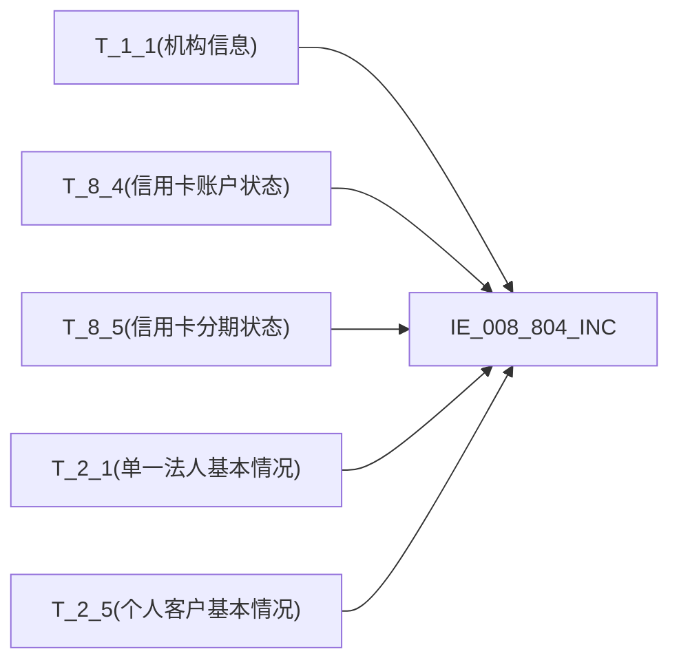

# 血缘-IE_008_804_INC-信用卡分期业务表-EAST5.0系统

## 页面边界

- 本页维护 `信用卡分期业务表` 从一表通来源表到 EAST5.0 目标表 `IE_008_804_INC` 的设计血缘。
- 证据为业务需求文档和工作区 GBase SQL 草案，尚未经过生产运行验证。
- 数据表字段定义见 [[数据表-IE_008_804_INC-信用卡分期业务表-EAST5.0系统]]；业务报送口径见 [[报表-IE_008_804_INC-信用卡分期业务表-EAST5.0系统]]。

## 系统边界

- 起始系统：一表通系统
- 目标系统：EAST5.0系统
- 是否跨系统血缘：是
- 目标对象：`IE_008_804_INC` `信用卡分期业务表`

## 业务链路摘要

- 按 历史业务需求材料 的字段映射，将一表通来源表加工为 EAST5.0 `信用卡分期业务表`。
- 表级规则：### 2.1 表级规则（Excel第 1261 行） 取分期办理日期在当月的
- SQL 草案采用按 `P_DATA_DATE` 清理后重插的方式；2026-05-10 重构校准已消除全部 ON 1=1 和 WHERE 1=1 占位，补齐码值 CASE、JOIN、日期转换和 WHERE 过滤。

## 直接上游对象

- [[数据表-T_1_1-机构信息-一表通系统]]：一表通来源表。
- [[数据表-T_8_4-信用卡账户状态-一表通系统]]：一表通来源表。
- [[数据表-T_8_5-信用卡分期状态-一表通系统]]：一表通来源表。
- [[数据表-T_2_1-单一法人基本情况-一表通系统]]：一表通来源表（对公客户信息）。
- [[数据表-T_2_5-个人客户基本情况-一表通系统]]：一表通来源表（个人基础信息）。

## 直接下游对象

- 目标数据表：[[数据表-IE_008_804_INC-信用卡分期业务表-EAST5.0系统]]
- 报表业务口径页：[[报表-IE_008_804_INC-信用卡分期业务表-EAST5.0系统]]
- SQL 草案：`sql/EAST5.0系统/PROC_EAST_IE_008_804_INC_XYKFQYWB_草案.sql`

## Nodes

- [[数据表-T_1_1-机构信息-一表通系统]]：一表通来源表。
- [[数据表-T_8_4-信用卡账户状态-一表通系统]]：一表通来源表。
- [[数据表-T_8_5-信用卡分期状态-一表通系统]]：一表通来源表。
- [[数据表-T_2_1-单一法人基本情况-一表通系统]]：一表通来源表（对公客户信息）。
- [[数据表-T_2_5-个人客户基本情况-一表通系统]]：一表通来源表（个人基础信息）。
- [[数据表-IE_008_804_INC-信用卡分期业务表-EAST5.0系统]]：EAST5.0 目标采集表。
- [[报表-IE_008_804_INC-信用卡分期业务表-EAST5.0系统]]：业务口径说明。

## 表级 Edge List

| From | To | Transform | Evidence |
| --- | --- | --- | --- |
| [[数据表-T_1_1-机构信息-一表通系统]] | [[数据表-IE_008_804_INC-信用卡分期业务表-EAST5.0系统]] | 字段映射、关联、过滤、码值/日期转换后装载 `IE_008_804_INC` | ；SQL 草案 |
| [[数据表-T_8_4-信用卡账户状态-一表通系统]] | [[数据表-IE_008_804_INC-信用卡分期业务表-EAST5.0系统]] | 字段映射、关联、过滤、码值/日期转换后装载 `IE_008_804_INC` | ；SQL 草案 |
| [[数据表-T_8_5-信用卡分期状态-一表通系统]] | [[数据表-IE_008_804_INC-信用卡分期业务表-EAST5.0系统]] | 主表，提供 24 个字段直接映射或加工 | ；SQL 草案 |
| [[数据表-T_2_1-单一法人基本情况-一表通系统]] | [[数据表-IE_008_804_INC-信用卡分期业务表-EAST5.0系统]] | LEFT JOIN 取对公客户名称、证件信息 | ；SQL 草案 |
| [[数据表-T_2_5-个人客户基本情况-一表通系统]] | [[数据表-IE_008_804_INC-信用卡分期业务表-EAST5.0系统]] | LEFT JOIN 取个人客户姓名、证件信息 | ；SQL 草案 |

## 字段级 Edge List

| 源对象 | 源字段 | 目标对象 | 目标字段 | 处理逻辑 | 关系类型 | 证据 |
| --- | --- | --- | --- | --- | --- | --- |
| [[数据表-T_1_1-机构信息-一表通系统]] | `A010003` | [[数据表-IE_008_804_INC-信用卡分期业务表-EAST5.0系统]] | `JRXKZH` | 加工映射：T_8_5.H050024 -> T_8_4.H040003, T_8_4.H040043 截取第12位 -> T_1_1.A010002, 取 T_1_1.A010003（全值，不截取） | 加工映射 | ；SQL 草案 |
| [[数据表-T_8_4-信用卡账户状态-一表通系统]] | `H040043` | [[数据表-IE_008_804_INC-信用卡分期业务表-EAST5.0系统]] | `NBJGH` | 加工映射：T_8_5.H050024 -> T_8_4.H040003, 取 T_8_4.H040043 从第12位开始截取至最后 | 加工映射 | ；SQL 草案 |
| [[数据表-T_1_1-机构信息-一表通系统]] | `A010005` | [[数据表-IE_008_804_INC-信用卡分期业务表-EAST5.0系统]] | `YHJGMC` | 加工映射：T_8_5.H050024 -> T_8_4.H040003, T_8_4.H040043 截取第12位 -> T_1_1.A010002, 取 T_1_1.A010005（全值，不截取） | 加工映射 | ；SQL 草案 |
| [[数据表-T_8_5-信用卡分期状态-一表通系统]] | `H050001` | [[数据表-IE_008_804_INC-信用卡分期业务表-EAST5.0系统]] | `FQYWBH` | 直接映射 | 直接映射 | ；SQL 草案 |
| [[数据表-T_8_5-信用卡分期状态-一表通系统]] | `H050004` | [[数据表-IE_008_804_INC-信用卡分期业务表-EAST5.0系统]] | `KHTYBH` | 直接映射 | 直接映射 | ；SQL 草案 |
| [[数据表-T_2_1-单一法人基本情况-一表通系统]] | `B010003` | [[数据表-IE_008_804_INC-信用卡分期业务表-EAST5.0系统]] | `KHMC` | 加工映射：T_8_5.H050004 关联 T_2_1.B010001 / T_2_5.B050001，COALESCE(corp.B010003, ind.B050003) 取不为空的值 | 加工映射 | ；SQL 草案 |
| [[数据表-T_2_5-个人客户基本情况-一表通系统]] | `B050003` | [[数据表-IE_008_804_INC-信用卡分期业务表-EAST5.0系统]] | `KHMC` | 加工映射：T_8_5.H050004 关联 T_2_1.B010001 / T_2_5.B050001，COALESCE(corp.B010003, ind.B050003) 取不为空的值 | 加工映射 | ；SQL 草案 |
| [[数据表-T_2_1-单一法人基本情况-一表通系统]] | `B010001` | [[数据表-IE_008_804_INC-信用卡分期业务表-EAST5.0系统]] | `ZJLB` | 加工映射：若 corp.B010001 非空则'营业执照'，否则按 ind 各证件字段判断，均空则'无证件' | 加工映射 | ；SQL 草案 |
| [[数据表-T_2_5-个人客户基本情况-一表通系统]] | `B050005`/`B050006`/`B050007` | [[数据表-IE_008_804_INC-信用卡分期业务表-EAST5.0系统]] | `ZJLB` | 加工映射：若 ind.B050005 非空则'身份证'，B050006 非空则'护照'，B050007 非空则取 B050007 值，均空则'无证件' | 加工映射 | ；SQL 草案 |
| [[数据表-T_2_1-单一法人基本情况-一表通系统]] | `B010004` | [[数据表-IE_008_804_INC-信用卡分期业务表-EAST5.0系统]] | `ZJHM` | 加工映射：COALESCE(corp.B010004, ind.B050005, ind.B050006, ind.B050008) | 加工映射 | ；SQL 草案 |
| [[数据表-T_2_5-个人客户基本情况-一表通系统]] | `B050005`/`B050006`/`B050008` | [[数据表-IE_008_804_INC-信用卡分期业务表-EAST5.0系统]] | `ZJHM` | 加工映射：COALESCE(corp.B010004, ind.B050005, ind.B050006, ind.B050008) | 加工映射 | ；SQL 草案 |
| [[数据表-T_8_5-信用卡分期状态-一表通系统]] | `H050024` | [[数据表-IE_008_804_INC-信用卡分期业务表-EAST5.0系统]] | `XYKZH` | 直接映射 | 直接映射 | ；SQL 草案 |
| [[数据表-T_8_5-信用卡分期状态-一表通系统]] | `H050005` | [[数据表-IE_008_804_INC-信用卡分期业务表-EAST5.0系统]] | `FQJYLX` | 加工映射：'01'->'普通分期总额','02'->'普通分期单笔','03'->'专项分期总额','04'->'专项分期单笔','05'->'现金分期总额','06'->'现金分期单笔','00-XX'->'其他-XX',ELSE->原值 | 加工映射 | ；SQL 草案 |
| [[数据表-T_8_5-信用卡分期状态-一表通系统]] | `H050006` | [[数据表-IE_008_804_INC-信用卡分期业务表-EAST5.0系统]] | `FQYWLX` | 加工映射：'01'->'账单分期','02'->'单笔消费分期','03'->'现金分期','04'->'POS商户分期','05'->'邮购电购分期','06'->'汽车分期','07'->'家装分期','08'->'车位分期','09'->'教育分期','10'->'婚庆分期','00-XX'->'其他-XX',ELSE->原值 | 加工映射 | ；SQL 草案 |
| [[数据表-T_8_5-信用卡分期状态-一表通系统]] | `H050013` | [[数据表-IE_008_804_INC-信用卡分期业务表-EAST5.0系统]] | `BLFQRQ` | 加工映射：DATE_FORMAT('%Y%m%d') 转成 YYYYMMDD | 加工映射 | ；SQL 草案 |
| [[数据表-T_8_5-信用卡分期状态-一表通系统]] | `H050014` | [[数据表-IE_008_804_INC-信用卡分期业务表-EAST5.0系统]] | `BLFQSJ` | 加工映射：REPLACE(CAST AS CHAR(8), ':', '') 删除":"，转成 HHMMSS | 加工映射 | ；SQL 草案 |
| [[数据表-T_8_5-信用卡分期状态-一表通系统]] | `H050007` | [[数据表-IE_008_804_INC-信用卡分期业务表-EAST5.0系统]] | `BZ` | 直接映射 | 直接映射 | ；SQL 草案 |
| [[数据表-T_8_5-信用卡分期状态-一表通系统]] | `H050008` | [[数据表-IE_008_804_INC-信用卡分期业务表-EAST5.0系统]] | `FQZED` | 直接映射，CAST NULLIF->DECIMAL(20,2) | 直接映射 | ；SQL 草案 |
| [[数据表-T_8_5-信用卡分期状态-一表通系统]] | `H050009` | [[数据表-IE_008_804_INC-信用卡分期业务表-EAST5.0系统]] | `KYFQED` | 直接映射，CAST NULLIF->DECIMAL(20,2) | 直接映射 | ；SQL 草案 |
| [[数据表-T_8_5-信用卡分期状态-一表通系统]] | `H050010` | [[数据表-IE_008_804_INC-信用卡分期业务表-EAST5.0系统]] | `FQJE` | 直接映射，CAST NULLIF->DECIMAL(20,2) | 直接映射 | ；SQL 草案 |
| [[数据表-T_8_5-信用卡分期状态-一表通系统]] | `H050015` | [[数据表-IE_008_804_INC-信用卡分期业务表-EAST5.0系统]] | `FQZRKH` | 直接映射 | 直接映射 | ；SQL 草案 |
| [[数据表-T_8_5-信用卡分期状态-一表通系统]] | `H050020` | [[数据表-IE_008_804_INC-信用卡分期业务表-EAST5.0系统]] | `FQZRHM` | 直接映射 | 直接映射 | ；SQL 草案 |
| [[数据表-T_8_5-信用卡分期状态-一表通系统]] | `H050016` | [[数据表-IE_008_804_INC-信用卡分期业务表-EAST5.0系统]] | `GXHFQBZ` | 加工映射：CASE WHEN '1' THEN '是' ELSE '否' END | 加工映射 | ；SQL 草案 |
| [[数据表-T_8_5-信用卡分期状态-一表通系统]] | `H050012` | [[数据表-IE_008_804_INC-信用卡分期业务表-EAST5.0系统]] | `FQLL` | 直接映射，CAST NULLIF->DECIMAL(20,6) | 直接映射 | ；SQL 草案 |
| [[数据表-T_8_5-信用卡分期状态-一表通系统]] | `H050011` | [[数据表-IE_008_804_INC-信用卡分期业务表-EAST5.0系统]] | `FQQS` | 直接映射，CAST NULLIF->SIGNED INT | 直接映射 | ；SQL 草案 |
| [[数据表-T_8_5-信用卡分期状态-一表通系统]] | `H050023` | [[数据表-IE_008_804_INC-信用卡分期业务表-EAST5.0系统]] | `BBZ` | 直接映射 | 直接映射 | ；SQL 草案 |
| 参数 `P_DATA_DATE` | `P_DATA_DATE` | [[数据表-IE_008_804_INC-信用卡分期业务表-EAST5.0系统]] | `CJRQ` | 默认值：报告日，格式为 YYYYMMDD，直接赋参数 P_DATA_DATE | 加工映射 | ；SQL 草案 |

## Graph-总览

## 回链检查

- 目标数据表页：已补 SQL 草案上游依赖摘要。
- 报表业务口径页：已创建或补充血缘回链。
- 一表通源表页：已补下游消费摘要（T_2_1/T_2_5 新增为上游）。
- 当前字段级血缘基于业务需求和 SQL 草案，未运行验证，状态为待确认。

## 变更与冲突

- 2026-05-10 第2轮重构校准：补齐 T_1_1 采集日期过滤(AND s2.A010020=V_DATA_DATE)防止复合主键重复行；补齐 T_8_4 采集日期过滤(AND s1.H040036=V_DATA_DATE)确保数据一致性；关联条件 SQL 代码段同步更新。
- 2026-05-10 重构校准：消除全部 ON 1=1 和 WHERE 1=1 占位，补齐码值 CASE（FQYWLX/FQJYLX/GXHFQBZ）、日期格式转换（BLFQRQ/BLFQSJ/CJRQ）、JOIN 条件（T_8_5->T_8_4->T_1_1 链式关联）、WHERE 过滤（分期办理日期在当月）、客户信息表关联（T_2_1/T_2_5 取 KHMC/ZJLB/ZJHM）。
- 修正 JRXKZH/YHJGMC 字段：原草案错误地使用了 SUBSTR 截取，改为取全值。
- 未发现需要将 `validated` 页面降级的情况；本页保持 `draft`。

## Open Questions

- GBase 8a 中 DATE_FORMAT() 和 LAST_DAY() 函数兼容性待跑数验证。
- 缺口字段（SENSITIVEFLAG/KHLB/GSFZJG/FQZRKHLB）来源待确认。
- T_2_1/T_2_5 客户表关联的实际映射逻辑（证件类别判定规则）待业务确认。
- '00-XX' 通配策略（LEFT+SUBSTR 模式匹配）在 GBase 8a 兼容性待验证。
- 外部监管实体页 wikilink 待补。
- T_8_5 表同一分期业务ID（H050001）在多个采集日期出现时的去重策略待确认。

## 缺口字段（2026-05-10）

| 目标字段 | 字段名称 | 缺口说明 |
| --- | --- | --- |
| `SENSITIVEFLAG` | 涉密标志 | 本地 DDL 存在，但业务需求映射表未给来源，SQL 中置 NULL。 |
| `KHLB` | 客户类别 | 本地 DDL 存在，但业务需求映射表未给来源，SQL 中置 NULL。 |
| `GSFZJG` | 归属分支机构 | 本地 DDL 存在，但业务需求映射表未给来源，SQL 中置 NULL。 |
| `FQZRKHLB` | 分期转入客户类别 | 本地 DDL 存在，但业务需求映射表未给来源，SQL 中置 NULL。 |
