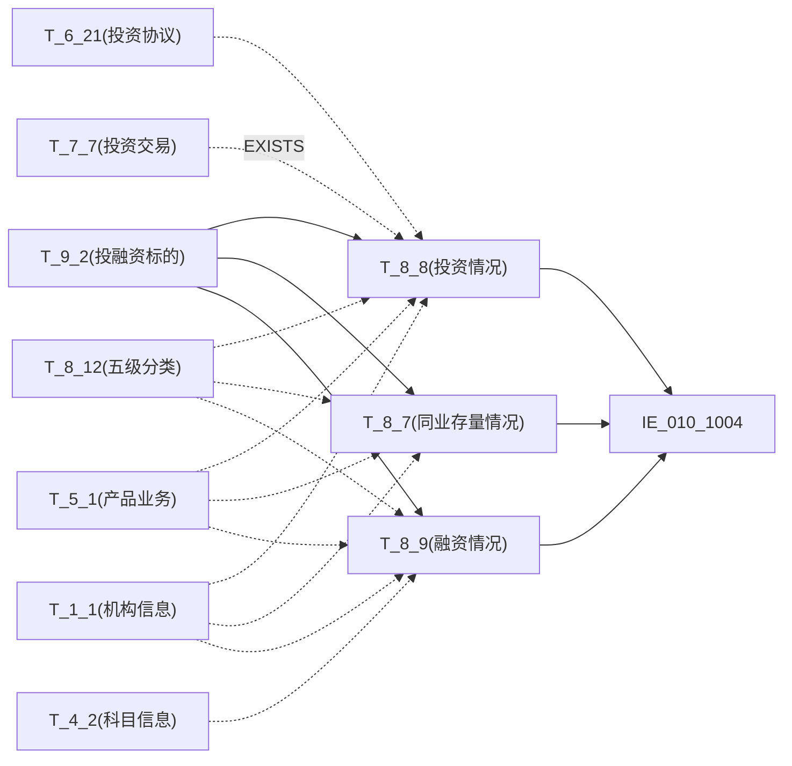

# 血缘-IE_010_1004-自营资金业务余额表-EAST5.0系统

## 页面边界

- 本页维护 `自营资金业务余额表` 从一表通来源表到 EAST5.0 目标表 `IE_010_1004` 的设计血缘。
- 证据为业务需求文档和工作区 GBase SQL 草案（2026-05-10 重构校准版）。
- 数据表字段定义见 [[数据表-IE_010_1004-自营资金业务余额表-EAST5.0系统]]；业务报送口径见 [[报表-IE_010_1004-自营资金业务余额表-EAST5.0系统]]。

## 系统边界

- 起始系统：一表通系统
- 目标系统：EAST5.0系统
- 是否跨系统血缘：是
- 目标对象：`IE_010_1004` `自营资金业务余额表`

## 业务链路摘要

- 按 历史业务需求材料 的字段映射，将一表通来源表加工为 EAST5.0 `自营资金业务余额表`。
- 本表分三部分 UNION ALL：投资情况（T_8_8）、同业存量情况（T_8_7）、融资情况（T_8_9）。
- 每部分独立完成 JOIN 关联、WHERE 过滤和字段映射，并关联上月末数据判断终态纳入。
- SQL 草案采用按 `P_DATA_DATE` 清理后重插方式；所有 JOIN 条件和 WHERE 过滤已按业务需求补齐。

## 直接上游对象

- [[数据表-T_8_8-投资情况-一表通系统]]：一表通来源表（Part 1 主表）。
- [[数据表-T_8_7-同业存量情况-一表通系统]]：一表通来源表（Part 2 主表）。
- [[数据表-T_8_9-融资情况-一表通系统]]：一表通来源表（Part 3 主表）。
- [[数据表-T_9_2-投融资标的-一表通系统]]：一表通来源表（三部分 JOIN）。
- [[数据表-T_6_21-投资协议-一表通系统]]：一表通来源表（Part 1 LEFT JOIN）。
- [[数据表-T_8_12-五级分类状态-一表通系统]]：一表通来源表（三部分 LEFT JOIN）。
- [[数据表-T_5_1-产品业务基本信息-一表通系统]]：一表通来源表（三部分 INNER JOIN）。
- [[数据表-T_1_1-机构信息-一表通系统]]：一表通来源表（三部分 LEFT JOIN）。
- [[数据表-T_4_2-科目信息-一表通系统]]：一表通来源表（Part 3 INNER JOIN）。
- [[数据表-T_7_7-投资交易-一表通系统]]：一表通来源表（Part 1 EXISTS子查询）。

## 直接下游对象

- 目标数据表：[[数据表-IE_010_1004-自营资金业务余额表-EAST5.0系统]]
- 报表业务口径页：[[报表-IE_010_1004-自营资金业务余额表-EAST5.0系统]]
- SQL 草案：`sql/EAST5.0系统/PROC_EAST_IE_010_1004_ZYZJYWYEB_草案.sql`

## Nodes

- [[数据表-T_8_8-投资情况-一表通系统]]：一表通来源表，Part 1 主表。
- [[数据表-T_8_7-同业存量情况-一表通系统]]：一表通来源表，Part 2 主表。
- [[数据表-T_8_9-融资情况-一表通系统]]：一表通来源表，Part 3 主表。
- [[数据表-T_9_2-投融资标的-一表通系统]]：一表通来源表，三部分 JOIN。
- [[数据表-T_6_21-投资协议-一表通系统]]：一表通来源表，Part 1 LEFT JOIN。
- [[数据表-T_8_12-五级分类状态-一表通系统]]：一表通来源表，三部分 LEFT JOIN。
- [[数据表-T_5_1-产品业务基本信息-一表通系统]]：一表通来源表，三部分 INNER JOIN（自营过滤）。
- [[数据表-T_1_1-机构信息-一表通系统]]：一表通来源表，三部分 LEFT JOIN。
- [[数据表-T_4_2-科目信息-一表通系统]]：一表通来源表，Part 3 INNER JOIN。
- [[数据表-T_7_7-投资交易-一表通系统]]：一表通来源表，Part 1 EXISTS。
- [[数据表-IE_010_1004-自营资金业务余额表-EAST5.0系统]]：EAST5.0 目标采集表。
- [[报表-IE_010_1004-自营资金业务余额表-EAST5.0系统]]：业务口径说明。

## 表级 Edge List

| From | To | Transform | Evidence |
| --- | --- | --- | --- |
| [[数据表-T_8_8-投资情况-一表通系统]] | [[数据表-IE_010_1004-自营资金业务余额表-EAST5.0系统]] | Part 1 主表，字段映射+关联T_9_2/T_6_21/T_1_1/T_5_1/T_8_12+上月LEFT JOIN+T_7_7 EXISTS | SQL 草案 2026-05-10 重构校准 |
| [[数据表-T_8_7-同业存量情况-一表通系统]] | [[数据表-IE_010_1004-自营资金业务余额表-EAST5.0系统]] | Part 2 主表，字段映射+关联T_9_2/T_5_1/T_1_1/T_8_12+上月LEFT JOIN | SQL 草案 2026-05-10 重构校准 |
| [[数据表-T_8_9-融资情况-一表通系统]] | [[数据表-IE_010_1004-自营资金业务余额表-EAST5.0系统]] | Part 3 主表（ROW_NUMBER去重），字段映射+关联T_9_2/T_1_1/T_4_2/T_8_12/T_5_1+上月LEFT JOIN | SQL 草案 2026-05-10 重构校准 |
| [[数据表-T_9_2-投融资标的-一表通系统]] | [[数据表-IE_010_1004-自营资金业务余额表-EAST5.0系统]] | 三部分 INNER/LEFT JOIN（投资标的ID→投融资标的ID），取JRZJMC/JRGJBH/XYFXQZ/DQRQ/QXRQ | SQL 草案 2026-05-10 重构校准 |
| [[数据表-T_6_21-投资协议-一表通系统]] | [[数据表-IE_010_1004-自营资金业务余额表-EAST5.0系统]] | Part 1 LEFT JOIN（协议ID），取生效日期/备注 | SQL 草案 2026-05-10 重构校准 |
| [[数据表-T_8_12-五级分类状态-一表通系统]] | [[数据表-IE_010_1004-自营资金业务余额表-EAST5.0系统]] | 三部分 LEFT JOIN，取五级分类/减值准备 | SQL 草案 2026-05-10 重构校准 |
| [[数据表-T_5_1-产品业务基本信息-一表通系统]] | [[数据表-IE_010_1004-自营资金业务余额表-EAST5.0系统]] | 三部分 INNER JOIN（产品ID），自营标识='01'过滤，取产品名称 | SQL 草案 2026-05-10 重构校准 |
| [[数据表-T_1_1-机构信息-一表通系统]] | [[数据表-IE_010_1004-自营资金业务余额表-EAST5.0系统]] | 三部分 LEFT JOIN（机构ID），取YHJGMC/JRXKZH | SQL 草案 2026-05-10 重构校准 |
| [[数据表-T_4_2-科目信息-一表通系统]] | [[数据表-IE_010_1004-自营资金业务余额表-EAST5.0系统]] | Part 3 INNER JOIN（科目ID），取科目名称 | SQL 草案 2026-05-10 重构校准 |
| [[数据表-T_7_7-投资交易-一表通系统]] | [[数据表-IE_010_1004-自营资金业务余额表-EAST5.0系统]] | Part 1 EXISTS（投资标的ID+科目ID+本月交易日期），判断本月内是否有交易 | SQL 草案 2026-05-10 重构校准 |

## 字段级 Edge List

| 源对象 | 源字段 | 目标对象 | 目标字段 | 处理逻辑 | 关系类型 | 证据 |
| --- | --- | --- | --- | --- | --- | --- |
| [[数据表-T_1_1-机构信息-一表通系统]] | `A010005` | [[数据表-IE_010_1004-自营资金业务余额表-EAST5.0系统]] | `YHJGMC` | 直接映射 | 直接映射 | SQL 草案 2026-05-10 |
| [[数据表-T_1_1-机构信息-一表通系统]] | `A010003` | [[数据表-IE_010_1004-自营资金业务余额表-EAST5.0系统]] | `JRXKZH` | 直接映射 | 直接映射 | SQL 草案 2026-05-10 |
| [[数据表-T_8_8-投资情况-一表通系统]]| `H080003` | [[数据表-IE_010_1004-自营资金业务余额表-EAST5.0系统]] | `NBJGH` | SUBSTR(H080003,13) 截取12位以后 | 加工映射 | SQL 草案 2026-05-10 |
| [[数据表-T_8_7-同业存量情况-一表通系统]]| `H070002` | [[数据表-IE_010_1004-自营资金业务余额表-EAST5.0系统]] | `NBJGH` | SUBSTR(H070002,13) 截取12位以后 | 加工映射 | SQL 草案 2026-05-10 |
| [[数据表-T_8_9-融资情况-一表通系统]]| `H090011` | [[数据表-IE_010_1004-自营资金业务余额表-EAST5.0系统]] | `NBJGH` | SUBSTR(H090011,13) 截取12位以后 | 加工映射 | SQL 草案 2026-05-10 |
| [[数据表-T_9_2-投融资标的-一表通系统]]| `J020011/J020001` | [[数据表-IE_010_1004-自营资金业务余额表-EAST5.0系统]] | `JRGJBH` | COALESCE(NULLIF(J020011), NULLIF(J020001)) | 加工映射 | SQL 草案 2026-05-10 |
| [[数据表-T_9_2-投融资标的-一表通系统]]| `J020002` | [[数据表-IE_010_1004-自营资金业务余额表-EAST5.0系统]] | `JRGJMC` | 直接映射（投资标的名称） | 直接映射 | SQL 草案 2026-05-10 |
| [[数据表-T_8_8-投资情况-一表通系统]]| `H080012` | [[数据表-IE_010_1004-自营资金业务余额表-EAST5.0系统]] | `BZ` | 直接映射（投资标的币种） | 直接映射 | SQL 草案 2026-05-10 |
| [[数据表-T_8_7-同业存量情况-一表通系统]]| `H070010` | [[数据表-IE_010_1004-自营资金业务余额表-EAST5.0系统]] | `BZ` | 直接映射（币种） | 直接映射 | SQL 草案 2026-05-10 |
| [[数据表-T_8_9-融资情况-一表通系统]]| `H090006` | [[数据表-IE_010_1004-自营资金业务余额表-EAST5.0系统]] | `BZ` | 直接映射（币种） | 直接映射 | SQL 草案 2026-05-10 |
| [[数据表-T_8_8-投资情况-一表通系统]]| `H080011` | [[数据表-IE_010_1004-自营资金业务余额表-EAST5.0系统]] | `ZMYE` | 直接映射→DECIMAL(20,2)（投资余额） | 直接映射 | SQL 草案 2026-05-10 |
| [[数据表-T_8_7-同业存量情况-一表通系统]]| `H070009` | [[数据表-IE_010_1004-自营资金业务余额表-EAST5.0系统]] | `ZMYE` | 直接映射→DECIMAL(20,2)（合同余额） | 直接映射 | SQL 草案 2026-05-10 |
| [[数据表-T_8_9-融资情况-一表通系统]]| `H090007` | [[数据表-IE_010_1004-自营资金业务余额表-EAST5.0系统]] | `ZMYE` | 直接映射→DECIMAL(20,2)（融资余额） | 直接映射 | SQL 草案 2026-05-10 |
| [[数据表-T_8_8-投资情况-一表通系统]]| `H080015` | [[数据表-IE_010_1004-自营资金业务余额表-EAST5.0系统]] | `CYCB` | 直接映射→DECIMAL(20,2)（持有成本） | 直接映射 | SQL 草案 2026-05-10 |
| [[数据表-T_8_7-同业存量情况-一表通系统]]| `H070028` | [[数据表-IE_010_1004-自营资金业务余额表-EAST5.0系统]] | `CYCB` | 直接映射→DECIMAL(20,2)（成本总额） | 直接映射 | SQL 草案 2026-05-10 |
| [[数据表-T_8_9-融资情况-一表通系统]]| `H090014` | [[数据表-IE_010_1004-自营资金业务余额表-EAST5.0系统]] | `CYCB` | 直接映射→DECIMAL(20,2)（成本总额） | 直接映射 | SQL 草案 2026-05-10 |
| [[数据表-T_8_8-投资情况-一表通系统]]| `H080013` | [[数据表-IE_010_1004-自营资金业务余额表-EAST5.0系统]] | `BQSY` | CASE：1月直接取，非1月本月减上月→DECIMAL(20,2)（本期投资收益） | 加工映射 | SQL 草案 2026-05-10 BQSY修正 |
| [[数据表-T_8_7-同业存量情况-一表通系统]]| `H070018` | [[数据表-IE_010_1004-自营资金业务余额表-EAST5.0系统]] | `BQSY` | CASE：1月直接取，非1月本月减上月→DECIMAL(20,2)（本期投资收益） | 加工映射 | SQL 草案 2026-05-10 BQSY修正 |
| [[数据表-T_8_9-融资情况-一表通系统]]| `H090023` | [[数据表-IE_010_1004-自营资金业务余额表-EAST5.0系统]] | `BQSY` | CASE：1月直接取，非1月本月减上月→DECIMAL(20,2)（本期收益） | 加工映射 | SQL 草案 2026-05-10 BQSY修正 |
| [[数据表-T_8_8-投资情况-一表通系统]]| `H080013` | [[数据表-IE_010_1004-自营资金业务余额表-EAST5.0系统]] | `LJSY` | 直接映射→DECIMAL(20,2)（本期投资收益） | 直接映射 | SQL 草案 2026-05-10 |
| [[数据表-T_8_7-同业存量情况-一表通系统]]| `H070018` | [[数据表-IE_010_1004-自营资金业务余额表-EAST5.0系统]] | `LJSY` | 直接映射→DECIMAL(20,2)（本期投资收益） | 直接映射 | SQL 草案 2026-05-10 |
| [[数据表-T_8_9-融资情况-一表通系统]]| `H090023` | [[数据表-IE_010_1004-自营资金业务余额表-EAST5.0系统]] | `LJSY` | 直接映射→DECIMAL(20,2)（本期收益） | 直接映射 | SQL 草案 2026-05-10 |
| [[数据表-T_8_8-投资情况-一表通系统]]| `H080024` | [[数据表-IE_010_1004-自营资金业务余额表-EAST5.0系统]] | `NHLL` | 直接映射→DECIMAL(20,6)（到期收益率） | 直接映射 | SQL 草案 2026-05-10 |
| [[数据表-T_8_7-同业存量情况-一表通系统]]| `H070013` | [[数据表-IE_010_1004-自营资金业务余额表-EAST5.0系统]] | `NHLL` | 直接映射→DECIMAL(20,6)（合同执行利率） | 直接映射 | SQL 草案 2026-05-10 |
| [[数据表-T_8_9-融资情况-一表通系统]]| `H090008` | [[数据表-IE_010_1004-自营资金业务余额表-EAST5.0系统]] | `NHLL` | 直接映射→DECIMAL(20,6)（合同执行利率） | 直接映射 | SQL 草案 2026-05-10 |
| [[数据表-T_5_1-产品业务基本信息-一表通系统]] | `E010003` | [[数据表-IE_010_1004-自营资金业务余额表-EAST5.0系统]] | `CPMC` | 直接映射（产品名称） | 直接映射 | SQL 草案 2026-05-10 |
| [[数据表-T_8_8-投资情况-一表通系统]]| `H080018` | [[数据表-IE_010_1004-自营资金业务余额表-EAST5.0系统]] | `YWZL` | 代码转换（待BS_CS_GGDM），暂取原值 | 转换映射 | SQL 草案 2026-05-10 |
| [[数据表-T_8_7-同业存量情况-一表通系统]]| `H070020` | [[数据表-IE_010_1004-自营资金业务余额表-EAST5.0系统]] | `YWZL` | 代码转换（待BS_CS_GGDM），暂取原值 | 转换映射 | SQL 草案 2026-05-10 |
| [[数据表-T_8_9-融资情况-一表通系统]]| `H090004` | [[数据表-IE_010_1004-自营资金业务余额表-EAST5.0系统]] | `YWZL` | CASE：012→同业存单 / 021,031-039,041,051,061,071,081,091→债券发行 / else→其他 | 转换映射 | SQL 草案 2026-05-10 |
| [[数据表-T_8_8-投资情况-一表通系统]]| `H080006` | [[数据表-IE_010_1004-自营资金业务余额表-EAST5.0系统]] | `JYZHLX` | CASE：'01'→银行账户 / '02'→交易账户 | 转换映射 | SQL 草案 2026-05-10 |
| [[数据表-T_8_7-同业存量情况-一表通系统]]| `H070007` | [[数据表-IE_010_1004-自营资金业务余额表-EAST5.0系统]] | `JYZHLX` | CASE：'01'→银行账户 / '02'→交易账户 | 转换映射 | SQL 草案 2026-05-10 |
| [[数据表-T_8_9-融资情况-一表通系统]]| N/A | [[数据表-IE_010_1004-自营资金业务余额表-EAST5.0系统]] | `JYZHLX` | 固定值 '银行账户' | 固定值 | SQL 草案 2026-05-10 |
| [[数据表-T_8_8-投资情况-一表通系统]]| `H080008` | [[数据表-IE_010_1004-自营资金业务余额表-EAST5.0系统]] | `MXKMBH` | 直接映射（科目ID） | 直接映射 | SQL 草案 2026-05-10 |
| [[数据表-T_8_7-同业存量情况-一表通系统]]| `H070005` | [[数据表-IE_010_1004-自营资金业务余额表-EAST5.0系统]] | `MXKMBH` | 直接映射（科目ID） | 直接映射 | SQL 草案 2026-05-10 |
| [[数据表-T_8_9-融资情况-一表通系统]]| `H090012` | [[数据表-IE_010_1004-自营资金业务余额表-EAST5.0系统]] | `MXKMBH` | 直接映射（科目ID） | 直接映射 | SQL 草案 2026-05-10 |
| [[数据表-T_8_8-投资情况-一表通系统]]| `H080009` | [[数据表-IE_010_1004-自营资金业务余额表-EAST5.0系统]] | `MXKMMC` | 直接映射（科目名称） | 直接映射 | SQL 草案 2026-05-10 |
| [[数据表-T_8_7-同业存量情况-一表通系统]]| `H070006` | [[数据表-IE_010_1004-自营资金业务余额表-EAST5.0系统]] | `MXKMMC` | 直接映射（科目名称） | 直接映射 | SQL 草案 2026-05-10 |
| [[数据表-T_4_2-科目信息-一表通系统]] | `D020003` | [[数据表-IE_010_1004-自营资金业务余额表-EAST5.0系统]] | `MXKMMC` | 直接映射（科目名称） | 直接映射 | SQL 草案 2026-05-10 |
| [[数据表-T_8_8-投资情况-一表通系统]]| `H080019` | [[数据表-IE_010_1004-自营资金业务余额表-EAST5.0系统]] | `YWXL` | 代码转换（待BS_CS_GGDM），暂取原值 | 转换映射 | SQL 草案 2026-05-10 |
| [[数据表-T_8_7-同业存量情况-一表通系统]]| `H070021` | [[数据表-IE_010_1004-自营资金业务余额表-EAST5.0系统]] | `YWXL` | 代码转换（待BS_CS_GGDM），暂取原值 | 转换映射 | SQL 草案 2026-05-10 |
| [[数据表-T_8_9-融资情况-一表通系统]]| `H090004` | [[数据表-IE_010_1004-自营资金业务余额表-EAST5.0系统]] | `YWXL` | CASE：012→同业存单发行 / 021→商业银行债 / 081→银行永续债 / 041→银行次级债 / else→其他-银行自定义 | 转换映射 | SQL 草案 2026-05-10 |
| [[数据表-T_8_8-投资情况-一表通系统]]| `H080018/H080019` | [[数据表-IE_010_1004-自营资金业务余额表-EAST5.0系统]] | `YEDL` | CASE：H080018='09' OR H080019 LIKE '11020%'→'同业往来' else→'债券投资与同业投资' | 加工映射 | SQL 草案 2026-05-10 |
| [[数据表-T_8_7-同业存量情况-一表通系统]]| N/A | [[数据表-IE_010_1004-自营资金业务余额表-EAST5.0系统]] | `YEDL` | 固定值 '同业往来' | 固定值 | SQL 草案 2026-05-10 |
| [[数据表-T_8_9-融资情况-一表通系统]]| N/A | [[数据表-IE_010_1004-自营资金业务余额表-EAST5.0系统]] | `YEDL` | 固定值 '同业往来' | 固定值 | SQL 草案 2026-05-10 |
| [[数据表-T_9_2-投融资标的-一表通系统]]| `J020022` | [[数据表-IE_010_1004-自营资金业务余额表-EAST5.0系统]] | `XYFXQZ` | CAST(J02022)/100 | 加工映射 | SQL 草案 2026-05-10 |
| [[数据表-T_9_2-投融资标的-一表通系统]]| `J020016` | [[数据表-IE_010_1004-自营资金业务余额表-EAST5.0系统]] | `DQRQ` | DATE_FORMAT(J020016,'%Y%m%d') | 日期转换 | SQL 草案 2026-05-10 |
| [[数据表-T_8_7-同业存量情况-一表通系统]]| `H070012` | [[数据表-IE_010_1004-自营资金业务余额表-EAST5.0系统]] | `DQRQ` | DATE_FORMAT(H070012,'%Y%m%d')（合同终止日期） | 日期转换 | SQL 草案 2026-05-10 |
| [[数据表-T_8_9-融资情况-一表通系统]]| `H090016` | [[数据表-IE_010_1004-自营资金业务余额表-EAST5.0系统]] | `DQRQ` | DATE_FORMAT(H090016,'%Y%m%d') | 日期转换 | SQL 草案 2026-05-10 |
| [[数据表-T_6_21-投资协议-一表通系统]] | `F210008` | [[数据表-IE_010_1004-自营资金业务余额表-EAST5.0系统]] | `QXRQ` | COALESCE(F210008, T_9_2.J020014) 转 YYYYMMDD | 加工映射 | SQL 草案 2026-05-10 |
| [[数据表-T_9_2-投融资标的-一表通系统]]| `J020014` | [[数据表-IE_010_1004-自营资金业务余额表-EAST5.0系统]] | `QXRQ` | COALESCE(T_6_21.F210008, J020014) 转 YYYYMMDD | 加工映射 | SQL 草案 2026-05-10 |
| [[数据表-T_8_7-同业存量情况-一表通系统]]| `H070011` | [[数据表-IE_010_1004-自营资金业务余额表-EAST5.0系统]] | `QXRQ` | DATE_FORMAT(H070011,'%Y%m%d')（合同起始日期） | 日期转换 | SQL 草案 2026-05-10 |
| [[数据表-T_8_9-融资情况-一表通系统]]| `H090015` | [[数据表-IE_010_1004-自营资金业务余额表-EAST5.0系统]] | `QXRQ` | DATE_FORMAT(H090015,'%Y%m%d')（生效日期） | 日期转换 | SQL 草案 2026-05-10 |
| [[数据表-T_8_12-五级分类状态-一表通系统]] | `H120005` | [[数据表-IE_010_1004-自营资金业务余额表-EAST5.0系统]] | `WJFL` | CASE：'01'→正常 / '02'→关注 / '03'→次级 / '04'→可疑 / '05'→损失 / else→'' | 码值转换 | SQL 草案 2026-05-10 |
| [[数据表-T_8_12-五级分类状态-一表通系统]] | `H120014` | [[数据表-IE_010_1004-自营资金业务余额表-EAST5.0系统]] | `JZZB` | COALESCE(NULLIF(H120014), '0') | 加工映射 | SQL 草案 2026-05-10 |
| [[数据表-T_8_8-投资情况-一表通系统]]| `H080031` | [[数据表-IE_010_1004-自营资金业务余额表-EAST5.0系统]] | `BBZ` | CONCAT_WS('；', H080031, T_6_21.F210029) | 加工映射 | SQL 草案 2026-05-10 |
| [[数据表-T_6_21-投资协议-一表通系统]] | `F210029` | [[数据表-IE_010_1004-自营资金业务余额表-EAST5.0系统]] | `BBZ` | CONCAT_WS('；', T_8_8.H080031, F210029) | 加工映射 | SQL 草案 2026-05-10 |
| [[数据表-T_8_7-同业存量情况-一表通系统]]| `H070026` | [[数据表-IE_010_1004-自营资金业务余额表-EAST5.0系统]] | `BBZ` | 直接映射（备注） | 直接映射 | SQL 草案 2026-05-10 |
| [[数据表-T_8_9-融资情况-一表通系统]]| `H090022` | [[数据表-IE_010_1004-自营资金业务余额表-EAST5.0系统]] | `BBZ` | 直接映射（备注） | 直接映射 | SQL 草案 2026-05-10 |
| N/A | N/A | [[数据表-IE_010_1004-自营资金业务余额表-EAST5.0系统]] | `GSFZJG` | 无业务来源，置 NULL | 缺口字段 | SQL 草案 2026-05-10 |
| N/A | N/A | [[数据表-IE_010_1004-自营资金业务余额表-EAST5.0系统]] | `SENSITIVEFLAG` | 无业务来源，置 NULL | 缺口字段 | SQL 草案 2026-05-10 |

## Graph-总览

## 回链检查

- 目标数据表页：已更新 SQL 草案上游依赖摘要（2026-05-10 重构校准）。
- 报表业务口径页：已创建或补充血缘回链。
- 一表通源表页：已补下游消费摘要。
- 当前字段级血缘基于业务需求和重构后 SQL 草案，未运行验证，状态保持 draft。

## 变更与冲突

- 2026-05-10 重构校准：全面重写草案，消除所有 ON 1=1 和 WHERE 1=1 占位。
- 拆分为三部分 UNION ALL（投资情况/同业存量情况/融资情况），每部分独立 JOIN 和 WHERE 过滤。
- 补齐全部 25 个字段的业务映射逻辑，2 个缺口字段（GSFZJG/SENSITIVEFLAG）无来源置 NULL。
- 新增 T_8_8/T_8_7/T_8_9/T_9_2/T_6_21/T_8_12/T_5_1/T_1_1/T_4_2/T_7_7 作为上游对象。
- BQSY 差额口径修正：实现 1 月直接取、非 1 月本月减上月（依赖 prev 左关联取上月值）。
- 所有页面保持 `draft`，SQL 草案尚未在 GBase 环境执行语法校验和跑数验证。

## Open Questions

- GBase 8a MPP 环境中 DATE_FORMAT 和 STR_TO_DATE 函数的兼容性待运行验证。
- BS_CS_GGDM 码值表（自营业务大类类型/自营业务小类类型）可用性待确认。
- 融资部分 ROW_NUMBER 窗口函数在 GBase 8a 中的兼容性待语法验证。
- 投资部分关联上月末的科目ID条件（H080008）是否正确，待业务确认。
- 外部监管实体页 wikilink 待补。

## 缺口字段（2026-05-10）

| 目标字段 | 字段名称 | 缺口说明 |
| --- | --- | --- |
| `GSFZJG` | 归属分支机构 | 本地 DDL 存在，但业务需求映射表和 SQL 草案未能确认来源，字段级血缘待补。 |
| `SENSITIVEFLAG` | 涉密标志 | 本地 DDL 存在，但业务需求映射表和 SQL 草案未能确认来源，字段级血缘待补。 |
