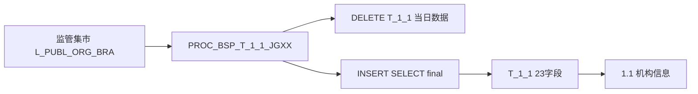
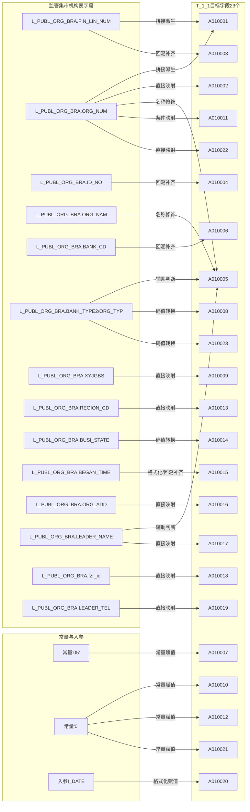

# 血缘-1.1-机构信息-一表通系统

## 系统边界

- 起始系统：监管集市系统
- 目标系统：一表通系统
- 是否仅系统内血缘：否
- 文件路径归属哪个系统：一表通系统

## 业务链路摘要

- 从监管集市系统机构主数据表 `L_PUBL_ORG_BRA` 读取当日机构快照。
- 通过多级上级机构关联补全许可证号、证件号和支付行号。
- 经过机构号剔除、失效保留、名称修饰和机构类别映射后，装入一表通 `T_1_1`。
- 2026-05-13 用户提供的一表通报表文件覆盖 `A010001~A010023`（23 字段）及 6 个码表完整定义，为本次 ingest 基准。
- 当前本地过程 `PROC_BSP_T_1_1_JGXX` 映射 `A010001~A010023`，字段级血缘闭环到此范围。
- 2.1 版新增字段 `A010024~A010026` 不在本次材料范围内，暂无字段级 SQL 来源。
- 最终形成 `1.1 机构信息` 报送结果，字段级血缘闭环到 `A010001~A010023`。

## 直接上游对象

- [[数据表-机构表-l_publ_org_bra-监管集市系统]]
- 
- `PROC_BSP_T_1_1_JGXX`

## 直接下游对象

- [[数据表-T_1_1-机构信息-一表通系统]]
- [[报表-1.1-机构信息-一表通系统]]

## Nodes

- [[数据表-机构表-l_publ_org_bra-监管集市系统]]
- `PROC_BSP_T_1_1_JGXX`
- `DELETE T_1_1@I_DATE`
- `INSERT SELECT final`
- [[数据表-T_1_1-机构信息-一表通系统]]
- [[报表-1.1-机构信息-一表通系统]]

## 表级 Edge List

| From                          | To                   | Transform                          | Evidence              |
| ----------------------------- | -------------------- | ---------------------------------- | --------------------- |
| 数据表-机构表-l_publ_org_bra-监管集市系统 | PROC_BSP_T_1_1_JGXX  | 读取 `T1` 当日机构快照，并向上递归关联 `T2~T6`     |  |
| PROC_BSP_T_1_1_JGXX           | DELETE T_1_1@I_DATE  | 先按采集日期删除历史快照                       |  |
| PROC_BSP_T_1_1_JGXX           | INSERT SELECT final  | 映射 `A010001~A010023`、处理同名机构和状态保留逻辑 |  |
| 本地 DDL `T_1_1`              | 数据表-T_1_1-机构信息-一表通系统 | 表结构已包含 `A010024~A010026`，但当前过程未赋值   |  |
| INSERT SELECT final           | 数据表-T_1_1-机构信息-一表通系统 | 形成一表通机构信息结果集；当前 SQL 血缘仅覆盖至 `A010023` |  |
| 数据表-T_1_1-机构信息-一表通系统          | 报表-1.1-机构信息-一表通系统    | 按采集日对外报送机构信息                       |  |

## 字段级 Edge List

> 基于 2026-05-13 通报表材料，字段范围 `A010001~A010023`（23 字段）；`A010024~A010026` 不在本次材料范围内。

| 序号 | 源对象            | 源字段                                                   | 目标对象  | 目标字段    | 处理逻辑                                          | 关系类型 | 证据                    |
| --- | -------------- | ----------------------------------------------------- | ----- | ------- | --------------------------------------------- | ---- | --------------------- |
| 1 | L_PUBL_ORG_BRA | FIN_LIN_NUM + ORG_NUM                                 | T_1_1 | A010001 | `SUBSTR(FIN_LIN_NUM,1,11) + ORG_NUM` 拼接生成机构ID | 拼接派生 | 一表通报表文件（2026-05-13）；SQL过程 |
| 2 | L_PUBL_ORG_BRA | ORG_NUM                                               | T_1_1 | A010002 | 直接取值                                          | 直接映射 | 一表通报表文件（2026-05-13）；SQL过程 |
| 3 | L_PUBL_ORG_BRA | FIN_LIN_NUM                                           | T_1_1 | A010003 | 本机构为空时向上级机构回溯补齐                               | 条件映射 | 一表通报表文件（2026-05-13）；SQL过程 |
| 4 | L_PUBL_ORG_BRA | ID_NO                                                 | T_1_1 | A010004 | 本机构为空时向上级机构回溯补齐                               | 条件映射 | 一表通报表文件（2026-05-13）；SQL过程 |
| 5 | L_PUBL_ORG_BRA | ORG_NAM + ORG_NUM + LEADER_NAME + fzr_id + BANK_TYPE2 | T_1_1 | A010005 | 名称修饰、管理机构后缀追加、同名机构追加`(待撤销)`                   | 条件映射 | SQL过程 |
| 6 | L_PUBL_ORG_BRA | BANK_CD                                               | T_1_1 | A010006 | 本机构为空时向上级机构回溯补齐                               | 条件映射 | 一表通报表文件（2026-05-13）；SQL过程 |
| 7 | 常量             | `'05'`                                                | T_1_1 | A010007 | 固定赋值（监管口径为 YBT_JGLX 26 码）                         | 常量赋值 | 一表通报表文件（2026-05-13）；SQL过程 |
| 8 | L_PUBL_ORG_BRA | BANK_TYPE2 + BANK_TYPE                                | T_1_1 | A010008 | 按 `BANK_TYPE2/BANK_TYPE` 转机构类别码（YBT_JGLB 6 码） | 码值转换 | 一表通报表文件（2026-05-13）；SQL过程 |
| 9 | L_PUBL_ORG_BRA | XYJGBS                                                | T_1_1 | A010009 | 直接取值（YBT_SF 是否类）                                | 直接映射 | 一表通报表文件（2026-05-13）；SQL过程 |
| 10 | 常量             | `'0'`                                                 | T_1_1 | A010010 | 固定赋值（YBT_SF 是否类）                                | 常量赋值 | 一表通报表文件（2026-05-13）；SQL过程 |
| 11 | L_PUBL_ORG_BRA | ORG_NUM                                               | T_1_1 | A010011 | 指定机构号映射为科技特色支行（YBT_SF 是否类）                     | 条件映射 | 一表通报表文件（2026-05-13）；SQL过程 |
| 12 | 常量             | `'0'`                                                 | T_1_1 | A010012 | 固定赋值（YBT_SF 是否类）                                | 常量赋值 | 一表通报表文件（2026-05-13）；SQL过程 |
| 13 | L_PUBL_ORG_BRA | REGION_CD                                             | T_1_1 | A010013 | 直接取值（YBT_XZQH 行政区划）                              | 直接映射 | 一表通报表文件（2026-05-13）；SQL过程 |
| 14 | L_PUBL_ORG_BRA | BUSI_STATE                                            | T_1_1 | A010014 | `01/02/其他` 压缩映射（YBT_YYZT_1.1 4 码；监管含`03-被合并`） | 码值转换 | 一表通报表文件（2026-05-13）；SQL过程 |
| 15 | L_PUBL_ORG_BRA | BEGAN_TIME                                            | T_1_1 | A010015 | 格式化为 `YYYY-MM-DD`，并可向上级机构回溯补齐                 | 条件映射 | 一表通报表文件（2026-05-13）；SQL过程 |
| 16 | L_PUBL_ORG_BRA | ORG_ADD                                               | T_1_1 | A010016 | 直接取值                                          | 直接映射 | 一表通报表文件（2026-05-13）；SQL过程 |
| 17 | L_PUBL_ORG_BRA | LEADER_NAME                                           | T_1_1 | A010017 | 直接取值                                          | 直接映射 | 一表通报表文件（2026-05-13）；SQL过程 |
| 18 | L_PUBL_ORG_BRA | fzr_id                                                | T_1_1 | A010018 | 直接取值                                          | 直接映射 | 一表通报表文件（2026-05-13）；SQL过程 |
| 19 | L_PUBL_ORG_BRA | LEADER_TEL                                            | T_1_1 | A010019 | 直接取值                                          | 直接映射 | 一表通报表文件（2026-05-13）；SQL过程 |
| 20 | 入参             | I_DATE                                                | T_1_1 | A010020 | 格式化为采集日期（YYYY-MM-DD）                              | 常量赋值 | 一表通报表文件（2026-05-13）；SQL过程 |
| 21 | 常量             | `'0'`                                                 | T_1_1 | A010021 | 固定赋值（YBT_SF 是否类）                                | 常量赋值 | 一表通报表文件（2026-05-13）；SQL过程 |
| 22 | L_PUBL_ORG_BRA | ORG_NUM                                               | T_1_1 | A010022 | 直接复用内部机构号                                      | 直接映射 | 一表通报表文件（2026-05-13）；SQL过程 |
| 23 | L_PUBL_ORG_BRA | BANK_TYPE2 + ORG_TYP                                  | T_1_1 | A010023 | 按 `BANK_TYPE2/ORG_TYP` 映射机构层级（YBT_JGCJ 7 码）    | 码值转换 | 一表通报表文件（2026-05-13）；SQL过程 |

## Graph-总览

## Graph-字段级

## 回链检查

- 上游对象页是否已回链本血缘页：已补充 `[[数据表-机构表-l_publ_org_bra-监管集市系统]]`
- 下游对象页是否已回链本血缘页：已补充 `[[数据表-T_1_1-机构信息-一表通系统]]`
- 报表业务口径页是否已回链本血缘页：已存在 `[[报表-1.1-机构信息-一表通系统]] -> [[血缘-1.1-机构信息-一表通系统]]`

## Open Questions

- 2026-05-13 材料覆盖 `A010001~A010023`，但 2.1 版填报说明和本地 DDL 已包含 `A010024~A010026`，需补充新版本 SQL 或人工录入链路。
- 过程内 `A010007`（机构类型）固定 `'05'`、`A010010`（科技支行）固定 `'0'`、`A010012`（科技金融专营机构）固定 `'0'`、`A010021`（自贸区网点）固定 `'0'` 是否来自外部口径文档，监管口径实际含完整码值。
- 机构名称 `(待撤销)` 规则是临时需求还是持续规则，需要补对应制度依据。
- 当前 DDL 未包含过程插入的 `DIS_DATA_DATE`、`DIS_BANK_ID`、`DIS_DEPT`、`DEPARTMENT_ID` 技术字段，需确认 DDL 与过程版本差异。
- `A010014` 运营状态 `YBT_YYZT_1.1` 码值含 `03-被合并`，但既有过程仅映射 `01/02/00`，`03` 映射逻辑待确认。
- `A010013` 行政区划码表 `YBT_XZQH` 明细待补充。
