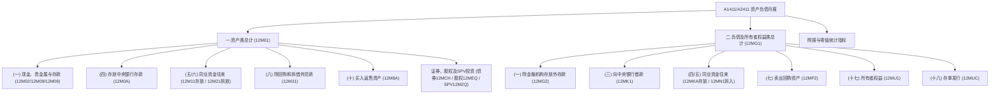

# 大集中系统-A1411_A2411-金融机构资产负债项目月报表

> [!note] 核心定位
> A1411（人民币业务类）和 A2411（外币业务类）金融机构资产负债项目月报表是大集中系统中最为核心的基础性报表，俗称**“全科目”一体化月报**。它以金融工具和金融产品为主线，增设非居民交易对手，在同一套指标体系下实现人民币与外币的资产、负债和所有者权益的精细化统计。该报表是评估金融机构资产负债期限结构、流动性缺口、同业风险敞口、利率风险和资本充足情况最权威、最核心的监管基础数据来源。

## 基本信息

- **报表编码**：A1411（法人/人民币） / A2411（分支及法人/外币）
- **报表名称**：金融机构资产负债项目月报表
- **系统归属**：大集中系统
- **报送频度**：月报
- **原文依据**：[[01-资料库/大集中系统/2026-05-18-A1411_A2411-金融机构资产负债项目月报表-原文|A1411、A2411 金融机构资产负债项目月报表原文]]

---

## 指标体系与层级结构

由于“全科目”表单指标极其庞大，实体页精炼提取其核心三级科目骨架，全量明细请链接回[[01-资料库/大集中系统/2026-05-18-A1411_A2411-金融机构资产负债项目月报表-原文|原文指标清单]]。
A1411 对应以 `12` 开头的指标编号，A2411 对应以 `22` 开头的指标编号。以下以 A1411（12系列）为例展示核心框架：

### 1. 资产类骨架 (12M01 / 22M01)
- **（一）现金 (12M02)**
  - 实物现金 (12M05 - 仅人民币表填) / 数字人民币现金 (12M06 - 仅人民币表填)
- **（四）存放中央银行存款 (12M0A)**
  - 存放中央银行准备金存款 (12M0B)、以外汇交存人民币存款准备金 (12M0C) 等。
- **（五）存放金融机构 (12M11)**：细分为活期 (12M12) 和定期 (12M1F)，均按境内外的银行业存款类、非存款类、证券业、保险业、特定目的载体（SPV）等多维机构类型拆细。
- **（六）拆放金融机构 (12M21)**：细分为短期 (12M2E) 和中长期 (12M39)，并向下按细分机构拆解。
- **（八）除回购和拆借外贷款 (12M31)**
  - 1.短期贷款 (12M32) / 2.中长期贷款 (12M51)：细分为**住户**（信用卡、经营、消费、住房等）、**非金融企业及机关团体**（经营、固投、并购、贸易融资等）、**非居民**（国际组织、政府、金融机构、非金融企业等）。
  - 3.融资租赁 (12MBT) / 4.各项垫款 (12MBE)。
- **（十）买入返售资产 (12M8A)**：按交易对手（央行、同业细分、非金融企业、境外等）划分，并在底层细分券别（债券、贷款、票据、其他）。
- **（十一）票据融资 (12M9U)**
- **（二十）债券资产 (12MCH) / （二十五）债券资产-2017准则 (12MWS)**：新准则按摊余成本（12MWT）、FVTOCI（12MX8）、FVTPL（12MXN）三分类填报。
- **（二十二）股权投资 (12MEQ) / （二十六）股权投资-2017准则 (12MYP)**。
- **（二十七）特定目的载体（SPV）份额投资 (12MZQ)**：细分为理财、信托、券商/公募/私募资管等。
- **（二十九）标准化票据 (12N0R)**。

### 2. 负债及所有者权益类骨架 (12MG1 / 22MG1)
- **（一）除金融机构存放外存款 (12MG2)**
  - 1.单位存款 (12MG3) / 2.个人存款 (12MI1)：向下拆分活期、定期、通知、协议、协定、保证金、结构性存款等。
  - 3.财政性存款 (12MIK) / 4.临时性存款 (12MIV)。
- **（三）向中央银行借款 (12MK1)**：再贷款、再贴现、MLF、SLF 等。
- **（四）金融机构存放 (12MKA)**：按活期存放 (12MKB) 与定期存放 (12MMA) 并按对手类型展开。
- **（五）从金融机构拆入 (12MN1)**。
- **（七）卖出回购资产 (12MP2)**：按交易对手划分，并在底层细分券别。
- **（十四）债券负债 (12MSM)**：境内/境外发行及交易性/其他。
- **（十七）所有者权益 (12MU1)**：实收资本、资本公积、其他权益工具（优先股/永续债）、盈余公积、未分配利润等。
- **（十八）存单发行 (12MUC)**：同业存单 (12MUD) 与大额存单 (12MUE)。

### 3. 附表与专项指标
- **黄金租借**：资产方黄金租借 (12N1I-12N1P)、负债方黄金租借 (12N1Q-12N1V)。
- **经营情况附报（A1411专用）**：营业收入 (12N1W)、利息净收入 (12N1X)、手续费及佣金净收入 (12N1Y)、信用减值损失 (12N1Z)、营业利润 (12N20)。

---

## 核心概念与统计边界

### 1. 数字人民币业务填报（2026年新规）
自2026年1月1日起，数字人民币的填报边界与口径明确如下：
- **自营端持有的数字人民币**：
  - 在“银行类数字人民币运营机构”开立的钱柜/钱包余额，计入资产方“（五）存放金融机构”下的**存放境内银行业存款类金融机构 (12M13/12M1G)**。
  - 在央行多边央行数字货币桥或央行端系统中的余额，计入**存放中央银行准备金存款 (12MOB)**。
- **客户持有的数字人民币（负债方）**：
  - 客户在本机构开立的数字人民币钱包余额，分别计入**1.单位存款 (12MG3)** 和 **2.个人存款 (12MI1)**，按活期/定期等具体产品类型填报。
  - 同业金融机构在本机构开立的钱包余额，计入负债方**（四）金融机构存放 (12MKA)** 对应子项。

### 2. 外汇买卖轧差与年初数修订（2024年新规）
- **轧差处理边界**：仅在最底层数据（县级/外资市级）的**年初报送结转数**上做外汇买卖及其子项资产、负债的轧差。轧差后净额计入对应资产或负债指标（对方科目清零）。
- **月度处理规则**：每月报送数据时，资产、负债双方数据均为“年初结转轧差净额 $+$ 年初至报告期末累计发生额”，**月度报送时不作二次轧差**。且各级层级在汇总过程中不再作轧差处理以防校验出错。

### 3. 黄金租借与同业拆借的边界（2023年新规）
- **同业拆借包含黄金**：资产方“拆放金融机构 (12M21)”和负债方“从金融机构拆入 (12MN1)”的统计范围，除同业拆借外，明确**包含金融机构之间开展黄金租借**以及计入表内的债券借贷余额。
- **向央行借款包含黄金**：负债方“向中央银行借款 (12MK1)”明确**包含金融机构从中央银行借入的黄金**。
- 黄金租借的资产负债多维分布在“黄金租借附报指标”中，按央行、同业、境外、境内其他单位四维度在表外双方反映。

### 4. 保证金存款的归属划分
- **非同业保证金**：单位及个人存入的保证金，在负债方“除金融机构存放外存款”下的“保证金存款（12MHB / 12MIE）”中填报。
- **同业保证金**：金融机构存放的保证金存款，**必须全额计入“金融机构存放定期款项 (12MMA)”**，不得在“单位保证金存款”中混淆填报。

---

## 重点校验与表内逻辑关系

月报表内存在极强的资产负债平衡关系与表间勾稽关系：

### 1. 表内资产负债基本平衡关系
月报首要规则是资产总额等于负债及所有者权益之和：
$$\text{一.资产类总计 (12M01)} = \text{二.负债及所有者权益类总计 (12MG1)}$$

### 2. 存贷款大类汇总与底层细分逻辑
各项贷款或存款大类必须等于其期限（短期/中长期等）的完全汇总：
$$\text{除回购和拆借外贷款 (12M31)} = \text{1.短期贷款 (12M32)} + \text{2.中长期贷款 (12M51)} + \text{3.融资租赁 (12MBT)} + \text{4.各项垫款 (12MBE)}$$
$$\text{除金融机构存放外存款 (12MG2)} = \text{1.单位存款 (12MG3)} + \text{2.个人存款 (12MI1)} + \text{3.财政性存款 (12MIK)} + \text{4.临时性存款 (12MIV)}$$

质量或产品底层在短期和中长期下必须轧平，例如：
$$\text{1.短期贷款 (12M32)} = \text{住户 (12M36)} + \text{非金融企业及机关团体 (12N10)} + \text{非居民 (12M4E)}$$

### 3. 买入返售与卖出回购的多维校验
买入返售和卖出回购作为大宗同业交易，需满足“对手方汇总 $=$ 各券别汇总”的交叉强校验：
$$\text{买入返售资产 (12M8A)} = \sum \text{从各金融机构及企业广义政府境外买入金额}$$
并且对于每一个交易对手分支，其券别构成必须平衡：
$$\text{从央行买入 (12M8B)} = \text{买入返售债券 (12M8C)} + \text{买入返售贷款 (12M8D)} + \text{买入返售票据 (12M8E)} + \text{买入返售其他资产 (12M89)}$$

---

## 历史调整与演化进程

报表历经多次制度性修订，其演化节点与重点调整如下：

### 2026年修订（当前最新）
- **数字人民币业务正式并表**：明确自营存同及存放央行准备金、客户数币钱包归属存贷款的划分办法。
- **向央行借款指标调整**：原“支小再贷款 (12MK7)”终止，“支农再贷款 (12MJ6)”更名为**“支农支小再贷款”**。
- **终止中央金控指标**：终止报送中央金融控股公司相关特定统计指标。
- **垫款瘦身**：终止“贴现垫款 (12MBG)”。

### 2024年修订
- **外汇买卖填报方式变革**：由历史累计发生额改为**“年初轧差净额 + 累计发生额”**报送方式，避免地区数据校验偏离。
- **现金细化**：终止现金发生额指标，增设**“实物现金”与“数字人民币现金”**。
- **应付及暂收款调整**：终止“预提费用 (12MR9)”，余额全部并入**“其他应付款 (12MRB)”**。
- **增设经营附报**：在 A1411 人民币月报中正式增设营业收入、利息净收入、利润等 5 项核心利润表发生额指标。
- **指标更名**：原“非居民个人住房贷款”更名为“住房贷款”；特定目的载体中的信托产品更名为“信托公司信托产品”。

### 2023年修订
- **存贷款分类大改版**：
  - 存款更名为“除金融机构存放外存款”；新增信用卡存款；拆分“应解汇款及临时存款”。
  - 贷款更名为“除回购和拆借外贷款”；将“融资租赁”和“各项垫款”并入；短期/中长期下重构“先交易对手、后产品”分类。
- **同业黄金拆借明细化**：拆放/拆入统计明确包含黄金租借、债券借贷余额；负债方借央行包含借入黄金；增设黄金表外对照附表。
- **证券资产重分类**：终止原“证券资产/证券负债”总分类，将买入返售/卖出回购提升为母项；债券投资与股权投资全面对接 2017 减值新准则三分类。
- **所有者权益规范**：新增“其他权益工具（优先股/永续债）”“未分配利润”等，终止“留存利润”“减所得税”等旧指标。

---

## 关联页面

- **系统实体页**：[[03-实体/大集中系统|大集中系统]]
- **报表目录页**：[[04-综合/大集中系统-报表目录|大集中系统-报表目录]]
- **监管总清单**：[[04-综合/监管系统-报表清单|监管系统-报表清单]]
- **待确认清单**：[[04-综合/待确认清单|待确认清单]]
