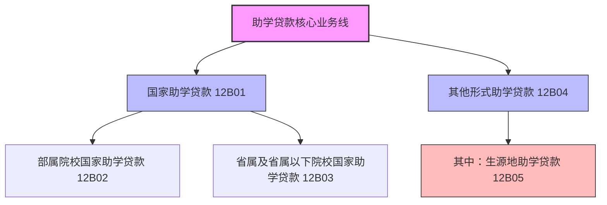

# 大集中系统-A1461-助学贷款统计季报表

> [!note] 页面角色
> 本页是大集中系统 A1461 助学贷款统计季报表的实体说明页。主要提炼本表的统计指标体系、核心概念逻辑、平衡加总等式与填报口径要点，是评估助学贷款监管报送规则的权威事实来源。

## 基本信息

* **报表编码**：A1461
* **报表名称**：助学贷款统计季报表
* **报送频度**：季报
* **报送单位**：法人汇总及分支机构级
* **数据单位**：金额指标为万元，人数/户数指标为个/户
* **核心定位**：全面统计和反映金融机构国家助学贷款（含部属、省属院校）及其他形式助学贷款（含生源地助学贷款）的本期余额、本年累计申请/合同/发放额度与人数、期末到期未清偿与逾期资产质量，以及财政贴息情况。

## 业务架构拓扑

## 统计指标分类清单

本表共包含 53 个核心指标，按业务流向和属性可划分为以下五大模块：

### 1. 存量余额指标（12B01 - 12B05）
* **12B01 国家助学贷款**：财政予以贴息，向所在地普通高等学校中家庭困难学生发放的用于助学的信用贷款。
* **12B02 部属院校国家助学贷款**：向教育部指定的部属院校在校生发放的国家助学贷款。
* **12B03 省属及省属以下院校国家助学贷款**：向部属院校以外的高等学校在校生发放的国家助学贷款。
* **12B04 其他形式助学贷款**：除国家助学贷款以外的，向接受非义务教育学习的学生或其直系亲属、法定监护人发放的用于助学的贷款。
* **12B05 其中：生源地助学贷款**：家庭经济困难学生家长或金融机构认可的个人在其户口所在地申请、发放，并由当地财政予以贴息的助学贷款。

### 2. 本年累计发生额指标（12B06 - 12B20）

| 申请金额（累计） | 合同金额（累计） | 实际发放额（累计） | 分类维度 |
|---|---|---|---|
| **12B06** 累计申请金额 | **12B11** 累计合同金额 | **12B16** 累计发放额 | 助学贷款总计 |
| **12B07** 部属院校申请金额 | **12B12** 部属院校合同金额 | **12B17** 部属院校发放额 | 国家助学贷款-部属 |
| **12B08** 省属院校申请金额 | **12B13** 省属院校合同金额 | **12B18** 省属院校发放额 | 国家助学贷款-省属及以下 |
| **12B09** 其他形式申请金额 | **12B14** 其他形式合同金额 | **12B19** 其他形式发放额 | 其他形式助学贷款 |
| **12B10** 生源地申请金额 | **12B15** 生源地合同金额 | **12B20** 生源地发放额 | 其中：生源地助学贷款 |

> [!important] 口径约束
> 发生额指标（申请、合同、发放）均统计**本年内**累计发生数，即自每年 1 月 1 日起至报告期末的本年累计流量。

### 3. 本年累计人数指标（12B21 - 12B35）

| 申请人数（累计） | 已审批人数（累计） | 实际发放人数（累计） | 分类维度 |
|---|---|---|---|
| **12B21** 累计申请人数 | **12B26** 累计已审批人数 | **12B31** 累计实际发放人数 | 助学贷款总计 |
| **12B22** 部属院校申请人数 | **12B27** 部属院校已审批人数 | **12B32** 部属院校发放人数 | 国家助学贷款-部属 |
| **12B23** 省属院校申请人数 | **12B28** 省属院校已审批人数 | **12B33** 省属院校发放人数 | 国家助学贷款-省属及以下 |
| **12B24** 其他形式申请人数 | **12B29** 其他形式已审批人数 | **12B34** 其他形式发放人数 | 其他形式助学贷款 |
| **12B25** 生源地申请人数 | **12B30** 生源地已审批人数 | **12B35** 生源地发放人数 | 其中：生源地助学贷款 |

### 4. 违约质量与资产期限指标（12B36 - 12B50）

* **12B36 到期未清偿贷款人数**：期末尚未按照合同规定的期限偿还助学贷款的总人数。
  * **12B37 到期未清偿部属院校国家助学贷款人数**
  * **12B38 到期未清偿省属及省属以下院校国家助学贷款人数**
  * **12B39 到期未清偿其他形式助学贷款人数**
    * **12B40 其中：到期未清偿生源地助学贷款人数**
* **12B41 到期未清偿助学贷款**：期末未按照合同规定的期限归还本金或利息的贷款总金额。
  * **12B42 到期未清偿部属院校国家助学贷款**
  * **12B43 到期未清偿省属及省属以下院校国家助学贷款**
  * **12B44 到期未清偿其他形式助学贷款**
    * **12B45 其中：到期未清偿生源地助学贷款**
* **12B46 逾期1年以上未清偿助学贷款**：合同到期日或结息日已逾期 1 年以上（不含 1 年）未偿清的贷款本金或利息金额。
  * **12B47 逾期1年以上未清偿部属院校国家助学贷款**
  * **12B48 逾期1年以上未清偿省属及省属以下院校国家助学贷款**
  * **12B49 逾期1年以上未清偿其他形式助学贷款**
    * **12B50 其中：逾期1年以上未清偿生源地助学贷款**

### 5. 财政贴息与客户规模指标（12B51 - 12B53）

* **12B51 助学贷款应收贴息额**：贷款银行申请的、经由财政部门审核后应拨付的助学贷款贴息额。**本指标统计历年累计应收贴息额。**
* **12B52 助学贷款实收贴息额**：贷款银行在**本年度**累计收到的财政部门拨付的财政贴息金额。**本指标填报本年累计数。**
* **12B53 助学贷款户数**：期末尚有助学贷款余额的借款人总户数。

## 重点填报规则与口径定义

1. **用途限制与追溯原则**：
   * 助学贷款所申请的贷款只能用于就读于非义务教育中全日制高中、大中专、大学本科、硕士和博士研究生等（包括留学）所需要的学杂费、生活费以及其他与学习有关的费用。如果是普通商业消费贷款，即便借款人口头声明用于子女读书，若无相关证明或未按助学贷款合同签约，一律不得计入本表。
2. **实际发放贷款人数 (12B31) 限制**：
   * 本指标只统计本年内“新发放”助学贷款的实际人数，**不包括以前年度已发放、本年仅发生续贷或存量未结清的借款人数**。
3. **“到期未清偿”与“逾期1年以上”的关系**：
   * “到期未清偿”不仅包含本金到期逾期，也包含利息到期未付；
   * “逾期 1 年以上”是“到期未清偿”的子集，即在期末，逾期天数超过 365 天的那部分本金或利息的余额。
4. **贴息额统计口径的非对称性（历年 vs 本年）**：
   * **应收贴息额 (12B51)** 是**历年累计数**（跨年度滚存累计）；
   * **实收贴息额 (12B52)** 仅为**本年累计数**（自本年 1 月 1 日至期末收到额）。
5. **生源地助学贷款的性质**：
   * 属于“其他形式助学贷款”的子项。核心区别在于：国家助学贷款是向“普通高等学校”学生在“学校所在地”发放；而生源地贷款是在学生“户口所在地”向家长或学生本人发放，同样享有当地财政予以的贴息扶持。

## 强平衡校验逻辑（LaTeX）

本表内部存在着严格的级联平衡加总关系，所有“总计”指标均应完全等于“部属 + 省属 + 其他形式”三项之和：

### 1. 本年累计申请金额
$$12B06 = 12B07 + 12B08 + 12B09$$

### 2. 本年累计合同金额
$$12B11 = 12B12 + 12B13 + 12B14$$

### 3. 本年累计助学贷款发放额
$$12B16 = 12B17 + 12B18 + 12B19$$

### 4. 本年累计申请人数
$$12B21 = 12B22 + 12B23 + 12B24$$

### 5. 本年累计已审批贷款人数
$$12B26 = 12B27 + 12B28 + 12B29$$

### 6. 本年累计实际发放贷款人数
$$12B31 = 12B32 + 12B33 + 12B34$$

### 7. 期末到期未清偿贷款人数
$$12B36 = 12B37 + 12B38 + 12B39$$

### 8. 期末到期未清偿助学贷款余额
$$12B41 = 12B42 + 12B43 + 12B44$$

### 9. 期末逾期 1 年以上未清偿助学贷款余额
$$12B46 = 12B47 + 12B48 + 12B49$$

### 10. “其中”项的上限包含性规则
除了上述完全相等的加总等式外，生源地助学贷款（作为其他形式的“其中”项）必须满足以下上限关系：
$$\begin{cases}
12B05 \le 12B04 \\
12B10 \le 12B09 \\
12B15 \le 12B14 \\
12B20 \le 12B19 \\
12B25 \le 12B24 \\
12B30 \le 12B29 \\
12B35 \le 12B34 \\
12B40 \le 12B39 \\
12B45 \le 12B44 \\
12B50 \le 12B49
\end{cases}$$

## 关联报表

* 大集中系统-资产负债项目表（人民币）：[[03-实体/大集中系统-A1411_A2411-金融机构资产负债项目月报表|A1411]] 负债方的单位/个人各项存款、以及资产方的各项贷款余额，与本表助学贷款总规模（12B01 + 12B04）存在宏观合理性勾稽。
* 1104系统普惠金融报表：[[03-实体/1104-S71-银行业普惠金融重点领域贷款情况表|S71]] 中的普惠型消费与涉农部分若涉及助学信贷，应保持口径交叉一致。
* 金融基础数据系统个人贷款：[[03-实体/金融基础数据系统-JS_201_CLGRDK_存量个人贷款信息|JS_201_CLGRDK]] 中产品类别为个人消费或助学贷款的明细数据，是本表汇总数据的底层颗粒来源。
