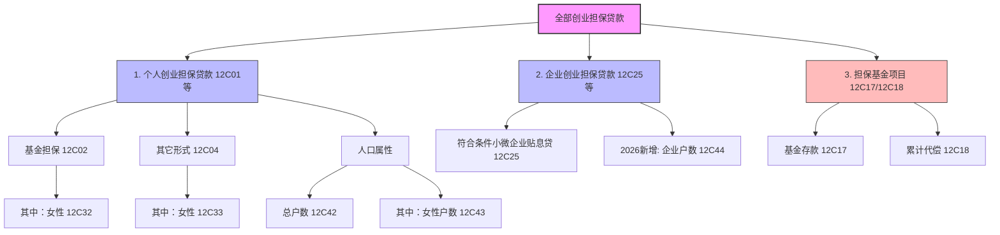

# 大集中系统-A1462-创业担保贷款专项统计季报表

> [!note] 页面角色
> 本页是大集中系统 A1462 创业担保贷款专项统计季报表的实体说明页。主要针对 **2026年依据财金〔2023〕75号文进行的重大口径重组** 进行深度解析，提炼指标架构、核心平衡公式及级联校验关系。

## 基本信息

* **报表编码**：A1462
* **报表名称**：创业担保贷款专项统计季报表
* **报送频度**：季报
* **报送单位**：法人汇总及分支机构级
* **数据单位**：金额指标为万元，人数/户数/笔数指标为个/户/笔
* **核心定位**：统计符合国家普惠就业政策要求的创业担保贷款（含个人创担贷、符合条件的小微企业贴息创担贷）的存量余额、本年累计发生额、到期违约质量、担保基金收支代偿及财政贴息规模。

## 2026年口径重组核心解析

依据财政部《普惠金融发展专项资金管理办法》（财金〔2023〕75号）要求，2026年对本表统计口径进行了结构性重组，彻底理清了“个人”与“企业”的分类边界。

### 1. 结构化分类边界表

| 报表区段 | 代表性汇总指标 | 统计范围 | 包含指标 |
|---|---|---|---|
| **第一区段 (个人端)** | `12C01` 创业担保贷款 | **仅限个人** 创业担保贷款 | 12C01~12C16, 12C19~12C24, 12C32~12C41, 12C42, 12C43 |
| **第二区段 (企业端)** | `12C25` 符合条件的小微企业贴息贷款 | **仅限小微企业** 创业担保贷款 | 12C25~12C31, `12C44` (2026年新增) |
| **第三区段 (混部/全口径)** | `12C17` 担保基金存款 / `12C18` 累计代偿金额 | **包括个人和企业** | 12C17, 12C18 |

### 2. 2026年新增指标
* **指标编码**：`12C44`
* **指标名称**：`符合条件的小微企业贴息贷款户数`
* **频度**：季报
* **作用**：填补了企业级创业担保贷款存量户数监测的空白，使企业端能够与个人端（12C42/12C43）在户数维度实现全量对齐。

### 3. 金融“五篇大文章”的穿透应用
* 在金融“五篇大文章”专项贷款数据采集与加工中，凡涉及“创业担保贷款”相关指标加工，**必须严格采用本表 2026 修订口径**：即个人部分（12C01）与企业部分（12C25）之和作为全口径基础。

## 业务架构拓扑

## 重点填报规则与口径定义

1. **时点（存量）与时期（流量）的匹配**：
   * **存量指标**（余额 12C01/12C25、笔数 12C13/12C29、基金存款 12C17、应收贴息 12C23/12C30、户数 12C42/12C44）反映报告期末最后一天的状态。
   * **时期流量指标**（本年累计发放额 12C05/12C26、累计发放笔数 12C09/12C27、本年基金累计代偿额 12C18、本年实收贴息额 12C24/12C31）均统计自当年 1 月 1 日至报告期末的本年累计流出入。
2. **应收贴息额与实收贴息额的非对称核算**：
   * 无论是个人端还是企业端，**应收贴息额**（12C23/12C30）反映的是**历年滚存累计的未拨付贴息余额**；
   * **实收贴息额**（12C24/12C31）反映的是**本年度内累计收到数**，具有非对称性。
3. **“到期未清偿”与“代偿”的区别**：
   * **到期未清偿**：指借款人发生违约，本金或利息期末逾期但尚未执行担保基金代偿。
   * **代偿额**：反映创业担保贷款担保基金在**本年内**实际已经替违约借款人划款代偿的累计资金。

## 强校验平衡逻辑（LaTeX）

本表在重组后，存在着极其严密的表内加总轧差等式以及在数据使用时的全口径汇总等式：

### 1. 个人端表内平衡加总等式
个人存量、发生额流量、发生笔数及违约质量各项指标，均须满足“基金担保 + 其他形式 = 总计”的平衡关系：

* **时点个人余额**：
  $$12C01 = 12C02 + 12C04$$
* **本年累计发放金额**：
  $$12C05 = 12C06 + 12C08$$
* **本年累计发放笔数**：
  $$12C09 = 12C10 + 12C12$$
* **时点到期未清偿笔数**：
  $$12C13 = 12C14 + 12C16$$
* **时点到期未清偿金额**：
  $$12C19 = 12C20 + 12C22$$

### 2. 个人端女性“其中项”上限包含规则
借款人为女性的贷款（包含金额、笔数、到期质量等维度）作为基金担保和其它形式贷款的“其中”子项，必须满足上限规则：
$$\begin{cases}
12C32 \le 12C02 \\
12C33 \le 12C04 \\
12C34 \le 12C06 \\
12C35 \le 12C08 \\
12C36 \le 12C10 \\
12C37 \le 12C12 \\
12C38 \le 12C14 \\
12C39 \le 12C16 \\
12C40 \le 12C20 \\
12C41 \le 12C22 \\
12C43 \le 12C42
\end{cases}$$

### 3. 数据使用时“全口径汇总加工”规则
在宏观分析与数据使用时，全口径（全部创业担保贷款）需通过个人段与企业段跨区段加总合并得出：

* **全部创担贷余额**：
  $$\text{全部创担贷余额} = 12C01 + 12C25$$
* **全部创担贷户数**：
  $$\text{全部创担贷户数} = 12C42 + 12C44$$
* **全部创担贷累计发放额**：
  $$\text{全部创担贷累计发放额} = 12C05 + 12C26$$
* **全部创担贷累计发放笔数**：
  $$\text{全部创担贷累计发放笔数} = 12C09 + 12C27$$
* **全部创担贷到期未清偿金额**：
  $$\text{全部创担贷到期未清偿金额} = 12C19 + 12C28$$
* **全部创担贷到期未清偿笔数**：
  $$\text{全部创担贷到期未清偿笔数} = 12C13 + 12C29$$
* **全部创担贷应收贴息额**：
  $$\text{全部创担贷应收贴息额} = 12C23 + 12C30$$
* **全部创担贷实收贴息额**：
  $$\text{全部创担贷实收贴息额} = 12C24 + 12C31$$

## 关联报表

* 大集中系统-资产负债表：[[03-实体/大集中系统-A1411_A2411-金融机构资产负债项目月报表|A1411]] 资产方的各项贷款余额及负债方的特定基金存款，与本表总贷款额和担保基金存款（12C17）存在表间合理性稽核。
* 大集中系统-涉农贷款表：[[03-实体/大集中系统-A1433_A2433-涉农贷款月报表|A1433]] 中的普惠涉农经营贷，在符合政策要求时，可与本表中涉农部分创担贷交叉勾稽。
* 1104系统普惠金融表：[[03-实体/1104-S71-银行业普惠金融重点领域贷款情况表|S71]] 中的普惠型小微与涉农信贷。
* 金融基础数据系统“五篇大文章”：[[03-实体/金融基础数据系统-五篇大文章-3.6存量普惠金融贷款信息|五篇大文章普惠信贷明细]] 中，其创业担保贷款明细字段的提取逻辑，必须完全等同于本表“个人（12C01） + 企业（12C25）”全口径。
