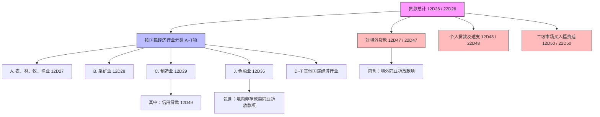

# 大集中系统-A1463_A2463-贷款分行业专项统计月报表

> [!note] 页面角色
> 本页是大集中系统 A1463（人民币）和 A2463（外币）贷款分行业专项统计月报表的实体说明页。主要提炼分行业统计指标架构、2024年二级市场福费廷单设与终止存贷比等最新修订，以及拆放款项和行业归属的核心统计口径与平衡校验规则。

## 基本信息

* **报表编码**：A1463（人民币业务） / A2463（外币业务折人民币）
* **报表名称**：贷款分行业专项统计月报表
* **系统归属**：大集中系统
* **报送频度**：月报
* **报送单位**：法人汇总及分支机构级
* **数据单位**：万元
* **原文依据**：[[01-资料库/大集中系统/2026-05-18-A1463_A2463-贷款分行业专项统计月报表-原文|A1463、A2463 贷款分行业专项统计月报表原文]]

---

## 指标体系与层级结构

本报表指标体系中，A1463 对应以 `12D` 开头的指标编号，A2463 对应以 `22D` 开头的指标编号。以下以 A1463（12D系列）为例，展示贷款分行业专项统计的完整指标列表与层级结构：

* **贷款总计 (12D26 / 22D26)**
  * **A. 农、林、牧、渔业 (12D27 / 22D27)**
  * **B. 采矿业 (12D28 / 22D28)**
  * **C. 制造业 (12D29 / 22D29)**
    * *其中：信用贷款 (12D49 / 22D49)*
  * **D. 电力、热力、燃气及水生产和供应业 (12D30 / 22D30)**
  * **E. 建筑业 (12D31 / 22D31)**
  * **F. 批发和零售业 (12D32 / 22D32)**
  * **G. 交通运输、仓储和邮政业 (12D33 / 22D33)**
  * **H. 住宿和餐饮业 (12D34 / 22D34)**
  * **I. 信息传输、软件和信息技术服务业 (12D35 / 22D35)**
  * **J. 金融业 (12D36 / 22D36)** *(含符合口径的非存款类金融机构拆放款项)*
  * **K. 房地产业 (12D37 / 22D37)**
  * **L. 租赁和商务服务业 (12D38 / 22D38)**
  * **M. 科学研究和技术服务业 (12D39 / 22D39)**
  * **N. 水利、环境和公共设施管理业 (12D40 / 22D40)**
  * **O. 居民服务、修理和其他服务业 (12D41 / 22D41)**
  * **P. 教育 (12D42 / 22D42)**
  * **Q. 卫生和社会工作 (12D43 / 22D43)**
  * **R. 文化、体育和娱乐业 (12D44 / 22D44)**
  * **S. 公共管理、社会保障和社会组织 (12D45 / 22D45)**
  * **T. 国际组织 (12D46 / 22D46)**
  * **对境外贷款 (12D47 / 22D47)** *(含境外同业拆放款项)*
  * **个人贷款及透支 (12D48 / 22D48)**
  * **买入其他金融机构福费廷（二级市场） (12D50 / 22D50)** *(2024年新增单设指标，不按行业细分)*

---

## 业务架构拓扑

---

## 核心统计口径与填报规则

### 1. 贷款定义与口径排除（硬约束）
* **贷款范围**：主要包括普通贷款、信用卡及账户透支、并购贷款、贸易融资、银团贷款、境外筹资转贷款、融资租赁和各项垫款。
* **硬性排除项**：**不含票据融资**。票据融资通常在其他专项报表报送，本表各项行业划分及总计均必须将其剔除。

### 2. 行业分类判定原则
行业分类严格按照中华人民共和国国家标准《国民经济行业分类》（GB/T 4754-2017）执行。
* **基本单位划分**：单位所属的行业性质根据该单位所从事的**主要经济活动**确定。
* **多重经济活动判定**：
  1. 若单位从事一种经济活动，则按照该经济活动确定行业。
  2. 若单位从事两种或以上经济活动，原则上按照**占单位增加值份额最大**的一种活动为主要活动。
  3. 若按增加值份额较难确定，则可依据**销售收入、营业收入或从业人员**确定单位的主要活动。

### 3. 同业拆放款项口径扩大规则（2015年起）
银行业存款类金融机构将拆放给同业的款项根据以下规则纳入本表分行业统计：
* **境内同业拆放**：拆放给银行业非存款类金融机构、证券业金融机构、保险业金融机构、交易及结算类金融机构、金融控股公司、特定目的载体（SPV）、境内其他金融机构的款项，视为对**“J. 金融业”**贷款（12D36 / 22D36）。
* **境外同业拆放**：拆放给境外同业的款项，视为**“对境外贷款”**（12D47 / 22D47）。

---

## 2024 年修订重点解析

### 1. 单设二级市场买入福费廷指标
* **修订内容**：对金融机构在二级市场买入其他金融机构的福费廷业务余额，单设指标进行统计（**12D50 / 22D50**）。
* **填报规则**：**不区分行业填报**。福费廷作为二级市场同业资金融通，不再穿透到最终借款人的行业，直接列入 `12D50/22D50`，但仍计入贷款总计中。

### 2. 终止报送存贷比相关指标
* **修订背景**：监管指标优化调整，存贷比已不再作为法定监管刚性指标。
* **修订内容**：终止本表配套报送的存贷比相关派生或附注指标，简化数据上报维度。

---

## 强校验平衡逻辑（LaTeX）

本表在月度报送中，存在着极严密的表内加总轧差等式与上限包含逻辑：

### 1. 表内大类加总平衡等式
本表贷款总计必须由 20 个国民经济行业大类（A~T）、对境外贷款、个人贷款及透支、以及二级市场福费廷加总一致：

* **人民币贷款总计（A1463）**：
  $$12D26 = \sum_{i=27}^{46} 12D(i) + 12D47 + 12D48 + 12D50$$
* **外币贷款总计（A2463）**：
  $$22D26 = \sum_{i=27}^{46} 22D(i) + 22D47 + 22D48 + 22D50$$

### 2. “其中项”上限包含规则
信用贷款作为制造业贷款的“其中”子项，必须满足上限规则：

* **人民币制造业信用贷款**：
  $$12D49 \le 12D29$$
* **外币制造业信用贷款**：
  $$22D49 \le 22D29$$

---

## 关联报表与稽核关系

* **资产负债项目表**：[[03-实体/大集中系统-A1411_A2411-金融机构资产负债项目月报表|A1411/A2411]]。
  * 本表“贷款总计”（12D26）应与 A1411 资产方“各项贷款”扣除“票据融资”和“拆放非存款类金融机构款项（同业资产大类中）”后的金额存在表间强合理性勾稽。
  * 外币“贷款总计”（22D26）与 A2411 外币各项贷款存在类似折算对照稽核。
* **1104系统分行业统计表**：[[03-实体/1104-S64-大中小微型企业贷款分行业情况表|1104-S64]]。
  * 虽然 S64 统计的是大中小微型企业贷款分行业，但其对公贷款分行业加总趋势与本表 A~T 门类走势应保持高度合理性一致。
* **金融基础数据系统**：[[03-实体/金融基础数据系统-JS_201_CLDWDK_存量单位贷款信息|JS_201_CLDWDK]] 与 [[03-实体/金融基础数据系统-JS_201_DWDKFS_单位贷款发生额信息|DWDKFS]]。
  * 基础数据系统存量及流量中的“行业GB/T4754大类”及“实际投向GB/T4754中类”字段，可作为底层细粒度明细，按月度加总校验本表人民币各行业（12D27~12D46）余额的数源一致性。
* **一表通系统**：[[03-实体/一表通-095-企业账户分析情况表-月度|一表通-095]]。
  * 一表通中对于企业贷款及账户的分行业数据分析同样使用 22 个国民经济行业分类，可作为核对企业端贷款投向的辅助工具。
