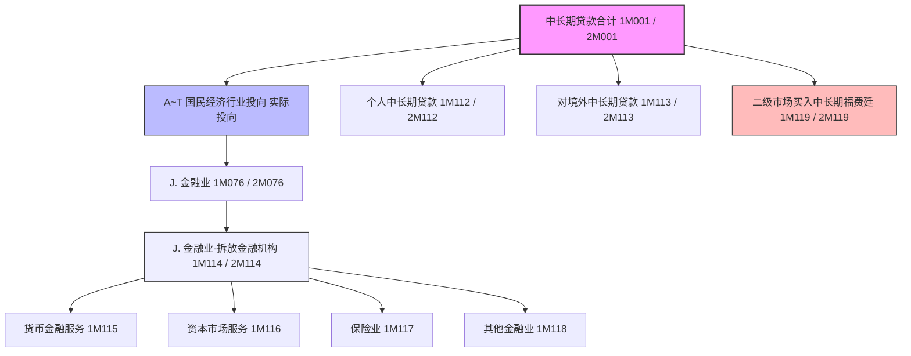

# 大集中系统-A1464_A2464-中长期贷款按实际投向统计月报表

> [!note] 页面角色
> 本页是大集中系统 A1464（人民币）和 A2464（外币）中长期贷款按实际投向统计月报表的实体说明页。主要提炼中长期贷款全口径加总与同业拆放统计扩大规则、2023-2024年二级市场福费廷单设与指标更名等最新修订、表内及跨表强校验平衡逻辑，以及与 A1411（资产负债表）和 A1463（全期限行业表）之间的精确稽核勾稽关系。

## 基本信息

* **报表编码**：A1464（人民币业务） / A2464（外币业务折人民币）
* **报表名称**：中长期贷款按实际投向统计月报表
* **系统归属**：大集中系统
* **报送频度**：月报
* **报送单位**：法人汇总及分支机构级
* **数据单位**：万元
* **原文依据**：[[01-资料库/大集中系统/2026-05-18-A1464_A2464-中长期贷款按实际投向统计月报表-原文|A1464、A2464 中长期贷款按实际投向统计月报表原文]]

---

## 指标体系与层级结构

本报表指标体系中，A1464 对应以 `1M` 开头的指标编号，A2464 对应以 `2M` 开头的指标编号。以下展示完整的国民经济分类中长期贷款投向指标树（以 A1464/1M 系列为例）：

* **中长期贷款合计 (1M001 / 2M001)**
  * **A. 农、林、牧、渔业 (1M002 / 2M002)**
    * `01.农业` (1M003) / `02.林业` (1M004) / `03.畜牧业` (1M005) / `04.渔业` (1M006) / `05.农、林、牧、渔专业及辅助性活动` (1M007)
  * **B. 采矿业 (1M008 / 2M008)**
    * `06.煤炭开采和洗选业` (1M009) / `07.石油和天然气开采业` (1M010) / `08.黑色金属矿采选业` (1M011) / `09.有色金属矿采选业` (1M012) / `10.非金属矿采选业` (1M013) / `11.开采专业及辅助性活动` (1M014) / `12.其他采矿业` (1M015)
  * **C. 制造业 (1M016 / 2M016)**
    * `13.农副食品加工业` (1M017) 到 `43.金属制品、机械和设备修理业` (1M047)（包含共计31个制造业中类细分）
  * **D. 电力、热力、燃气及水生产和供应业 (1M048 / 2M048)**
    * `44.电力、热力生产和供应业` (1M049) / `45.燃气生产和供应业` (1M050) / `46.水的生产和供应业` (1M051)
  * **E. 建筑业 (1M052 / 2M052)**
    * `47.房屋建筑业` (1M053) / `48.土木工程建筑业` (1M054) / `49.建筑安装业` (1M055) / `50.建筑装饰、装修和其他建筑业` (1M056)
  * **F. 批发和零售业 (1M057 / 2M057)**
    * `51.批发业` (1M058) / `52.零售业` (1M059)
  * **G. 交通运输、仓储和邮政业 (1M060 / 2M060)**
    * `53.铁路运输业` (1M061) 到 `60.邮政业` (1M068)（包含共计8个行业中类细分）
  * **H. 住宿和餐饮业 (1M069 / 2M069)**
    * `61.住宿业` (1M070) / `62.餐饮业` (1M071)
  * **I. 信息传输、软件和信息技术服务业 (1M072 / 2M072)**
    * `63.电信、广播电视和卫星传输服务` (1M073) / `64.互联网和相关服务` (1M074) / `65.软件和信息技术服务业` (1M075)
  * **J. 金融业 (1M076 / 2M076)** *(包含非存款类同业中长期拆放)*
    * `66.货币金融服务` (1M077) / `67.资本市场服务` (1M078) / `68.保险业` (1M079) / `69.其他金融业` (1M080)
  * **K. 房地产业 (1M081 / 2M081)**
    * `70.房地产业` (1M082 / 2M082)
  * **L. 租赁和商务服务业 (1M083 / 2M083)**
    * `71.租赁业` (1M084) / `72.商务服务业` (1M085)
  * **M. 科学研究和技术服务业 (1M086 / 2M086)**
    * `73.研究和试验发展` (1M087) / `74.专业技术服务业` (1M088) / `75.科技推广和应用服务` (1M089)
  * **N. 水利、环境和公共设施管理业 (1M090 / 2M090)**
    * `76.水利管理业` (1M091) 到 `79.土地管理业` (1M094)（包含4个行业中类细分）
  * **O. 居民服务、修理和其他服务业 (1M095 / 2M095)**
    * `80.居民服务业` (1M096) / `81.机动车、电子产品和日用产品修理业` (1M097) / `82.其他服务业` (1M098)
  * **P. 教育 (1M099 / 2M099)**
    * `83.教育` (1M100 / 2M100)
  * **Q. 卫生和社会工作 (1M101 / 2M101)**
    * `84.卫生` (1M102) / `85.社会工作` (1M103)
  * **R. 文化、体育和娱乐业 (1M104 / 2M104)**
    * `86.新闻和出版业` (1M105) 到 `90.娱乐业` (1M109)（包含5个行业中类细分，1M106已于2023年更名）
  * **S. 公共管理、社会保障和社会组织 (1M110 / 2M110)**
  * **T. 国际组织 (1M111 / 2M111)**
  * **个人贷款 (1M112 / 2M112)**
  * **对境外贷款 (1M113 / 2M113)** *(包含境外同业中长期拆放)*
  * **买入其他金融机构福费廷（二级市场） (1M119 / 2M119)** *(2024年新增单设指标，不计入具体行业)*

### 附报指标（单独校验）
* **J. 金融业-拆放金融机构 (1M114 / 2M114)** *(2023年新增细化附报)*
  * `货币金融服务` (1M115) / `资本市场服务` (1M116) / `保险业` (1M117) / `其他金融业` (1M118)

---

## 业务架构与统计口径拓扑

---

## 核心统计口径与填报规则

### 1. 中长期贷款的“大加总”口径扩展（2015年起）
本表中的“中长期贷款”并非仅包含传统客户贷款（期限 > 1年），还根据监管大口径将**中长期同业资金拆借**纳入统计：
* **境内非存款类拆放**：对银行业非存款类金融机构、证券业金融机构、保险业金融机构、交易及结算类金融机构、金融控股公司、特定目的载体（SPV）、境内其他金融机构的中长期拆放款项，均视为投向 **“J. 金融业”** 贷款（1M076 / 2M076）。
* **境外同业拆放**：对境外同业的中长期拆放款项，视为投向 **“对境外贷款”**（1M113 / 2M113）。
* **排除项**：拆放给**境内银行业存款类金融机构**的款项，被明确排除在本表“中长期贷款合计”之外。

### 2. J. 金融业与“拆放金融机构”附报指标（2023年修订）
为了细化金融同业中长期资融的流向监控，2023年增设了“J. 金融业-拆放金融机构”附报指标：
* **定义**：填报在“J.金融业”项下的，金融机构依据拆借或借款合同对**其他金融机构**融出的资金余额。
* **细分归属**：填报机构必须将此类拆放资金进一步细拆至货币金融服务（1M115）、资本市场服务（1M116）、保险业（1M117）和其他金融业（1M118）中，并满足完全加总等式。

### 3. 二级市场买入福费廷单设与上限约束（2024年修订）
* **不区分行业投向**：二级市场买入其他金融机构的福费廷业务余额，单设指标（1M119 / 2M119），直接作为中长期贷款合计的加项，**不穿透、不区分行业**填报。
* **上限稽核**：二级市场买入福费廷作为贸易融资的派生形式，其余额受资产负债表 A1411/A2411 底层“贸易融资”科目的硬性约束，即：福费廷余额必须 $\le$ 贸易融资总额。

---

## 强校验平衡逻辑（LaTeX）

### 1. 表内大类加总平衡等式（2024年调整后）
本表中长期贷款合计必须由 20 个行业大类、个人贷款、对境外贷款以及二级市场买入福费廷加总完全一致：

* **人民币中长期贷款合计（A1464）**：
  $$1M001 = \sum_{i=2}^{81\text{ step }6} 1M002 + \dots + 1M081 + 1M083 + 1M086 + 1M090 + 1M095 + 1M099 + 1M101 + 1M104 + 1M110 + 1M111 + 1M112 + 1M113 + 1M119$$
  *(即大类 A~T 余额 + 个人贷款 + 对境外贷款 + 二级市场买入福费廷)*
* **外币中长期贷款合计（A2464）**：
  $$2M001 = \sum_{i=2\dots}^{113} 2M(i) + 2M119$$

### 2. 行业大类与子类中类完全平衡等式（校验关系 B~S）
各行业大类必须等于其下设子类中类的加总（例如农林牧渔、采矿、制造、建筑、交运、金融等）：
* **A. 农、林、牧、渔业**：
  $$1M002 = \sum_{j=3}^{7} 1M(j)$$
* **B. 采矿业**：
  $$1M008 = \sum_{j=9}^{15} 1M(j)$$
* **C. 制造业**：
  $$1M016 = \sum_{j=17}^{47} 1M(j)$$
* **J. 金融业**：
  $$1M076 = \sum_{j=77}^{80} 1M(j)$$
* **J. 金融业-拆放金融机构附报平衡**：
  $$1M114 = \sum_{j=115}^{118} 1M(j)$$

### 3. 跨表强稽核平衡等式（大集中系统表间勾稽）
本表多项核心指标直接与 A1411/A2411（金融机构资产负债项目表）存在穿透级的表间硬勾稽关系：

* **中长期贷款合计跨表校验（校验关系 T）**：
  $$1M001 = \text{12M51（中长期贷款）} + \text{12M39（中长期拆放同业）} - \text{12M3F（拆放境内银行业存款类金融机构）}$$
  *(外币等式为：2M001 = 22M51 + 22M39 - 22M3F)*
* **个人贷款跨表校验（校验关系 U）**：
  $$1M112 = 12M52\text{（资产负债表-个人贷款项）}$$
  *(外币等式为：2M112 = 22M52)*
* **对境外贷款跨表校验（校验关系 V）**：
  $$1M113 = \text{12M67（对非居民贷款）} + \text{12M46（拆放境外同业）}$$
  *(外币等式为：2M113 = 22M67 + 22M46)*
* **买入福费廷跨表上限包含关系**：
  $$1M119 \le 12M5M\text{（资产负债表-贸易融资科目）}$$
  *(外币等式为：2M119 \le 22M5M)*

---

## 跨系统与关联报表稽核

### 1. 与全期限行业表 [[03-实体/大集中系统-A1463_A2463-贷款分行业专项统计月报表|A1463/A2463]] 的包含关系
* **口径定位**：A1463 是**全期限（短期+中长期）**贷款分行业表，而 A1464 是**中长期（期限 > 1年）**贷款按实际投向表。
* **稽核关系**：在相同的行业大类及中类上，A1464 对应的中长期投向余额必须**小于或等于** A1463 的对应行业余额：
  $$\forall \text{ 行业 } X, \quad 1M(X)_{\text{中长期}} \le 12D(X)_{\text{全期限}}$$
* **福费廷指标**：两表均于2024年新增二级市场福费廷单设指标（12D50 与 1M119），同样满足 $1M119 \le 12D50$。

### 2. 与 1104 系统的稽核对照
* **资产负债附注 [[03-实体/1104-G01_Ⅶ-资产负债项目表附注|G01_Ⅶ]]**：G01_Ⅶ 中第4部分“中长期贷款按实际投向统计”的各项大类指标与本表 A1464 的 A~T 大类应保持完全一致。
* **分行业统计 [[03-实体/1104-S64-大中小微型企业贷款分行业情况表|1104-S64]]**：S64 为对公企业分行业，本表中的企业中长期贷款分行业走势和占比应与 S64 中长期口径具有高度合理性匹配。

### 3. 与金融基础数据系统（人行明细报送）的校验
* **存量明细 [[03-实体/金融基础数据系统-JS_201_CLDWDK_存量单位贷款信息|JS_201_CLDWDK]] 和 [[03-实体/金融基础数据系统-JS_201_CLGRDK_存量个人贷款信息|JS_201_CLGRDK]]**：
  * 筛选条件：`合同期限` 或 `剩余期限` 超过 1 年的中长期贷款明细。
  * 行业字段：通过 `实际投向GB/T4754中类` 字段进行月度汇总，加总值应与本表 A1464 对应中类的期末余额（1M017~1M098）完成精确数源稽核。

---

## 待确认清单

| 待确认问题 | 业务背景 | 确认建议与后续跟进 |
|---|---|---|
| A1411 中 `12M5M` 贸易融资科目的具体包含范围 | 影响校验关系 $1M119 \le 12M5M$ 的上限勾稽紧密度。 | 需调阅 A1411 资产负债表原文中“贸易融资”的详细定义（是否包含国内/国际信用证项下买单等）。 |
| 1M001 中拆放同业扣除项 `12M3F` 的底层物理表归属 | 确认该拆放境内银行款项是否在大集中系统总账科目中被单设。 | 需核对大集中系统总账科目对照表，确认拆放存款类与非存款类同业的科目级隔离。 |

---

## 变化记录

* **2026-05-18**：首次 ingest 接入中长期贷款按实际投向统计月报表，按《国民经济行业分类》（GB/T 4754-2017）标准全面转录 119 个指标，提炼 2015 同业拆放大口径扩充原则，落实了2023年“拆放金融机构”附报细化及更名、2024年二级市场福费廷（1M119/2M119）单设不分行业填报和贸易融资（12M5M/22M5M）上限硬性约束，建立了 20 组大类中类折算与跨报表 T/U/V 强校验勾稽体系。
