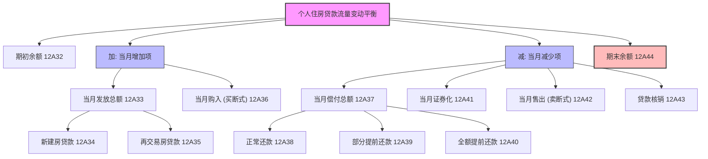
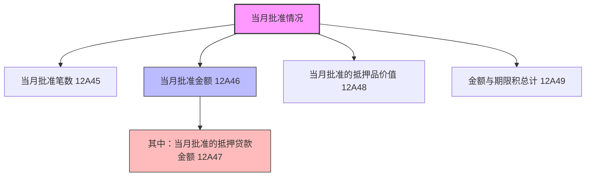

# 大集中系统-A1470-个人住房贷款流量统计月报表

> [!note] 页面角色
> 本页是大集中系统 A1470 个人住房贷款流量统计月报表的实体说明页。主要提炼本表的统计指标体系、期初期末对账轧差逻辑、提前还款与新批贷等流量关键口径，是评估个人住房信贷增量与监测房地产金融稳定的权威事实来源。

## 基本信息

* **报表编码**：A1470
* **报表名称**：个人住房贷款流量统计月报表
* **报送频度**：月报
* **报送单位**：法人汇总及分支机构级
* **数据单位**：金额/价值为万元，笔数为笔，期限积为万元·月（或其他等价加权单位）
* **核心定位**：通过对个人住房贷款“增量”与“流量”的多维度监控（包含批准、发放、购入、偿还、证券化、售出、核销），反映房地产市场与信贷的最前沿变化，特别聚焦了“提前还款”以及“新批贷加权平均期限”等前瞻性政策监测指标。

## 业务架构拓扑

### 1. 个人住房贷款余额变动流向

### 2. 当月新批准贷款情况

## 统计指标分类清单

本表共包含 18 个核心指标，可划分为以下两大模块：

### 1. 余额变动对账指标（12A32 - 12A44）

* **12A32 期初（上月末）个人住房贷款余额**：上月末金融机构向个人发放的用于购买住房的表内贷款余额。
* **12A33 当月发放个人住房贷款总额**：当月实际放款并记入表内的总额。
  * **12A34 当月发放新建房贷款**：用于购买第一次出售的住房（一手房）的个人住房贷款。
  * **12A35 当月发放再交易房贷款**：用于购买非第一次出售的住房（二手房）的个人住房贷款。
* **12A36 当月购入个人住房贷款（买断式）**：指从其他金融机构无条件买断购入的个人住房贷款余额。
* **12A37 当月个人住房贷款偿付总额**：本月借款人偿还的个人住房贷款总额。
  * **12A38 正常还款**：按合同约定的还款计划本月正常收回的本金。
  * **12A39 部分提前还款**：借款人未到合同约定期限，提前偿还部分贷款本金的行为。
  * **12A40 全额提前还款**：借款人未到合同约定期限，提前一次性结清所有剩余贷款本金的行为。
* **12A41 当月证券化**：当月因开展个人住房抵押贷款支持证券（RMBS）发行而从表内出表的贷款本金总额。
* **12A42 当月售出个人住房贷款（卖断式）**：向其他机构无条件卖断出售的个人住房贷款余额。
* **12A43 当月贷款核销**：本月由于确认为坏账损失并按法定程序予以核销的贷款本金。
* **12A44 期末个人住房贷款余额**：报告期末金融机构个人住房贷款余额。

### 2. 批贷及前瞻指标（12A45 - 12A49）

* **12A45 当月批准笔数**：金融机构在本月内正式审批通过的个人住房贷款的总笔数。
* **12A46 当月批准金额**：金融机构在本月内正式审批通过的个人住房贷款总金额。
  * **12A47 其中：当月批准的抵押贷款金额**：当月批准的贷款中，属于抵押担保类型的金额。
* **12A48 当月批准的抵押品价值**：当月审批通过的抵押贷款所对应的抵押品评估总价值。
* **12A49 当月全部个人住房贷款金额与期限积的总计**：当月新审批的各项个人住房贷款金额与其相应合同期限（以月为单位）的乘积之和。

## 重点填报规则与概念定义

1. **新建房与再交易房的界定**：
   * **一手房 (新建房贷款 12A34)** 指向购买**第一次出售**的住房发放的贷款。其主要特点是开发商直售，属于增量房。
   * **二手房 (再交易房贷款 12A35)** 指向购买**非第一次出售**的住房发放的贷款。属于存量交易。
2. **提前还款的细化监测 (12A39 / 12A40)**：
   * 随着政策变动，个人住房贷款提前还款流量（部分 12A39 + 全额 12A40）是评估居民资产负债表“缩表”倾向、分析商业银行利差敞口受阻以及流动性预期的极关键前瞻性指标。
3. **“金额与期限积” (12A49) 的前瞻性分析作用**：
   * 本指标主要是为了计算**当月新批准贷款的加权平均期限**（Weighted Average Maturity, WAM），可用于穿透监测市场信贷供给与居民债务结构变化：
     $$\text{当月新批准贷款加权平均期限（月）} = \frac{\text{12A49 当当月全部金额与期限积总计}}{\text{12A46 当月批准金额}}$$
4. **阶段性保证加抵押贷款的认定硬规则**：
   * > [!important] 阶段性保证与抵押填报要求
     > 在个人住房贷款当月发放、偿还情况统计中，金融机构的**阶段性保证加抵押**个人住房贷款业务在**批贷时就认定为抵押贷款**。
     > 相应的贷款数值必须填报在“当月批准的抵押贷款金额”（12A47）和“当月批准的抵押品价值”（12A48）中。此举旨在确保抵押敞口统计的及时性，避免由于阶段性担保至正式抵押确权期间的时间差导致抵押敞口低估。

## 强平衡校验逻辑（LaTeX）

本表内部存在着极其严密的增量变化扎账勾稽公式和级联加总平衡：

### 1. 月度余额变动轧账恒等式
期末余额应完美等于期初余额加上当期增加项，扣除当期减少项：
$$12A44 = 12A32 + 12A33 + 12A36 - 12A37 - 12A41 - 12A42 - 12A43$$

### 2. 当月发放贷款拆分等式
当月发放总额必须完全等于一手房发放与二手房发放之和：
$$12A33 = 12A34 + 12A35$$

### 3. 当月偿付总额拆分等式
当月偿付总额必须完全等于正常还款、部分提前还款与全额提前还款之和：
$$12A37 = 12A38 + 12A39 + 12A40$$

### 4. 批准抵押贷款上限约束
批准抵押贷款金额作为批准总额的“其中”项，必须满足上限包含规则：
$$12A47 \le 12A46$$

### 5. 抵押品成数合理性约束
通过批准抵押贷款额与抵押品价值之比，可监控期末新批准个人住房贷款的加权平均成数（LTV），该比值应通常低于监管最高限额（如 70% 或 80%）：
$$\text{LTV} = \frac{12A47}{12A48} \le \text{监管最高LTV限额}$$

## 关联报表

* 大集中系统-房地产贷款表：[[03-实体/大集中系统-A1460_A2460-房地产贷款统计月报表|A1460/A2460]]。本表期末余额（12A44）应通常与 A1460 人民币房地产表中的个人住房贷款余额（如 $12H19$ 或对应个人购房明细）保持口径一致性。
* 大集中系统-资产负债项目表（人民币）：[[03-实体/大集中系统-A1411_A2411-金融机构资产负债项目月报表|A1411]]。本表的期末个人住房贷款余额 $12A44$ 构成了资产负债表资产方“中长期贷款-各项贷款”底层的核心组成部分。
* 大集中系统-房地产抵押季报表：[[03-实体/大集中系统-A1369_A2369-个人住房贷款及以房地产为抵押品的贷款统计季报表|A1369]]。A1369 属于季频，偏向资产质量与剩余期限结构；而本表 A1470 属于月频，偏向流量变动。两表应在季度末月份的余额和分类方面形成良好的宏观核对链条。
* 金融基础数据系统个人贷款：[[03-实体/金融基础数据系统-JS_201_CLGRDK_存量个人贷款信息|JS_201_CLGRDK]]。底层个人房贷借据在月末的余额总和以及流量发生额，是本表统计指标（12A32、12A44、12A33等）的底层明细来源。
