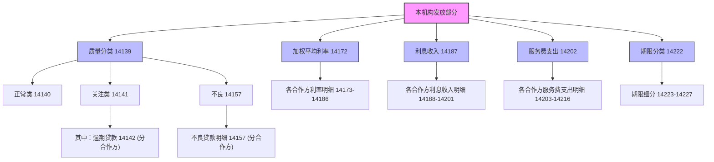

# 大集中系统-A1480-线上联合消费贷款专项统计月报表

> [!note] 页面角色
> 本页是大集中系统 A1480 线上联合消费贷款专项统计月报表的实体说明页。主要提炼本表的统计指标体系、资金合作方分类、资产质量与期限结构、以及利息收入与服务费支出等关键口径，是评估金融机构线上联合放贷规模与防范互联网消费金融联合敞口风险的权威事实来源。

## 基本信息

* **报表编码**：A1480
* **报表名称**：线上联合消费贷款专项统计月报表
* **报送频度**：月报（第二批次）
* **报送单位**：法人汇总及地市级及以上各级汇总数据（法人最高为县级及以下的，报送法人汇总数据）
* **业务类与币种**：人民币/人民币
* **核心定位**：全面、准确反映金融机构发放线上联合消费贷款的规模、合作方类型（存款类、非存款类、小贷公司）、资产质量（五级分类及逾期）、加权平均利率、利息收入与服务费支出、客户户数以及期限分布，监测互联网贷款中金融机构与第三方机构的合作敞口与风险分布。

## 业务架构拓扑

### 1. 资金合作方与放贷额结构

```mermaid
graph TD
    A[线上联合消费贷款总余额 14100] --> B["与银行业存款类金融机构合作 14101"]
    A --> C["与银行业非存款类金融机构合作 14104"]
    A --> D["与小额贷款公司合作 14117"]
    
    B --> B1[本机构发放部分 14102]
    B --> B2[合作方发放部分 14103]
    
    C --> C1[1.与消费金融公司合作 14105]
    C --> C2[2.与汽车金融公司合作 14108]
    C --> C3[3.与贷款公司合作 14111]
    C --> C4[4.与其他银行业非存款类合作 14114]
    
    C1 --> C11[本机构发放部分 14106]
    C1 --> C12[合作方发放部分 14107]
    C2 --> C21[本机构发放部分 14109]
    C2 --> C22[合作方发放部分 14110]
    C3 --> C31[本机构发放部分 14112]
    C3 --> C32[合作方发放部分 14113]
    C4 --> C41[本机构发放部分 14115]
    C4 --> C42[合作方发放部分 14116]
    
    D --> D1[1.与重庆蚂蚁小微小贷合作 14118]
    D --> D2[2.与重庆蚂蚁商诚小贷合作 14121]
    D --> D3[3.与重庆美团三快小贷合作 14124]
    D --> D4[4.与重庆度小满小贷合作 14127]
    D --> D5[5.与重庆小米小贷合作 14130]
    D --> D6[6.与重庆苏宁小贷合作 14133]
    D --> D7[7.与其他小额贷款公司合作 14136]
    
    D1 --> D11[本机构发放部分 14119]
    D1 --> D12[合作方发放部分 14120]
    D2 --> D21[本机构发放部分 14122]
    D2 --> D22[合作方发放部分 14123]
    D3 --> D31[本机构发放部分 14125]
    D3 --> D32[合作方发放部分 14126]
    D4 --> D41[本机构发放部分 14128]
    D4 --> D42[合作方发放部分 14129]
    D5 --> D51[本机构发放部分 14131]
    D5 --> D52[合作方发放部分 14132]
    D6 --> D61[本机构发放部分 14134]
    D6 --> D62[合作方发放部分 14135]
    D7 --> D71[本机构发放部分 14137]
    D7 --> D72[合作方发放部分 14138]

    style A fill:#f9f,stroke:#333,stroke-width:2px
    style B fill:#bbf,stroke:#333,stroke-width:1px
    style C fill:#bbf,stroke:#333,stroke-width:1px
    style D fill:#bbf,stroke:#333,stroke-width:1px
```

### 2. 本机构发放部分的质量、利率、利息与支出架构

## 统计指标分类清单

本表共包含 132 个指标细项（含附报），可划分为以下七大模块：

### 1. 线上联合消费贷款余额 (按资金合作方分类) (14100 - 14138)
* 统计期末存续的线上联合消费贷款全口径余额，细拆为与存款类金融机构、4类非存款类金融机构、6个指定头部小贷公司及其他小贷公司合作的规模，并对每个小类拆出 **“本机构发放部分”** 与 **“合作方发放部分”**。

### 2. 线上联合消费贷款质量分类（本机构发放部分）(14139 - 14171)
* 针对**本机构发放部分**，按五级风险分类（正常 14140、关注 14141、不良 14157）进行归集。
* 特别监测 **“其中：逾期贷款” (14142)** 的流向，并按资金合作方类型进行全层级穿透细分。
* 对 **“不良贷款余额” (14157)** 同样按资金合作方类型进行全层级穿透细分。

### 3. 加权平均利率（本机构发放部分）(14172 - 14186)
* 监测期末**本机构发放部分**的加权平均年化利率，按资金合作方细拆，揭示各类资金通道的定价特征。

### 4. 线上联合消费贷款利息收入（本机构）(14187 - 14201)
* 统计自年初至报告期末**本机构**累计取得的联合消费贷款利息收入（用余额属性报送累计数），并按资金合作方细化。

### 5. 线上联合消费贷款服务费支出（本机构）(14202 - 14216)
* 统计自年初至报告期末**本机构**因接受服务合作方服务而累计支出的服务费（用余额属性报送累计数，不含代收代缴费用），并按资金合作方细化。

### 6. 线上联合消费贷款户数 (14217 - 14221)
* 统计期末有余额的联合消费贷款客户总数，按单户余额分档（小于2000元、2000-5000元、5000-1万元、大于1万元）进行填报。
* 本指标不参与大宗总分校验，但需遵循严格的 **地市/省/全国去重** 报送原则。

### 7. 期限分类及附报 (14222 - 14229)
* **期限分类 (14223 - 14227)**：按剩余合同期限将**本机构发放部分**拆分为：1个月以内、1-3个月、3-6个月、6个月-1年、1年以上五个区间。
* **附报 (14228 - 14229)**：统计自年初至报告期末累计发生的资产证券化（ABS）转让金额以及累计核销金额（均仅统计本机构部分，余额属性报送累计数）。

## 重点填报规则与概念定义

1. **线上联合消费贷款的核心标准**：
   必须同时满足以下四大要点才可纳入统计：
   * **渠道特征**：经由线上渠道获取。
   * **服务合作方**：由合作机构（如互联网平台、助贷机构）推送个人客户信息。
   * **资金合作方**：与其他具备放贷资格的主体（如银行、消金、小贷）共同放贷。
   * **放贷形式**：基于**同一贷款协议**、以**约定比例**共同向同一借款人发放的**个人消费贷款**。
2. **户数的多级去重原则 (14217)**：
   * > [!important] 全市/全省/全国去重硬性规则
     > 线上联合消费贷款户数在报送不同行政层级汇总数据时，**必须按对应的行政区域实行完全去重**。
     > 即：地市级数据按全市去重，省级数据按全省去重，全国数据按全国去重。避免因跨区域借款人在不同地市或分行重复计数而导致全国或全省客户规模失真。
3. **利息与服务费的累计发生额核算**：
   * 线上联合消费贷款利息收入（14187）与服务费支出（14202），以及附报中的证券化（14228）和核销（14229），必须以 **自年初至报告期末的累计发生额** 填报，虽然系统中使用“余额属性”格式，但核算逻辑是流量累计值。
   * **服务费支出**：仅限报送机构为接受服务合作方（助贷平台等）提供的贷款发放与管理服务而支付的费用，**明确排除任何代收代缴的第三方费用**（如代扣收的客户征信费、通道费等）。
4. **加权平均利率的前瞻监控**：
   * 余额加权平均利率（14172）用于评估线上联合消费贷业务的利差和定价变化趋势：
     $$\text{加权平均利率（\%）} = \frac{\sum（单笔线上联合消费贷款余额 \times 该笔年化利率）}{\sum（单笔线上联合消费贷款余额）}$$

## 强平衡校验逻辑（LaTeX）

本表内部存在着严密的分层级级联加总与上限包含校验关系：

### 1. 本机构发放余额五级分类轧账恒等式
本机构发放部分的所有合作渠道之和，必须完美等于质量分类中的正常类、关注类与不良类贷款之和：
$$\sum \text{本机构发放部分} = 14140 + 14141 + 14157$$
其中 $\sum \text{本机构发放部分}$ 展开为：
$$\begin{aligned}
\sum \text{本机构发放部分} = & 14102 \text{ (存款类)} + 14106 \text{ (消金)} + 14109 \text{ (汽金)} + 14112 \text{ (贷款公司)} \\
& + 14115 \text{ (其他非存)} + 14119 \text{ (蚂蚁小微)} + 14122 \text{ (蚂蚁商诚)} + 14125 \text{ (美团)} \\
& + 14128 \text{ (度小满)} + 14131 \text{ (小米)} + 14134 \text{ (苏宁)} + 14137 \text{ (其他小贷)}
\end{aligned}$$

### 2. 本机构发放余额期限分类轧账恒等式
本机构发放部分的五级分类总和，必须与期限分类下的 5 个剩余合同期限区间完全扎平：
$$14140 + 14141 + 14157 = 14223 + 14224 + 14225 + 14226 + 14227$$

### 3. 关注类对逾期贷款的上限约束
逾期贷款是关注类贷款的“其中”项，必须满足上限包含规则：
$$14141 \ge 14142$$

### 4. 逾期贷款渠道级联加总等式
逾期贷款总额（14142）必须完全等于存款类、非存款类与小贷公司三大渠道之和：
$$14142 = 14143 + 14144 + 14149$$
其中非存款类与小贷公司需满足子类加总：
$$14144 = 14145 + 14146 + 14147 + 14148$$
$$14149 = 14150 + 14151 + 14152 + 14153 + 14154 + 14155 + 14156$$

### 5. 不良贷款渠道级联加总等式
不良贷款总额（14157）必须完全等于存款类、非存款类与小贷公司三大渠道之和：
$$14157 = 14158 + 14159 + 14164$$
其中非存款类与小贷公司满足子类加总：
$$14159 = 14160 + 14161 + 14162 + 14163$$
$$14164 = 14165 + 14166 + 14167 + 14168 + 14169 + 14170 + 14171$$

### 6. 利息收入与服务费支出渠道级联加总等式
累计利息收入（14187）与累计服务费支出（14202）分别按渠道完全加总（关系I/J/K 及 L/M/N）：
$$14187 = 14188 + 14189 + 14194$$
$$14202 = 14203 + 14204 + 14209$$

### 7. 客户户数分档完全加总等式
户数总数（14217）必须等于 4 个余额分档户数之和：
$$14217 = 14218 + 14219 + 14220 + 14221$$

## 关联报表

* 大集中系统-资产负债表（人民币）：[[03-实体/大集中系统-A1411_A2411-金融机构资产负债项目月报表|A1411]]。
  * **表间校验关系Q**：A1411 中的短中长期“个人消费贷款”科目余额总和，构成了本机构全部个人消费贷款的上限，其必须大于或等于 A1480 线上联合消费贷款本机构发放余额总和：
    $$\text{12M3A (短短个人消费) } + \text{12M53 (中长期个人消费) } \ge 14140 + 14141 + 14157 \text{ (表A1480)}$$
* 一表通系统-互联网贷款合作协议：[[03-实体/一表通-6.25互联网贷款合作协议|一表通-6.25]]。一表通 6.25 采集互联网贷款的合作方类型、放贷比例、增信模式等，与本表 A1480 中的合作渠道分类（存款类、非存款类、小贷公司）以及各渠道本机构发放/合作方发放的余额比重互为验证。
* EAST5.0系统-互联网贷款附加表：[[03-实体/EAST5.0-IE_005_502-互联网贷款合同附加表|IE_005_502]]。EAST 中明细级合同对应的业务模式、合作方出资比例、合作方责任金额，是本表渠道出资余额级联汇总的底层明细依据。
* 金融基础数据系统-存量个人贷款：[[03-实体/金融基础数据系统-JS_201_CLGRDK_存量个人贷款信息|JS_201_CLGRDK]]。个人消费贷款对应的产品类别 F0203（个人消费贷款）及其实际出资比重，是本表余额轧账的源数据。

## 变化记录

* 2026-05-18：首次接入 A1480 线上联合消费贷款专项统计月报表，构建完整的“资金合作方出资（本机构/合作方）”和“本机构质量/利率/利息收入/服务费支出/期限区间”多维分析骨架，明确全市/全省/全国户数分区域去重硬性填报要求，并确立了与 A1411 资产负债表个人消费信贷（12M3A/12M53）的上限勾稽关系。

## 备注

* 线上联合消费贷款的“利息收入”和“服务费支出”是年初至今的累计发生额，需在数据质量校验时重点防范与其余额属性格式混淆而导致月度流量被误判。
