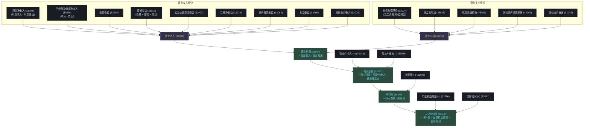

# 大集中系统-A3101_A3301-本外币利润统计表

## 简介

本外币利润统计表是反映金融机构在特定会计期间内经营成果、盈利能力和盈利结构的重要监管统计报表。在人民银行大集中数据系统中，该表以双频度报送：
- **A3301（本外币利润统计季报表）**：按季上报，反映本季度及本年累计的季度损益与盈利构成。
- **A3101（本外币利润统计年报表）**：按年上报，用于汇总与核算金融机构全年的最终利润状况。

两表在会计核算骨架和指标编码上高度一致，但在**金融机构往来**的填报边界上具有宏观审慎监管层面的重要区别。

## 关键信息

- **所属系统**：大集中系统
- **报表编码**：A3101（年报） / A3301（季报）
- **报表名称**：本外币利润统计年报表 / 本外币利润统计季报表
- **当前原文依据**：[[01-资料库/大集中系统/2026-05-18-A3101_A3301-本外币利润统计表-原文|2026-05-18 原文]]
- **知识沉淀位置**：本页直接维护该报表的提炼结论、重点规则和常见口径。

## 当前结论

### 核心区别：金融机构往来利息的“系统内”填报边界
- **季报（A3301）**：在统计“金融机构往来利息收入（33004）”和“金融机构往来利息支出（33010）”时，**必须包含系统内往来利息收支（33005、33011）**。这主要用于季度期间对金融机构流动性状况、系统内资金调度及内部转移定价（FTP）影响的动态监测。
- **年报（A3101）**：在填报年度利润统计指标时，**必须排除系统内往来利息收支（33005、33011）**。这在宏观层面是为了实现系统内往来资金的合并轧差，消除法人金融机构内部双向计息导致的利息收支双向虚增，从而准确反映银行业金融机构对外的实际获利能力。

## 利润指标层级骨架 (Mermaid 拓扑图)

## 重点口径解释

1. **金融机构往来与各项存贷款的非对称性边界**
   - **各项存款利息支出（33012）**：严格仅统计从**非金融机构**（如企业、个人、机关团体、保证金存款等）吸收存款产生的利息支出。
   - **同业存款与借款利息**：金融机构之间发生的同业拆借、同业存放、卖出回购以及向中央银行借款、再贴现/转贴现资金的利息支出，必须统一归入“金融机构往来利息支出（33010）”，不得与普通非金融存款利息混淆。
2. **职工工资的超常统计范围**
   - **职工工资（33028）**：除在职职工的工资、奖金、津贴外，**特殊规定必须包括已退休职工的工资/津贴**。这与普通企业会计核算中退休职工费用计入管理费用或福利费的常规做法存在口径差异，在填报时需特别注意从人力成本总账中穿透提取。
3. **福利费的多维列支项目**
   - **福利费（33029）**：包含法定的各项社会保险费（五险一金中的五险、补充养老与补充医疗）、集体福利补贴、生活困难补助、交通补贴、取暖费，以及**因解除劳动关系给予的补偿（离职补偿金）**。
4. **资产减值损失、信用减值损失与其它减值损失的三层次区分**
   - **信用减值损失（33066）**：反映按照新金融工具准则（CAS 22/IFRS 9）计提的金融资产（如贷款准备、坏账准备、债权投资减值准备）的信用损失准备。
   - **其他资产减值损失（33067）**：反映非金融工具类资产（如固定资产、无形资产、抵债资产、商誉等）由于减值迹象计提的减值准备。
   - **资产减值损失（33043/历史码）**：在系统升级过渡期中，主要作为信用减值与非信用减值的统称，具体填报时应优先根据明细科目拆分至 33066 和 33067。

## 重点校验规则 (数学公式模型)

使用以下数学模型与公式进行报表内的强勾稽校验：

### 1. 利息净收入与各项利息细分平衡
$$\text{利息净收入 } (33002) = \text{利息收入 } (33003) - \text{利息支出 } (33009)$$

- 利息收入来源构成：
$$33003 = 33004 (\text{金融往来}) + 33006 (\text{各项贷款}) + 33007 (\text{债券利息}) + 33008 (\text{其他利息})$$
- 利息支出去向构成：
$$33009 = 33010 (\text{金融往来}) + 33012 (\text{各项存款}) + 33013 (\text{债券利息}) + 33014 (\text{其他利息})$$

- 系统内往来上限校验（仅在季报 A3301 校验，年报 A3101 两个“其中项”应填 0）：
$$33005 \le 33004$$
$$33011 \le 33010$$

### 2. 营业收入及其他净收入平衡
$$\text{手续费及佣金净收入 } (33015) = \text{手续费及佣金收入 } (33016) - \text{手续费及佣金支出 } (33017)$$
$$\text{投资收益 } (33019) = 33020 (\text{债券}) + 33021 (\text{股权}) + 33022 (\text{其他})$$

- 营业收入总额加总公式：
$$33001 = 33002 + 33015 + 33018 (\text{租赁}) + 33019 + 33023 (\text{公允价值}) + 33024 (\text{汇兑}) + 33063 (\text{资产处置}) + 33065 (\text{其他收益}) + 33025 (\text{其他业务收入})$$

### 3. 营业支出与管理费关系
- 业务及管理费构成不等式（非全量加总，包含非职工费用）：
$$33027 (\text{业务及管理费}) \ge 33028 (\text{职工工资}) + 33029 (\text{福利费}) + 33030 (\text{公积金/补贴})$$

- 营业支出总额加总公式：
$$33026 = 33027 + 33041 (\text{税金及附加}) + 33066 (\text{信用减值}) + 33067 (\text{其他减值}) + 33043 (\text{其他业务支出})$$

### 4. 利润总额与未分配利润轧账模型
$$\text{营业利润 } (33044) = 33001 (\text{营业收入}) - 33026 (\text{营业支出})$$
$$\text{利润总额 } (33047) = 33044 + 33045 (\text{营业外收入}) - 33046 (\text{营业外支出})$$
$$\text{净利润 } (33049) = 33047 - 33048 (\text{所得税})$$
$$\text{未分配利润 } (33052) = 33049 (\text{净利润}) + 33050 (\text{年度损益调整}) + 33051 (\text{留存利润})$$

## 跨报表勾稽与系统间映射 (L2/L3 关联)

### 1. 与大集中系统内其他报表勾稽关系
- **与 A1411_A2411（金融机构资产负债项目表）勾稽**：
  - “各项存款利息支出（33012）”的平均变动应与 A1411 中的各项非金融存款（如 `14A20` 系列科目）期末余额和月日均数呈合理合理的加权利率区间映射。
  - “各项贷款利息收入（33006）”的变动应与 A1411 中的各项非同业贷款（如 `12M51` 等科目）期末余额和平均利率相勾稽。
  - 资产处置收益（33063）及其他资产减值损失（33067）应与 A1411 抵债资产（`12M2C`）、固定资产变动及折旧科目变动保持平衡。

### 2. 与金融基础数据系统（人行金基）系统间映射
- **与金基《JS_101_JGFRLR 金融机构（法人）利润及资本统计表》映射**：
  - 人行金基系统的法人利润表（JS_101）中也包含营业收入、利息净收入、投资收益、净利润等基础财务指标。两套系统在报送数据时，同口径指标（如同属于对外口径的年报数据）在数据源头上必须保持完全一致，但在信息粒度上，金基系统聚焦于以逐笔/法人级的细化归集，而大集中系统 A3101/A3301 侧重于通过科目编码体系进行快速多维汇总。

## 变化记录

- **2026-05-18**：首次引入大集中系统本外币利润统计季报表与年报表（A3101、A3301），梳理了“季报含系统内，年报去系统内”的金融往来核算核心边界，利用 Mermaid 构建了完整的利润指标五级分层汇总与轧账拓扑图，引入 LaTeX 规范了 14 组报表内勾稽强校验，并明确了与 A1411 资产负债项目表及金融基础数据系统 JS_101 利润表的跨系统平衡映射。

## 备注

- 利润统计表的数据来源高度依赖银行总账（General Ledger）系统及财务损益科目。在填报中，需特别注意将“系统内往来利息”作为独立明细账科目进行隔离维护，以备年报时一键扣除。
